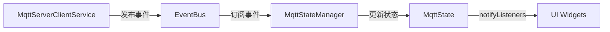
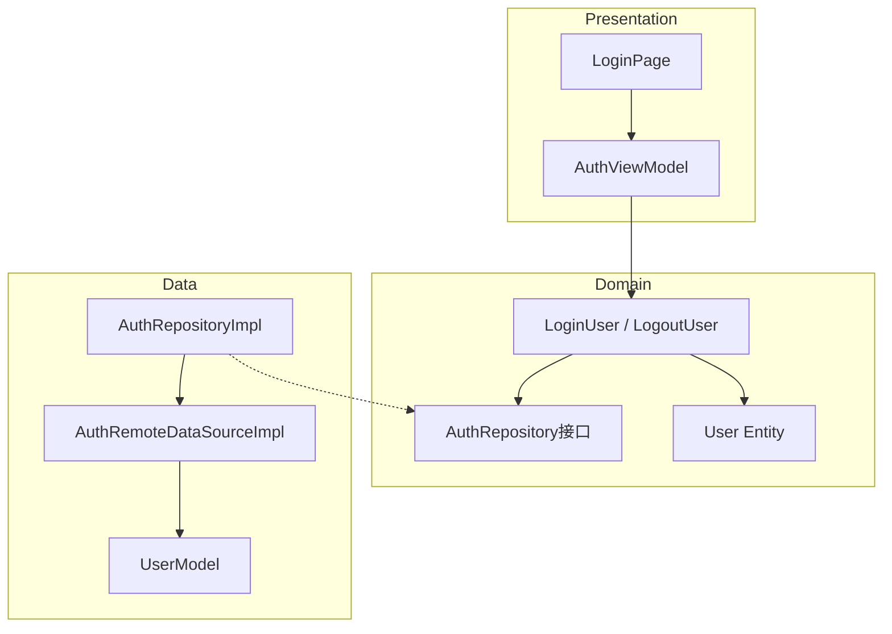

# Provider Mode - Flutter状态管理学习项目

一个用于学习Flutter Provider状态管理的示例项目，展示了多种常见的状态管理场景。

## 功能特性

### 🎯 Provider示例

| 示例 | 说明 | 学习要点 |
|------|------|---------|
| **计数器** | 基础计数功能（增/减/重置） | ChangeNotifier基础用法、构造注入、状态持久化 |
| **主题切换** | 亮色/暗色/系统跟随 | 与MaterialApp集成、枚举状态管理 |
| **多语言** | 中文/英文切换 | 国际化支持、Locale管理 |
| **应用设置** | 通知/声音/振动开关 | 复杂对象状态管理、Equatable使用 |
| **错误日志** | 日志查看/搜索/导出/分享 | 日志系统集成、筛选和分页 |
| **Provider认证** | Mock登录/登出 | Clean Architecture + Provider、表单状态管理 |
| **MQTT状态** | 连接状态可视化 | EventBus解耦、全局单例状态监听 |

### 🏗️ 项目架构

```
lib/
├── main.dart                 # 应用入口，全局Provider配置 + 错误SnackBar
├── app.dart                  # 首页（功能导航卡片）
├── core/                     # 核心基础设施
│   ├── router/              # 路由配置 (go_router)
│   ├── store/               # 存储服务 (SharedPreferences, MMKV)
│   ├── mqtt/                # MQTT服务 (事件驱动架构)
│   ├── event/               # 事件总线
│   ├── logging/             # 日志系统 (文件存储/设备信息/导出)
│   └── error/               # 错误处理 (Failures)
├── di/                       # 依赖注入 (GetIt)
└── features/                 # 功能模块
    ├── counter/             # 计数器示例
    ├── theme/               # 主题切换示例
    ├── locale/              # 多语言示例
    ├── settings/            # 应用设置示例
    ├── logs/                # 日志查看示例
    ├── auth/                # 认证模块 (Clean Architecture)
    │   ├── data/           # 数据层 (DataSource, Repository实现)
    │   ├── domain/         # 领域层 (Entity, UseCase, Repository接口)
    │   └── presentation/   # 表现层 (ViewModel + UI)
    └── mqtt/               # MQTT状态页面
```

## 技术栈

- **Flutter**: 3.41.x
- **Dart**: 3.11
- **状态管理**: provider 6.1.5+1
- **路由**: go_router 17.1.0
- **依赖注入**: get_it 9.1.1
- **存储**: shared_preferences, mmkv
- **网络**: dio 5.9.2
- **MQTT**: mqtt_client 10.11.1
- **工具**: equatable, dart_either, uuid

## 快速开始

### 环境要求

- Flutter SDK >= 3.5.2
- Dart SDK >= 3.5.2

### 安装运行

```bash
# 获取依赖
flutter pub get

# 运行应用
flutter run

# 运行测试
flutter test
```

## Provider使用指南

### 1. 创建Provider（构造注入）

```dart
class CounterProvider with ChangeNotifier {
  final KeyValueDb _db;

  CounterProvider({required KeyValueDb sharedPreferencesDb})
    : _db = sharedPreferencesDb;

  int get count => _count;

  void increment() {
    _count++;
    _db.put('count', _count);
    notifyListeners();
  }
}
```

### 2. 注册Provider

```dart
// 在 di/injector.dart 中注册
injector.registerFactory(() => CounterProvider(
  sharedPreferencesDb: injector<SharedPreferencesDb>(),
));

// 在 main.dart 中添加到MultiProvider（全局状态）
MultiProvider(
  providers: [
    ChangeNotifierProvider.value(value: injector<ThemeProvider>()),
  ],
  child: const MyApp(),
)

// 或在页面中局部注册
ChangeNotifierProvider.value(value: injector<AuthViewModel>())
```

### 3. 使用Provider

```dart
// 方式1: Consumer监听变化
Consumer<ThemeProvider>(
  builder: (context, provider, child) {
    return Text(provider.currentTheme.displayName);
  },
)

// 方式2: context.read调用方法
context.read<CounterProvider>().increment();

// 方式3: context.watch获取值
final count = context.watch<CounterProvider>().count;

// 方式4: Provider.of
final provider = Provider.of<ThemeProvider>(context, listen: false);
```

### 4. 与MaterialApp集成

```dart
MaterialApp.router(
  themeMode: context.watch<ThemeProvider>().themeMode,
  locale: context.watch<LocaleProvider>().locale,
)
```

## 项目特色

### 事件驱动架构

MQTT模块采用事件驱动架构实现解耦：



### Clean Architecture (Auth模块)

认证模块遵循Clean Architecture分层：



### 依赖注入

使用GetIt进行依赖注入，方便测试和解耦：

```dart
// 注册
injector.registerLazySingleton(() => SharedPreferencesDb());
injector.registerFactory(() => CounterProvider(...));
injector.registerFactory(() => AuthViewModel(...));

// 获取
final counter = injector<CounterProvider>();
```

### 持久化存储

支持多种存储方式：

- **SharedPreferences**: 通用键值存储
- **MMKV**: 高性能键值存储

### 全局错误处理

- 自动捕获 Flutter/Dart 异常
- 错误写入日志文件（含设备信息、网络状态等元数据）
- UI 层通过 SnackBar 实时提示用户
- 支持一键跳转到日志查看页面

## 目录结构说明

```
lib/features/auth/              # Clean Architecture 示例
├── data/
│   ├── datasources/           # 数据源（接口 + Mock实现）
│   ├── models/                # 数据模型（JSON序列化）
│   └── repositories/          # Repository实现
├── domain/
│   ├── entities/              # 业务实体
│   ├── repositories/          # Repository接口
│   └── usecases/              # 用例
└── presentation/
    ├── viewmodels/            # ViewModel (ChangeNotifier)
    └── view/                  # UI页面
```

每个功能模块遵循类似的结构：
- `models/`: 数据模型
- `view/`: UI页面
- `xxx_provider.dart`: 状态管理（或独立 ViewModel）

## 学习路径

1. **基础**: 从计数器示例开始，理解ChangeNotifier和Consumer
2. **进阶**: 学习主题切换，了解与MaterialApp的集成
3. **扩展**: 多语言示例，掌握国际化基础
4. **复杂**: 应用设置，学习复杂对象的状态管理
5. **架构**: Auth模块，理解Clean Architecture + Provider
6. **解耦**: MQTT模块，学习事件驱动架构

## Mock测试账号 (Auth模块)

| 邮箱 | 密码 |
|------|------|
| test@example.com | 123456 |
| admin@example.com | admin123 |

## 常见问题

### Q: Provider和Bloc有什么区别？

Provider更轻量，适合简单状态管理；Bloc更适合复杂业务逻辑和大型项目。

### Q: 什么时候使用notifyListeners？

当状态发生变化需要通知UI更新时调用。注意不要在build方法中调用。

### Q: Consumer和Provider.of有什么区别？

Consumer会自动处理context，并且可以精确控制重建范围；Provider.of更灵活但需要手动管理。

### Q: 为什么使用构造注入而不是服务定位器？

构造注入使依赖关系显式化，便于单元测试（可注入Mock对象），而服务定位器（直接调用injector）会隐藏依赖关系。

## 许可证

MIT License
