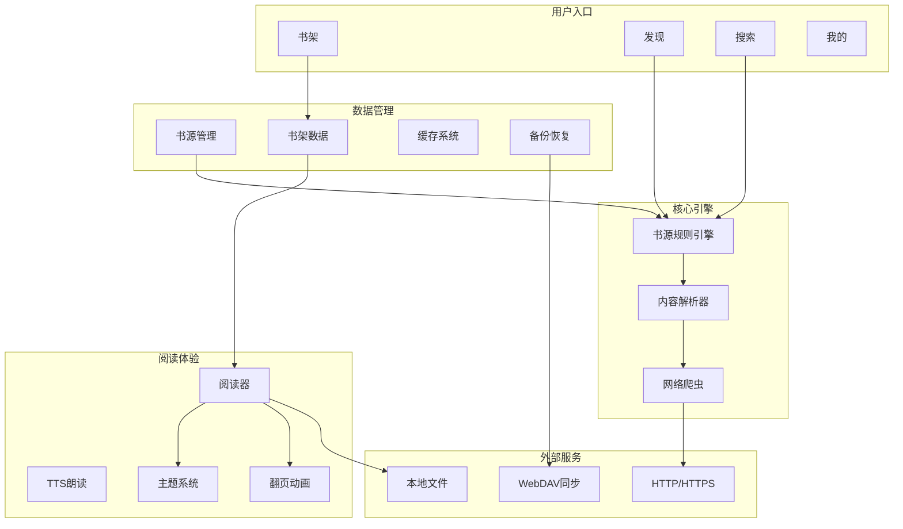
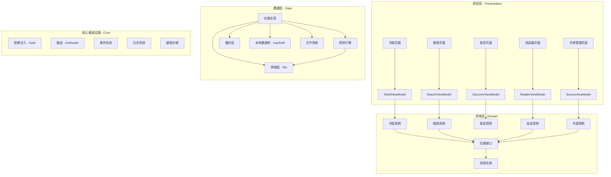
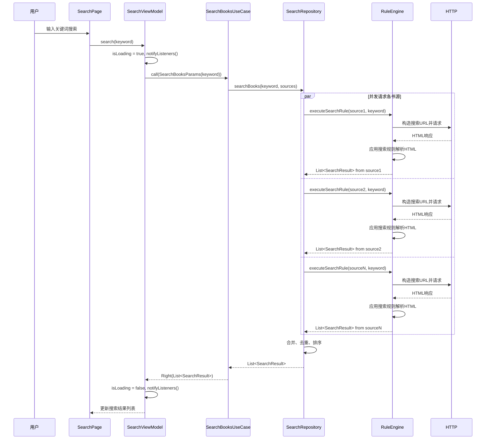
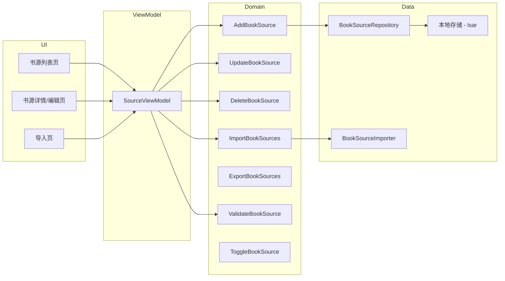
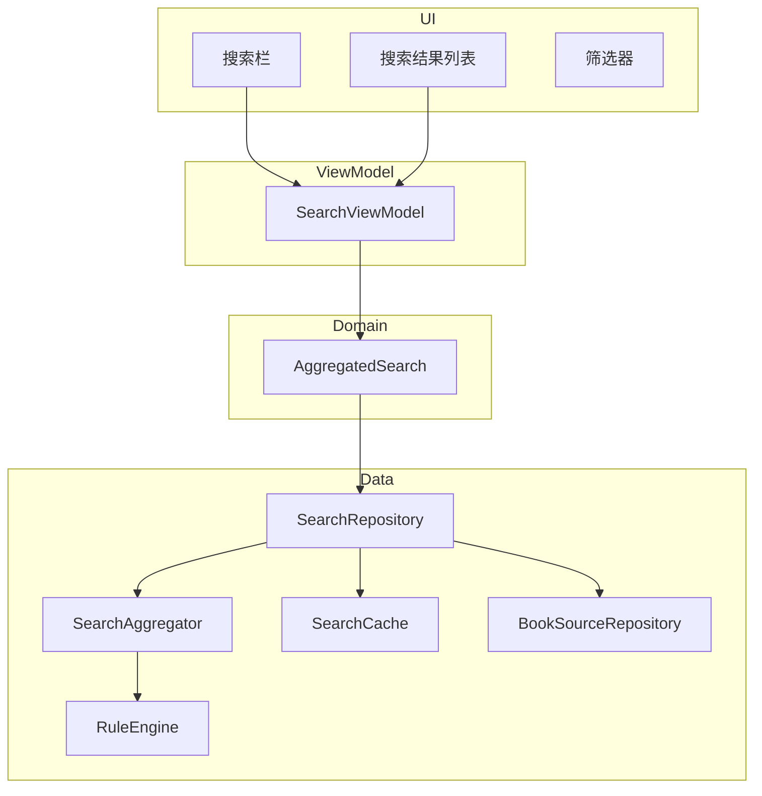
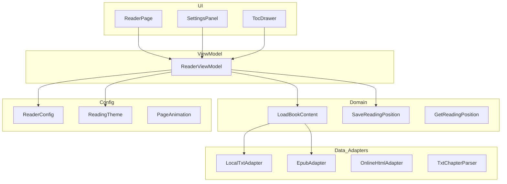

# DeepSeek × Legado-MD3 Flutter 迁移设计文档

> **项目代号**: FlutterLegado  
> **目标**: 将 Android 原生开源阅读应用 [legado-with-MD3](https://github.com/HapeLee/legado-with-MD3) 使用 Flutter 技术完全重构，保留 Material Design 3 视觉风格  
> **架构风格**: Clean Architecture + Provider + GetIt（沿用现有 `provider_mode` 项目规范）  
> **生成工具**: DeepSeek AI

---

## 目录

1. [项目概述](#1-项目概述)
2. [Legado 核心功能分析](#2-legado-核心功能分析)
3. [整体架构设计](#3-整体架构设计)
4. [书源规则引擎设计（核心）](#4-书源规则引擎设计核心)
5. [书源管理模块设计](#5-书源管理模块设计)
6. [在线搜索模块设计](#6-在线搜索模块设计)
7. [本地阅读模块设计](#7-本地阅读模块设计)
8. [书架与发现模块设计](#8-书架与发现模块设计)
9. [数据持久化设计](#9-数据持久化设计)
10. [技术选型与依赖](#10-技术选型与依赖)
11. [完整目录结构](#11-完整目录结构)
12. [分阶段实施计划](#12-分阶段实施计划)
13. [风险与挑战](#13-风险与挑战)
14. [附录：与现有项目的集成策略](#14-附录与现有项目的集成策略)

---

## 1. 项目概述

### 1.1 背景

[Legado](https://github.com/gedoor/legado) 是 Android 平台上最受欢迎的开源阅读应用之一，拥有超过 30k GitHub Star。其核心特色是基于**可自定义规则引擎**的书源系统，用户可以通过编写类 CSS 选择器规则来自定义任意网站的内容解析逻辑。[legado-with-MD3](https://github.com/HapeLee/legado-with-MD3) 是针对 Material Design 3 视觉规范的改造版本。

本项目旨在使用 **Flutter** 技术完全重构该应用，实现真正的跨平台（Android / iOS / Desktop），同时保留其核心架构思想。

### 1.2 目标

| 维度         | 目标描述                                     |
| ------------ | -------------------------------------------- |
| **平台覆盖** | Android、iOS、macOS、Windows、Linux、Web     |
| **核心功能** | 书源规则引擎、书源管理、在线搜索、本地阅读   |
| **架构风格** | Clean Architecture + Provider + GetIt        |
| **UI 风格**  | Material Design 3（与 legado-with-MD3 一致） |
| **代码复用** | 核心业务逻辑 100% 纯 Dart，平台无关          |

### 1.3 设计原则

| 原则               | 说明                                                                   |
| ------------------ | ---------------------------------------------------------------------- |
| **规则引擎可移植** | 书源规则语法完全兼容 Legado 现有格式，支持从 Legado 直接导入书源 JSON  |
| **关注点分离**     | 解析引擎、网络层、缓存层、UI 层完全解耦                                |
| **渐进增强**       | 先实现核心阅读链路，再逐步补齐 TTS、备份同步等增强功能                 |
| **遵循项目规范**   | 沿用 `provider_mode` 项目的 Clean Architecture + Provider + GetIt 风格 |

---

## 2. Legado 核心功能分析

### 2.1 功能全景图



### 2.2 核心功能优先级

本次迁移按以下优先级实施：

| 优先级 | 模块         | 说明                          |
| ------ | ------------ | ----------------------------- |
| **P0** | 书源规则引擎 | 整个应用的基石，必须最先完成  |
| **P0** | 书源管理     | 书源的 CRUD、导入导出、校验   |
| **P0** | 在线搜索     | 聚合多书源搜索、结果合并去重  |
| **P0** | 本地阅读     | TXT/EPUB 解析、翻页、主题配置 |
| P1     | 书架管理     | 书籍增删、分组、阅读进度      |
| P1     | 发现页       | 基于书源的探索推荐            |
| P1     | 内容缓存     | 离线阅读缓存策略              |
| P2     | TTS 朗读     | 文字转语音                    |
| P2     | 备份恢复     | 本地 + WebDAV                 |
| P2     | 替换净化     | 正文内容清洗规则              |

---

## 3. 整体架构设计

### 3.1 分层架构



### 3.2 数据流示意（在线搜索）



---

## 4. 书源规则引擎设计（核心）

### 4.1 概述

书源规则引擎是 Legado 的灵魂。它允许用户使用**声明式规则**（类 JSON DSL）来描述任意网站的数据提取逻辑，无需编写代码即可适配新书源。

**核心挑战**：将 Android 原生的 Jsoup / OkHttp 实现迁移到纯 Dart 生态。

### 4.2 规则数据结构

一份完整的书源定义包含以下核心规则组：

```dart
// lib/features/source/domain/entities/book_source.dart

/// 书源规则定义实体
class BookSource extends Equatable {
  // ===== 基础信息 =====
  final String id;             // 唯一标识（UUID）
  final String name;           // 书源名称
  final String baseUrl;        // 基础URL
  final String group;          // 分组（如"笔趣阁"、"起点系"）

  // ===== 搜索规则 =====
  final String? searchUrl;     // 搜索URL模板，{{key}} 为关键词占位符
  final SearchRule? searchRule;

  // ===== 发现规则（可多个） =====
  final List<DiscoverRule> discoverRules;

  // ===== 书籍详情规则 =====
  final BookInfoRule? bookInfoRule;

  // ===== 目录规则 =====
  final TocRule? tocRule;

  // ===== 正文规则 =====
  final ContentRule? contentRule;

  // ===== 登录规则（可选） =====
  final LoginRule? loginRule;

  // ===== 元数据 =====
  final DateTime createdAt;
  final DateTime updatedAt;
  final int weight;            // 权重（用于排序）
  final bool enabled;          // 是否启用
  final String? userAgent;     // 自定义 User-Agent
  final Map<String, String>? headers; // 自定义请求头

  // ... props, copyWith, toJson, fromJson
}
```

### 4.3 规则子类型定义

```dart
// lib/features/source/domain/entities/rules/

/// 搜索规则
class SearchRule extends Equatable {
  final String bookList;       // 书籍列表选择器
  final String name;           // 书名选择器（相对于 bookList）
  final String author;         // 作者选择器
  final String coverUrl;       // 封面选择器
  final String detailUrl;      // 详情页链接选择器
  final String? kind;          // 分类选择器
  final String? wordCount;     // 字数选择器
  final String? lastChapter;   // 最新章节选择器
  final String? updateTime;    // 更新时间选择器
  final String? intro;         // 简介选择器

  const SearchRule({ /* ... */ });
}

/// 发现规则
class DiscoverRule extends Equatable {
  final String name;           // 发现分类名（如"玄幻"、"都市"）
  final String url;            // 发现页URL
  final SearchRule rule;       // 复用搜索规则结构

  const DiscoverRule({ /* ... */ });
}

/// 书籍详情规则
class BookInfoRule extends Equatable {
  final String name;           // 书名
  final String author;         // 作者
  final String coverUrl;       // 封面
  final String intro;          // 简介
  final String? kind;          // 分类
  final String? wordCount;     // 字数
  final String? lastChapter;   // 最新章节
  final String? updateTime;    // 更新时间
  final String? status;        // 连载状态

  const BookInfoRule({ /* ... */ });
}

/// 目录规则
class TocRule extends Equatable {
  final String chapterList;    // 章节列表选择器
  final String chapterName;    // 章节名选择器
  final String chapterUrl;     // 章节链接选择器
  final String? isVolume;      // 是否为分卷（非分卷则为 null）
  final String? nextTocUrl;    // 下一页目录URL选择器（分页目录）

  const TocRule({ /* ... */ });
}

/// 正文规则
class ContentRule extends Equatable {
  final String content;        // 正文内容选择器
  final String? nextContentUrl;// 下一页正文URL选择器
  final String? webJs;         // 需要执行的 JS 代码（处理动态渲染）
  final List<String>? filterRules;  // 过滤规则（正则表达式列表）
  final List<ReplaceRule>? replaceRules; // 替换规则

  const ContentRule({ /* ... */ });
}

/// 替换规则
class ReplaceRule extends Equatable {
  final String pattern;        // 匹配正则
  final String replacement;    // 替换为
  final bool isRegex;          // 是否为正则表达式

  const ReplaceRule({ /* ... */ });
}

/// 登录规则
class LoginRule extends Equatable {
  final String loginUrl;       // 登录URL
  final String? checkJs;       // 登录状态检查JS
  final Map<String, String>? loginFields; // 登录表单字段

  const LoginRule({ /* ... */ });
}
```

### 4.4 规则引擎实现

```dart
// lib/features/source/data/engine/rule_engine.dart

/// 书源规则引擎 —— 核心解析器
///
/// 负责将声明式规则应用于 HTML，提取结构化数据。
/// 兼容 Legado 原生规则语法，支持 CSS 选择器 + 属性提取 + JSONPath。
class RuleEngine {
  final Dio _dio;

  RuleEngine({required Dio dio}) : _dio = dio;

  // ===== 搜索 =====
  /// 执行搜索规则，返回书籍列表
  Future<List<SearchResult>> executeSearch(
    BookSource source,
    String keyword, {
    int page = 1,
  }) async {
    final searchUrl = _buildSearchUrl(source, keyword, page);
    final html = await _fetchHtml(searchUrl, source);
    final document = html_parser.parse(html);

    final bookElements = document.querySelectorAll(source.searchRule!.bookList);

    return bookElements.map((el) => SearchResult(
      name: _extractText(el, source.searchRule!.name),
      author: _extractText(el, source.searchRule!.author),
      coverUrl: _extractAttr(el, source.searchRule!.coverUrl, 'src'),
      detailUrl: _resolveUrl(source.baseUrl, _extractAttr(el, source.searchRule!.detailUrl, 'href')),
      kind: _extractTextOrNull(el, source.searchRule!.kind),
      wordCount: _extractTextOrNull(el, source.searchRule!.wordCount),
      lastChapter: _extractTextOrNull(el, source.searchRule!.lastChapter),
      sourceId: source.id,
      sourceName: source.name,
    )).toList();
  }

  // ===== 书籍详情 =====
  /// 执行书籍详情规则
  Future<BookInfo> executeBookInfo(
    BookSource source,
    String detailUrl,
  ) async {
    final html = await _fetchHtml(detailUrl, source);
    final document = html_parser.parse(html);
    final rule = source.bookInfoRule!;

    return BookInfo(
      name: _extractText(document, rule.name),
      author: _extractText(document, rule.author),
      coverUrl: _resolveUrl(detailUrl, _extractAttr(document, rule.coverUrl, 'src')),
      intro: _extractHtml(document, rule.intro),
      kind: _extractTextOrNull(document, rule.kind),
      status: _extractTextOrNull(document, rule.status),
      wordCount: _extractTextOrNull(document, rule.wordCount),
      lastChapter: _extractTextOrNull(document, rule.lastChapter),
      sourceId: source.id,
    );
  }

  // ===== 章节目录 =====
  /// 执行目录规则，返回章节列表
  Future<List<Chapter>> executeToc(
    BookSource source,
    String tocUrl,
  ) async {
    final html = await _fetchHtml(tocUrl, source);
    final document = html_parser.parse(html);
    final rule = source.tocRule!;

    final chapterElements = document.querySelectorAll(rule.chapterList);

    return chapterElements.map((el) => Chapter(
      title: _extractText(el, rule.chapterName),
      url: _resolveUrl(tocUrl, _extractAttr(el, rule.chapterUrl, 'href')),
    )).toList();
  }

  // ===== 正文内容 =====
  /// 执行正文规则，返回纯净文本内容
  Future<String> executeContent(
    BookSource source,
    String chapterUrl,
  ) async {
    final html = await _fetchHtml(chapterUrl, source);
    final document = html_parser.parse(html);
    final rule = source.contentRule!;

    // 提取正文 DOM
    final contentEl = document.querySelector(rule.content);
    if (contentEl == null) {
      throw RuleEngineException('正文内容未找到: $chapterUrl');
    }

    String text = contentEl.text;

    // 应用替换规则
    if (rule.replaceRules != null) {
      for (final replaceRule in rule.replaceRules!) {
        text = text.replaceAll(
          RegExp(replaceRule.pattern),
          replaceRule.replacement,
        );
      }
    }

    return text.trim();
  }

  // ===== 私有方法 =====

  /// 构造搜索URL —— 替换模板占位符
  String _buildSearchUrl(BookSource source, String keyword, int page) {
    return source.searchUrl!
        .replaceAll('{{key}}', Uri.encodeComponent(keyword))
        .replaceAll('{{page}}', page.toString());
  }

  /// 获取HTML —— 支持编码检测
  Future<String> _fetchHtml(String url, BookSource source) async {
    final response = await _dio.get<String>(
      url,
      options: Options(
        headers: {
          if (source.userAgent != null) 'User-Agent': source.userAgent,
          ...?source.headers,
        },
        responseType: ResponseType.plain,
      ),
    );

    // 简单的编码检测（从 meta charset 中提取）
    String? encoding = _detectEncoding(response.data ?? '');
    if (encoding != null && encoding.toLowerCase() != 'utf-8') {
      // 需要转码（实际实现可用 dart:convert 的 Encoding）
    }

    return response.data ?? '';
  }

  /// 从元素中提取文本
  String _extractText(dynamic parent, String selector) {
    final el = _querySelector(parent, selector);
    return el?.text.trim() ?? '';
  }

  /// 从元素中提取属性值
  String _extractAttr(dynamic parent, String selector, String attr) {
    final el = _querySelector(parent, selector);
    return el?.attributes[attr] ?? '';
  }

  /// 提取 HTML（保留标签）
  String _extractHtml(dynamic parent, String selector) {
    final el = _querySelector(parent, selector);
    return el?.innerHtml ?? '';
  }

  /// 可空版本
  String? _extractTextOrNull(dynamic parent, String? selector) {
    if (selector == null) return null;
    final text = _extractText(parent, selector);
    return text.isEmpty ? null : text;
  }

  /// CSS 选择器查询
  dom.Element? _querySelector(dynamic parent, String selector) {
    if (parent is dom.Document) return parent.querySelector(selector);
    if (parent is dom.Element) return parent.querySelector(selector);
    return null;
  }

  /// URL 解析（处理相对路径）
  String _resolveUrl(String baseUrl, String url) {
    if (url.startsWith('http')) return url;
    final base = Uri.parse(baseUrl);
    return base.resolve(url).toString();
  }

  /// 编码检测
  String? _detectEncoding(String html) {
    final match = RegExp(r'charset=["\']?([a-zA-Z0-9\-]+)').firstMatch(html);
    return match?.group(1);
  }
}
```

### 4.5 规则引擎扩展点

```dart
// lib/features/source/data/engine/rule_engine_extensions.dart

/// JS 执行器接口 —— 处理需要 JavaScript 渲染的页面
abstract class JavaScriptExecutor {
  /// 在 HTML 上下文中执行 JS 代码，返回修改后的 HTML
  Future<String> executeJavaScript(String html, String jsCode);
}

/// WebView JS 执行器实现（Android/iOS）
class WebViewJavaScriptExecutor implements JavaScriptExecutor {
  @override
  Future<String> executeJavaScript(String html, String jsCode) async {
    // 通过 platform channel 调用 WebView 执行 JS
    // 或使用 flutter_inappwebview 的 headless 模式
    throw UnimplementedError('需平台具体实现');
  }
}

/// JSONPath 规则支持 —— 处理返回 JSON 的书源
class JsonPathExtractor {
  /// 从 JSON 数据中根据 JSONPath 表达式提取值
  dynamic extract(dynamic jsonData, String jsonPath) {
    // 实现 JSONPath 解析逻辑
    // 支持 $.store.book[0].title 等语法
    throw UnimplementedError('待实现');
  }
}
```

### 4.6 规则导入/导出兼容性

```dart
// lib/features/source/data/datasources/book_source_importer.dart

/// 书源导入器 —— 兼容 Legado 原生书源 JSON 格式
class BookSourceImporter {
  /// 从 Legado 格式的 JSON 字符串导入书源列表
  List<BookSource> importFromLegadoJson(String jsonString) {
    final List<dynamic> rawList = json.decode(jsonString);
    return rawList.map((raw) => _convertLegadoSource(raw)).toList();
  }

  /// 将单个 Legado 书源 JSON 转换为我们的 BookSource 模型
  BookSource _convertLegadoSource(Map<String, dynamic> raw) {
    return BookSource(
      id: const Uuid().v4(),
      name: raw['bookSourceName'] ?? '',
      baseUrl: raw['bookSourceUrl'] ?? '',
      group: raw['bookSourceGroup'] ?? '未分组',
      searchUrl: raw['searchUrl'],
      searchRule: raw['ruleSearch'] != null
          ? _parseSearchRule(raw['ruleSearch'])
          : null,
      discoverRules: _parseDiscoverRules(raw),
      bookInfoRule: raw['ruleBookInfo'] != null
          ? _parseBookInfoRule(raw['ruleBookInfo'])
          : null,
      tocRule: raw['ruleToc'] != null
          ? _parseTocRule(raw['ruleToc'])
          : null,
      contentRule: raw['ruleContent'] != null
          ? _parseContentRule(raw['ruleContent'])
          : null,
      weight: raw['weight'] ?? 0,
      enabled: raw['enabled'] != true ? false : true,
      userAgent: raw['httpUserAgent'],
      headers: raw['header'] != null
          ? Map<String, String>.from(json.decode(raw['header']))
          : null,
      createdAt: DateTime.now(),
      updatedAt: DateTime.now(),
    );
  }

  // _parseSearchRule, _parseDiscoverRules, _parseBookInfoRule... 等具体转换方法

  /// 导出为 Legado 兼容格式
  List<Map<String, dynamic>> exportToLegadoJson(List<BookSource> sources) {
    return sources.map((source) => _convertToLegadoFormat(source)).toList();
  }
}
```

---

## 5. 书源管理模块设计

### 5.1 模块架构



### 5.2 书源验证器

```dart
// lib/features/source/domain/usecases/validate_book_source.dart

/// 书源验证结果
class SourceValidationResult {
  final bool isValid;
  final String? errorMessage;
  final Duration responseTime;
  final int? bookCount;        // 搜索结果数量

  const SourceValidationResult({
    required this.isValid,
    this.errorMessage,
    required this.responseTime,
    this.bookCount,
  });
}

/// 验证书源是否可用
class ValidateBookSource implements UseCase<SourceValidationResult, ValidateBookSourceParams> {
  final BookSourceRepository _repository;
  final RuleEngine _ruleEngine;

  ValidateBookSource(this._repository, this._ruleEngine);

  @override
  Future<Either<Failure, SourceValidationResult>> call(
    ValidateBookSourceParams params,
  ) async {
    final stopwatch = Stopwatch()..start();

    try {
      // 1. 检查基础URL可达性
      final isReachable = await _repository.checkReachable(params.source.baseUrl);
      if (!isReachable) {
        return Right(SourceValidationResult(
          isValid: false,
          errorMessage: '书源服务器不可达',
          responseTime: stopwatch.elapsed,
        ));
      }

      // 2. 尝试搜索测试关键词
      if (params.source.searchRule != null && params.source.searchUrl != null) {
        final results = await _ruleEngine.executeSearch(
          params.source,
          params.testKeyword ?? '测试',
        );

        return Right(SourceValidationResult(
          isValid: true,
          responseTime: stopwatch.elapsed,
          bookCount: results.length,
        ));
      }

      return Right(SourceValidationResult(
        isValid: true,
        responseTime: stopwatch.elapsed,
      ));
    } catch (e) {
      return Right(SourceValidationResult(
        isValid: false,
        errorMessage: e.toString(),
        responseTime: stopwatch.elapsed,
      ));
    }
  }
}
```

### 5.3 书源管理 ViewModel

```dart
// lib/features/source/presentation/viewmodels/source_view_model.dart

class SourceViewModel extends ChangeNotifier {
  final GetBookSources _getBookSources;
  final AddBookSource _addBookSource;
  final UpdateBookSource _updateBookSource;
  final DeleteBookSource _deleteBookSource;
  final ImportBookSources _importBookSources;
  final ToggleBookSource _toggleBookSource;
  final ValidateBookSource _validateBookSource;

  List<BookSource> _sources = [];
  Map<String, SourceValidationResult> _validationResults = {};
  bool _isLoading = false;
  String? _errorMessage;

  SourceViewModel({
    required GetBookSources getBookSources,
    required AddBookSource addBookSource,
    required UpdateBookSource updateBookSource,
    required DeleteBookSource deleteBookSource,
    required ImportBookSources importBookSources,
    required ToggleBookSource toggleBookSource,
    required ValidateBookSource validateBookSource,
  })  : _getBookSources = getBookSources,
        _addBookSource = addBookSource,
        _updateBookSource = updateBookSource,
        _deleteBookSource = deleteBookSource,
        _importBookSources = importBookSources,
        _toggleBookSource = toggleBookSource,
        _validateBookSource = validateBookSource;

  // Getters...
  List<BookSource> get sources => _sources;
  List<BookSource> get enabledSources => _sources.where((s) => s.enabled).toList();
  Map<String, List<BookSource>> get groupedSources {
    final map = <String, List<BookSource>>{};
    for (final source in _sources) {
      map.putIfAbsent(source.group, () => []).add(source);
    }
    return map;
  }
  bool get isLoading => _isLoading;
  String? get errorMessage => _errorMessage;

  // ===== 加载书源列表 =====
  Future<void> loadSources() async {
    _isLoading = true;
    notifyListeners();

    final result = await _getBookSources(NoParams());
    result.fold(
      (failure) {
        _errorMessage = failure.message;
        _isLoading = false;
        notifyListeners();
      },
      (sources) {
        _sources = sources;
        _isLoading = false;
        notifyListeners();
      },
    );
  }

  // ===== 导入书源（支持 URL、剪贴板、文件） =====
  Future<void> importFromUrl(String url) async { /* ... */ }
  Future<void> importFromClipboard() async { /* ... */ }
  Future<void> importFromFile(String filePath) async { /* ... */ }

  // ===== 验证书源 =====
  Future<void> validateSource(String sourceId) async {
    final source = _sources.firstWhere((s) => s.id == sourceId);
    final result = await _validateBookSource(
      ValidateBookSourceParams(source: source),
    );
    result.fold(
      (_) {},
      (validation) {
        _validationResults[sourceId] = validation;
        notifyListeners();
      },
    );
  }

  Future<void> validateAllSources() async {
    for (final source in _sources) {
      await validateSource(source.id);
    }
  }

  // ===== 启用/禁用书源 =====
  Future<void> toggleSource(String sourceId) async {
    await _toggleBookSource(ToggleBookSourceParams(id: sourceId));
    await loadSources();
  }

  // ===== 删除书源 =====
  Future<void> deleteSource(String sourceId) async { /* ... */ }

  // ===== 导出书源 =====
  Future<String> exportSources() async { /* ... */ }
}
```

---

## 6. 在线搜索模块设计

### 6.1 模块架构



### 6.2 聚合搜索引擎

```dart
// lib/features/search/data/repositories/search_repository_impl.dart

/// 聚合搜索引擎 —— 并发搜索所有已启用书源，合并去重
class SearchRepositoryImpl implements SearchRepository {
  final BookSourceRepository _sourceRepository;
  final RuleEngine _ruleEngine;
  final SearchCache _cache;

  SearchRepositoryImpl(
    this._sourceRepository,
    this._ruleEngine,
    this._cache,
  );

  @override
  Future<AggregatedSearchResult> searchBooks(
    String keyword, {
    int page = 1,
    int timeout = 15000, // 单书源超时 15s
  }) async {
    // 1. 检查缓存
    final cached = await _cache.get(keyword, page);
    if (cached != null) return cached;

    // 2. 获取所有已启用且有搜索规则的书源
    final sources = await _sourceRepository.getEnabledSources()
        .where((s) => s.searchRule != null && s.searchUrl != null)
        .toList();

    // 3. 并发搜索（每个书源独立超时）
    final futures = sources.map((source) {
      return _searchWithTimeout(source, keyword, page, timeout)
          .then((result) => SearchSourceResult(
                sourceId: source.id,
                sourceName: source.name,
                results: result,
                error: null,
              ))
          .catchError((e) => SearchSourceResult(
                sourceId: source.id,
                sourceName: source.name,
                results: [],
                error: e.toString(),
              ));
    });

    final sourceResults = await Future.wait(futures);

    // 4. 合并、去重（按书名+作者）
    final merged = _mergeAndDeduplicate(sourceResults);

    // 5. 排序（按匹配度、权重）
    merged.sort((a, b) {
      // 多个书源都有的结果排前面
      final sourceCompare = b.sourceIds.length.compareTo(a.sourceIds.length);
      if (sourceCompare != 0) return sourceCompare;
      // 按书名与关键词匹配度
      return _matchScore(b.name, keyword).compareTo(_matchScore(a.name, keyword));
    });

    // 6. 缓存结果
    final result = AggregatedSearchResult(
      items: merged,
      totalSources: sources.length,
      successSources: sourceResults.where((r) => r.error == null).length,
      keyword: keyword,
      page: page,
    );
    await _cache.set(keyword, page, result);

    return result;
  }

  /// 带超时的单书源搜索
  Future<List<SearchResult>> _searchWithTimeout(
    BookSource source,
    String keyword,
    int page,
    int timeoutMs,
  ) {
    return _ruleEngine
        .executeSearch(source, keyword, page: page)
        .timeout(Duration(milliseconds: timeoutMs));
  }

  /// 合并去重逻辑
  List<AggregatedSearchItem> _mergeAndDeduplicate(
    List<SearchSourceResult> sourceResults,
  ) {
    final map = <String, AggregatedSearchItem>{};

    for (final sourceResult in sourceResults) {
      for (final item in sourceResult.results) {
        final key = '${item.name}::${item.author}'.toLowerCase().trim();

        if (map.containsKey(key)) {
          // 已存在：追加书源信息
          map[key] = map[key]!.copyWith(
            sourceIds: [...map[key]!.sourceIds, sourceResult.sourceId],
            sourceNames: [...map[key]!.sourceNames, sourceResult.sourceName],
          );
        } else {
          map[key] = AggregatedSearchItem(
            name: item.name,
            author: item.author,
            coverUrl: item.coverUrl,
            detailUrls: {sourceResult.sourceId: item.detailUrl},
            sourceIds: [sourceResult.sourceId],
            sourceNames: [sourceResult.sourceName],
            kind: item.kind,
            wordCount: item.wordCount,
            lastChapter: item.lastChapter,
          );
        }
      }
    }

    return map.values.toList();
  }

  /// 简单匹配度计算
  double _matchScore(String text, String keyword) {
    final lowerText = text.toLowerCase();
    final lowerKeyword = keyword.toLowerCase();
    if (lowerText == lowerKeyword) return 1.0;
    if (lowerText.startsWith(lowerKeyword)) return 0.8;
    if (lowerText.contains(lowerKeyword)) return 0.5;
    return 0.0;
  }
}
```

### 6.3 搜索结果数据模型

```dart
// lib/features/search/domain/entities/search_result.dart

/// 单书源的搜索结果
class SearchSourceResult {
  final String sourceId;
  final String sourceName;
  final List<SearchResult> results;
  final String? error;

  const SearchSourceResult({ /* ... */ });
}

/// 聚合去重后的搜索结果项
class AggregatedSearchItem extends Equatable {
  final String name;
  final String author;
  final String coverUrl;
  final Map<String, String> detailUrls; // sourceId -> detailUrl
  final List<String> sourceIds;
  final List<String> sourceNames;
  final String? kind;
  final String? wordCount;
  final String? lastChapter;

  /// 选择最佳书源获取详情（优先使用权重最高的）
  String? get bestSourceId => sourceIds.isNotEmpty ? sourceIds.first : null;
  String? get bestDetailUrl => bestSourceId != null ? detailUrls[bestSourceId] : null;

  const AggregatedSearchItem({ /* ... */ });
}

/// 聚合搜索结果
class AggregatedSearchResult extends Equatable {
  final List<AggregatedSearchItem> items;
  final int totalSources;
  final int successSources;
  final String keyword;
  final int page;

  const AggregatedSearchResult({ /* ... */ });
}
```

### 6.4 搜索 ViewModel

```dart
// lib/features/search/presentation/viewmodels/search_view_model.dart

class SearchViewModel extends ChangeNotifier {
  final AggregatedSearch _aggregatedSearch;
  final AddToShelf _addToShelf;

  // 状态
  List<AggregatedSearchItem> _results = [];
  String _keyword = '';
  int _currentPage = 1;
  bool _isLoading = false;
  bool _isLoadingMore = false;
  String? _errorMessage;
  SearchProgress? _progress;

  // 历史记录
  List<String> _searchHistory = [];

  SearchViewModel({
    required AggregatedSearch aggregatedSearch,
    required AddToShelf addToShelf,
  })  : _aggregatedSearch = aggregatedSearch,
        _addToShelf = addToShelf;

  // Getters...

  /// 搜索
  Future<void> search(String keyword) async {
    if (keyword.trim().isEmpty) return;

    _keyword = keyword;
    _currentPage = 1;
    _isLoading = true;
    _errorMessage = null;
    _progress = null;
    notifyListeners();

    _addToHistory(keyword);

    final result = await _aggregatedSearch(
      AggregatedSearchParams(keyword: keyword, page: 1),
    );

    result.fold(
      (failure) {
        _errorMessage = failure.message;
        _isLoading = false;
        notifyListeners();
      },
      (searchResult) {
        _results = searchResult.items;
        _isLoading = false;
        notifyListeners();
      },
    );
  }

  /// 加载更多（翻页）
  Future<void> loadMore() async {
    if (_isLoadingMore) return;

    _isLoadingMore = true;
    _currentPage++;
    notifyListeners();

    final result = await _aggregatedSearch(
      AggregatedSearchParams(keyword: _keyword, page: _currentPage),
    );

    result.fold(
      (_) {
        _isLoadingMore = false;
        notifyListeners();
      },
      (searchResult) {
        _results = [..._results, ...searchResult.items];
        _isLoadingMore = false;
        notifyListeners();
      },
    );
  }

  /// 搜索进度（实时反馈各书源搜索状态）
  Stream<SearchProgress> get progressStream => /* ... */;

  /// 添加到书架
  Future<void> addToShelf(AggregatedSearchItem item) async { /* ... */ }

  void _addToHistory(String keyword) { /* 最多保存 20 条 */ }
  List<String> get searchHistory => _searchHistory;
  void clearHistory() { /* ... */ }
}
```

---

## 7. 本地阅读模块设计

### 7.1 模块架构

本模块复用并扩展现有的 [阅读器框架设计](reader-framework-design.md)，在原有框架基础上增加 EPUB 支持、书籍元数据解析、章节目录导航等功能。



### 7.2 书籍内容实体（扩展）

在现有 [`ReaderContent`](reader-framework-design.md:568) 基础上扩展：

```dart
// lib/features/reader/domain/entities/book_content.dart

/// 书籍完整内容 —— 扩展版
class BookContent extends Equatable {
  final String bookId;
  final String title;
  final String author;
  final String? coverPath;
  final String? intro;
  final BookFormat format;          // txt, epub, html
  final List<BookChapter> chapters;
  final BookMetadata metadata;

  /// 总字数
  int get totalWordCount => chapters.fold(0, (sum, ch) => sum + ch.wordCount);

  const BookContent({ /* ... */ });
}

/// 书籍格式
enum BookFormat { txt, epub, html, pdf }

/// 章节
class BookChapter extends Equatable {
  final int index;
  final String title;
  final String? content;           // 加载后填充
  final bool isLoaded;
  final String? sourceRef;         // EPUB内部引用路径 / TXT字节偏移
  final int wordCount;

  const BookChapter({ /* ... */ });
}

/// 书籍元数据
class BookMetadata extends Equatable {
  final BookFormat format;
  final String filePath;
  final int fileSize;
  final String? encoding;          // TXT编码
  final String? isbn;
  final DateTime? publishDate;
  final String? publisher;

  const BookMetadata({ /* ... */ });
}
```

### 7.3 EPUB 适配器

```dart
// lib/features/reader/data/datasources/epub_adapter.dart

/// EPUB 格式适配器
///
/// 依赖: epub_parser 或 epubx 包
class EpubAdapter implements BookFormatAdapter {
  @override
  bool canHandle(String source) {
    return source.endsWith('.epub') || source.endsWith('.epub');
  }

  @override
  Future<BookContent> loadBook(String source) async {
    // 1. 打开 EPUB 文件
    final epubBook = await EpubReader.openBook(source);

    // 2. 读取元数据
    final metadata = BookMetadata(
      format: BookFormat.epub,
      filePath: source,
      fileSize: File(source).lengthSync(),
      isbn: epubBook.metadata?.isbn,
      publishDate: epubBook.metadata?.date,
      publisher: epubBook.metadata?.publisher,
    );

    // 3. 解析目录（NCX / NAV）
    final chapters = <BookChapter>[];
    final spine = epubBook.spine;
    for (int i = 0; i < spine.length; i++) {
      final item = spine[i];
      final content = await item.readContent();

      chapters.add(BookChapter(
        index: i,
        title: item.title ?? '第${i + 1}章',
        content: _stripHtml(content),
        isLoaded: true,
        sourceRef: item.src,
        wordCount: content.length,
      ));
    }

    // 4. 提取封面
    String? coverPath;
    if (epubBook.cover != null) {
      coverPath = await _saveCoverToCache(epubBook.cover!.bytes, source);
    }

    return BookContent(
      bookId: _generateBookId(source),
      title: epubBook.metadata?.title ?? '未知书名',
      author: epubBook.metadata?.author ?? '未知作者',
      coverPath: coverPath,
      intro: epubBook.metadata?.description,
      format: BookFormat.epub,
      chapters: chapters,
      metadata: metadata,
    );
  }

  /// 去除 HTML 标签保留纯文本
  String _stripHtml(String html) {
    return html.replaceAll(RegExp(r'<[^>]*>'), '').trim();
  }

  @override
  BookFormat get format => BookFormat.epub;
}

/// 统一适配器接口
abstract class BookFormatAdapter {
  bool canHandle(String source);
  Future<BookContent> loadBook(String source);
  BookFormat get format;
}
```

### 7.4 TXT 智能分章适配器

```dart
// lib/features/reader/data/datasources/local_txt_adapter.dart (增强版)

/// TXT 格式适配器 —— 增强版支持智能分章
class LocalTxtAdapter implements BookFormatAdapter {
  @override
  bool canHandle(String source) => source.endsWith('.txt');

  @override
  Future<BookContent> loadBook(String source) async {
    final file = File(source);
    final bytes = await file.readAsBytes();

    // 1. 编码检测
    final encoding = _detectEncoding(bytes);
    final rawText = encoding != null
        ? await file.readAsString(encoding: encoding)
        : await file.readAsString();

    // 2. 智能分章（正则匹配章节标题）
    final chapterRegex = RegExp(
      r'(第[零一二三四五六七八九十百千万\d]+[章节卷篇部]|'
      r'[Cc]hapter\s*\d+|'
      r'[Ss]ection\s*\d+|'
      r'序[章言]|楔子|尾声|后记|番外)',
      multiLine: true,
    );

    final chapters = <BookChapter>[];
    final matches = chapterRegex.allMatches(rawText).toList();

    if (matches.isEmpty) {
      // 无章节标题：整本书作为一个章节
      chapters.add(BookChapter(
        index: 0,
        title: '正文',
        content: rawText,
        isLoaded: true,
        wordCount: rawText.length,
      ));
    } else {
      for (int i = 0; i < matches.length; i++) {
        final start = matches[i].start;
        final end = i < matches.length - 1 ? matches[i + 1].start : rawText.length;
        final content = rawText.substring(start, end).trim();

        chapters.add(BookChapter(
          index: i,
          title: matches[i].group(0)!,
          content: content,
          isLoaded: true,
          sourceRef: start.toString(),
          wordCount: content.length,
        ));
      }
    }

    final fileName = source.split('/').last.replaceAll('.txt', '');

    return BookContent(
      bookId: _generateBookId(source),
      title: fileName,
      author: '未知作者',
      format: BookFormat.txt,
      chapters: chapters,
      metadata: BookMetadata(
        format: BookFormat.txt,
        filePath: source,
        fileSize: file.lengthSync(),
        encoding: encoding?.name,
      ),
    );
  }

  @override
  BookFormat get format => BookFormat.txt;
}
```

---

## 8. 书架与发现模块设计

### 8.1 书架模块

```dart
// lib/features/shelf/domain/entities/shelf_book.dart

/// 书架上的书籍（精简版，区别于完整 BookContent）
class ShelfBook extends Equatable {
  final String id;
  final String title;
  final String author;
  final String? coverPath;
  final String? sourceId;        // 来源书源ID（在线书籍）
  final String? filePath;        // 本地文件路径（本地书籍）
  final bool isLocal;            // 是否为本地书籍
  final int totalChapters;
  final int currentChapterIndex;
  final double readingProgress;  // 0.0 - 1.0
  final DateTime lastReadTime;
  final DateTime addedTime;
  final String? group;           // 分组（自定义分组）

  const ShelfBook({ /* ... */ });
}
```

### 8.2 发现模块

```dart
// lib/features/discover/presentation/viewmodels/discover_view_model.dart

/// 发现页 ViewModel —— 基于书源的探索推荐
class DiscoverViewModel extends ChangeNotifier {
  final GetBookSources _getBookSources;
  final RuleEngine _ruleEngine;

  List<DiscoverSection> _sections = [];
  bool _isLoading = false;

  DiscoverViewModel({
    required GetBookSources getBookSources,
    required RuleEngine ruleEngine,
  })  : _getBookSources = getBookSources,
        _ruleEngine = ruleEngine;

  /// 加载发现页数据（聚合所有书源的发现规则）
  Future<void> loadDiscover() async {
    _isLoading = true;
    notifyListeners();

    final sources = await _getBookSources(NoParams());
    final sections = <DiscoverSection>[];

    sources.fold(
      (_) {},
      (sourceList) async {
        for (final source in sourceList.where((s) => s.enabled)) {
          for (final discoverRule in source.discoverRules) {
            try {
              final books = await _ruleEngine.executeSearch(
                source,
                '', // 发现页不需要搜索关键词
                page: 1,
                customUrl: discoverRule.url, // 使用发现规则指定的URL
              );

              if (books.isNotEmpty) {
                sections.add(DiscoverSection(
                  title: '${source.name} · ${discoverRule.name}',
                  sourceId: source.id,
                  books: books,
                ));
              }
            } catch (_) {
              // 单个书源失败不影响整体
            }
          }
        }
      },
    );

    _sections = sections;
    _isLoading = false;
    notifyListeners();
  }
}
```

---

## 9. 数据持久化设计

### 9.1 存储方案选择

| 数据类型     | 存储方案                 | 理由                             |
| ------------ | ------------------------ | -------------------------------- |
| 书源规则     | Isar / Drift (SQLite)    | 结构化数据，需要查询、排序、分组 |
| 书架数据     | Isar / Drift             | 关联查询（书籍-章节-进度）       |
| 阅读进度     | Isar / Drift             | 需要高效读写                     |
| 用户配置     | SharedPreferences / MMKV | 简单键值对                       |
| 搜索缓存     | Isar + TTL               | 需要过期机制                     |
| 书籍内容缓存 | 文件系统                 | 大文本存储                       |
| 封面图片     | 文件系统 + 缓存          | 图片文件                         |

### 9.2 Isar Schema 设计

```dart
// lib/features/source/data/models/book_source_isar.dart
// 使用 Isar 的 @Collection 注解

@Collection()
class BookSourceIsar {
  Id id = Isar.autoIncrement;  // Isar 自动ID

  @Index(unique: true)
  late String uuid;            // 业务UUID

  late String name;
  late String baseUrl;
  late String group;
  @enumerated
  late bool enabled;
  late int weight;
  late DateTime createdAt;
  late DateTime updatedAt;

  // JSON 字符串存储规则（Isar 不直接支持嵌套对象）
  late String rulesJson;       // 完整的规则 JSON
  late String? headersJson;
  late String? userAgent;
}

@Collection()
class ShelfBookIsar {
  Id id = Isar.autoIncrement;

  @Index(unique: true)
  late String bookId;

  late String title;
  late String author;
  late String? coverPath;
  late String? sourceId;
  late String? filePath;
  late bool isLocal;
  late int totalChapters;
  late int currentChapterIndex;
  late double readingProgress;
  late DateTime lastReadTime;
  late DateTime addedTime;
  late String? groupName;

  // 关联的章节
  final chapters = IsarLinks<ChapterIsar>();
}

@Collection()
class ChapterIsar {
  Id id = Isar.autoIncrement;

  late String chapterId;
  late String bookId;          // 外键
  late int index;
  late String title;
  late String? cachePath;      // 缓存的正文文件路径
  late bool isCached;
  late int wordCount;
}
```

### 9.3 缓存策略

```dart
// lib/features/cache/cache_manager.dart

/// 统一缓存管理器
class CacheManager {
  /// 正文内容缓存 —— LRU + 文件系统
  Future<String?> getChapterContent(String bookId, int chapterIndex) async {
    // 1. 检查文件缓存
    final cachePath = await _getCachePath(bookId, chapterIndex);
    final file = File(cachePath);
    if (await file.exists()) {
      return file.readAsString();
    }

    // 2. 检查数据库中的章节信息
    final chapter = await _db.getChapter(bookId, chapterIndex);
    if (chapter == null || !chapter.isCached) return null;

    // 3. 从文件读取
    if (chapter.cachePath != null) {
      return File(chapter.cachePath!).readAsString();
    }

    return null;
  }

  /// 缓存章节内容
  Future<void> cacheChapterContent(
    String bookId,
    int chapterIndex,
    String content,
  ) async {
    final cachePath = await _getCachePath(bookId, chapterIndex);
    await File(cachePath).writeAsString(content);
    await _db.markChapterCached(bookId, chapterIndex, cachePath);
  }

  /// 清理过期缓存（保留最近阅读的 N 本书）
  Future<void> cleanExpiredCache({int keepBooks = 20}) async {
    final books = await _db.getShelfBooks(sortBy: 'lastReadTime');
    final toRemove = books.skip(keepBooks);

    for (final book in toRemove) {
      await _removeBookCache(book.bookId);
    }
  }

  /// 缓存大小统计
  Future<int> get totalCacheSize async {
    final cacheDir = await _getCacheRoot();
    return _calculateDirSize(cacheDir);
  }
}
```

---

## 10. 技术选型与依赖

### 10.1 新增依赖

在现有 [`pubspec.yaml`](pubspec.yaml:30) 基础上新增：

```yaml
dependencies:
  # ===== 现有依赖（保持不变） =====
  flutter:
    sdk: flutter
  provider: ^6.1.5+1
  get_it: ^9.1.1
  go_router: ^17.1.0
  dio: ^5.9.2
  equatable: ^2.0.8
  dart_either: ^2.1.0
  uuid: ^4.5.3
  mmkv: ^2.4.0
  shared_preferences: ^2.3.4
  path_provider: ^2.1.1
  flutter_markdown: ^0.7.6
  intl: any

  # ===== 新增：HTML 解析 =====
  html: ^0.15.4 # CSS选择器解析HTML（核心依赖）

  # ===== 新增：本地数据库 =====
  isar: ^3.1.0+1 # 高性能 NoSQL 数据库
  isar_flutter_libs: ^3.1.0+1 # Isar Flutter 绑定

  # ===== 新增：EPUB 解析 =====
  epubx: ^4.0.0 # EPUB 读写支持

  # ===== 新增：文件处理 =====
  file_picker: ^8.0.0 # 文件选择器
  permission_handler: ^11.0.0 # 权限管理

  # ===== 新增：UI 增强 =====
  cached_network_image: ^3.3.0 # 图片缓存
  flutter_slidable: ^3.0.0 # 滑动操作（列表项）
  shimmer: ^3.0.0 # 骨架屏加载效果

  # ===== 新增：WebView（处理需要JS渲染的书源） =====
  flutter_inappwebview: ^6.0.0 # WebView 集成

  # ===== 新增：文本编码检测 =====
  # 用 dart:convert 处理常见编码，或使用 charset 包

  # ===== 新增：分享与导出 =====
  share_plus: ^12.0.1 # 已有
```

### 10.2 技术决策说明

| 决策点     | 选择                   | 理由                                       |
| ---------- | ---------------------- | ------------------------------------------ |
| HTML 解析  | `html` 包              | 纯 Dart 实现，支持 CSS 选择器，对标 Jsoup  |
| 本地数据库 | Isar                   | 高性能、类型安全、支持索引和查询           |
| EPUB 解析  | `epubx`                | 纯 Dart 实现，支持元数据、目录、内容读取   |
| 网络请求   | `dio`                  | 已在项目中，支持拦截器、超时、自定义适配器 |
| 图片缓存   | `cached_network_image` | 成熟稳定，内存+磁盘双重缓存                |
| 编码检测   | 自实现                 | 针对中文书源的 GBK/GB2312 编码检测         |

---

## 11. 完整目录结构

```
lib/
├── main.dart                                     # 应用入口
├── app.dart                                      # 首页导航
│
├── core/                                         # 核心基础设施（现有，扩展）
│   ├── router/app_router.dart                   # 路由配置（新增书源、阅读路由）
│   ├── store/                                   # 存储服务
│   ├── event/                                   # 事件总线
│   ├── logging/                                 # 日志系统
│   ├── error/                                   # 错误处理
│   └── usecases/use_case.dart                   # 用例基类
│
├── di/
│   └── injector.dart                            # 依赖注入（新增各模块注册）
│
├── features/
│   ├── source/                                  # ★ 书源管理模块
│   │   ├── source_provider.dart                 # 全局Provider
│   │   ├── domain/
│   │   │   ├── entities/
│   │   │   │   ├── book_source.dart             # 书源实体
│   │   │   │   └── rules/                       # 规则子实体
│   │   │   │       ├── search_rule.dart
│   │   │   │       ├── discover_rule.dart
│   │   │   │       ├── book_info_rule.dart
│   │   │   │       ├── toc_rule.dart
│   │   │   │       ├── content_rule.dart
│   │   │   │       └── replace_rule.dart
│   │   │   ├── repositories/
│   │   │   │   └── book_source_repository.dart   # 仓储接口
│   │   │   └── usecases/
│   │   │       ├── get_book_sources.dart
│   │   │       ├── add_book_source.dart
│   │   │       ├── update_book_source.dart
│   │   │       ├── delete_book_source.dart
│   │   │       ├── import_book_sources.dart
│   │   │       ├── export_book_sources.dart
│   │   │       ├── toggle_book_source.dart
│   │   │       └── validate_book_source.dart
│   │   ├── data/
│   │   │   ├── datasources/
│   │   │   │   ├── book_source_importer.dart     # 书源导入器（兼容Legado格式）
│   │   │   │   └── book_source_exporter.dart     # 书源导出器
│   │   │   ├── models/
│   │   │   │   └── book_source_isar.dart         # Isar 数据模型
│   │   │   ├── repositories/
│   │   │   │   └── book_source_repository_impl.dart
│   │   │   └── engine/
│   │   │       ├── rule_engine.dart              # ★ 核心规则引擎
│   │   │       ├── rule_engine_extensions.dart   # JS执行器、JSONPath
│   │   │       └── encoding_detector.dart        # 编码检测
│   │   └── presentation/
│   │       ├── view/
│   │       │   ├── source_list_page.dart         # 书源列表页
│   │       │   ├── source_detail_page.dart       # 书源详情/编辑页
│   │       │   ├── source_import_page.dart       # 导入页
│   │       │   └── widgets/
│   │       │       ├── source_card.dart          # 书源卡片
│   │       │       └── source_group_header.dart  # 分组标题
│   │       └── viewmodels/
│   │           └── source_view_model.dart        # 书源ViewModel
│   │
│   ├── search/                                  # ★ 在线搜索模块
│   │   ├── domain/
│   │   │   ├── entities/
│   │   │   │   └── search_result.dart           # 搜索结果实体
│   │   │   ├── repositories/
│   │   │   │   └── search_repository.dart        # 仓储接口
│   │   │   └── usecases/
│   │   │       ├── aggregated_search.dart        # 聚合搜索用例
│   │   │       └── get_search_history.dart
│   │   ├── data/
│   │   │   ├── repositories/
│   │   │   │   └── search_repository_impl.dart   # 聚合搜索引擎实现
│   │   │   └── cache/
│   │   │       └── search_cache.dart             # 搜索缓存
│   │   └── presentation/
│   │       ├── view/
│   │       │   ├── search_page.dart              # 搜索页面
│   │       │   └── widgets/
│   │       │       ├── search_bar_widget.dart
│   │       │       ├── search_result_item.dart
│   │       │       └── search_history_list.dart
│   │       └── viewmodels/
│   │           └── search_view_model.dart
│   │
│   ├── reader/                                  # ★ 本地阅读模块（扩展现有设计）
│   │   ├── reader_provider.dart
│   │   ├── domain/
│   │   │   ├── entities/
│   │   │   │   ├── reader_content.dart          # 现有，保留
│   │   │   │   ├── reader_config.dart           # 现有，保留
│   │   │   │   ├── reader_position.dart         # 现有，保留
│   │   │   │   ├── reader_source_type.dart      # 现有，扩展
│   │   │   │   └── book_content.dart            # 新增：完整书籍模型
│   │   │   ├── repositories/
│   │   │   │   ├── reader_repository.dart        # 现有
│   │   │   │   └── book_repository.dart          # 新增：书籍仓储
│   │   │   └── usecases/
│   │   │       ├── load_reader_content.dart      # 现有
│   │   │       ├── load_book_content.dart        # 新增
│   │   │       └── save_reading_position.dart    # 新增
│   │   ├── data/
│   │   │   ├── datasources/
│   │   │   │   ├── reader_source_adapter.dart    # 现有：适配器接口
│   │   │   │   ├── local_txt_adapter.dart        # 增强：智能分章
│   │   │   │   ├── local_markdown_adapter.dart   # 现有
│   │   │   │   ├── online_html_adapter.dart      # 现有
│   │   │   │   ├── epub_adapter.dart             # ★ 新增：EPUB适配器
│   │   │   │   └── parsers/
│   │   │   │       ├── html_to_text_parser.dart  # 现有
│   │   │   │       └── txt_chapter_parser.dart   # 新增：TXT分章
│   │   │   └── repositories/
│   │   │       ├── reader_repository_impl.dart   # 现有
│   │   │       └── book_repository_impl.dart     # 新增
│   │   ├── presentation/
│   │   │   ├── view/
│   │   │   │   ├── reader_page.dart              # 现有
│   │   │   │   ├── reader_scroll_view.dart       # 现有
│   │   │   │   ├── reader_page_turn_view.dart    # 现有
│   │   │   │   ├── reader_toc_drawer.dart        # 新增：目录抽屉
│   │   │   │   └── widgets/
│   │   │   │       ├── reader_content_renderer.dart # 现有
│   │   │   │       ├── reader_app_bar.dart
│   │   │   │       ├── reader_bottom_bar.dart
│   │   │   │       ├── reader_settings_panel.dart
│   │   │   │       ├── reader_background_painter.dart
│   │   │   │       └── reader_animation_builder.dart
│   │   │   └── viewmodels/
│   │   │       └── reader_view_model.dart         # 现有，增强
│   │   └── core/
│   │       ├── reader_animation.dart
│   │       ├── reader_background.dart
│   │       ├── reader_spacing.dart
│   │       └── reader_theme.dart
│   │
│   ├── shelf/                                   # 书架模块
│   │   ├── domain/
│   │   │   ├── entities/
│   │   │   │   └── shelf_book.dart
│   │   │   ├── repositories/
│   │   │   │   └── shelf_repository.dart
│   │   │   └── usecases/
│   │   │       ├── get_shelf_books.dart
│   │   │       ├── add_to_shelf.dart
│   │   │       ├── remove_from_shelf.dart
│   │   │       └── update_reading_progress.dart
│   │   ├── data/
│   │   │   ├── models/
│   │   │   │   └── shelf_book_isar.dart
│   │   │   └── repositories/
│   │   │       └── shelf_repository_impl.dart
│   │   └── presentation/
│   │       ├── view/
│   │       │   ├── shelf_page.dart
│   │       │   └── widgets/
│   │       │       └── shelf_book_card.dart
│   │       └── viewmodels/
│   │           └── shelf_view_model.dart
│   │
│   ├── discover/                                # 发现模块
│   │   ├── domain/
│   │   │   ├── entities/
│   │   │   │   └── discover_section.dart
│   │   │   └── usecases/
│   │   │       └── load_discover.dart
│   │   └── presentation/
│   │       ├── view/
│   │       │   ├── discover_page.dart
│   │       │   └── widgets/
│   │       │       └── discover_section_widget.dart
│   │       └── viewmodels/
│   │           └── discover_view_model.dart
│   │
│   ├── cache/                                   # 缓存管理模块
│   │   └── cache_manager.dart
│   │
│   ├── download/                                # 下载管理模块（未来）
│   │
│   └── [现有模块保持不变...]                    # counter, theme, locale, settings, logs, auth, mqtt, chat
│
└── l10n/                                        # 国际化（扩展现有）
```

---

## 12. 分阶段实施计划

### 第一阶段：基础设施 + 书源规则引擎（P0 核心）

| 序号 | 任务                                 | 产出物                            |
| ---- | ------------------------------------ | --------------------------------- |
| 1    | 添加 `html`、`isar`、`epubx` 等依赖  | 更新 `pubspec.yaml`               |
| 2    | 创建书源领域实体与规则实体           | `book_source.dart` + 6个规则实体  |
| 3    | 实现 RuleEngine 核心解析器           | `rule_engine.dart`                |
| 4    | 实现编码检测器                       | `encoding_detector.dart`          |
| 5    | 创建 Isar Schema                     | `book_source_isar.dart`           |
| 6    | 实现 BookSourceRepository            | 仓储接口 + 实现                   |
| 7    | 实现书源导入器（兼容 Legado JSON）   | `book_source_importer.dart`       |
| 8    | 单元测试：规则引擎解析本地 HTML 文件 | `test/unit/rule_engine_test.dart` |

### 第二阶段：书源管理界面（P0）

| 序号 | 任务                                | 产出物                                   |
| ---- | ----------------------------------- | ---------------------------------------- |
| 9    | 实现书源用例（CRUD + 导入导出）     | 6个用例                                  |
| 10   | 实现 SourceViewModel                | `source_view_model.dart`                 |
| 11   | 实现书源列表页面                    | `source_list_page.dart`                  |
| 12   | 实现书源导入页面（URL/剪贴板/文件） | `source_import_page.dart`                |
| 13   | 实现书源验证功能                    | `validate_book_source.dart`              |
| 14   | DI 注册 + 路由配置                  | 更新 `injector.dart` + `app_router.dart` |

### 第三阶段：在线搜索（P0）

| 序号 | 任务                       | 产出物                              |
| ---- | -------------------------- | ----------------------------------- |
| 15   | 实现聚合搜索引擎           | `search_repository_impl.dart`       |
| 16   | 实现搜索缓存               | `search_cache.dart`                 |
| 17   | 实现 SearchViewModel       | `search_view_model.dart`            |
| 18   | 实现搜索页面（含搜索历史） | `search_page.dart` + widgets        |
| 19   | 集成测试：多书源并发搜索   | `test/integration/search_test.dart` |

### 第四阶段：本地阅读器（P0）

| 序号 | 任务                                       | 产出物                      |
| ---- | ------------------------------------------ | --------------------------- |
| 20   | 实现 EPUB 适配器                           | `epub_adapter.dart`         |
| 21   | 增强 TXT 适配器（智能分章）                | `local_txt_adapter.dart`    |
| 22   | 实现 BookRepository                        | `book_repository_impl.dart` |
| 23   | 实现目录抽屉组件                           | `reader_toc_drawer.dart`    |
| 24   | 增强 ReaderViewModel（目录导航、进度保存） | `reader_view_model.dart`    |
| 25   | 集成现有阅读器 UI 框架                     | `reader_page.dart` 增强     |

### 第五阶段：书架 + 发现（P1）

| 序号 | 任务                         | 产出物               |
| ---- | ---------------------------- | -------------------- |
| 26   | 实现书架模块完整链路         | shelf 全套           |
| 27   | 实现发现模块                 | discover 全套        |
| 28   | 实现缓存管理器               | `cache_manager.dart` |
| 29   | 首页导航整合（替换现有首页） | 更新 `app.dart`      |

### 第六阶段：增强功能（P2+）

| 序号 | 任务         | 说明                       |
| ---- | ------------ | -------------------------- |
| 30   | TTS 朗读     | 集成 `flutter_tts`         |
| 31   | 备份恢复     | 本地 + WebDAV              |
| 32   | 替换净化规则 | 正文内容正则清洗           |
| 33   | 暗黑模式适配 | 完善 MD3 暗黑主题          |
| 34   | 性能优化     | 长文本虚拟列表、图片懒加载 |

---

## 13. 风险与挑战

### 13.1 技术风险

| 风险                    | 等级  | 缓解措施                                                             |
| ----------------------- | ----- | -------------------------------------------------------------------- |
| **规则引擎兼容性**      | 🔴 高 | 充分测试 Legado 现有热门书源（如笔趣阁系列），优先保证核心书源可工作 |
| **编码检测准确性**      | 🟡 中 | 中文书源大量使用 GBK/GB2312，需实现多编码自动检测回退机制            |
| **EPUB 解析兼容性**     | 🟡 中 | EPUB 格式多样化（EPUB2/EPUB3），需要兼容性测试                       |
| **并发搜索性能**        | 🟡 中 | 限制并发书源数（默认 10 个），单个书源超时 15 秒                     |
| **文本渲染性能**        | 🟡 中 | 长章节（>10万字）需要使用 `SliverList` + 虚拟化渲染                  |
| **JavaScript 渲染支持** | 🔴 高 | 部分书源需 JS 渲染（反爬），需集成 headless WebView，会增加包体积    |

### 13.2 兼容性风险

| 风险                    | 说明                          | 应对                                 |
| ----------------------- | ----------------------------- | ------------------------------------ |
| **Legado 书源格式变化** | Legado 书源 JSON 格式可能迭代 | 导入器做版本兼容，支持多版本规则映射 |
| **书源失效**            | 网站改版导致规则失效          | 提供书源社区共享机制，便于用户更新   |

### 13.3 工程风险

| 风险           | 说明               | 应对                                             |
| -------------- | ------------------ | ------------------------------------------------ |
| **代码量庞大** | 预估新增 80+ 文件  | 严格按照分阶段计划，确保每阶段可独立交付         |
| **测试覆盖**   | 规则引擎需大量测试 | 建立测试书源库（本地 HTML 文件），自动化回归测试 |

---

## 14. 附录：与现有项目的集成策略

### 14.1 现有代码复用

| 现有模块            | 复用方式 | 说明                                      |
| ------------------- | -------- | ----------------------------------------- |
| `core/router`       | 直接复用 | 新增路由，不修改现有路由逻辑              |
| `core/store`        | 直接复用 | SharedPreferences + MMKV 继续用于用户配置 |
| `core/event`        | 直接复用 | 事件总线可用于搜索进度通知                |
| `core/logging`      | 直接复用 | 规则引擎错误日志                          |
| `core/error`        | 直接复用 | Failure 体系                              |
| `di/injector`       | 扩展     | 新增模块的 DI 注册                        |
| `features/reader/*` | 扩展复用 | 阅读器基础框架直接复用，新增 EPUB 适配器  |
| `l10n/*`            | 扩展     | 新增中英文翻译 key                        |
| `features/theme`    | 直接复用 | MD3 主题系统                              |

### 14.2 首页改造

将现有 `app.dart` 中的示例卡片首页替换为 Legado 风格的主页：

```
┌─────────────────────────────────────┐
│  Legado Flutter                  🔍 │  ← 搜索入口
├─────────────────────────────────────┤
│  [书架] [发现] [书源] [我的]        │  ← 底部导航
├─────────────────────────────────────┤
│                                     │
│  最近阅读                           │
│  ┌─────────────────────────────┐    │
│  │ 📖 斗破苍穹                 │    │
│  │    第234章 · 阅读进度 67%   │    │
│  └─────────────────────────────────┘    │
│                                     │
│  书架书籍                           │
│  ┌──────┐ ┌──────┐ ┌──────┐        │
│  │ 📖   │ │ 📖   │ │ 📖   │        │
│  │书名  │ │书名  │ │书名  │        │
│  └──────┘ └──────┘ └──────┘        │
│                                     │
└─────────────────────────────────────┘
```

### 14.3 国际化 Key 扩展

```json
// lib/l10n/app_zh.arb 新增
{
  "bookSource": "书源",
  "bookSourceManagement": "书源管理",
  "importBookSource": "导入书源",
  "validateBookSource": "校验书源",
  "onlineSearch": "在线搜索",
  "searchHint": "搜索书名或作者",
  "searching": "正在搜索...",
  "searchCompleted": "搜索完成，{count}个书源有结果",
  "localReading": "本地阅读",
  "importLocalBook": "导入本地书籍",
  "chapterList": "章节目录",
  "noChapters": "暂无章节",
  "discover": "发现",
  "shelf": "书架",
  "addToShelf": "加入书架",
  "removeFromShelf": "移出书架",
  "readingProgress": "阅读进度"
}
```

---

## 文档信息

| 属性     | 值                                                             |
| -------- | -------------------------------------------------------------- |
| 文档版本 | v1.0                                                           |
| 创建日期 | 2026-07-01                                                     |
| 生成工具 | DeepSeek AI                                                    |
| 目标项目 | [legado-with-MD3](https://github.com/HapeLee/legado-with-MD3)  |
| 技术栈   | Flutter 3.x + Dart 3.x + Provider + GetIt + Clean Architecture |
| 适用范围 | Android / iOS / macOS / Windows / Linux / Web                  |

> **本文档由 DeepSeek AI 生成，作为 legado-with-MD3 项目 Flutter 迁移的技术设计参考。具体实现细节可能需要根据实际开发过程中的发现进行调整。**
