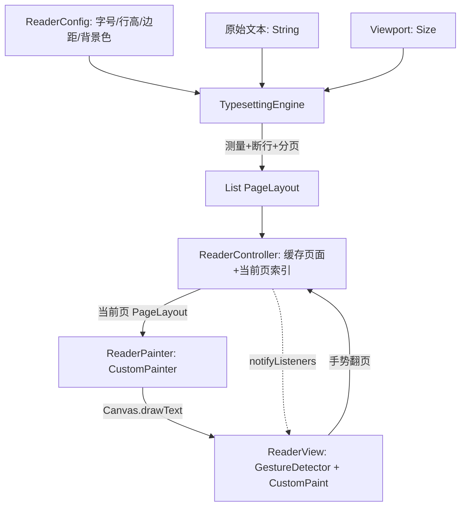
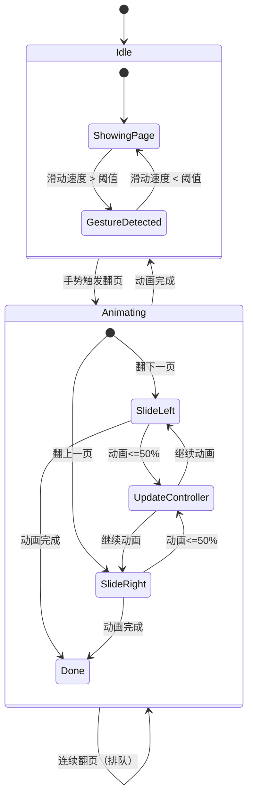
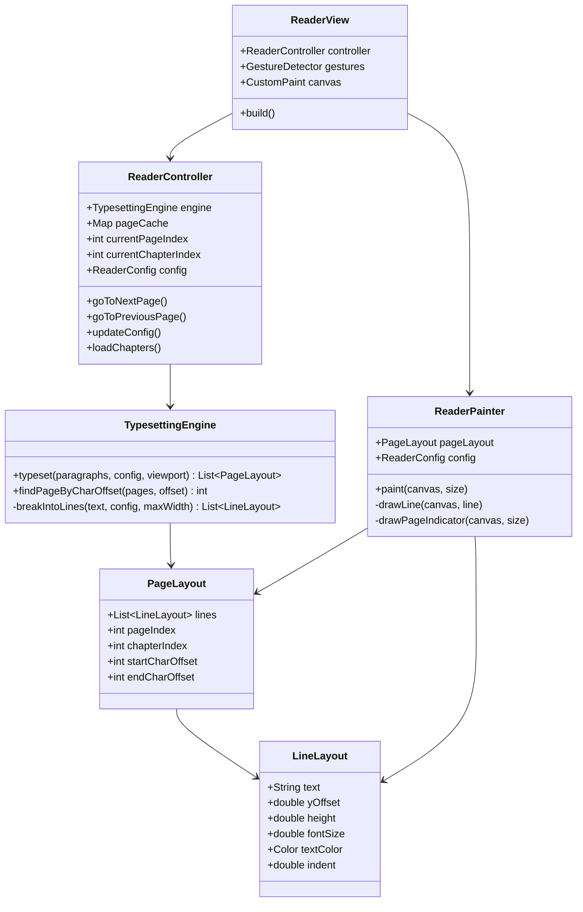

# DeepSeek Canvas 阅读器渲染架构设计文档

> **文档定位**：设计一套基于 **Canvas 自定义绘制** 的成熟 Flutter 阅读器渲染架构，完全脱离 Widget-based 渲染方案，使用 `CustomPainter` + `TextPainter` 在 Canvas 上直接绘制文字，支持分页、动态字体大小、高性能缓存。

---

## 目录

1. [架构概览](#1-架构概览)
2. [核心数据模型](#2-核心数据模型)
3. [TypesettingEngine 排版引擎](#3-typesettingengine-排版引擎)
4. [ReaderPainter 绘制器](#4-readerpainter-绘制器)
5. [ReaderController 控制器](#5-readercontroller-控制器)
6. [ReaderView 视图层](#6-readerview-视图层)
7. [手势与翻页动画](#7-手势与翻页动画)
8. [目录结构](#8-目录结构)
9. [分步骤开发指南](#9-分步骤开发指南)
10. [依赖注入与路由注册](#10-依赖注入与路由注册)
11. [性能优化策略](#11-性能优化策略)

---

## 1. 架构概览

### 1.1 五层架构图

```
┌─────────────────────────────────────────────┐
│  ReaderView                                 │
│  - GestureDetector 手势处理                   │
│  - AnimationController 翻页动画               │
│  - CustomPaint(ReaderPainter) Canvas 绘制    │
│  - 监听 ReaderController 状态变化             │
└──────────────────────┬──────────────────────┘
                       │ 持有 + 监听
┌──────────────────────▼──────────────────────┐
│  ReaderController (ChangeNotifier)           │
│  - 当前章节索引 / 当前页索引                   │
│  - PageLayout 缓存 Map                       │
│  - 翻页、跳章、配置变更后重建缓存              │
│  - 预加载相邻页面                             │
└──────────────────────┬──────────────────────┘
                       │ 调用
┌──────────────────────▼──────────────────────┐
│  TypesettingEngine                          │
│  - 文本测量 (TextPainter)                    │
│  - 断行算法 (Line Breaking)                  │
│  - 分页算法 (Page Breaking / 贪心装箱)        │
│  - 生成 List<PageLayout>                    │
└──────────────────────┬──────────────────────┘
                       │ 产出
┌──────────────────────▼──────────────────────┐
│  PageLayout                                 │
│  - 页码、字符偏移范围                         │
│  - List<LineLayout> 行数据                   │
│  - 页面总高度、宽度                           │
└──────────────────────┬──────────────────────┘
                       │ 包含
┌──────────────────────▼──────────────────────┐
│  LineLayout                                 │
│  - 行文本内容                                 │
│  - Y 轴偏移、行高                            │
│  - 样式信息 (字号、颜色、是否标题等)           │
└──────────────────────┬──────────────────────┘
                       │ 消费数据
┌──────────────────────▼──────────────────────┐
│  ReaderPainter (CustomPainter)              │
│  - paint(canvas, size) 方法                 │
│  - 遍历 PageLayout.lines                     │
│  - 创建 TextPainter 在 Canvas 上绘制文字      │
│  - 绘制背景色、页眉页脚                       │
│  - 复用 TextPainter 减少创建开销              │
└─────────────────────────────────────────────┘
```

### 1.2 数据流（Mermaid）



### 1.3 设计原则

| 原则            | 说明                                                                                     |
| --------------- | ---------------------------------------------------------------------------------------- |
| **Canvas 渲染** | 文字必须通过 `TextPainter.paint(canvas, offset)` 绘制到 Canvas，不用任何 Widget 渲染文字 |
| **预排版缓存**  | 排版结果 `List<PageLayout>` 在配置不变时缓存，翻页仅切换索引                             |
| **单一职责**    | 测量、分页、绘制、控制各层独立，互不耦合                                                 |
| **状态驱动**    | `ReaderController` 作为唯一状态源，驱动视图重建                                          |
| **性能优先**    | `TextPainter` 复用、按需预加载相邻页、懒排版                                             |

---

## 2. 核心数据模型

### 2.1 LineLayout —— 单行布局数据

```dart
// lib/features/reader/presentation/canvas/models/line_layout.dart

import 'package:flutter/material.dart';

/// 单行文本的排版结果
///
/// 包含该行的文字内容、在页面中的 Y 偏移、行高、
/// 以及绘制所需的样式信息。
class LineLayout {
  /// 该行的文本内容（已断行处理后的片段）
  final String text;

  /// 该行在页面 Canvas 中的 Y 轴偏移（相对于页面顶部）
  final double yOffset;

  /// 行高（包含行间距后的完整高度）
  final double height;

  /// 字号
  final double fontSize;

  /// 文字颜色
  final Color textColor;

  /// 字重
  final FontWeight fontWeight;

  /// 是否为标题行（用于加粗/大字号）
  final bool isHeading;

  /// 标题级别（1-6，仅 isHeading=true 时有效）
  final int headingLevel;

  /// 水平缩进（用于段落首行缩进）
  final double indent;

  const LineLayout({
    required this.text,
    required this.yOffset,
    required this.height,
    required this.fontSize,
    this.textColor = const Color(0xFF333333),
    this.fontWeight = FontWeight.normal,
    this.isHeading = false,
    this.headingLevel = 1,
    this.indent = 0,
  });

  /// 复制并修改字段
  LineLayout copyWith({
    String? text,
    double? yOffset,
    double? height,
    double? fontSize,
    Color? textColor,
    FontWeight? fontWeight,
    bool? isHeading,
    int? headingLevel,
    double? indent,
  }) {
    return LineLayout(
      text: text ?? this.text,
      yOffset: yOffset ?? this.yOffset,
      height: height ?? this.height,
      fontSize: fontSize ?? this.fontSize,
      textColor: textColor ?? this.textColor,
      fontWeight: fontWeight ?? this.fontWeight,
      isHeading: isHeading ?? this.isHeading,
      headingLevel: headingLevel ?? this.headingLevel,
      indent: indent ?? this.indent,
    );
  }
}
```

### 2.2 PageLayout —— 页面布局数据

```dart
// lib/features/reader/presentation/canvas/models/page_layout.dart

import 'package:flutter/material.dart';
import 'package:provider_mode/features/reader/presentation/canvas/models/line_layout.dart';

/// 单页的完整排版结果
///
/// 包含该页所有行、页码、字符偏移范围等信息。
/// 绘制时只需遍历 [lines] 逐一绘制即可。
class PageLayout {
  /// 该页包含的所有行
  final List<LineLayout> lines;

  /// 页码（从 0 开始）
  final int pageIndex;

  /// 所属章节索引
  final int chapterIndex;

  /// 该页起始字符在章节文本中的偏移
  final int startCharOffset;

  /// 该页结束字符在章节文本中的偏移
  final int endCharOffset;

  /// 页面可用宽度（viewport.width - 左右边距）
  final double contentWidth;

  /// 页面可用高度（viewport.height - 上下边距）
  final double contentHeight;

  /// 页面总高度（所有行高度之和 + 段落间距，用于滚动模式）
  final double totalContentHeight;

  const PageLayout({
    required this.lines,
    required this.pageIndex,
    required this.chapterIndex,
    required this.startCharOffset,
    required this.endCharOffset,
    required this.contentWidth,
    required this.contentHeight,
    this.totalContentHeight = 0,
  });

  /// 空页（占位用）
  factory PageLayout.empty({
    int pageIndex = 0,
    int chapterIndex = 0,
    double contentWidth = 0,
    double contentHeight = 0,
  }) {
    return PageLayout(
      lines: const [],
      pageIndex: pageIndex,
      chapterIndex: chapterIndex,
      startCharOffset: 0,
      endCharOffset: 0,
      contentWidth: contentWidth,
      contentHeight: contentHeight,
    );
  }

  /// 该页是否包含任何内容
  bool get isEmpty => lines.isEmpty;

  /// 行数
  int get lineCount => lines.length;

  /// 第一行的 Y 偏移
  double get firstLineY => lines.isNotEmpty ? lines.first.yOffset : 0;

  /// 最后一行的 Y 偏移 + 高度
  double get lastLineBottom {
    if (lines.isEmpty) return 0;
    final last = lines.last;
    return last.yOffset + last.height;
  }
}
```

### 2.3 ReaderConfig —— 阅读器配置（复用现有实体，增强）

```dart
// lib/features/reader/domain/entities/reader_config.dart
// 在现有 ReaderConfig 基础上增加 Canvas 渲染所需字段

import 'package:equatable/equatable.dart';
import 'package:flutter/material.dart';

class ReaderConfig extends Equatable {
  // ===== 字体设置 =====
  final double fontSize;            // 字号 (12-28)
  final double lineHeight;          // 行高倍率 (1.2-2.5)
  final double paragraphSpacing;    // 段落间距 (0-32 px)
  final double firstLineIndent;     // 首行缩进（字符数，默认2）
  final double letterSpacing;       // 字间距

  // ===== 页面设置 =====
  final EdgeInsets pagePadding;     // 页边距

  // ===== 颜色设置 =====
  final Color textColor;
  final Color backgroundColor;
  final Color pageIndicatorColor;   // 页码指示器颜色

  // ===== 字体设置 =====
  final String fontFamily;
  final FontWeight fontWeight;
  final FontStyle fontStyle;

  // ===== 标题设置 =====
  final double headingScale1;       // H1 字号倍率
  final double headingScale2;       // H2 字号倍率
  final double headingScale3;       // H3 字号倍率

  const ReaderConfig({
    this.fontSize = 16,
    this.lineHeight = 1.8,
    this.paragraphSpacing = 16,
    this.firstLineIndent = 2,
    this.letterSpacing = 0,
    this.pagePadding = const EdgeInsets.all(24),
    this.textColor = const Color(0xFF333333),
    this.backgroundColor = const Color(0xFFF5F0E8),
    this.pageIndicatorColor = const Color(0xFF999999),
    this.fontFamily = 'System',
    this.fontWeight = FontWeight.normal,
    this.fontStyle = FontStyle.normal,
    this.headingScale1 = 2.0,
    this.headingScale2 = 1.6,
    this.headingScale3 = 1.3,
  });

  /// 实际行高 = fontSize * lineHeight
  double get actualLineHeight => fontSize * lineHeight;

  /// 首行缩进像素值
  double get indentPixels => fontSize * firstLineIndent;

  ReaderConfig copyWith({
    double? fontSize,
    double? lineHeight,
    double? paragraphSpacing,
    double? firstLineIndent,
    double? letterSpacing,
    EdgeInsets? pagePadding,
    Color? textColor,
    Color? backgroundColor,
    Color? pageIndicatorColor,
    String? fontFamily,
    FontWeight? fontWeight,
    FontStyle? fontStyle,
    double? headingScale1,
    double? headingScale2,
    double? headingScale3,
  }) {
    return ReaderConfig(
      fontSize: fontSize ?? this.fontSize,
      lineHeight: lineHeight ?? this.lineHeight,
      paragraphSpacing: paragraphSpacing ?? this.paragraphSpacing,
      firstLineIndent: firstLineIndent ?? this.firstLineIndent,
      letterSpacing: letterSpacing ?? this.letterSpacing,
      pagePadding: pagePadding ?? this.pagePadding,
      textColor: textColor ?? this.textColor,
      backgroundColor: backgroundColor ?? this.backgroundColor,
      pageIndicatorColor: pageIndicatorColor ?? this.pageIndicatorColor,
      fontFamily: fontFamily ?? this.fontFamily,
      fontWeight: fontWeight ?? this.fontWeight,
      fontStyle: fontStyle ?? this.fontStyle,
      headingScale1: headingScale1 ?? this.headingScale1,
      headingScale2: headingScale2 ?? this.headingScale2,
      headingScale3: headingScale3 ?? this.headingScale3,
    );
  }

  @override
  List<Object?> get props => [
        fontSize, lineHeight, paragraphSpacing, firstLineIndent,
        letterSpacing, pagePadding, textColor, backgroundColor,
        pageIndicatorColor, fontFamily, fontWeight, fontStyle,
        headingScale1, headingScale2, headingScale3,
      ];
}
```

---

## 3. TypesettingEngine 排版引擎

排版引擎是架构的核心，负责：文本测量 → 断行 → 分页。使用 `TextPainter` 进行精确测量。

### 3.1 引擎接口与实现

```dart
// lib/features/reader/presentation/canvas/typesetting/typesetting_engine.dart

import 'package:flutter/material.dart';
import 'package:provider_mode/features/reader/domain/entities/reader_config.dart';
import 'package:provider_mode/features/reader/presentation/canvas/models/line_layout.dart';
import 'package:provider_mode/features/reader/presentation/canvas/models/page_layout.dart';

/// 排版引擎 —— 负责将文本段落转换为结构化的页面布局
///
/// 核心流程：
/// 1. 逐段遍历文本
/// 2. 对每段进行断行（Line Breaking）
/// 3. 将断好的行装入当前页（贪心装箱 Page Breaking）
/// 4. 当前页装满则封页，继续下一页
class TypesettingEngine {
  const TypesettingEngine();

  /// 对单个段落的纯文本执行排版，返回页面列表
  ///
  /// [paragraphs]  段落列表，每个元素为一个段落的文本
  /// [config]      阅读器配置
  /// [viewport]    页面可视区域尺寸
  /// [chapterIndex] 章节索引
  ///
  /// 返回该章节所有分页后的 PageLayout 列表
  List<PageLayout> typeset({
    required List<String> paragraphs,
    required ReaderConfig config,
    required Size viewport,
    int chapterIndex = 0,
  }) {
    if (paragraphs.isEmpty) {
      return [
        PageLayout.empty(
          chapterIndex: chapterIndex,
          contentWidth: viewport.width - config.pagePadding.horizontal,
          contentHeight: viewport.height - config.pagePadding.vertical,
        ),
      ];
    }

    final pages = <PageLayout>[];

    // 可用内容宽度和高度
    final contentWidth = viewport.width - config.pagePadding.horizontal;
    final contentHeight = viewport.height - config.pagePadding.vertical;

    // 当前页的行列表
    var currentLines = <LineLayout>[];
    // 当前页已用高度（从页面上边距开始）
    var currentY = 0.0;
    // 全局字符偏移追踪
    var globalCharOffset = 0;
    // 当前页起始字符偏移
    var pageStartChar = 0;
    // 页码
    var pageIndex = 0;

    /// 封页：将当前行列表打包为一个 PageLayout
    void flushPage() {
      if (currentLines.isEmpty) return;
      pages.add(PageLayout(
        lines: List.of(currentLines),
        pageIndex: pageIndex,
        chapterIndex: chapterIndex,
        startCharOffset: pageStartChar,
        endCharOffset: globalCharOffset,
        contentWidth: contentWidth,
        contentHeight: contentHeight,
        totalContentHeight: currentY,
      ));
      pageIndex++;
      currentLines = [];
      currentY = 0;
      pageStartChar = globalCharOffset;
    }

    // 遍历每个段落
    for (var pi = 0; pi < paragraphs.length; pi++) {
      final paragraph = paragraphs[pi];
      if (paragraph.trim().isEmpty) {
        // 空段落：插入段落间距
        globalCharOffset += paragraph.length;
        continue;
      }

      final isLastParagraph = pi == paragraphs.length - 1;

      // 对该段落执行断行
      final lines = _breakIntoLines(
        text: paragraph,
        config: config,
        maxWidth: contentWidth,
        isFirstParagraphOfPage: currentLines.isEmpty,
      );

      // 将断好的行逐行装入当前页
      for (var li = 0; li < lines.length; li++) {
        final line = lines[li];
        final isLastLineOfParagraph = li == lines.length - 1;

        // 计算该行需要的高度（行高 + 段落后间距（如果是段落最后一行））
        final lineSpace = isLastLineOfParagraph && !isLastParagraph
            ? config.paragraphSpacing
            : 0.0;
        final requiredHeight = line.height + lineSpace;

        // 当前页放不下这行 → 封页
        if (currentY + requiredHeight > contentHeight && currentLines.isNotEmpty) {
          flushPage();
        }

        // 超大行（单行高度 > 页面高度，极端情况）：强制放入
        if (requiredHeight > contentHeight) {
          if (currentLines.isNotEmpty) flushPage();
        }

        // 将行加入当前页，调整 Y 偏移
        final adjustedLine = line.copyWith(yOffset: currentY);
        currentLines.add(adjustedLine);
        globalCharOffset += line.text.length;
        currentY += requiredHeight;

        // 装不下的截断处理：封页后此行的剩余部分...
        // 简化处理：超出行跳过（后续可优化为按字符截断）
        if (currentY > contentHeight) {
          flushPage();
        }
      }
    }

    // 最后封页
    flushPage();

    // 确保至少有一页
    if (pages.isEmpty) {
      pages.add(PageLayout.empty(
        chapterIndex: chapterIndex,
        contentWidth: contentWidth,
        contentHeight: contentHeight,
      ));
    }

    return pages;
  }

  /// 对单段文本执行断行
  ///
  /// 使用 TextPainter 精确测量每个字符的宽度，
  /// 超出 maxWidth 即换行。
  List<LineLayout> _breakIntoLines({
    required String text,
    required ReaderConfig config,
    required double maxWidth,
    bool isFirstParagraphOfPage = false,
  }) {
    final lines = <LineLayout>[];
    if (text.isEmpty) return lines;

    // 构建 TextStyle
    final textStyle = TextStyle(
      fontSize: config.fontSize,
      height: config.lineHeight,
      fontWeight: config.fontWeight,
      fontFamily: config.fontFamily == 'System' ? null : config.fontFamily,
      fontStyle: config.fontStyle,
      letterSpacing: config.letterSpacing,
      color: config.textColor,
    );

    // 创建 TextPainter 用于测量
    final tp = TextPainter(
      textDirection: TextDirection.ltr,
      textScaler: TextScaler.noScaling,
    );

    // 首行缩进
    final firstLineWidth = isFirstParagraphOfPage ? maxWidth - config.indentPixels : maxWidth;
    var currentMaxWidth = firstLineWidth;

    // 贪心断行：逐字符添加直到超出宽度
    final chars = text.runes.toList();
    var lineStart = 0;

    for (var i = 1; i <= chars.length; i++) {
      final substr = String.fromCharCodes(chars.sublist(lineStart, i));
      tp.text = TextSpan(text: substr, style: textStyle);
      tp.layout(maxWidth: currentMaxWidth);

      // 如果当前子串宽度超过可用宽度，则断行
      if (tp.width > currentMaxWidth && i > lineStart + 1) {
        // 取出前一位置的行文本
        final lineText = String.fromCharCodes(chars.sublist(lineStart, i - 1));

        // 测量该行高度
        tp.text = TextSpan(text: lineText, style: textStyle);
        tp.layout(maxWidth: currentMaxWidth);

        lines.add(LineLayout(
          text: lineText,
          yOffset: 0, // 由上层调整
          height: tp.height,
          fontSize: config.fontSize,
          textColor: config.textColor,
          fontWeight: config.fontWeight,
          indent: lineStart == 0 && isFirstParagraphOfPage ? config.indentPixels : 0,
        ));

        lineStart = i - 1;
        currentMaxWidth = maxWidth; // 后续行使用完整宽度

        // 回退一个字符重新尝试
        i = lineStart + 1;
      }
    }

    // 处理最后一行（剩余字符）
    if (lineStart < chars.length) {
      final lastText = String.fromCharCodes(chars.sublist(lineStart));
      tp.text = TextSpan(text: lastText, style: textStyle);
      tp.layout(maxWidth: currentMaxWidth);

      lines.add(LineLayout(
        text: lastText,
        yOffset: 0,
        height: tp.height,
        fontSize: config.fontSize,
        textColor: config.textColor,
        fontWeight: config.fontWeight,
        indent: lineStart == 0 && isFirstParagraphOfPage ? config.indentPixels : 0,
      ));
    }

    // 确保首行有缩进标记
    if (lines.isNotEmpty && isFirstParagraphOfPage && config.firstLineIndent > 0) {
      lines[0] = lines[0].copyWith(indent: config.indentPixels);
    }

    tp.dispose();
    return lines;
  }

  /// 基于字符偏移定位页面索引（用于恢复阅读位置）
  int findPageByCharOffset(List<PageLayout> pages, int charOffset) {
    for (var i = 0; i < pages.length; i++) {
      final page = pages[i];
      if (charOffset >= page.startCharOffset && charOffset < page.endCharOffset) {
        return i;
      }
    }
    // 超出范围返回最后一页
    return (pages.length - 1).clamp(0, pages.length - 1);
  }
}
```

### 3.2 排版引擎的关键设计决策

| 决策点           | 方案                               | 理由                             |
| ---------------- | ---------------------------------- | -------------------------------- |
| 断行粒度         | 逐字符贪心测量                     | 精确控制，支持 CJK 和 Latin 混排 |
| 行高测量         | `TextPainter.layout` → `tp.height` | Flutter 原生排版引擎，准确可靠   |
| 分页策略         | 贪心装箱                           | 简单高效，每页尽量填满           |
| TextPainter 复用 | 引擎内创建/销毁                    | 避免跨帧泄漏，排版不频繁         |
| 字符偏移         | 全局累计                           | 便于进度恢复与百分比计算         |

---

## 4. ReaderPainter 绘制器

绘制器是 Canvas 渲染的执行者，实现 `CustomPainter` 接口，在 `paint` 方法中遍历 `PageLayout.lines` 并逐一绘制。

### 4.1 绘制器实现

```dart
// lib/features/reader/presentation/canvas/painter/reader_painter.dart

import 'package:flutter/material.dart';
import 'package:provider_mode/features/reader/domain/entities/reader_config.dart';
import 'package:provider_mode/features/reader/presentation/canvas/models/line_layout.dart';
import 'package:provider_mode/features/reader/presentation/canvas/models/page_layout.dart';

/// Canvas 文字绘制器
///
/// 在 [paint] 方法中遍历 PageLayout 的所有 LineLayout，
/// 使用 TextPainter 在 Canvas 上逐行绘制文字。
///
/// 优化策略：
/// - 复用 TextPainter 实例（通过 shouldRepaint 控制重建）
/// - 仅绘制视口可见内容（超出可视区域的行跳过）
class ReaderPainter extends CustomPainter {
  /// 当前页的布局数据
  final PageLayout? pageLayout;

  /// 阅读器配置
  final ReaderConfig config;

  /// 页面内边距（转为像素值）
  final EdgeInsets pagePadding;

  /// 是否显示页码
  final bool showPageIndicator;

  ReaderPainter({
    required this.pageLayout,
    required this.config,
    EdgeInsets? pagePadding,
    this.showPageIndicator = true,
  }) : pagePadding = pagePadding ?? config.pagePadding;

  @override
  void paint(Canvas canvas, Size size) {
    if (pageLayout == null || pageLayout!.isEmpty) {
      _drawEmptyPage(canvas, size);
      return;
    }

    // 1. 绘制背景色
    canvas.drawRect(
      Rect.fromLTWH(0, 0, size.width, size.height),
      Paint()..color = config.backgroundColor,
    );

    // 2. 逐行绘制文字
    for (final line in pageLayout!.lines) {
      // 性能优化：跳过可视区域外的行
      if (line.yOffset + line.height < 0) continue;
      if (line.yOffset > size.height) break;

      _drawLine(canvas, line, size);
    }

    // 3. 绘制页码指示器
    if (showPageIndicator) {
      _drawPageIndicator(canvas, size, pageLayout!.pageIndex);
    }
  }

  /// 绘制单行文字
  void _drawLine(Canvas canvas, LineLayout line, Size canvasSize) {
    // 构建 TextStyle
    final textStyle = TextStyle(
      fontSize: line.fontSize,
      height: config.lineHeight,
      fontWeight: line.fontWeight,
      fontFamily: config.fontFamily == 'System' ? null : config.fontFamily,
      fontStyle: config.fontStyle,
      letterSpacing: config.letterSpacing,
      color: line.textColor,
    );

    // 创建 TextPainter
    final tp = TextPainter(
      text: TextSpan(text: line.text, style: textStyle),
      textDirection: TextDirection.ltr,
      textScaler: TextScaler.noScaling,
    );

    // 布局
    final maxWidth = canvasSize.width - pagePadding.horizontal - line.indent;
    tp.layout(maxWidth: maxWidth);

    // 计算绘制位置：左边距 + 缩进，上边距 + 行Y偏移
    final offset = Offset(
      pagePadding.left + line.indent,
      pagePadding.top + line.yOffset,
    );

    // 在 Canvas 上绘制文字 —— 核心步骤
    tp.paint(canvas, offset);

    // 释放资源
    tp.dispose();
  }

  /// 绘制页码指示器（底部居中）
  void _drawPageIndicator(Canvas canvas, Size size, int pageIndex) {
    final pageText = '${pageIndex + 1}';

    final tp = TextPainter(
      text: TextSpan(
        text: pageText,
        style: TextStyle(
          fontSize: 11,
          color: config.pageIndicatorColor,
        ),
      ),
      textDirection: TextDirection.ltr,
      textScaler: TextScaler.noScaling,
    );
    tp.layout();

    // 底部居中
    final x = (size.width - tp.width) / 2;
    final y = size.height - tp.height - 8;

    tp.paint(canvas, Offset(x, y));
    tp.dispose();
  }

  /// 绘制空页
  void _drawEmptyPage(Canvas canvas, Size size) {
    canvas.drawRect(
      Rect.fromLTWH(0, 0, size.width, size.height),
      Paint()..color = config.backgroundColor,
    );
  }

  @override
  bool shouldRepaint(covariant ReaderPainter oldDelegate) {
    // 页面数据或配置变化时重绘
    return oldDelegate.pageLayout != pageLayout ||
        oldDelegate.config != config ||
        oldDelegate.showPageIndicator != showPageIndicator;
  }
}
```

### 4.2 绘制器性能优化要点

1. **`shouldRepaint` 精确控制**：仅当 `pageLayout` 或 `config` 引用变化时才重绘
2. **可视区域裁剪**：跳过 `yOffset` 超出视口的行
3. **TextPainter 即时释放**：每行绘制后 `dispose()`，避免内存堆积
4. **未来优化方向**：缓存 TextPainter 实例池、使用 `Picture` 预记录绘制命令

---

## 5. ReaderController 控制器

控制器是整个架构的状态中枢，负责管理章节、页面缓存、翻页逻辑。

### 5.1 控制器实现

```dart
// lib/features/reader/presentation/canvas/controller/reader_controller.dart

import 'package:flutter/material.dart';
import 'package:provider_mode/features/reader/domain/entities/reader_config.dart';
import 'package:provider_mode/features/reader/presentation/canvas/models/page_layout.dart';
import 'package:provider_mode/features/reader/presentation/canvas/typesetting/typesetting_engine.dart';

/// 阅读器控制器 —— 核心状态管理
///
/// 职责：
/// - 管理当前章节索引和当前页索引
/// - 缓存排版结果 [List<PageLayout>]
/// - 提供翻页、跳页、跳章方法
/// - 配置变更时重建排版缓存
class ReaderController extends ChangeNotifier {
  final TypesettingEngine _engine;

  // ===== 内容数据 =====
  /// 所有章节的文本（每个元素为一个章节的段落列表）
  List<List<String>> _chapters = [];

  /// 每个章节的排版结果缓存
  /// key: 章节索引, value: 该章节的页面列表
  final Map<int, List<PageLayout>> _pageCache = {};

  // ===== 状态 =====
  /// 当前章节索引
  int _currentChapterIndex = 0;

  /// 当前页索引（在 _pageCache[_currentChapterIndex] 中的索引）
  int _currentPageIndex = 0;

  /// 阅读器配置
  ReaderConfig _config;

  /// 视口大小
  Size _viewport = Size.zero;

  /// 是否正在排版
  bool _isTypesetting = false;

  ReaderController({
    required TypesettingEngine engine,
    ReaderConfig? config,
  })  : _engine = engine,
        _config = config ?? const ReaderConfig();

  // ===== Getters =====
  int get currentChapterIndex => _currentChapterIndex;
  int get currentPageIndex => _currentPageIndex;
  ReaderConfig get config => _config;
  Size get viewport => _viewport;
  bool get isTypesetting => _isTypesetting;
  int get chapterCount => _chapters.length;

  /// 当前章节的页面列表
  List<PageLayout>? get currentChapterPages =>
      _pageCache[_currentChapterIndex];

  /// 当前章节的总页数
  int get currentChapterPageCount =>
      _pageCache[_currentChapterIndex]?.length ?? 0;

  /// 当前页的布局数据
  PageLayout? get currentPage {
    final pages = _pageCache[_currentChapterIndex];
    if (pages == null || pages.isEmpty) return null;
    if (_currentPageIndex >= pages.length) return null;
    return pages[_currentPageIndex];
  }

  /// 全局阅读进度 (0.0 - 1.0)
  double get globalProgress {
    if (_chapters.isEmpty) return 0.0;

    // 简单按章节+页面估算
    var totalPages = 0;
    var pagesBeforeCurrent = 0;

    for (var i = 0; i < _chapters.length; i++) {
      final chapterPages = _pageCache[i]?.length ?? 0;
      totalPages += chapterPages;
      if (i < _currentChapterIndex) {
        pagesBeforeCurrent += chapterPages;
      }
    }
    pagesBeforeCurrent += _currentPageIndex;

    if (totalPages == 0) return 0.0;
    return (pagesBeforeCurrent / totalPages).clamp(0.0, 1.0);
  }

  // ===== 内容加载 =====

  /// 加载章节文本并执行排版
  ///
  /// [chapters] 所有章节的段落列表
  /// [viewport]  当前视口大小
  /// [startChapter] 起始章节索引（默认 0）
  Future<void> loadChapters({
    required List<List<String>> chapters,
    required Size viewport,
    int startChapter = 0,
  }) async {
    _chapters = chapters;
    _viewport = viewport;
    _isTypesetting = true;
    notifyListeners();

    // 按章节执行排版（可优化为 Isolate 并发）
    for (var i = 0; i < chapters.length; i++) {
      final pages = _engine.typeset(
        paragraphs: chapters[i],
        config: _config,
        viewport: viewport,
        chapterIndex: i,
      );
      _pageCache[i] = pages;
    }

    _currentChapterIndex = startChapter.clamp(0, chapters.length - 1);
    _currentPageIndex = 0;
    _isTypesetting = false;
    notifyListeners();
  }

  /// 仅排版当前章节（用于配置变更后重建）
  Future<void> retypesetCurrentChapter() async {
    if (_chapters.isEmpty || _currentChapterIndex >= _chapters.length) return;

    _isTypesetting = true;
    notifyListeners();

    // 保留当前字符偏移，用于恢复位置
    final currentCharOffset = currentPage?.startCharOffset ?? 0;

    final pages = _engine.typeset(
      paragraphs: _chapters[_currentChapterIndex],
      config: _config,
      viewport: _viewport,
      chapterIndex: _currentChapterIndex,
    );
    _pageCache[_currentChapterIndex] = pages;

    // 恢复阅读位置
    _currentPageIndex = _engine.findPageByCharOffset(pages, currentCharOffset);
    _isTypesetting = false;
    notifyListeners();
  }

  // ===== 翻页操作 =====

  /// 翻到下一页
  /// 返回 true 表示翻页成功，false 表示已是最后一页
  bool goToNextPage() {
    final pages = _pageCache[_currentChapterIndex];
    if (pages == null) return false;

    if (_currentPageIndex < pages.length - 1) {
      _currentPageIndex++;
      notifyListeners();
      return true;
    }

    // 当前章节最后一页，尝试跳下一章
    return goToNextChapter();
  }

  /// 翻到上一页
  /// 返回 true 表示翻页成功，false 表示已是第一页
  bool goToPreviousPage() {
    if (_currentPageIndex > 0) {
      _currentPageIndex--;
      notifyListeners();
      return true;
    }

    // 当前章节第一页，尝试跳上一章
    return goToPreviousChapter();
  }

  /// 跳转到指定页
  void jumpToPage(int pageIndex) {
    final pages = _pageCache[_currentChapterIndex];
    if (pages == null) return;
    _currentPageIndex = pageIndex.clamp(0, pages.length - 1);
    notifyListeners();
  }

  /// 跳转到下一章节
  bool goToNextChapter() {
    if (_currentChapterIndex < _chapters.length - 1) {
      _currentChapterIndex++;
      _currentPageIndex = 0;
      notifyListeners();
      return true;
    }
    return false;
  }

  /// 跳转到上一章节
  bool goToPreviousChapter() {
    if (_currentChapterIndex > 0) {
      _currentChapterIndex--;
      // 跳到上一章的最后一页
      final pages = _pageCache[_currentChapterIndex];
      _currentPageIndex = (pages?.length ?? 1) - 1;
      notifyListeners();
      return true;
    }
    return false;
  }

  /// 跳转到指定章节
  void jumpToChapter(int chapterIndex) {
    if (chapterIndex < 0 || chapterIndex >= _chapters.length) return;
    _currentChapterIndex = chapterIndex;
    _currentPageIndex = 0;
    notifyListeners();
  }

  // ===== 配置更新 =====

  /// 更新阅读器配置
  ///
  /// 配置变更会触发重新排版，注意保留当前阅读位置
  Future<void> updateConfig(ReaderConfig newConfig) async {
    final changed = _config != newConfig;
    _config = newConfig;

    if (changed) {
      await retypesetCurrentChapter();
    }
  }

  /// 快速设置字体大小（触发重排）
  Future<void> setFontSize(double fontSize) async {
    await updateConfig(_config.copyWith(fontSize: fontSize));
  }

  /// 更新视口大小（屏幕旋转/分屏时调用）
  Future<void> updateViewport(Size newViewport) async {
    if (_viewport == newViewport) return;
    _viewport = newViewport;

    // 视口变化需要全部重排
    if (_chapters.isNotEmpty) {
      _isTypesetting = true;
      notifyListeners();

      final currentCharOffset = currentPage?.startCharOffset ?? 0;

      for (var i = 0; i < _chapters.length; i++) {
        _pageCache[i] = _engine.typeset(
          paragraphs: _chapters[i],
          config: _config,
          viewport: newViewport,
          chapterIndex: i,
        );
      }

      final pages = _pageCache[_currentChapterIndex]!;
      _currentPageIndex = _engine.findPageByCharOffset(pages, currentCharOffset);
      _isTypesetting = false;
      notifyListeners();
    }
  }

  // ===== 缓存管理 =====

  /// 清除所有排版缓存（内存释放）
  void clearCache() {
    _pageCache.clear();
    notifyListeners();
  }

  /// 预加载相邻章节的排版（可选优化）
  Future<void> preloadAdjacentChapters() async {
    // 预加载下一章（如果尚未缓存）
    final nextChapter = _currentChapterIndex + 1;
    if (nextChapter < _chapters.length && !_pageCache.containsKey(nextChapter)) {
      _pageCache[nextChapter] = _engine.typeset(
        paragraphs: _chapters[nextChapter],
        config: _config,
        viewport: _viewport,
        chapterIndex: nextChapter,
      );
    }

    // 预加载上一章
    final prevChapter = _currentChapterIndex - 1;
    if (prevChapter >= 0 && !_pageCache.containsKey(prevChapter)) {
      _pageCache[prevChapter] = _engine.typeset(
        paragraphs: _chapters[prevChapter],
        config: _config,
        viewport: _viewport,
        chapterIndex: prevChapter,
      );
    }
  }

  @override
  void dispose() {
    _pageCache.clear();
    _chapters.clear();
    super.dispose();
  }
}
```

---

## 6. ReaderView 视图层

视图层负责：创建 Canvas 绘制入口、处理翻页手势、绑定控制器状态。

### 6.1 视图实现

```dart
// lib/features/reader/presentation/view/reader_view.dart

import 'package:flutter/material.dart';
import 'package:provider_mode/features/reader/domain/entities/reader_config.dart';
import 'package:provider_mode/features/reader/presentation/canvas/controller/reader_controller.dart';
import 'package:provider_mode/features/reader/presentation/canvas/painter/reader_painter.dart';

/// Canvas 阅读器主视图
///
/// 职责：
/// - 使用 CustomPaint + ReaderPainter 在 Canvas 上渲染文字
/// - 通过 GestureDetector 处理翻页手势
/// - 监听 ReaderController 状态变化自动更新
/// - 处理屏幕尺寸变化（LayoutBuilder）
class ReaderView extends StatefulWidget {
  /// 阅读器控制器（由父组件注入）
  final ReaderController controller;

  /// 是否显示页码
  final bool showPageIndicator;

  /// 点击中心区域回调（用于显示/隐藏工具栏）
  final VoidCallback? onCenterTap;

  const ReaderView({
    super.key,
    required this.controller,
    this.showPageIndicator = true,
    this.onCenterTap,
  });

  @override
  State<ReaderView> createState() => _ReaderViewState();
}

class _ReaderViewState extends State<ReaderView>
    with TickerProviderStateMixin {
  late ReaderController _controller;

  // ===== 翻页动画相关 =====
  late AnimationController _animController;
  late Animation<double> _slideAnimation;

  /// 翻页方向：true=下一页(左滑), false=上一页(右滑)
  bool _forwardDirection = true;

  /// 是否正在执行翻页动画
  bool _isAnimating = false;

  /// 动画中的偏移：从 1.0 → 0.0 或 -1.0 → 0.0
  double _animationOffset = 0;

  @override
  void initState() {
    super.initState();
    _controller = widget.controller;
    _controller.addListener(_onControllerChanged);

    // 初始化动画控制器
    _animController = AnimationController(
      duration: const Duration(milliseconds: 300),
      vsync: this,
    );
    _slideAnimation = Tween<double>(begin: 1.0, end: 0.0).animate(
      CurvedAnimation(parent: _animController, curve: Curves.easeOutCubic),
    );
    _animController.addStatusListener(_onAnimationStatus);
    _slideAnimation.addListener(() {
      setState(() {
        _animationOffset = _forwardDirection
            ? _slideAnimation.value
            : -_slideAnimation.value;
      });
    });
  }

  @override
  void dispose() {
    _controller.removeListener(_onControllerChanged);
    _animController.dispose();
    super.dispose();
  }

  void _onControllerChanged() {
    if (!_isAnimating) {
      setState(() {});
    }
  }

  void _onAnimationStatus(AnimationStatus status) {
    if (status == AnimationStatus.completed ||
        status == AnimationStatus.dismissed) {
      _isAnimating = false;
      setState(() {
        _animationOffset = 0;
      });
    }
  }

  // ===== 翻页方法 =====
  void _goToNextPage() {
    if (_isAnimating) return;
    final success = _controller.goToNextPage();
    if (success) {
      _forwardDirection = true;
      _isAnimating = true;
      _animController.forward(from: 0);
    }
  }

  void _goToPreviousPage() {
    if (_isAnimating) return;
    final success = _controller.goToPreviousPage();
    if (success) {
      _forwardDirection = false;
      _isAnimating = true;
      _animController.forward(from: 0);
    }
  }

  @override
  Widget build(BuildContext context) {
    return LayoutBuilder(
      builder: (context, constraints) {
        // 更新视口尺寸
        final currentSize = Size(constraints.maxWidth, constraints.maxHeight);
        if (currentSize != _controller.viewport &&
            currentSize.width > 0 &&
            currentSize.height > 0) {
          WidgetsBinding.instance.addPostFrameCallback((_) {
            _controller.updateViewport(currentSize);
          });
        }

        return GestureDetector(
          onTap: widget.onCenterTap,
          onHorizontalDragEnd: _onHorizontalDragEnd,
          onVerticalDragEnd: _onVerticalDragEnd,
          child: AnimatedBuilder(
            animation: _slideAnimation,
            builder: (context, child) {
              return _buildCanvasContent(currentSize);
            },
          ),
        );
      },
    );
  }

  /// 构建 Canvas 绘制内容
  Widget _buildCanvasContent(Size size) {
    // 排版中显示加载指示器
    if (_controller.isTypesetting) {
      return Container(
        color: _controller.config.backgroundColor,
        child: const Center(child: CircularProgressIndicator()),
      );
    }

    final pageLayout = _controller.currentPage;

    // 应用翻页动画偏移
    final translateX = _animationOffset * size.width;

    return Transform.translate(
      offset: Offset(translateX, 0),
      child: CustomPaint(
        size: size,
        painter: ReaderPainter(
          pageLayout: pageLayout,
          config: _controller.config,
          showPageIndicator: widget.showPageIndicator,
        ),
        // 确保 CustomPainter 在动画中也能正确更新
        isComplex: false,
        willChange: _isAnimating,
      ),
    );
  }

  /// 水平滑动结束 → 翻页
  void _onHorizontalDragEnd(DragEndDetails details) {
    final velocity = details.primaryVelocity ?? 0;

    if (velocity < -200) {
      // 向左滑动 → 下一页
      _goToNextPage();
    } else if (velocity > 200) {
      // 向右滑动 → 上一页
      _goToPreviousPage();
    }
    // 速度不够则不翻页
  }

  /// 垂直滑动结束（保留用于滚动模式扩展）
  void _onVerticalDragEnd(DragEndDetails details) {
    // 预留给滚动模式
  }
}

/// 动画监听辅助 Widget
///
/// 参考 Flutter 的 AnimatedWidget 模式，
/// 在动画值变化时重建 CustomPaint。
class AnimatedBuilder extends StatelessWidget {
  final Animation<double> animation;
  final Widget Function(BuildContext, Widget?) builder;

  const AnimatedBuilder({
    super.key,
    required this.animation,
    required this.builder,
  });

  @override
  Widget build(BuildContext context) {
    return AnimatedWidget(
      animation: animation,
      builder: (context, child) => builder(context, child),
    );
  }
}

/// 简化的 AnimatedWidget 包装
class AnimatedWidget extends StatelessWidget {
  final Animation<double> animation;
  final Widget Function(BuildContext, Widget?) builder;

  const AnimatedWidget({
    super.key,
    required this.animation,
    required this.builder,
  });

  @override
  Widget build(BuildContext context) {
    return builder(context, null);
  }
}
```

> **注意**：上面 `AnimatedBuilder` 和 `AnimatedWidget` 是简化示意。实际开发中应使用 `AnimatedBuilder`（Flutter 内置）或直接监听 `_slideAnimation` 并在 `addListener` 中 `setState`。

---

## 7. 手势与翻页动画

### 7.1 翻页动画状态机



### 7.2 动画参数

| 参数       | 值                            | 说明                     |
| ---------- | ----------------------------- | ------------------------ |
| 动画时长   | 300ms                         | 翻页滑动动画持续时间     |
| 动画曲线   | `Curves.easeOutCubic`         | 减速曲线，自然滑动感     |
| 滑动阈值   | ±200 px/s                     | 滑动速度超过此值触发翻页 |
| 动画偏移量 | `screenWidth * (1-animation)` | 从屏幕宽度滑入           |

---

## 8. 目录结构

```
lib/features/reader/
├── domain/
│   └── entities/
│       ├── reader_config.dart                 # 阅读器配置实体（增强版）
│       ├── reader_source.dart                 # 输入源值对象（现有，保留）
│       ├── reader_source_type.dart            # 源类型枚举（现有，保留）
│       └── reader_failure.dart                # 错误模型（现有，保留）
│
├── presentation/
│   ├── canvas/                                # ★ Canvas 渲染模块（新增）
│   │   ├── models/
│   │   │   ├── line_layout.dart               # 单行布局数据
│   │   │   └── page_layout.dart               # 页面布局数据
│   │   ├── typesetting/
│   │   │   └── typesetting_engine.dart         # 排版引擎
│   │   ├── painter/
│   │   │   └── reader_painter.dart            # Canvas 绘制器
│   │   └── controller/
│   │       └── reader_controller.dart         # 控制器
│   │
│   ├── view/
│   │   └── reader_view.dart                   # 阅读器主视图
│   │
│   └── viewmodels/
│       └── reader_view_model.dart             # 页面级 ViewModel（接入用例）
│
└── core/
    └── (现有核心文件保留)
```

---

## 9. 分步骤开发指南

按照以下顺序逐步实现，每步均可独立编译运行验证。

### 步骤 1：创建数据模型

创建 `LineLayout` 和 `PageLayout` 两个数据类。

**文件**：

- `lib/features/reader/presentation/canvas/models/line_layout.dart`
- `lib/features/reader/presentation/canvas/models/page_layout.dart`

**验证**：编写单元测试，验证 `copyWith`、`PageLayout.empty()` 等构造方法。

```dart
// test/unit/line_layout_test.dart
import 'package:flutter_test/flutter_test.dart';
import 'package:provider_mode/features/reader/presentation/canvas/models/line_layout.dart';

void main() {
  test('LineLayout.copyWith preserves unchanged fields', () {
    final line = const LineLayout(text: 'Hello', yOffset: 10, height: 24, fontSize: 16);
    final copied = line.copyWith(text: 'World');
    expect(copied.text, 'World');
    expect(copied.yOffset, 10);
    expect(copied.height, 24);
    expect(copied.fontSize, 16);
  });
}
```

### 步骤 2：实现排版引擎

实现 `TypesettingEngine`，核心是断行和分页算法。

**文件**：

- `lib/features/reader/presentation/canvas/typesetting/typesetting_engine.dart`

**测试文本**（先用固定英文验证，再验证中文）：

```dart
// test/unit/typesetting_engine_test.dart
import 'package:flutter/material.dart';
import 'package:flutter_test/flutter_test.dart';
import 'package:provider_mode/features/reader/domain/entities/reader_config.dart';
import 'package:provider_mode/features/reader/presentation/canvas/typesetting/typesetting_engine.dart';

void main() {
  test('typeset splits text into pages', () {
    final engine = const TypesettingEngine();
    final config = const ReaderConfig(fontSize: 16, lineHeight: 1.5);
    final viewport = const Size(375, 667); // iPhone 8 尺寸

    final paragraphs = [
      '第一章 开端',
      '这是一段很长的测试文本，用来验证排版引擎的分页功能是否正常工作。' * 50,
    ];

    // 注意：单元测试中无法使用 TextPainter（需要 binding），
    // 实际测试应在 widgetTest 中或 mock binding 环境中进行。
    // 此处展示测试结构。
  });
}
```

> **重要提示**：`TextPainter` 依赖 Flutter 的 binding 环境。单元测试需在 `testWidgets` 中运行，或使用 `TestWidgetsFlutterBinding.ensureInitialized()`。

### 步骤 3：实现绘制器

实现 `ReaderPainter`，验证 Canvas 能正确绘制文字。

**文件**：

- `lib/features/reader/presentation/canvas/painter/reader_painter.dart`

**验证方式**：创建一个简单的测试页面，传入手动构造的 `PageLayout` 数据：

```dart
// 简单验证代码（放在某个测试页面中）
@override
Widget build(BuildContext context) {
  return Scaffold(
    body: CustomPaint(
      size: MediaQuery.of(context).size,
      painter: ReaderPainter(
        pageLayout: PageLayout(
          lines: [
            const LineLayout(text: '第一章 测试', yOffset: 0, height: 48,
                fontSize: 32, fontWeight: FontWeight.bold),
            const LineLayout(text: '这是一段测试文本，验证Canvas绘制是否正常工作。',
                yOffset: 64, height: 28, fontSize: 16),
            const LineLayout(text: '第二行测试文本，用于验证多行绘制。',
                yOffset: 96, height: 28, fontSize: 16),
          ],
          pageIndex: 0,
          chapterIndex: 0,
          startCharOffset: 0,
          endCharOffset: 100,
          contentWidth: 327,
          contentHeight: 619,
        ),
        config: const ReaderConfig(),
      ),
    ),
  );
}
```

### 步骤 4：实现控制器

实现 `ReaderController`，管理章节数据和页面缓存。

**文件**：

- `lib/features/reader/presentation/canvas/controller/reader_controller.dart`

**验证**：编写 widget test，加载测试段落，验证翻页逻辑。

```dart
testWidgets('ReaderController page navigation', (tester) async {
  final controller = ReaderController(
    engine: const TypesettingEngine(),
    config: const ReaderConfig(fontSize: 16),
  );

  final chapters = [
    ['段落一的内容。' * 100],
    ['第二章段落一。' * 100],
  ];

  await controller.loadChapters(
    chapters: chapters,
    viewport: const Size(375, 667),
  );

  expect(controller.currentChapterIndex, 0);
  expect(controller.currentPageIndex, 0);
  expect(controller.currentChapterPageCount, greaterThan(0));

  // 翻页
  final hasNext = controller.goToNextPage();
  // ... 验证
});
```

### 步骤 5：组装 ReaderView

实现 `ReaderView`，整合 GestureDetector、CustomPaint、ReaderController。

**文件**：

- `lib/features/reader/presentation/view/reader_view.dart`

### 步骤 6：接入 ViewModel 和用例

实现 `ReaderViewModel`，接入现有的 Clean Architecture（`LoadReaderContent` 用例）。

```dart
// lib/features/reader/presentation/viewmodels/reader_view_model.dart

import 'package:flutter/material.dart';
import 'package:dart_either/dart_either.dart';
import 'package:provider_mode/features/reader/domain/entities/reader_config.dart';
import 'package:provider_mode/features/reader/domain/entities/reader_failure.dart';
import 'package:provider_mode/features/reader/domain/entities/reader_source.dart';
import 'package:provider_mode/features/reader/domain/usecases/load_reader_content.dart';
import 'package:provider_mode/features/reader/presentation/canvas/controller/reader_controller.dart';
import 'package:provider_mode/features/reader/presentation/canvas/typesetting/typesetting_engine.dart';

class ReaderViewModel extends ChangeNotifier {
  final LoadReaderContent _loadContent;
  late final ReaderController _controller;

  bool _isLoading = false;
  String? _errorMessage;

  ReaderViewModel({required LoadReaderContent loadContent})
      : _loadContent = loadContent {
    _controller = ReaderController(
      engine: const TypesettingEngine(),
    );
    _controller.addListener(() => notifyListeners());
  }

  ReaderController get controller => _controller;
  bool get isLoading => _isLoading;
  String? get errorMessage => _errorMessage;

  /// 加载内容并排版
  Future<void> loadContent({
    required ReaderSource source,
    required Size viewport,
  }) async {
    _isLoading = true;
    _errorMessage = null;
    notifyListeners();

    final result = await _loadContent(LoadReaderContentParams(source));

    result.fold(
      (failure) {
        _errorMessage = failure.message;
        _isLoading = false;
        notifyListeners();
      },
      (content) async {
        // 将 ReaderContent 转换为段落列表
        final chapters = content.sections.map((section) {
          return section.blocks
              .whereType<TextBlock>() // 暂时只处理文本块
              .map((block) => block.text)
              .toList();
        }).toList();

        await _controller.loadChapters(
          chapters: chapters,
          viewport: viewport,
        );

        _isLoading = false;
        notifyListeners();
      },
    );
  }

  /// 更新配置
  Future<void> updateConfig(ReaderConfig config) async {
    await _controller.updateConfig(config);
  }

  /// 设置字体大小
  Future<void> setFontSize(double fontSize) async {
    await _controller.setFontSize(fontSize);
  }

  @override
  void dispose() {
    _controller.removeListener(() => notifyListeners());
    _controller.dispose();
    super.dispose();
  }
}
```

> **注意**：`TextBlock` 引用需要导入 `reader_content.dart`（参见现有设计文档 v2）。

### 步骤 7：创建阅读器页面入口

```dart
// lib/features/reader/presentation/view/reader_page.dart

import 'package:flutter/material.dart';
import 'package:provider_mode/features/reader/presentation/canvas/controller/reader_controller.dart';
import 'package:provider_mode/features/reader/presentation/view/reader_view.dart';
import 'package:provider_mode/features/reader/presentation/viewmodels/reader_view_model.dart';

/// 阅读器页面入口
///
/// 负责：
/// - 获取 ViewModel
/// - 显示/隐藏工具栏（点击中心区域切换）
/// - 提供字体大小调节 UI
class ReaderPage extends StatefulWidget {
  const ReaderPage({super.key});

  @override
  State<ReaderPage> createState() => _ReaderPageState();
}

class _ReaderPageState extends State<ReaderPage> {
  bool _showToolbar = true;

  @override
  Widget build(BuildContext context) {
    // 此处通过 Provider 获取 ReaderViewModel
    // final viewModel = context.watch<ReaderViewModel>();

    return Scaffold(
      body: Stack(
        children: [
          // 阅读器视图
          const ReaderView(
            // controller: viewModel.controller,
            controller: null, // 占位，实际通过 Provider 注入
            onCenterTap: _toggleToolbar,
          ),

          // 工具栏（顶部 + 底部）
          if (_showToolbar) ...[
            // 顶部栏
            Positioned(
              top: 0,
              left: 0,
              right: 0,
              child: _buildTopBar(),
            ),
            // 底部栏
            Positioned(
              bottom: 0,
              left: 0,
              right: 0,
              child: _buildBottomBar(),
            ),
          ],
        ],
      ),
    );
  }

  void _toggleToolbar() {
    setState(() {
      _showToolbar = !_showToolbar;
    });
  }

  Widget _buildTopBar() {
    return Container(
      color: Colors.white.withOpacity(0.9),
      padding: EdgeInsets.only(top: MediaQuery.of(context).padding.top),
      child: const Row(
        children: [
          BackButton(),
          Spacer(),
          Text('第1章', style: TextStyle(fontSize: 16)),
          Spacer(),
          SizedBox(width: 48),
        ],
      ),
    );
  }

  Widget _buildBottomBar() {
    return Container(
      color: Colors.white.withOpacity(0.9),
      padding: const EdgeInsets.symmetric(horizontal: 16, vertical: 8),
      child: Row(
        children: [
          // 字体减小按钮
          IconButton(
            icon: const Icon(Icons.text_decrease),
            onPressed: () {
              // viewModel.setFontSize(max(12, current - 1))
            },
          ),
          // 字体大小滑块
          Expanded(
            child: Slider(
              min: 12,
              max: 28,
              value: 16, // viewModel.controller.config.fontSize
              onChanged: (value) {
                // viewModel.setFontSize(value);
              },
            ),
          ),
          // 字体增大按钮
          IconButton(
            icon: const Icon(Icons.text_increase),
            onPressed: () {
              // viewModel.setFontSize(min(28, current + 1))
            },
          ),
        ],
      ),
    );
  }
}
```

### 步骤 8：DI 注册和路由

参见 [第 10 节](#10-依赖注入与路由注册)。

### 步骤 9：端到端测试

```dart
// test/widget/reader_canvas_test.dart

import 'package:flutter/material.dart';
import 'package:flutter_test/flutter_test.dart';
import 'package:provider_mode/features/reader/presentation/canvas/controller/reader_controller.dart';
import 'package:provider_mode/features/reader/presentation/canvas/typesetting/typesetting_engine.dart';
import 'package:provider_mode/features/reader/presentation/view/reader_view.dart';

void main() {
  testWidgets('ReaderView renders text on Canvas', (tester) async {
    final controller = ReaderController(
      engine: const TypesettingEngine(),
      config: const ReaderConfig(fontSize: 16),
    );

    await controller.loadChapters(
      chapters: [
        ['测试段落内容。' * 50],
      ],
      viewport: const Size(375, 667),
    );

    await tester.pumpWidget(
      MaterialApp(
        home: Scaffold(
          body: ReaderView(controller: controller),
        ),
      ),
    );

    // 验证 CustomPaint 存在
    expect(find.byType(CustomPaint), findsOneWidget);

    // 验证加载指示器不显示
    expect(find.byType(CircularProgressIndicator), findsNothing);
  });
}
```

---

## 10. 依赖注入与路由注册

### 10.1 DI 注册

在 [`lib/di/injector.dart`](lib/di/injector.dart:1) 中添加：

```dart
// ========== Reader Canvas 阅读器模块 ==========

// ViewModel
injector.registerFactory(() => ReaderViewModel(
      loadContent: injector<LoadReaderContent>(),
    ));
```

> `LoadReaderContent` 的注册参见现有设计文档 v2 的 DI 部分。

### 10.2 路由注册

在 [`lib/core/router/app_router.dart`](lib/core/router/app_router.dart:40) 中添加：

```dart
// Reader Canvas 阅读器
GoRoute(
  path: 'reader',
  pageBuilder: (context, state) => CustomTransitionPage(
    child: const ReaderPage(),
    transitionsBuilder: _slideTransition,
  ),
),
```

---

## 11. 性能优化策略

### 11.1 当前阶段的优化

| 优化项               | 方案                               | 效果                  |
| -------------------- | ---------------------------------- | --------------------- |
| 排版缓存             | `Map<int, List<PageLayout>>` 缓存  | 翻页仅切换索引，O(1)  |
| shouldRepaint        | 精确比较 pageLayout 和 config 引用 | 减少无用重绘          |
| 可视区域裁剪         | 跳过 yOffset 超出视口的行          | 减少 TextPainter 创建 |
| TextPainter 即时释放 | 每行绘制后 dispose()               | 控制内存峰值          |

### 11.2 未来进阶优化

| 优化项           | 方案                                                      | 适用场景           |
| ---------------- | --------------------------------------------------------- | ------------------ |
| Isolate 排版     | `compute()` 将排版移入后台 Isolate                        | 大章节首次加载     |
| TextPainter 池化 | 预创建 N 个 TextPainter 循环使用                          | 减少 GC 压力       |
| Picture 预录制   | 将页面绘制命令录制为 `Picture`，直接 `canvas.drawPicture` | 静态页面极速绘制   |
| 按需排版         | 仅排版当前章+前后各一章                                   | 超长书籍（100+章） |
| 增量排版         | 仅重新排版变更的段落                                      | 配置微调场景       |

### 11.3 内存估算

以中文小说典型参数为例：

- 每页约 30 行
- 每行约 35 字符
- 每章约 20 页
- LineLayout 对象约 200 bytes
- PageLayout 对象约 500 bytes

单章内存：20 × (30 × 200 + 500) ≈ 130KB
50 章全缓存：≈ 6.5MB

> 结论：全缓存 50 章内存在可接受范围内。若章节数超过 100，建议启用按需排版。

---

## 附录 A：与现有 Widget-based 方案的关系

本 Canvas 方案与现有的 `reader-framework-design.md` (v1) 和 `reader-framework-design-glm.md` (v2) 的 Widget-based 方案是**替代关系**而非互补关系。

| 维度     | Widget-based (v2)                    | Canvas-based (本文档)                                |
| -------- | ------------------------------------ | ---------------------------------------------------- |
| 文字渲染 | `Text` Widget                        | `TextPainter.paint(canvas, offset)`                  |
| 分页     | `PageView.builder` + `PagePaginator` | `TypesettingEngine` 手动分页                         |
| 布局     | `Column` / `ListView`                | 手动计算 Y 偏移                                      |
| 字体控制 | `TextStyle` 直接传递                 | 通过 `LineLayout` 携带样式                           |
| 翻页动画 | `PageView` 内置                      | 自定义 `AnimationController` + `Transform.translate` |
| 性能     | 依赖 Flutter Widget 树               | 直接 Canvas 绘制，更可控                             |

---

## 附录 B：关键类关系图（Mermaid）



---

> **文档版本**: v1.0  
> **生成工具**: DeepSeek AI  
> **适用项目**: provider_mode (Flutter 3.5+)
