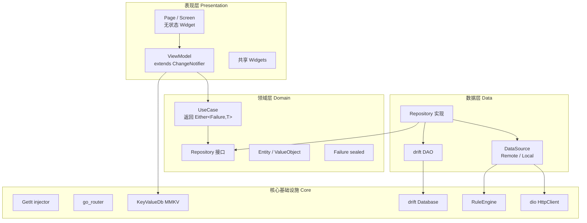
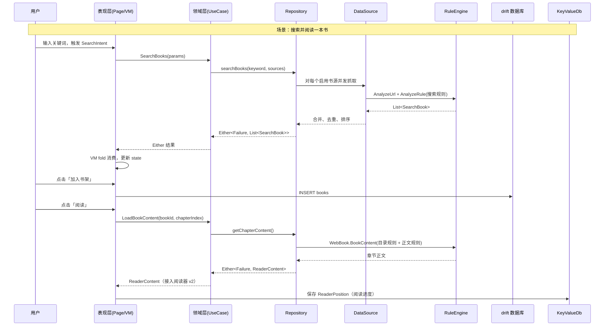
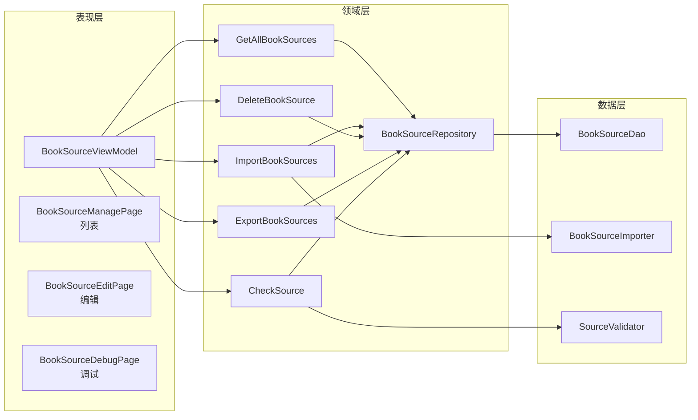
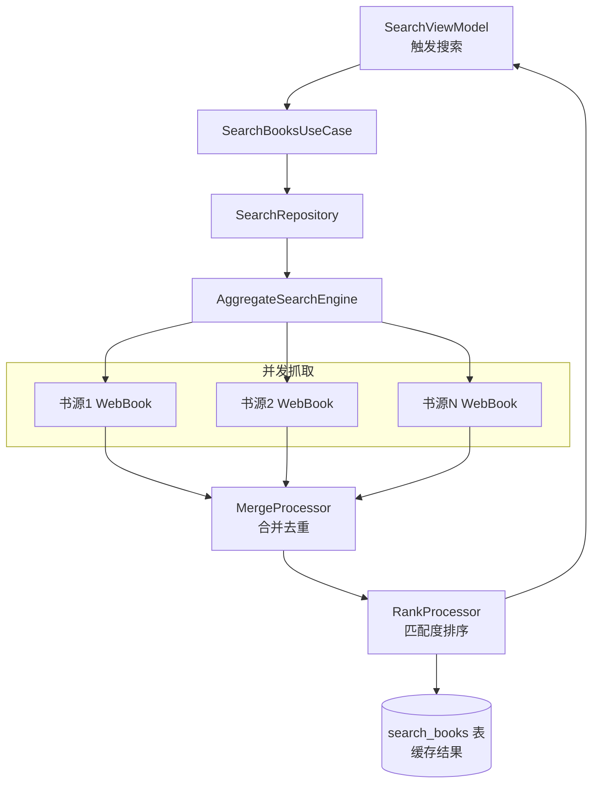
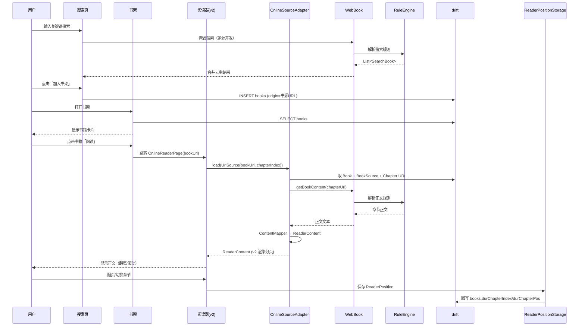
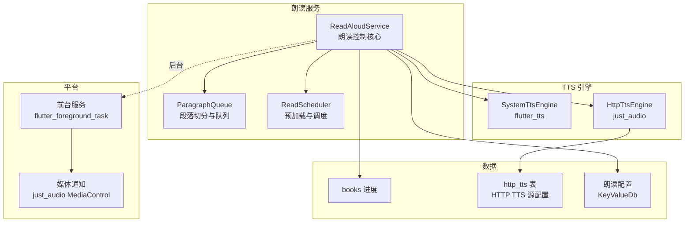
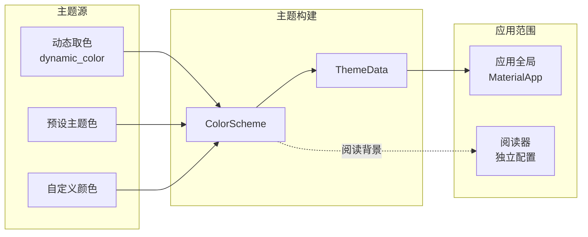
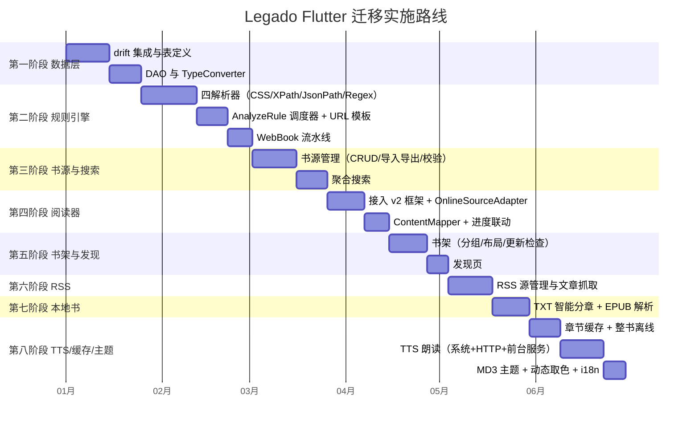
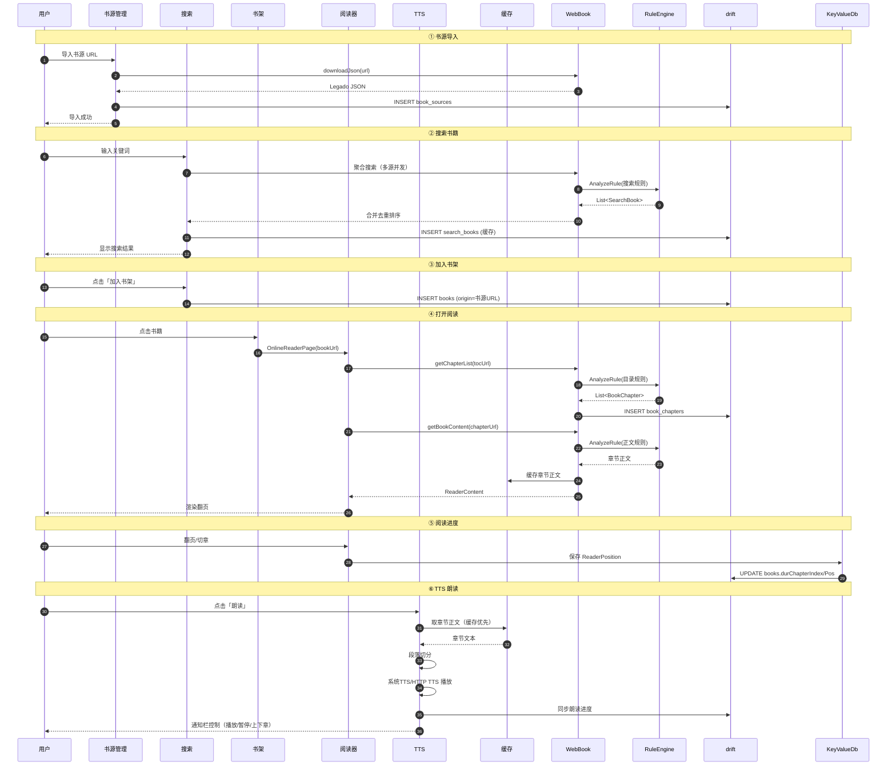
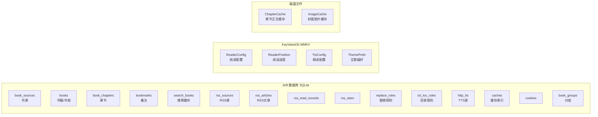

# GLM × Legado-MD3 Flutter 迁移设计文档

> **项目代号**：FlutterLegado
> **目标**：将 Android 原生开源阅读应用 [legado-with-MD3](https://github.com/HapeLee/legado-with-MD3) 使用 Flutter 技术栈完整重构，跨平台覆盖 Android / iOS / Desktop，保留 Material Design 3 视觉风格与核心书源规则引擎生态。
> **架构风格**：Clean Architecture + Provider + GetIt + drift + go_router（沿用并扩展现有 `provider_mode` 项目规范）
> **生成工具**：GLM
> **文档定位**：**端到端主设计文档（权威主线）**，整合并超越以下已有文档：
> - `DeepSeek-legado-flutter-migration-design.md`（整体迁移设计 v1，基于 Isar）
> - `reader-framework-design-glm.md`（阅读器框架 v2，本文件直接引用，不重写）

---

## 目录

1. [文档说明与定位](#1-文档说明与定位)
2. [项目概述](#2-项目概述)
3. [legado-with-MD3 架构剖析（实测）](#3-legado-with-md3-架构剖析实测)
4. [Flutter 整体架构设计](#4-flutter-整体架构设计)
5. [核心数据模型与 drift 持久化设计](#5-核心数据模型与-drift-持久化设计)
6. [书源规则引擎设计（核心）](#6-书源规则引擎设计核心)
7. [书源管理模块设计](#7-书源管理模块设计)
8. [在线搜索模块设计](#8-在线搜索模块设计)
9. [书架与发现模块设计](#9-书架与发现模块设计)
10. [阅读器子系统（接入层）](#10-阅读器子系统接入层)
11. [RSS 订阅模块设计](#11-rss-订阅模块设计)
12. [本地书导入模块设计](#12-本地书导入模块设计)
13. [TTS 朗读模块设计](#13-tts-朗读模块设计)
14. [内容缓存模块设计](#14-内容缓存模块设计)
15. [主题系统（MD3 + 动态取色）](#15-主题系统md3--动态取色)
16. [国际化与可访问性](#16-国际化与可访问性)
17. [完整目录结构](#17-完整目录结构)
18. [技术选型与依赖](#18-技术选型与依赖)
19. [分阶段实施计划](#19-分阶段实施计划)
20. [风险与挑战](#20-风险与挑战)
21. [附录 A：与现有项目的集成策略](#21-附录-a与现有项目的集成策略)
22. [附录 B：端到端数据流](#22-附录-b端到端数据流)

---

## 1. 文档说明与定位

### 1.1 本文档是什么

本文档是 FlutterLegado 项目的 **端到端主设计文档**，描述如何用 Flutter 重构 [legado-with-MD3](https://github.com/HapeLee/legado-with-MD3)。它覆盖**核心闭环**的全部模块（书源规则引擎 → 搜索 → 书架 → 阅读 → RSS → TTS → 本地书 → 缓存 → MD3 主题），并提供与现有 `provider_mode` 项目的集成方案。

本文档**整合并修正**了项目内已有的两份设计文档，作为唯一的权威主线：

| 已有文档 | 内容 | 本文档的处理 |
| -------- | ---- | ------------ |
| `DeepSeek-legado-flutter-migration-design.md` | 整体迁移设计（14 章），基于 Isar，覆盖书源/搜索/书架/发现 | **整合并修正**：核心模块设计重新定义（drift 替代 Isar；基于 legado `main` 分支实测架构深化规则引擎）；新增 RSS/TTS/本地书/缓存/MD3 主题等未覆盖模块 |
| `reader-framework-design-glm.md` | 阅读器框架 v2（22 章），适配器/Loader/Parser/Cache/分页/渲染 | **直接引用，不重写**：§10 仅写「在线书源接入层」与端到端衔接，框架细节指向 v2 |

### 1.2 选型决策记录（ADR）

以下决策已与项目所有者确认，写入文档作为设计基准：

| # | 维度 | 决策 | 候选 | 理由 |
| - | ---- | ---- | ---- | ---- |
| 1 | 文档定位 | 端到端主文档 | 补充版 / 核心闭环版 | 整合已有两份文档，作为权威主线，覆盖全模块 |
| 2 | 状态管理 | **Provider** | Bloc / Riverpod | 沿用现有 `provider_mode` 项目；legado 的 MVI/UDF 可用 `ChangeNotifier` + sealed State/Intent 充分表达 |
| 3 | 本地数据库 | **drift** | Isar / sqflite | 最贴近 Room 的表/查询/TypeConverter 模型；Isar 2024 后已停止维护（长期风险）；38 张表机械迁移友好 |
| 4 | 功能范围 | 核心 + RSS + TTS + 本地书 | 全量 / 最小 MVP | 覆盖阅读场景完整闭环；AI/漫画/音频书/Web 服务/备份恢复列为后续扩展 |

### 1.3 范围边界

**本次设计覆盖（IN）**：

- 书源规则引擎（CSS/XPath/JSONPath/正则四解析器 + 可选 JS）
- 书源管理（CRUD/导入导出/校验）
- 在线搜索（多源聚合）
- 书架与发现
- 阅读器接入层（引用 v2 框架）
- RSS 订阅
- 本地书导入（TXT/EPUB）
- TTS 朗读（系统 TTS + HTTP TTS）
- 内容缓存
- MD3 主题与动态取色
- 国际化与可访问性

**本次设计不覆盖（OUT，列为 §20 后续扩展方向）**：

- AI 对话子系统（legado-with-MD3 分支独有，含 7 张表）
- 漫画阅读增强
- 有声书 / 音频书
- Ktor 内置 Web 管理服务
- WebDAV / 本地备份恢复
- 翻译缓存与简繁转换
- Baseline Profile / Macrobenchmark 性能工程

### 1.4 术语表

| 术语 | 含义 |
| ---- | ---- |
| **书源（BookSource）** | 一份 JSON 配置，描述「搜索/发现/详情/目录/正文」全链路解析规则，可抓取任意网站 |
| **规则引擎（RuleEngine）** | 可配置解析引擎，按规则字符串自动路由到 CSS/XPath/JSONPath/正则解析器 |
| **WebBook** | legado 的书源操作门面，串联搜索→详情→目录→正文抓取流水线 |
| **净化/替换规则（ReplaceRule）** | 对正文做正则替换，用于去除广告/净化排版 |
| **MVI/UDF** | Model-View-Intent / 单向数据流：状态进 UiState，动作进 Intent，副作用进 Effect |
| **Clean Architecture** | 表现层(presentation) + 领域层(domain) + 数据层(data) 三层分离 |
| **TypeConverter** | Room/drift 中将复杂对象序列化为列存储（JSON 字符串）的转换器 |
| **Monet / 动态取色** | Material You 从壁纸提取主题色，生成 ColorScheme |

---

## 2. 项目概述

### 2.1 背景与来源

[Legado](https://github.com/gedoor/legado)（「阅读」）是 Android 平台最受欢迎的开源阅读应用之一（GitHub 30k+ Star）。其核心特色是基于 **可自定义规则引擎** 的书源系统——用户通过编写类 CSS 选择器规则，自定义任意网站的内容解析逻辑。

[legado-with-MD3](https://github.com/HapeLee/legado-with-MD3) 是 Legado 的一个 **深度重构分支**：

- **保留** Legado 全部核心能力（书源系统、规则引擎、净化替换、TTS、RSS 等），直接复用其业务逻辑层与数据层。
- **重做 UI 层**：用 **Material Design 3**（Material You / Monet 动态取色）全面重绘界面，并逐步从传统 View 迁移到 **Jetpack Compose**。
- 分支独有特性：详尽阅读记录、增强漫画/有声书/发现、平板优化、AI 功能模块、书籍备注、智能分组等。

本项目旨在使用 **Flutter** 技术完全重构该应用，实现真正的跨平台（Android / iOS / macOS / Windows / Linux），同时保留核心架构思想与书源生态兼容性。

### 2.2 目标

| 维度 | 目标描述 |
| ---- | -------- |
| **平台覆盖** | Android、iOS、macOS、Windows、Linux（Web 视情况） |
| **核心功能** | 书源规则引擎、书源管理、在线搜索、阅读、RSS、TTS、本地书 |
| **架构风格** | Clean Architecture + Provider + GetIt + drift |
| **UI 风格** | Material Design 3（动态取色，与 legado-with-MD3 一致） |
| **生态兼容** | 书源 JSON 格式与 Legado 1:1 兼容，可直接导入用户现有书源 |
| **代码复用** | 核心业务逻辑 100% 纯 Dart，平台无关 |

### 2.3 设计原则

| 原则 | 说明 |
| ---- | ---- |
| **规则引擎可移植** | 书源规则语法完全兼容 Legado 现有格式，支持直接导入书源 JSON |
| **关注点分离** | 解析引擎、网络层、缓存层、持久层、UI 层完全解耦 |
| **渐进增强** | 先实现无 JS 纯解析子集（覆盖 80% 书源），JS 引擎作为可选增强 |
| **沿用项目规范** | 严格遵循 `provider_mode` 的 Clean Architecture + Provider + GetIt 风格，复用 `UseCase`/`Failure`/`KeyValueDb`/`go_router` |
| **生态兼容优先** | 书源 JSON schema 不变是与 Legado 生态互通的前提，所有字段 1:1 对齐 |
| **可测试** | 规则解析器为纯函数；Repository/DataSource 通过抽象注入，免真实网络 |

---

## 3. legado-with-MD3 架构剖析（实测）

> 本章基于 legado-with-MD3 仓库 `main` 分支源码实测，提炼对 Flutter 重写直接可用的架构事实。

### 3.1 技术栈全表（Android → Flutter 对应）

| 领域 | Android 技术栈 | Flutter 重写对应 |
| ---- | -------------- | ---------------- |
| 语言 | Kotlin | Dart |
| UI 框架 | Jetpack Compose（迁移中）+ 残留 View/XML | Flutter widgets |
| 设计系统 | Material 3 + MaterialKolor（动态取色）+ Haze | Material 3 + `dynamic_color` |
| 导航 | Navigation 3（`NavKey`/`NavDisplay`） | `go_router` |
| 状态管理 | **MVI/UDF**：`StateFlow<UiState>` + `SharedFlow<Effect>` + sealed `Intent` | **Provider**：`ChangeNotifier` + sealed State/Intent |
| 架构 | Clean Architecture（data/domain/ui 三层） | Clean Architecture（data/domain/presentation 三层） |
| DI | **Koin**（`singleOf`/`viewModelOf`） | **GetIt**（`registerLazySingleton`/`registerFactory`） |
| 本地数据库 | **Room 2.8.4**（SQLite + TypeConverters，规则字段 Gson JSON 列） | **drift**（SQLite + `TypeConverter`，规则字段 json JSON 列） |
| 键值存储 | DataStore Preferences + 旧 Preference | `shared_preferences` + `mmkv`（已有） |
| 网络 | **OkHttp 5.3.2** + Cronet | **dio**（已有 5.9.2） |
| 规则解析 | **Jsoup 1.16.2**（CSS）+ JsoupXpath（XPath）+ json-path（JSONPath）+ 正则 | **html** + 自研 XPath + json_path + 正则 |
| JS 执行 | **Mozilla Rhino 1.8.1**（`@js:` 规则） | **flutter_js**（可选增强） |
| 电子书 | EPUB（魔改 epublib）+ libarchive + intellij-markdown | `epubx` + `archive` |
| 图片加载 | Glide + Coil | `cached_network_image` |
| 音频/TTS | Media3/ExoPlayer + 系统 TTS + HttpTTS | `just_audio` + `flutter_tts` |
| 内嵌服务 | **Ktor 3.5.0**（内置 Web 服务器，PC 端管理） | `shelf`（后续扩展） |
| 二维码 | zxing-lite | `mobile_scanner` |
| 简繁转换 | quick-chinese-transfer | 自研/移植（后续扩展） |

### 3.2 目录结构与分层

主源码根：`app/src/main/java/io/legado/app/`

```
io/legado/app/
├── api/          # Ktor Web 服务器 API（后续扩展，本次不迁移）
├── base/         # BaseComposeActivity（Compose 宿主）
├── constant/     # AppPattern、BookSourceType、BookType、PageAnim 常量
├── data/         # ★ 数据层（38 实体 + 30 DAO + repository）
├── di/           # Koin DI（appModule / appDatabaseModule）
├── domain/       # ★ 领域层（gateway 端口 + model + usecase）
├── exception/    # 异常
├── help/         # 业务帮助类
├── lib/          # 第三方封装（aliyun/cronet/webdav/...）
├── model/        # ★ 核心业务模型（规则引擎 + WebBook 在此）
├── receiver/     # 广播接收器
├── service/      # 前台/后台 Service（TTS/缓存/校验/下载）
├── ui/           # ★ UI 层（按功能区分）
├── utils/        # 工具类
└── web/          # Web 端相关
```

### 3.3 数据层：38 个 Room 实体（核心数据模型）

本次迁移范围内的实体清单（按模块分组）：

| 模块 | 实体 | 说明 |
| ---- | ---- | ---- |
| **书源** | `BookSource`、`BaseSource`、`BookSourcePart` | 书源规则配置（核心，30+ 字段） |
| **规则** | `TxtTocRule`、`ReplaceRule`、`DictRule` | 本地目录规则、净化替换规则、字典规则 |
| **书籍** | `Book`、`BaseBook`、`BookChapter`、`Bookmark`、`BookProgress` | 书籍元数据、章节、备注、进度 |
| **书架** | `BookGroup` | 书架分组 |
| **搜索** | `SearchBook`、`SearchKeyword`、`SearchContentHistory` | 搜索结果缓存、历史 |
| **RSS** | `RssSource`、`BaseRssArticle`、`RssArticle`、`RssReadRecord`、`RssStar`、`RuleSub` | RSS 源、文章、阅读记录、收藏、规则订阅 |
| **缓存/网络** | `Cache`、`Cookie`、`Server`、`HttpTTS` | 章节缓存、Cookie、服务器、HTTP TTS 源 |
| （本次不迁移） | `AiArtifact`/`AiChatConversation`/...（7 个 AI 表）、`HighlightRule`、`HomepageModule`、`TranslationCache` 等 | 列为后续扩展 |

### 3.4 核心实体 `BookSource` 字段（实测，30+ 字段）

```
标识：bookSourceUrl(PK)、bookSourceName、bookSourceGroup、bookSourceType(0文本/1音频/2图片/3文件/4视频)、
      bookUrlPattern、customOrder、enabled、enabledExplore、enabledCookieJar、concurrentRate、
      header、loginUrl/loginUi/loginCheckJs、coverDecodeJs、jsLib、weight、respondTime、lastUpdateTime
规则：searchUrl + ruleSearch、exploreUrl + ruleExplore + exploreScreen、ruleBookInfo、ruleToc、ruleContent、ruleReview
扩展：homepageModules、eventListener、customButton
```

规则字段（`ruleSearch`/`ruleExplore`/`ruleBookInfo`/`ruleToc`/`ruleContent`）各自是 JSON 对象（`SearchRule`/`ExploreRule`/`BookInfoRule`/`TocRule`/`ContentRule`），通过 **Gson TypeConverter 序列化为 JSON 字符串列存储**。→ Flutter 用 drift `TEXT` 列 + 自定义 `TypeConverter` 复刻（§5.4）。

### 3.5 核心业务模型（`model/`）——规则引擎

`model/analyzeRule/`（legado 的灵魂，也是 Flutter 重写最大工作量）：

| 文件 | 职责 | Flutter 对应 |
| ---- | ---- | ------------ |
| `AnalyzeRule.kt`（~32KB） | 核心引擎，统一调度下面四套解析器，处理 `@put`/`@get`/`@js:`/`##正则##` | `RuleEngine`（调度器） |
| `AnalyzeByJSoup.kt` | CSS 选择器解析（`@` 分隔，class/id/tag/text/children） | `CssSelectorParser`（基于 `html` 包） |
| `AnalyzeByXPath.kt` | XPath 解析 | `XPathParser`（自研/移植） |
| `AnalyzeByJSonPath.kt` | JSONPath 解析 | `JsonPathParser`（`json_path` 包） |
| `AnalyzeByRegex.kt` | 正则解析 | `RegexParser`（内置） |
| `AnalyzeUrl.kt`/`CustomUrl.kt` | URL 模板解析（POST/GET/header/编码/分页占位符） | `AnalyzeUrl` |

`model/webBook/`——书源操作流水线：

| 文件 | 职责 | Flutter 对应 |
| ---- | ---- | ------------ |
| `WebBook.kt` | 书源操作门面 | `WebBook` 门面 |
| `BookList.kt` | 搜索/发现结果列表抓取 | `WebBookSearchList` |
| `BookInfo.kt` | 书籍详情抓取 | `WebBookBookInfo` |
| `BookChapterList.kt` | 目录抓取 | `WebBookToc` |
| `BookContent.kt` | 正文抓取 | `WebBookContent` |

### 3.6 领域层（`domain/`）——Clean Architecture

`domain/gateway/`（端口，定义 usecase 与基础设施边界，本次迁移相关）：

```
BookSearchGateway、BookSourceCallbackGateway、BookCacheCleanupGateway、BookCacheDownloadGateway、
ExploreBooksGateway、LocalBookGateway、ReadingProgressGateway、DictionaryGateway
```

`domain/model/`（领域模型，与 Room 实体解耦）：`BookShelfState`、`BookGroupAssignment`、`BookSearchScope`、`CacheableBook`、`ReadingProgress`、`ContentChunker` 等。

### 3.7 UI 层页面架构约定（MVI/UDF）

legado-with-MD3 的每个功能页面遵循 colocate 约定（来自仓库 `.agents/skills/legado-compose-migration/`）：

```
FeatureContract.kt    → sealed UiState + sealed Intent + sealed Effect
FeatureViewModel.kt   → StateFlow<UiState> + SharedFlow<Effect>，单 onIntent() 入口
FeatureScreen.kt      → 无状态 Composable
```

**对 Flutter 重写的启示**：这套 MVI/UDF 结构可几乎逐行映射到 `ChangeNotifier` + sealed State/Intent（§4.3）。

### 3.8 服务层（`service/`）

| Service | 职责 | Flutter 对应 |
| ------- | ---- | ------------ |
| `AudioPlayService` / `TTSReadAloudService` / `HttpReadAloudService` | 朗读（系统 TTS + HTTP TTS） | `ReadAloudService` + `flutter_tts`/`just_audio` + 前台服务 |
| `CacheBookService` | 整书离线缓存 | `CacheBookService`（§14） |
| `CheckSourceService` | 书源校验（测响应时间/有效性） | `CheckSourceUseCase`（§7） |
| `ExportBookService` | 导出 EPUB/TXT | 后续扩展 |
| `WebService` | Ktor 内置 Web 管理端 | 后续扩展 |

### 3.9 对 Flutter 重写的关键启示

1. **规则引擎是最硬骨头**：需移植 CSS+XPath+JSONPath+正则 四套解析器，并执行 `@js:`（Rhino）。→ 先做无 JS 纯解析子集，JS 作为可选增强。
2. **数据模型可 1:1 机械迁移**：38 实体 → drift 表，规则 JSON 列照搬 TypeConverter。
3. **MVI 天然适配 Provider**：Contract 结构逐行映射 `ChangeNotifier` + sealed State/Intent。
4. **业务逻辑与 UI 已解耦**：legado 处于 Compose 迁移中，说明 data/domain 层较独立，可干净移植到 Dart。
5. **书源生态兼容是前提**：JSON schema 必须 1:1 对齐，否则无法导入用户已有书源。

---

## 4. Flutter 整体架构设计

### 4.1 分层架构

严格遵循 `provider_mode` 项目的 Clean Architecture 风格（参照现有 `features/auth`、`features/chat` 模板）：



### 4.2 各层职责

| 层 | 职责 | 约定 |
| -- | ---- | ---- |
| **表现层** | UI 渲染、用户交互、调用 UseCase、持有页面状态 | Page 是无状态 Widget；ViewModel `extends ChangeNotifier`，通过 `injector` 获取 UseCase |
| **领域层** | 业务规则；定义 Entity、Repository 接口、UseCase | UseCase 返回 `Future<Either<Failure, T>>`；Repository 是抽象接口；纯 Dart，无 Flutter 依赖 |
| **数据层** | Repository 实现、DataSource（网络/本地）、drift DAO | 远程数据用 dio + RuleEngine；本地数据用 drift DAO / KeyValueDb |
| **核心基础设施** | DI、路由、存储、数据库、规则引擎、网络 | 模块化注册到 `GetIt`；新模块沿用现有模式 |

### 4.3 状态管理：Provider 表达 MVI/UDF

legado 的 MVI 架构（`StateFlow<UiState>` + `SharedFlow<Effect>` + sealed `Intent`）用 Provider 表达如下：

```dart
// ===== 1. State（sealed，不可变，替代 StateFlow<UiState>）=====
sealed class BookSourceState extends Equatable {
  const BookSourceState();
}
class BookSourceInitial extends BookSourceState {
  const BookSourceInitial();
  @override List<Object?> get props => [];
}
class BookSourceLoading extends BookSourceState {
  const BookSourceLoading();
  @override List<Object?> get props => [];
}
class BookSourceLoaded extends BookSourceState {
  final List<BookSource> sources;
  const BookSourceLoaded(this.sources);
  @override List<Object?> get props => [sources];
}
class BookSourceError extends BookSourceState {
  final String message;
  const BookSourceError(this.message);
  @override List<Object?> get props => [message];
}

// ===== 2. Intent（sealed，替代 sealed Intent）=====
sealed class BookSourceIntent {
  const BookSourceIntent();
}
class LoadBookSources extends BookSourceIntent {
  final int? type;
  const LoadBookSources({this.type});
}
class DeleteBookSource extends BookSourceIntent {
  final String bookSourceUrl;
  const DeleteBookSource(this.bookSourceUrl);
}
class ToggleBookSourceEnabled extends BookSourceIntent {
  final String bookSourceUrl;
  final bool enabled;
  const ToggleBookSourceEnabled(this.bookSourceUrl, this.enabled);
}

// ===== 3. Effect（一次性副作用，导航/通知/权限，替代 SharedFlow<Effect>）=====
sealed class BookSourceEffect {
  const BookSourceEffect();
}
class ShowSnackBar extends BookSourceEffect {
  final String message;
  const ShowSnackBar(this.message);
}
class NavigateToEditPage extends BookSourceEffect {
  final String? bookSourceUrl;
  const NavigateToEditPage(this.bookSourceUrl);
}

// ===== 4. ViewModel（extends ChangeNotifier，替代 ViewModel + onIntent()）=====
class BookSourceViewModel extends ChangeNotifier {
  final GetAllBookSources _getAll;
  final DeleteBookSourceUseCase _delete;
  final ToggleBookSourceEnabledUseCase _toggle;

  BookSourceViewModel(this._getAll, this._delete, this._toggle);

  BookSourceState _state = const BookSourceInitial();
  BookSourceState get state => _state;

  // Effect 通过回调或 Stream 通知页面
  final _effectController = StreamController<BookSourceEffect>.broadcast();
  Stream<BookSourceEffect> get effects => _effectController.stream;

  /// 单一入口，替代 onIntent(intent)
  void onIntent(BookSourceIntent intent) async {
    switch (intent) {
      case LoadBookSources(:final type):
        _state = const BookSourceLoading();
        notifyListeners();
        final result = await _getAll(BookSourceParams(type: type));
        result.fold(
          (failure) => _state = BookSourceError(failure.message),
          (sources) => _state = BookSourceLoaded(sources),
        );
        notifyListeners();
      case DeleteBookSource(:final bookSourceUrl):
        await _delete(DeleteParams(bookSourceUrl));
        onIntent(const LoadBookSources()); // 刷新
        _effectController.add(const ShowSnackBar('已删除'));
      case ToggleBookSourceEnabled(:final bookSourceUrl, :final enabled):
        await _toggle(ToggleParams(bookSourceUrl, enabled));
    }
  }

  @override
  void dispose() {
    _effectController.close();
    super.dispose();
  }
}
```

**页面消费**：

```dart
class BookSourceManagePage extends StatefulWidget { ... }

class _BookSourceManagePageState extends State<BookSourceManagePage> {
  late final BookSourceViewModel _vm;

  @override
  void initState() {
    super.initState();
    _vm = injector<BookSourceViewModel>();
    _vm.onIntent(const LoadBookSources());
    _vm.effects.listen((effect) {
      switch (effect) {
        case ShowSnackBar(:final message):
          ScaffoldMessenger.of(context).showSnackBar(SnackBar(content: Text(message)));
        case NavigateToEditPage(:final bookSourceUrl):
          context.go('/bookSource/edit', extra: bookSourceUrl);
      }
    });
  }

  @override
  Widget build(BuildContext context) {
    return ListenableBuilder(
      listenable: _vm,
      builder: (context, _) {
        return switch (_vm.state) {
          BookSourceInitial() || BookSourceLoading() => const Center(child: CircularProgressIndicator()),
          BookSourceError(:final message) => Center(child: Text(message)),
          BookSourceLoaded(:final sources) => BookSourceListView(sources: sources),
        };
      },
    );
  }
}
```

### 4.4 依赖注入：GetIt 分模块注册

新模块沿用现有 `auth`/`chat` 的注册模式（`DataSource → Repository → UseCase → ViewModel`），追加到 `lib/di/injector.dart`：

```dart
// ========== 数据库 ==========
injector.registerLazySingleton<AppDatabase>(() => AppDatabase());
// DAO 通过 injector<AppDatabase>() 访问

// ========== 规则引擎 ==========
injector.registerLazySingleton<RuleEngine>(() => RuleEngineImpl(
      httpClient: injector<Dio>(),
      jsExecutor: injector<JsExecutor>(), // 可选，首期用 NoopJsExecutor
    ));
injector.registerLazySingleton<JsExecutor>(() => NoopJsExecutor()); // 首期空实现

// ========== 书源模块 ==========
injector.registerLazySingleton<BookSourceRepository>(
  () => BookSourceRepositoryImpl(db: injector<AppDatabase>()));
injector.registerFactory(() => GetAllBookSources(injector<BookSourceRepository>()));
injector.registerFactory(() => ImportBookSources(injector<BookSourceRepository>()));
injector.registerFactory(() => BookSourceViewModel(
      getAll: injector<GetAllBookSources>(),
      delete: injector<DeleteBookSourceUseCase>(),
      toggle: injector<ToggleBookSourceEnabledUseCase>(),
    ));

// ========== 搜索模块 ==========
// ...（同模式）
```

### 4.5 路由扩展：go_router

在 `lib/core/router/app_router.dart` 的 `/` 下追加子路由（沿用现有 `_slideTransition` 转场）：

```dart
routes: <RouteBase>[
  GoRoute(path: '/', ..., routes: [
    // ... 现有 8 个路由 ...
    // 新增 Legado 路由
    GoRoute(path: 'bookshelf', pageBuilder: (...) => CustomTransitionPage(child: const BookshelfPage(), transitionsBuilder: _slideTransition)),
    GoRoute(path: 'bookSource', ..., routes: [
      GoRoute(path: 'manage', ...),
      GoRoute(path: 'edit', ...),
    ]),
    GoRoute(path: 'search', ...),
    GoRoute(path: 'explore', ...),
    GoRoute(path: 'rss', ...),
    GoRoute(path: 'reader', ...), // 阅读器，extra 传 bookId
    GoRoute(path: 'tts', ...),
    GoRoute(path: 'localBook', ...),
  ]),
],
```

### 4.6 端到端数据流总览



---

## 5. 核心数据模型与 drift 持久化设计

> 本章用 **drift** 替代 DeepSeek 迁移文档中的 Isar 方案。drift 是类型安全的 SQLite ORM，最贴近 legado 原生 Room 的表/查询/TypeConverter 模型。

### 5.1 为什么选 drift 而非 Isar

| 维度 | drift | Isar | sqflite |
| ---- | ----- | ---- | ------- |
| 数据模型 | SQL 表（最贴近 Room） | NoSQL 集合 | SQL 表（手写） |
| 类型安全 | 编译期 + 代码生成 | 编译期 | 运行期 |
| TypeConverter | ✅ 原生支持（JSON 列） | ❌ 需嵌套对象 | ❌ 手写序列化 |
| 维护状态 | 活跃维护 | **2024 后停止维护** | 活跃 |
| 迁移友好度 | ★★★★★（Room 几乎 1:1） | ★★★ | ★★★★ |
| 学习曲线 | 中等（DSL + 代码生成） | 低 | 低（但样板多） |

**结论**：规则字段是 JSON 列（Room 的 Gson TypeConverter），drift 的 `TypeConverter` 原生支持此模式，是迁移 38 表的最佳选择。

### 5.2 drift Database 骨架

```dart
// lib/core/database/app_database.dart
import 'package:drift/drift.dart';
import 'package:drift/native.dart';

part 'app_database.g.dart';

@DriftDatabase(
  tables: [
    // 书源
    BookSources, BookSourceParts,
    // 规则
    TxtTocRules, ReplaceRules, DictRules,
    // 书籍
    Books, BookChapters, Bookmarks, BookProgresses,
    // 书架
    BookGroups,
    // 搜索
    SearchBooks, SearchKeywords, SearchContentHistories,
    // RSS
    RssSources, RssArticles, RssReadRecords, RssStars, RuleSubs,
    // 缓存/网络
    Caches, Cookies, HttpTTS, Servers,
  ],
  daos: [
    BookSourceDao, BookDao, BookChapterDao, BookmarkDao,
    SearchBookDao, RssSourceDao, RssArticleDao,
    ReplaceRuleDao, TxtTocRuleDao, HttpTTSDao, CacheDao, CookieDao,
  ],
)
class AppDatabase extends _$AppDatabase {
  AppDatabase() : super(_openConnection());

  // 用于测试的构造
  AppDatabase.forTesting(super.e);

  @override
  int get schemaVersion => 1;

  static LazyDatabase _openConnection() {
    return LazyDatabase(() => NativeDatabase.createInBackground(
      // 使用 path_provider 获取数据库路径
    ));
  }
}
```

### 5.3 核心表定义

#### 5.3.1 `book_sources` 表（书源，核心）

```dart
// 规则字段的 TypeConverter：把规则对象序列化为 JSON 字符串列（复刻 Room 的 Gson TypeConverter）
class SearchRuleConverter extends TypeConverter<SearchRule, String>
    with JsonTypeConverter2<SearchRule, String, Map<String, dynamic>> {
  const SearchRuleConverter();
  @override SearchRule fromSql(String json) => SearchRule.fromJson(jsonDecode(json));
  @override String toSql(SearchRule value) => jsonEncode(value.toJson());
}
// 同理：ExploreRuleConverter / BookInfoRuleConverter / TocRuleConverter / ContentRuleConverter / ReviewRuleConverter

class BookSources extends Table {
  // ===== 标识 =====
  TextColumn get bookSourceUrl => text()(); // ★ 主键
  TextColumn get bookSourceName => text().withDefault(const Constant(''))();
  TextColumn get bookSourceGroup => text().withDefault(const Constant(''))();
  IntColumn get bookSourceType => integer().withDefault(const Constant(0))(); // 0文本 1音频 2图片 3文件
  TextColumn get bookSourceComment => text().withDefault(const Constant(''))();
  BoolColumn get enabled => boolean().withDefault(const Constant(true))();
  BoolColumn get enabledExplore => boolean().withDefault(const Constant(true))();
  IntColumn get enabledCookieJar => integer().withDefault(const Constant(0))();
  IntColumn get customOrder => integer().withDefault(const Constant(0))();
  IntColumn get weight => integer().withDefault(const Constant(0))();
  IntColumn get respondTime => integer().withDefault(const Constant(180000))();
  IntColumn get lastUpdateTime => integer().withDefault(const Constant(0))();

  // ===== 规则 URL =====
  TextColumn get searchUrl => text().withDefault(const Constant(''))();
  TextColumn get exploreUrl => text().withDefault(const Constant(''))();
  TextColumn get exploreScreen => text().withDefault(const Constant(''))();
  TextColumn get loginUrl => text().withDefault(const Constant(''))();
  TextColumn get loginUi => text().withDefault(const Constant(''))();
  TextColumn get loginCheckJs => text().withDefault(const Constant(''))();

  // ===== 请求/解码 =====
  TextColumn get header => text().withDefault(const Constant(''))();
  TextColumn get concurrentRate => text().withDefault(const Constant('0'))(); // 并发限速
  TextColumn get bookUrlPattern => text().withDefault(const Constant(''))();
  TextColumn get coverDecodeJs => text().withDefault(const Constant(''))();
  TextColumn get jsLib => text().withDefault(const Constant(''))();

  // ===== 规则对象（JSON 列）=====
  TextColumn get ruleSearch => text().map(const SearchRuleConverter()).withDefault(Constant(''))();
  TextColumn get ruleExplore => text().map(const ExploreRuleConverter()).withDefault(Constant(''))();
  TextColumn get ruleBookInfo => text().map(const BookInfoRuleConverter()).withDefault(Constant(''))();
  TextColumn get ruleToc => text().map(const TocRuleConverter()).withDefault(Constant(''))();
  TextColumn get ruleContent => text().map(const ContentRuleConverter()).withDefault(Constant(''))();
  TextColumn get ruleReview => text().map(const ReviewRuleConverter()).withDefault(Constant(''))();

  @override Set<Column> get primaryKey => {bookSourceUrl};
}
```

#### 5.3.2 `books` 表（书架书籍）

```dart
class Books extends Table {
  TextColumn get bookUrl => text()(); // ★ 主键（书源 + 路径）
  IntColumn get bookSourceType => integer().withDefault(const Constant(0))();
  TextColumn get name => text()();
  TextColumn get author => text().withDefault(const Constant(''))();
  TextColumn get kind => text().withDefault(const Constant(''))(); // 分类
  TextColumn get customTag => text().withDefault(const Constant(''))();
  TextColumn get coverUrl => text().withDefault(const Constant(''))();
  TextColumn get customCoverUrl => text().withDefault(const Constant(''))();
  TextColumn get intro => text().withDefault(const Constant(''))();
  TextColumn get customIntro => text().withDefault(const Constant(''))();
  TextColumn get tocUrl => text().withDefault(const Constant(''))();
  TextColumn get origin => text().withDefault(const Constant(''))(); // 书源名
  TextColumn get originOrder => integer().withDefault(const Constant(0))();
  TextColumn get bookFolder => text().withDefault(const Constant(''))(); // 本地书路径
  TextColumn get charset => text().withDefault(const Constant(''))();

  // 阅读进度
  IntColumn get durChapterIndex => integer().withDefault(const Constant(0))();
  TextColumn get durChapterName => text().withDefault(const Constant(''))();
  IntColumn get durChapterPos => integer().withDefault(const Constant(0))(); // 页内位置
  IntColumn get durChapterTime => integer().withDefault(const Constant(0))(); // 章节更新时间

  // 规则（书籍可继承/覆盖书源规则，本地书自带规则）
  TextColumn get ruleBookInfo => text().map(const BookInfoRuleConverter()).withDefault(Constant(''))();
  TextColumn get ruleToc => text().map(const TocRuleConverter()).withDefault(Constant(''))();
  TextColumn get ruleContent => text().map(const ContentRuleConverter()).withDefault(Constant(''))();

  // 替换净化
  TextColumn get replaceRule => text().withDefault(const Constant(''))();

  // 状态
  IntColumn get totalChapterNum => integer().withDefault(const Constant(0))();
  IntColumn get lastCheckCount => integer().withDefault(const Constant(0))();
  IntColumn get lastCheckTime => integer().withDefault(const Constant(0))();
  IntColumn get lastUpdate => integer().withDefault(const Constant(0))();
  BoolColumn get canUpdate => boolean().withDefault(const Constant(true))();
  IntColumn get order => integer().withDefault(const Constant(0))();
  TextColumn get variable => text().withDefault(const Constant(''))(); // @put 变量存储

  @override Set<Column> get primaryKey => {bookUrl};
}
```

#### 5.3.3 其他核心表（精简）

```dart
class BookChapters extends Table {
  TextColumn get url => text()();
  TextColumn get bookUrl => text().customConstraint('REFERENCES books(bookUrl)')();
  TextColumn get title => text()();
  IntColumn get index => integer()(); // 章节序号
  IntColumn get resource => integer().nullable()(); // 章节@source
  TextColumn get tag => text().nullable()();
  IntColumn get isVolume => integer().withDefault(const Constant(0))();
  IntColumn get isVip => integer().withDefault(const Constant(0))();
  IntColumn get isPay => integer().withDefault(const Constant(0))();
  IntColumn get chapterInfo => integer().withDefault(const Constant(0))();
  IntColumn get updateTime => integer().withDefault(const Constant(0))();
  @override Set<Column> get primaryKey => {url, bookUrl};
}

class SearchBooks extends Table {  // 搜索结果缓存
  TextColumn get origin => text()();           // 来源书源
  IntColumn get originOrder => integer()();
  TextColumn get bookUrl => text()();
  TextColumn get name => text()();
  TextColumn get author => text()();
  TextColumn get kind => text().nullable()();
  TextColumn get coverUrl => text().nullable()();
  TextColumn get intro => text().nullable()();
  TextColumn get wordCount => text().nullable()();
  TextColumn get latestChapterTitle => text().nullable()();
  TextColumn get latestChapterTime => integer().nullable()();
  TextColumn get tocUrl => text().nullable()();
  IntColumn get updateTime => integer().withDefault(const Constant(0))();
  @override Set<Column> get primaryKey => {origin, bookUrl};
}

class Bookmarks extends Table {  // 书籍备注
  IntColumn get id => integer().autoIncrement()();
  TextColumn get bookUrl => text()();
  IntColumn get chapterIndex => integer()();
  TextColumn get bookText => text()();
  TextColumn get content => text()();
  IntColumn get chapterPos => integer().withDefault(const Constant(0))();
}

class RssSources extends Table {
  TextColumn get sourceUrl => text()();
  TextColumn get sourceName => text()();
  TextColumn get sourceGroup => text().nullable()();
  TextColumn get sourceComment => text().nullable()();
  BoolColumn get enabled => boolean().withDefault(const Constant(true))();
  TextColumn get sortUrl => text().nullable()();
  TextColumn get singleUrl => text().nullable()();
  TextColumn get articleStyle => integer().withDefault(const Constant(0))(); // 0标题 1图文 2摘要
  TextColumn get header => text().nullable()();
  TextColumn get loginUrl => text().nullable()();
  TextColumn get loginUi => text().nullable()();
  TextColumn get loginCheckJs => text().nullable()();
  BoolColumn get enableJs => boolean().withDefault(const Constant(false))();
  BoolColumn get loadWithBaseUrl => boolean().withDefault(const Constant(false))();
  TextColumn get ruleArticles => text().map(const RssArticlesRuleConverter()).nullable()();
  TextColumn get ruleNextPage => text().nullable()();
  IntColumn get customOrder => integer().withDefault(const Constant(0))();
  IntColumn get lastUpdateTime => integer().withDefault(const Constant(0))();
  @override Set<Column> get primaryKey => {sourceUrl};
}

class RssArticles extends Table {
  IntColumn get id => integer().autoIncrement()();
  TextColumn get origin => text()();
  TextColumn get sort => text()();
  TextColumn get title => text()();
  TextColumn get order => text()();
  TextColumn get link => text()();
  TextColumn get pubDate => text().nullable()();
  TextColumn get description => text().nullable()();
  TextColumn get content => text().nullable()();
  TextColumn get image => text().nullable()();
  IntColumn get read => integer().withDefault(const Constant(0))();
  @override Set<Column> get primaryKey => {id};
}

class ReplaceRules extends Table {
  IntColumn get id => integer().autoIncrement()();
  TextColumn get name => text()();
  TextColumn get group => text().nullable()();
  TextColumn get rule => text()(); // 正则
  TextColumn get replacement => text().withDefault(const Constant(''))();
  IntColumn get scope => integer().withDefault(const Constant(0))(); // 0全部
  IntColumn get order => integer().withDefault(const Constant(0))();
  BoolColumn get isEnabled => boolean().withDefault(const Constant(true))();
  BoolColumn get isRegex => boolean().withDefault(const Constant(false))();
}

class TxtTocRules extends Table {  // 本地 TXT 目录规则
  IntColumn get id => integer().autoIncrement()();
  TextColumn get name => text()();
  TextColumn get rule => text()(); // 正则
  IntColumn get serialNumber => integer().withDefault(const Constant(0))();
  TextColumn get example => text().nullable()();
}

class HttpTTS extends Table {  // HTTP TTS 源
  IntColumn get id => integer().autoIncrement()();
  TextColumn get name => text()();
  TextColumn get url => text()();
  TextColumn get header => text().nullable()();
  TextColumn get loginUrl => text().nullable()();
  TextColumn get loginUi => text().nullable()();
  TextColumn get loginCheckJs => text().nullable()();
  TextColumn get contentType => text().nullable()(); // audio/mpeg 等
  BoolColumn get enabled => boolean().withDefault(const Constant(true))();
  IntColumn get sortNumber => integer().withDefault(const Constant(0))();
}

class Caches extends Table {
  TextColumn get key => text()();
  TextColumn get value => text()();
  TextColumn get deadline => integer().withDefault(const Constant(0))(); // 过期时间戳
  @override Set<Column> get primaryKey => {key};
}

class Cookies extends Table {
  TextColumn get url => text()();
  TextColumn get cookie => text()();
  @override Set<Column> get primaryKey => {url};
}

class BookGroups extends Table {  // 书架分组
  IntColumn get id => integer().autoIncrement()();
  IntColumn get groupId => integer()(); // -1: 全部 -2: 本地
  TextColumn get name => text()();
  IntColumn get order => integer().withDefault(const Constant(0))();
  BoolColumn get show => boolean().withDefault(const Constant(true))();
}

class RuleSubs extends Table {  // 规则订阅
  IntColumn get id => integer().autoIncrement()();
  TextColumn get url => text()();
  IntColumn get type => integer()(); // 0书源 1替换 2 RSS
  IntColumn get customOrder => integer().withDefault(const Constant(0))();
  TextColumn get name => text()();
  TextColumn get intro => text().nullable()();
  IntColumn get lastUpdateTime => integer().withDefault(const Constant(0))();
}
```

### 5.4 规则 JSON 列 TypeConverter 模式（核心机制）

legado 用 Room 的 Gson TypeConverter 将规则子对象序列化为 JSON 字符串列。drift 的对应实现：

```dart
// 规则对象（纯 Dart data class，fromJson/toJson）
@JsonSerializable()
class SearchRule {
  final String? bookList;       // 搜索结果列表规则
  final String? name;           // 书名规则
  final String? author;         // 作者规则
  final String? kind;           // 分类规则
  final String? wordCount;      // 字数规则
  final String? lastChapter;    // 最新章节规则
  final String? intro;          // 简介规则
  final String? coverUrl;       // 封面规则
  final String? bookUrl;        // 详情页 URL 规则
  final String? checkKeyWord;   // 校验关键词
  SearchRule({this.bookList, this.name, this.author, ...});
  factory SearchRule.fromJson(Map<String, dynamic> json) => _$SearchRuleFromJson(json);
  Map<String, dynamic> toJson() => _$SearchRuleToJson(this);
}

// drift TypeConverter
class SearchRuleConverter extends TypeConverter<SearchRule, String> {
  const SearchRuleConverter();
  @override SearchRule fromSql(String from) =>
      from.isEmpty ? SearchRule() : SearchRule.fromJson(jsonDecode(from) as Map<String, dynamic>);
  @override String toSql(SearchRule value) => jsonEncode(value.toJson());
}
```

> **要点**：`fromJson`/`toJson` 生成的 JSON 结构 **必须与 Legado 书源 JSON schema 完全一致**（字段名、嵌套结构），这是书源生态兼容的前提。Legado 书源导入时直接 `jsonDecode` 即可填充。

### 5.5 DAO 设计示例

```dart
@DriftAccessor(tables: [BookSources])
class BookSourceDao extends DatabaseAccessor<AppDatabase> with _$BookSourceDaoMixin {
  BookSourceDao(super.db);

  // 按类型查询启用书源
  Future<List<BookSource>> getEnabledByType(int type) =>
      (select(bookSources)
            ..where((t) => t.enabled.equals(true))
            ..where((t) => t.bookSourceType.equals(type))
            ..orderBy([(t) => OrderingTerm(expression: t.customOrder)]))
          .get();

  // Flow 监听（对应 Room 的 Flow）
  Stream<List<BookSource>> watchAll() => select(bookSources).watch();

  // 批量插入（导入书源）
  Future<void> insertAll(List<BookSourcesCompanion> sources) async {
    await batch((b) => b.insertAll(bookSources, sources, mode: InsertMode.insertOrReplace));
  }

  Future<void> upsert(BookSourcesCompanion source) =>
      into(bookSources).insertOnConflictUpdate(source);

  Future<int> deleteByUrl(String url) =>
      (delete(bookSources)..where((t) => t.bookSourceUrl.equals(url))).go();
}

@DriftAccessor(tables: [Books, BookChapters])
class BookDao extends DatabaseAccessor<AppDatabase> with _$BookDaoMixin {
  BookDao(super.db);

  Future<List<Book>> getAllBooks() =>
      (select(books)..orderBy([(t) => OrderingTerm(expression: t.order)])).get();

  Future<Book?> getByUrl(String bookUrl) =>
      (select(books)..where((t) => t.bookUrl.equals(bookUrl))).getSingleOrNull();

  Future<void> updateProgress(String bookUrl, int chapterIndex, int chapterPos) {
    return (update(books)..where((t) => t.bookUrl.equals(bookUrl))).write(
      BooksCompanion(
        durChapterIndex: Value(chapterIndex),
        durChapterPos: Value(chapterPos),
        lastUpdate: Value(DateTime.now().millisecondsSinceEpoch),
      ),
    );
  }

  Future<List<BookChapter>> getChapters(String bookUrl) =>
      (select(bookChapters)
            ..where((t) => t.bookUrl.equals(bookUrl))
            ..orderBy([(t) => OrderingTerm(expression: t.index)]))
          .get();
}
```

### 5.6 领域实体与 drift 行的映射

drift 行（`BookSource` 生成类）与领域实体分离，避免 UI 依赖数据库细节：

```dart
// 领域实体（纯 Dart，UI 使用）
class BookSourceEntity extends Equatable {
  final String bookSourceUrl;
  final String bookSourceName;
  final int bookSourceType;
  final bool enabled;
  final SearchRule ruleSearch;
  final ExploreRule ruleExplore;
  final BookInfoRule ruleBookInfo;
  final TocRule ruleToc;
  final ContentRule ruleContent;
  // ... 其他字段

  const BookSourceEntity({...});

  // 从 drift 行转换
  factory BookSourceEntity.fromRow(BookSource row) => BookSourceEntity(
        bookSourceUrl: row.bookSourceUrl,
        bookSourceName: row.bookSourceName,
        ruleSearch: row.ruleSearch,
        // ...
      );

  // 从 Legado JSON 转换（导入用）
  factory BookSourceEntity.fromLegadoJson(Map<String, dynamic> json) => BookSourceEntity(
        bookSourceUrl: json['bookSourceUrl'] as String,
        bookSourceName: json['bookSourceName'] as String,
        ruleSearch: SearchRule.fromJson(json['ruleSearch'] ?? {}),
        // ...
      );

  Map<String, dynamic> toLegadoJson() => {...}; // 导出用

  @override List<Object?> get props => [bookSourceUrl];
}
```

### 5.7 索引策略

```dart
// book_sources: bookSourceUrl 主键自带索引
// books: (name, author) 联合索引（搜索去重用）
@override List<Set<Column>> get uniqueKeys => []; // drift 用 customConstraint 或 migration 建
// book_chapters: (bookUrl, index) 联合查询
// search_books: (origin, bookUrl) 主键
// rss_articles: origin 索引
```

---

## 6. 书源规则引擎设计（核心）

> 规则引擎是 legado 的灵魂，也是 Flutter 重写最大的工作量所在。本章是全书最核心章节。

### 6.1 规则语法全景

legado 规则字符串支持**四种解析器自动路由**，外加**净化**、**JS 嵌入**、**变量传递**三种增强：

| 语法 | 示例 | 解析器 | 说明 |
| ---- | ---- | ------ | ---- |
| **CSS 选择器**（默认） | `class.bookname@a` | `CssSelectorParser` | `@` 分隔，左侧定位元素、右侧取属性（`text`/`href`/`src` 等） |
| **@XPath** | `@XPath://*[@id="name"]` | `XPathParser` | `@XPath:` 前缀 |
| **@Json**（JSONPath） | `@Json:$.data.list` | `JsonPathParser` | `@Json:` 前缀，解析 JSON 响应 |
| **正则** | `正则` 或 `regex://` | `RegexParser` | 无前缀时按特征识别 |
| **净化** `##正则##替换` | `class.name##第\d+章##` | `PurifyProcessor` | 在解析结果上做正则替换 |
| **@js:** 内联 JS | `result@js:result.replace(/a/,'b')` | `JsExecutor`（可选） | 取 `result`（前一步结果）做 JS 运算 |
| **@put:{...}** / **@get:{x}** | `@put:{key:result}@get:{key}` | `VariableStore` | 跨规则/跨步骤传递变量 |
| **`<js>...</js>` 块** | `<js>java.lang.System.out</js>` | `JsExecutor` | JS 代码块 |

**路由优先级**：`@js:`/`<js>` → `@XPath:` → `@Json:` → 正则（`regex://`） → CSS 选择器（默认）。

### 6.2 RuleEngine 架构

```mermaid
graph TB
    subgraph RuleEngine
        AR[AnalyzeRule<br/>调度器]
        CSS[CssSelectorParser<br/>基于 html 包]
        XP[XPathParser<br/>自研/移植]
        JP[JsonPathParser<br/>json_path 包]
        RX[RegexParser<br/>内置 RegExp]
        JS[JsExecutor<br/>flutter_js 可选]
        PP[PurifyProcessor<br/>##正则##替换]
        VS[VariableStore<br/>@put/@get]
        AU[AnalyzeUrl<br/>URL 模板解析]
    end

    RULE[(规则字符串)]
    CTX[(上下文: HTML/JSON/Text)]
    RESULT[(解析结果)]

    RULE --> AR
    CTX --> AR
    AR -->|@XPath:| XP
    AR -->|@Json:| JP
    AR -->|regex| RX
    AR -->|CSS默认| CSS
    AR -->|@js:| JS
    AR -->|##正则##| PP
    AR <--> VS
    XP --> RESULT
    JP --> RESULT
    RX --> RESULT
    CSS --> RESULT
    JS --> RESULT
    PP --> RESULT

    URL[URL 模板] --> AU
    AU --> HTTP[HTTP 请求构造]
```

### 6.3 核心接口设计

```dart
// ===== 规则上下文（被解析的内容）=====
sealed class RuleContext {
  const RuleContext();
}
class HtmlContext extends RuleContext {
  final String html;
  final String? baseUrl; // 用于相对 URL 解析
  const HtmlContext(this.html, {this.baseUrl});
}
class JsonContext extends RuleContext {
  final dynamic json; // Map 或 List
  const JsonContext(this.json);
}
class TextContext extends RuleContext {
  final String text;
  const TextContext(this.text);
}

// ===== 解析器统一接口 =====
abstract class RuleParser {
  /// 单值解析：返回第一个匹配
  String? getString(RuleContext context, String rule);

  /// 多值解析：返回所有匹配
  List<String> getStringList(RuleContext context, String rule);

  /// 元素解析：返回节点列表（用于列表抓取）
  List<RuleContext> getElements(RuleContext context, String rule);
}

// ===== 调度器 =====
class AnalyzeRule {
  final CssSelectorParser _css;
  final XPathParser _xpath;
  final JsonPathParser _jsonPath;
  final RegexParser _regex;
  final JsExecutor _jsExecutor;
  final VariableStore _variables;

  AnalyzeRule(this._css, this._xpath, this._jsonPath, this._regex, this._jsExecutor, this._variables);

  /// 主入口：解析规则字符串，返回结果
  /// 支持链式：`rule1@js:...##正则##替换`
  String? getString(RuleContext context, String rule) {
    var currentContext = context;
    var currentRule = rule;

    // 1. 处理 @put/@get 变量
    currentRule = _variables.resolve(currentRule);

    // 2. 按链式拆分（@js: 和 ## 为分隔）
    final segments = _parseRuleChain(currentRule);

    String? result;
    for (final seg in segments) {
      result = _dispatch(currentContext, seg);
      if (result == null) return null;
      currentContext = TextContext(result); // 链式：前一步结果作为下一步输入
    }

    // 3. 处理净化 ##正则##替换##
    return _applyPurify(result, rule);
  }

  String? _dispatch(RuleContext context, RuleSegment seg) {
    return switch (seg.type) {
      RuleType.xpath => _xpath.getString(context, seg.body),
      RuleType.jsonPath => _jsonPath.getString(context, seg.body),
      RuleType.regex => _regex.getString(context, seg.body),
      RuleType.js => _jsExecutor.eval(seg.body, {'result': _contextToRaw(context)}),
      RuleType.css => _css.getString(context, seg.body),
    };
  }
}
```

### 6.4 四解析器实现要点

#### 6.4.1 CssSelectorParser（基于 `html` 包）

legado 的 CSS 规则用 `@` 分隔：左侧是选择器，右侧是取值类型。

```dart
class CssSelectorParser implements RuleParser {
  /// legado CSS 规则：class.bookname@text
  /// 左侧：class. → .bookname；tag.a → a；id.name → #name
  /// 右侧：text / href / src / @attr / html / ownText
  @override
  String? getString(RuleContext context, String rule) {
    if (context is! HtmlContext) return null;

    final parts = rule.split('@');
    final selector = _toCssSelector(parts[0]); // class.bookname → .bookname
    final attr = parts.length > 1 ? parts[1] : 'text';

    final doc = parse(context.html);
    final element = doc.querySelector(selector);
    if (element == null) return null;

    return switch (attr) {
      'text' => element.text.trim(),
      'ownText' => element.nodes.whereType<Text>().map((t) => t.text).join().trim(),
      'html' => element.innerHtml,
      String() when attr.startsWith('@') => element.attributes[attr.substring(1)],
      _ => element.attributes[attr], // href / src 等
    };
  }

  @override
  List<RuleContext> getElements(RuleContext context, String rule) {
    if (context is! HtmlContext) return [];
    final doc = parse(context.html);
    final selector = _toCssSelector(rule.split('@')[0]);
    return doc.querySelectorAll(selector)
        .map((e) => HtmlContext(e.outerHtml, baseUrl: context.baseUrl))
        .toList();
  }

  /// legado 选择器语法 → 标准 CSS 选择器
  String _toCssSelector(String legadoSelector) {
    return legadoSelector
        .replaceAllMapped(RegExp(r'class\.(\w+)'), (m) => '.${m[1]}')
        .replaceAllMapped(RegExp(r'id\.(\w+)'), (m) => '#${m[1]}')
        .replaceAllMapped(RegExp(r'tag\.(\w+)'), (m) => '${m[1]}');
  }
}
```

#### 6.4.2 XPathParser（自研/移植）

Dart 生态无成熟的 XPath 库，需基于 `html` 包的 DOM 树自研简化版，或使用 `xml` 包（支持 XML XPath，HTML 经 tidy 转换后可用）：

```dart
class XPathParser implements RuleParser {
  final HtmlToXmlConverter _converter; // HTML → 规整 XML
  XPathParser(this._converter);

  @override
  String? getString(RuleContext context, String rule) {
    if (context is! HtmlContext) return null;
    final xmlDoc = _converter.convert(context.html);
    // 使用 xml 包的 XPath 求值
    final result = xmlDoc.xpathEval(rule); // 需 xml 包 xpath 支持
    return result.isEmpty ? null : result.first.text;
  }
}
```

> **实现策略**：首期可用 `xml` 包 + HTML 预处理；复杂 XPath 表达式作为后续增强。建议评估 `xpath_parser` 包或移植 JsoupXpath 的核心逻辑到 Dart。

#### 6.4.3 JsonPathParser

```dart
class JsonPathParser implements RuleParser {
  @override
  String? getString(RuleContext context, String rule) {
    if (context is! JsonContext) return null;
    // 使用 json_path 包：$.data.list[0].name
    final results = JsonPath(rule).read(context.json);
    return results.isEmpty ? null : results.first.value?.toString();
  }

  @override
  List<RuleContext> getElements(RuleContext context, String rule) {
    if (context is! JsonContext) return [];
    final results = JsonPath(rule).read(context.json);
    return results.map((r) => JsonContext(r.value)).toList();
  }
}
```

#### 6.4.4 RegexParser

```dart
class RegexParser implements RuleParser {
  @override
  String? getString(RuleContext context, String rule) {
    final text = switch (context) {
      HtmlContext(:final html) => html,
      TextContext(:final text) => text,
      JsonContext(:final json) => jsonEncode(json),
    };
    final match = RegExp(rule).firstMatch(text);
    return match?.group(0);
  }
}
```

### 6.5 URL 模板解析（AnalyzeUrl）

书源的 `searchUrl`/`exploreUrl` 是模板字符串，含占位符、编码、POST body、header 等：

```
searchUrl 示例：
https://www.example.com/search?q={{key}},{'webView':true}
https://www.example.com/search,{method:'POST',body:'keyword={{key}}&page={{page}}',headers:{...}}
```

```dart
class AnalyzeUrl {
  final Dio _http;
  final VariableStore _variables;

  AnalyzeUrl(this._http, this._variables);

  /// 解析 URL 模板，构造 HTTP 请求
  Future<Response<String>> execute({
    required String urlRule,
    required String key,        // 搜索关键词/章节 URL
    int? page,                  // 分页页码
    Map<String, String>? headers,
    String? charset,
  }) async {
    // 1. 解析 URL 配置块（URL,{json 配置}）
    final parsed = _parseUrlConfig(urlRule);
    final url = _resolvePlaceholders(parsed.url, key, page);

    // 2. 构造请求
    final options = Options(
      method: parsed.method ?? 'GET',
      headers: {...?parsed.headers, ...?headers},
      responseType: ResponseType.plain,
    );

    // 3. 编码处理
    final body = parsed.body != null ? _resolvePlaceholders(parsed.body!, key, page) : null;

    return _http.request<String>(url, data: body, options: options);
  }
}

class UrlConfig {
  final String url;
  final String? method;
  final String? body;
  final Map<String, String>? headers;
  final String? charset;
  final bool webView; // 需要 WebView 渲染（flutter_inappwebview）
}
```

### 6.6 BookSource 实体（全字段）

```dart
class BookSourceEntity extends Equatable {
  // ===== 标识 =====
  final String bookSourceUrl;       // 主键
  final String bookSourceName;
  final String bookSourceGroup;
  final int bookSourceType;         // 0文本 1音频 2图片 3文件
  final String bookSourceComment;
  // ===== 启用/排序 =====
  final bool enabled;
  final bool enabledExplore;
  final int enabledCookieJar;
  final int customOrder;
  final int weight;
  final int respondTime;
  final int lastUpdateTime;
  // ===== URL =====
  final String searchUrl;
  final String exploreUrl;
  final String loginUrl;
  final String loginUi;
  final String loginCheckJs;
  // ===== 请求 =====
  final String header;
  final String concurrentRate;
  final String bookUrlPattern;
  final String coverDecodeJs;
  final String jsLib;
  // ===== 规则（JSON 对象）=====
  final SearchRule ruleSearch;
  final ExploreRule ruleExplore;
  final BookInfoRule ruleBookInfo;
  final TocRule ruleToc;
  final ContentRule ruleContent;
  final ReviewRule ruleReview;
  // ===== 扩展（本分支）=====
  final String exploreScreen;
  // ... 省略 AI/首页模块等扩展字段

  const BookSourceEntity({...});
  factory BookSourceEntity.fromLegadoJson(Map<String, dynamic> json) => BookSourceEntity(
        bookSourceUrl: json['bookSourceUrl'] ?? '',
        bookSourceName: json['bookSourceName'] ?? '',
        bookSourceType: json['bookSourceType'] ?? 0,
        ruleSearch: SearchRule.fromJson(json['ruleSearch'] ?? {}),
        ruleExplore: ExploreRule.fromJson(json['ruleExplore'] ?? {}),
        ruleBookInfo: BookInfoRule.fromJson(json['ruleBookInfo'] ?? {}),
        ruleToc: TocRule.fromJson(json['ruleToc'] ?? {}),
        ruleContent: ContentRule.fromJson(json['ruleContent'] ?? {}),
        // ...
      );
  Map<String, dynamic> toLegadoJson() => {/* 1:1 对齐 Legado schema */};
  @override List<Object?> get props => [bookSourceUrl];
}
```

### 6.7 六种规则子类型

```dart
// 搜索结果列表规则
class SearchRule {
  final String? bookList;     // 书籍列表定位
  final String? name;         // 书名
  final String? author;       // 作者
  final String? kind;         // 分类
  final String? wordCount;    // 字数
  final String? lastChapter;  // 最新章节
  final String? intro;        // 简介
  final String? coverUrl;     // 封面
  final String? bookUrl;      // 详情页 URL
}

// 发现页规则
class ExploreRule {
  final String? bookList;
  final String? name;
  final String? author;
  final String? kind;
  final String? wordCount;
  final String? lastChapter;
  final String? intro;
  final String? coverUrl;
  final String? bookUrl;
}

// 书籍详情规则
class BookInfoRule {
  final String? init;          // 初始化规则（@js:，获取变量）
  final String? name;
  final String? author;
  final String? kind;
  final String? wordCount;
  final String? lastChapter;
  final String? intro;
  final String? coverUrl;
  final String? tocUrl;        // 目录页 URL（可能与详情页不同）
  final String? canReName;     // 是否允许重命名
}

// 目录规则
class TocRule {
  final String? chapterList;   // 章节列表定位
  final String? chapterName;   // 章节名
  final String? chapterUrl;    // 章节 URL
  final String? isVip;         // VIP 标识
  final String? isPay;         // 付费标识
  final String? updateTime;    // 更新时间
  final String? nextTocUrl;    // 下一页目录 URL（分页目录）
}

// 正文规则
class ContentRule {
  final String? content;       // 正文定位（核心）
  final String? nextContentUrl;// 下一页正文 URL（长章节分页）
  final String? replaceRegex;  // 净化规则
  final String? imageStyle;    // 图片样式（漫画）
  final String? payAction;     // 付费处理
}

// 净化/替换规则
class ReviewRule {
  final String? reviewUrl;
  final String? avatar;
  final String? content;
  final String? postUrl;
}
```

### 6.8 WebBook 抓取流水线

`WebBook` 是书源操作门面，串联搜索→详情→目录→正文四步：

```dart
class WebBook {
  final AnalyzeUrl _analyzeUrl;
  final AnalyzeRule _analyzeRule;

  WebBook(this._analyzeUrl, this._analyzeRule);

  /// 搜索：对单书源执行搜索，返回结果列表
  Future<List<SearchBookEntity>> searchBooks({
    required BookSourceEntity source,
    required String key,
    int page = 1,
  }) async {
    final response = await _analyzeUrl.execute(
      urlRule: source.searchUrl, key: key, page: page,
      headers: _parseHeaders(source.header), charset: source.bookSourceCharset,
    );
    final context = _buildContext(response, source);
    // 用 ruleSearch.bookList 定位列表
    final elements = _analyzeRule.getElements(context, source.ruleSearch.bookList ?? '');
    // 逐个解析书名/作者/封面/URL
    return elements.map((el) => SearchBookEntity(
      origin: source.bookSourceUrl,
      name: _analyzeRule.getString(el, source.ruleSearch.name ?? '') ?? '',
      author: _analyzeRule.getString(el, source.ruleSearch.author ?? '') ?? '',
      coverUrl: _analyzeRule.getString(el, source.ruleSearch.coverUrl ?? ''),
      bookUrl: _analyzeRule.getString(el, source.ruleSearch.bookUrl ?? '') ?? '',
    )).toList();
  }

  /// 书籍详情：抓取详情页，填充 BookInfo
  Future<BookInfoEntity> getBookInfo({required BookSourceEntity source, required String bookUrl}) async { ... }

  /// 目录：抓取章节列表（支持分页 nextTocUrl）
  Future<List<BookChapterEntity>> getChapterList({
    required BookSourceEntity source, required String tocUrl,
  }) async { ... }

  /// 正文：抓取单章正文（支持分页 nextContentUrl）
  Future<String> getBookContent({
    required BookSourceEntity source, required String chapterUrl,
  }) async { ... }
}
```

### 6.9 Legado JSON 导入兼容

书源 JSON 的导入/导出必须与 Legado 1:1 兼容：

```dart
class BookSourceImporter {
  /// 从 Legado JSON 数组导入书源
  Future<ImportResult> importFromJson(String json) async {
    final List<dynamic> list = jsonDecode(json);
    final sources = list.map((e) => BookSourceEntity.fromLegadoJson(e as Map<String, dynamic>)).toList();
    // 批量入库
    await _dao.insertAll(sources.map((s) => s.toCompanion()).toList());
    return ImportResult(success: sources.length);
  }

  /// 从网络 URL 导入（订阅书源）
  Future<ImportResult> importFromUrl(String url) async {
    final response = await _dio.get<String>(url);
    return importFromJson(response.data!);
  }

  /// 导出为 Legado JSON
  Future<String> exportToJson(List<String> urls) async {
    final sources = await _dao.getByUrls(urls);
    final json = sources.map((s) => BookSourceEntity.fromRow(s).toLegadoJson()).toList();
    return jsonEncode(json);
  }
}
```

### 6.10 JS 执行器（可选增强）

首期使用 `NoopJsExecutor`（返回原结果），二期接入 `flutter_js`：

```dart
abstract class JsExecutor {
  String? eval(String code, Map<String, dynamic> environment);
}

class NoopJsExecutor implements JsExecutor {
  @override String? eval(String code, Map<String, dynamic> environment) => null;
}

class FlutterJsExecutor implements JsExecutor {
  final JavascriptRuntime _runtime = getJavascriptRuntime();
  @override String? eval(String code, Map<String, dynamic> environment) {
    for (final entry in environment.entries) {
      _runtime.evaluate('var ${entry.key} = ${jsonEncode(entry.value)};');
    }
    final result = _runtime.evaluate(code);
    return result.stringResult;
  }
}
```

> **策略**：首期不实现 JS，覆盖约 80% 书源；将含 `@js:` 的规则标记为「需 JS 支持」并在 UI 提示用户。二期集成 `flutter_js` 补齐。

---

## 7. 书源管理模块设计

### 7.1 模块职责

书源是整个应用的配置基石。本模块负责书源的 **CRUD、批量导入导出、有效性校验、启用/禁用、排序、分组**。

### 7.2 模块架构



### 7.3 UseCase 定义

```dart
class GetAllBookSources extends UseCase<List<BookSourceEntity>, BookSourceParams> {
  final BookSourceRepository _repo;
  GetAllBookSources(this._repo);
  @override
  Future<Either<Failure, List<BookSourceEntity>>> call(BookSourceParams params) async {
    try {
      final sources = params.type != null
          ? await _repo.getByType(params.type!)
          : await _repo.getAll();
      return Right(sources);
    } catch (e) {
      return Left(CacheFailure(message: e.toString()));
    }
  }
}

class ImportBookSources extends UseCase<ImportResult, ImportParams> {
  final BookSourceRepository _repo;
  ImportBookSources(this._repo);
  @override
  Future<Either<Failure, ImportResult>> call(ImportParams params) async {
    try {
      final result = params.url != null
          ? await _repo.importFromUrl(params.url!)
          : await _repo.importFromJson(params.json!);
      return Right(result);
    } catch (e) {
      return Left(ServerFailure(message: e.toString()));
    }
  }
}

/// 书源校验：测试每个书源的响应时间与有效性，回写 weight/respondTime
class CheckSource extends UseCase<CheckResult, CheckParams> {
  final BookSourceRepository _repo;
  final SourceValidator _validator;
  CheckSource(this._repo, this._validator);

  @override
  Future<Either<Failure, CheckResult>> call(CheckParams params) async {
    try {
      final result = await _validator.validate(
        sources: params.sources,
        keyword: params.keyword, // 用关键词测试搜索
        concurrency: 8,
      );
      // 校验结果回写数据库
      await _repo.batchUpdateRespondTime(result.results);
      return Right(result);
    } catch (e) {
      return Left(ServerFailure(message: e.toString()));
    }
  }
}
```

### 7.4 书源校验器（SourceValidator）

```dart
class SourceValidator {
  final WebBook _webBook;
  final ConcurrentExecutor _executor; // 限速并发执行器

  SourceValidator(this._webBook, this._executor);

  Future<CheckResult> validate({
    required List<BookSourceEntity> sources,
    required String keyword,
    int concurrency = 8,
    Duration timeout = const Duration(seconds: 10),
  }) async {
    final results = <SourceCheckItem>[];

    await _executor.forEach(sources, concurrency: concurrency, (source) async {
      final stopwatch = Stopwatch()..start();
      try {
        final searchResult = await _webBook.searchBooks(source: source, key: keyword)
            .timeout(timeout);
        stopwatch.stop();
        results.add(SourceCheckItem(
          bookSourceUrl: source.bookSourceUrl,
          success: searchResult.isNotEmpty,
          respondTime: stopwatch.elapsedMilliseconds,
          resultCount: searchResult.length,
        ));
      } catch (e) {
        stopwatch.stop();
        results.add(SourceCheckItem(
          bookSourceUrl: source.bookSourceUrl,
          success: false,
          respondTime: stopwatch.elapsedMilliseconds,
          error: e.toString(),
        ));
      }
    });

    return CheckResult(results: results);
  }
}

/// 限速并发执行器（尊重书源的 concurrentRate 字段）
class ConcurrentExecutor {
  Future<void> forEach<T>(List<T> items, {required int concurrency, required Future<void> Function(T) task}) async {
    // 用 Pool 或 Stream 实现并发控制
  }
}
```

### 7.5 导入方式

| 导入方式 | 实现 | 说明 |
| -------- | ---- | ---- |
| **网络 URL** | `dio.get(url)` → `BookSourceImporter.importFromJson` | 订阅书源仓库 |
| **二维码** | `mobile_scanner` 扫码 → 解析 URL/JSON | 扫码导入 |
| **本地文件** | `file_picker` 选 JSON → `importFromJson` | 本地备份导入 |
| **剪贴板** | 读剪贴板 JSON → `importFromJson` | 复制粘贴导入 |

### 7.6 BookSourceViewModel

```dart
class BookSourceViewModel extends ChangeNotifier {
  final GetAllBookSources _getAll;
  final ImportBookSources _import;
  final DeleteBookSourceUseCase _delete;
  final CheckSource _check;
  final ExportBookSources _export;

  BookSourceViewModel(this._getAll, this._import, this._delete, this._check, this._export);

  BookSourceState _state = const BookSourceInitial();
  BookSourceState get state => _state;

  final _effectController = StreamController<BookSourceEffect>.broadcast();
  Stream<BookSourceEffect> get effects => _effectController.stream;

  // 筛选状态
  int? _filterType;
  String? _filterGroup;
  String? _searchQuery;
  bool _showDisabled = false;

  void onIntent(BookSourceIntent intent) async {
    switch (intent) {
      case LoadBookSources():
        await _loadSources();
      case ImportFromUrl(:final url):
        _state = const BookSourceLoading();
        notifyListeners();
        final result = await _import(ImportParams(url: url));
        result.fold(
          (f) => _effectController.add(ShowSnackBar('导入失败: ${f.message}')),
          (r) => _effectController.add(ShowSnackBar('成功导入 ${r.success} 个书源')),
        );
        await _loadSources();
      case DeleteBookSource(:final bookSourceUrl):
        await _delete(DeleteParams(bookSourceUrl));
        await _loadSources();
      case ToggleEnabled(:final bookSourceUrl, :final enabled):
        await _toggleEnabled(bookSourceUrl, enabled);
      case StartCheck(:final sources, :final keyword):
        _effectController.add(const ShowSnackBar('开始校验...'));
        final result = await _check(CheckParams(sources: sources, keyword: keyword));
        result.fold(
          (f) => _effectController.add(ShowSnackBar('校验失败: ${f.message}')),
          (r) { _effectController.add(ShowSnackBar('校验完成: ${r.successCount}/${r.total}')); _loadSources(); },
        );
      case ReorderSources(:final from, :final to):
        await _reorder(from, to);
    }
  }

  Future<void> _loadSources() async {
    _state = const BookSourceLoading();
    notifyListeners();
    final result = await _getAll(BookSourceParams(type: _filterType));
    _state = result.fold(
      (f) => BookSourceError(f.message),
      (sources) {
        var filtered = sources;
        if (_searchQuery != null) filtered = filtered.where((s) =>
            s.bookSourceName.contains(_searchQuery!) || s.bookSourceUrl.contains(_searchQuery!)).toList();
        if (!_showDisabled) filtered = filtered.where((s) => s.enabled).toList();
        return BookSourceLoaded(filtered);
      },
    );
    notifyListeners();
  }

  void setFilter({int? type, String? group, String? query, bool? showDisabled}) {
    _filterType = type ?? _filterType;
    _searchQuery = query ?? _searchQuery;
    _showDisabled = showDisabled ?? _showDisabled;
    onIntent(const LoadBookSources());
  }
}
```

### 7.7 页面设计

- **BookSourceManagePage**：列表（ReorderableListView 拖拽排序）+ 顶部搜索栏 + 筛选 chip（类型/分组/启用状态）+ 右下 FAB「导入」+ 长按多选批量操作（启用/禁用/删除/校验/导出）
- **BookSourceEditPage**：表单编辑（书源名/URL/分组/类型/header/searchUrl/各规则字段），JSON 源码视图切换，调试按钮
- **BookSourceDebugPage**：输入关键词，逐步显示搜索→详情→目录→正文各步骤的解析结果，便于排查规则

---

## 8. 在线搜索模块设计

### 8.1 模块职责

聚合多个书源并发搜索，结果**合并、去重、按匹配度排序**，支持搜索历史与全文内容搜索。

### 8.2 聚合搜索引擎架构



### 8.3 AggregateSearchEngine

```dart
class AggregateSearchEngine {
  final WebBook _webBook;
  final ConcurrentExecutor _executor;

  AggregateSearchEngine(this._webBook, this._executor);

  /// 对所有启用书源并发搜索，合并去重排序
  Future<List<SearchBookEntity>> search({
    required List<BookSourceEntity> sources,
    required String keyword,
    int concurrency = 16,
    Duration timeout = const Duration(seconds: 12),
  }) async {
    final allResults = <SearchBookEntity>[];

    await _executor.forEach(sources, concurrency: concurrency, (source) async {
      try {
        final results = await _webBook.searchBooks(source: source, key: keyword).timeout(timeout);
        allResults.addAll(results);
      } catch (_) { /* 单源失败不影响整体 */ }
    });

    // 1. 合并去重（按书名+作者归组，保留多来源）
    final grouped = _groupByBook(allResults);
    // 2. 匹配度排序
    final ranked = _rankByRelevance(grouped, keyword);
    return ranked;
  }

  /// 按书名+作者归组，同一本书聚合多个书源来源
  List<SearchBookGroup> _groupByBook(List<SearchBookEntity> results) {
    final map = <String, SearchBookGroup>{};
    for (final r in results) {
      final key = '${r.name}|${r.author}'.toLowerCase().trim();
      map.putIfAbsent(key, () => SearchBookGroup(name: r.name, author: r.author))
        .sources.add(r);
    }
    return map.values.toList();
  }

  /// 匹配度排序：完全匹配 > 包含匹配 > 多来源优先
  List<SearchBookGroup> _rankByRelevance(List<SearchBookGroup> groups, String keyword) {
    groups.sort((a, b) {
      final scoreA = _matchScore(a, keyword);
      final scoreB = _matchScore(b, keyword);
      return scoreB.compareTo(scoreA);
    });
    return groups;
  }

  double _matchScore(SearchBookGroup g, String keyword) {
    var score = 0.0;
    if (g.name.toLowerCase() == keyword.toLowerCase()) score += 100; // 完全匹配
    else if (g.name.contains(keyword)) score += 50;                  // 包含匹配
    score += g.sources.length * 5;                                   // 多来源加权
    return score;
  }
}
```

### 8.4 SearchBooksUseCase

```dart
class SearchBooksUseCase extends UseCase<List<SearchBookGroup>, SearchParams> {
  final SearchRepository _repo;
  SearchBooksUseCase(this._repo);

  @override
  Future<Either<Failure, List<SearchBookGroup>>> call(SearchParams params) async {
    try {
      final sources = await _repo.getEnabledSources();
      final results = await _repo.aggregateSearch(sources: sources, keyword: params.keyword);
      // 缓存到 search_books 表 + 记录搜索历史
      await _repo.cacheResults(results);
      await _repo.saveSearchHistory(params.keyword);
      return Right(results);
    } on TimeoutException {
      return const Left(ServerFailure(message: '搜索超时'));
    } catch (e) {
      return Left(ServerFailure(message: e.toString()));
    }
  }
}
```

### 8.5 搜索内容全文检索

legado 支持「搜索内容」（在书架书籍正文中搜索关键词），复用规则引擎：

```dart
class SearchContentUseCase extends UseCase<List<SearchContentResult>, SearchContentParams> {
  /// 在已缓存章节正文中全文检索
  /// 遍历 books → book_chapters → 缓存正文，匹配关键词
  @override
  Future<Either<Failure, List<SearchContentResult>>> call(SearchContentParams params) async {
    final results = <SearchContentResult>[];
    final cachedBooks = await _repo.getBooksWithCache();
    for (final book in cachedBooks) {
      final chapters = await _repo.getCachedChapters(book.bookUrl);
      for (final chapter in chapters) {
        final content = await _repo.getCachedContent(chapter.url);
        if (content != null && content.contains(params.keyword)) {
          results.add(SearchContentResult(book: book, chapter: chapter, snippet: _extractSnippet(content, params.keyword)));
        }
      }
    }
    return Right(results);
  }
}
```

### 8.6 SearchViewModel 与搜索历史

```dart
sealed class SearchState extends Equatable { ... }
class SearchIdle extends SearchState { ... }       // 显示搜索历史 + 热门
class SearchLoading extends SearchState { ... }
class SearchLoaded extends SearchState {
  final List<SearchBookGroup> results;
  final int sourceCount;        // 参与搜索的书源数
  final int completedCount;     // 已完成数（进度）
  ...
}
class SearchError extends SearchState { ... }

class SearchViewModel extends ChangeNotifier {
  final SearchBooksUseCase _searchUseCase;
  final GetSearchHistoryUseCase _historyUseCase;

  // 流式进度：搜索过程中实时更新已完成数
  Future<void> search(String keyword) async {
    _state = SearchLoading();
    notifyListeners();
    final result = await _searchUseCase(SearchParams(keyword: keyword));
    _state = result.fold(
      (f) => SearchError(f.message),
      (r) => SearchLoaded(results: r, sourceCount: r.length),
    );
    notifyListeners();
  }
}
```

---

## 9. 书架与发现模块设计

### 9.1 书架数据模型

```dart
/// 书架书籍（聚合 Book 表数据 + 阅读进度 + 更新状态）
class ShelfBook extends Equatable {
  final String bookUrl;
  final String name;
  final String author;
  final String coverUrl;
  final String intro;
  final String origin;          // 来源书源名（LocalBook 则为「本地」）
  final int bookSourceType;     // 0在线 1本地
  final int durChapterIndex;    // 当前章节
  final String durChapterName;
  final int totalChapterNum;
  final int lastCheckTime;
  final int lastUpdate;
  final bool canUpdate;         // 是否有更新
  final int groupId;            // 分组 ID
  final int order;
  const ShelfBook({...});
  @override List<Object?> get props => [bookUrl];
}

/// 书架分组
class BookGroupEntity extends Equatable {
  final int groupId;   // -1: 全部 -2: 本地 -3: 音频
  final String name;
  final int order;
  final bool show;
  const BookGroupEntity({...});
}
```

### 9.2 书架 ViewModel

```dart
sealed class BookshelfState extends Equatable { ... }
class BookshelfLoading extends BookshelfState { ... }
class BookshelfGrid extends BookshelfState {
  final List<ShelfBook> books;
  final List<BookGroupEntity> groups;
  final int activeGroupId;       // 当前选中分组
  final BookshelfLayout layout;  // 列表/网格/封面
  ...
}

enum BookshelfLayout { list, grid, cover }

class BookshelfViewModel extends ChangeNotifier {
  final GetShelfBooksUseCase _getBooks;
  final CheckBookUpdateUseCase _checkUpdate;
  final UpdateBookProgressUseCase _updateProgress;

  BookshelfState _state = const BookshelfLoading();
  BookshelfState get state => _state;

  Future<void> load({int groupId = -1, BookshelfLayout layout = BookshelfLayout.grid}) async {
    final books = await _getBooks(ShelfParams(groupId: groupId));
    _state = BookshelfGrid(books: books, groups: ..., activeGroupId: groupId, layout: layout);
    notifyListeners();
  }

  /// 检查书架书籍更新（对各书源查最新章节）
  Future<void> checkUpdates() async {
    final result = await _checkUpdate(const NoParams());
    result.fold((_) {}, (_) => load());
  }
}
```

### 9.3 发现页（Explore）

发现页展示书源 `exploreUrl` 配置的分类内容：

```dart
/// 书源的发现配置（exploreUrl 字段解析）
/// 格式示例：
/// 都市::https://example.com/category/1\n玄幻::https://example.com/category/2
class ExploreCategory {
  final String title;    // 分类名
  final String url;      // 分类 URL
  const ExploreCategory({required this.title, required this.url});
}

class DiscoverViewModel extends ChangeNotifier {
  final WebBook _webBook;
  final GetEnabledSourcesUseCase _getSources;

  /// 加载某书源的发现分类
  List<ExploreCategory> parseExploreCategories(String exploreUrl) {
    return exploreUrl.split('\n').where((l) => l.contains('::')).map((line) {
      final parts = line.split('::');
      return ExploreCategory(title: parts[0], url: parts[1]);
    }).toList();
  }

  /// 加载分类下的书籍列表
  Future<List<SearchBookEntity>> loadCategory(BookSourceEntity source, ExploreCategory category) async {
    return _webBook.exploreBooks(source: source, url: category.url);
  }
}
```

### 9.4 书籍更新检查

```dart
class CheckBookUpdateUseCase extends UseCase<UpdateResult, NoParams> {
  final BookRepository _repo;
  final WebBook _webBook;

  @override
  Future<Either<Failure, UpdateResult>> call(NoParams params) async {
    final books = await _repo.getUpdatableBooks(); // canUpdate == true 的书
    final updates = <String, int>{}; // bookUrl → 新章节数

    await _executor.forEach(books, concurrency: 8, (book) async {
      try {
        final source = await _repo.getSourceByUrl(book.origin);
        final chapters = await _webBook.getChapterList(source: source, tocUrl: book.tocUrl);
        final newCount = chapters.length - book.totalChapterNum;
        if (newCount > 0) {
          updates[book.bookUrl] = newCount;
          await _repo.updateBookChapters(book.bookUrl, chapters);
        }
      } catch (_) {}
    });

    return Right(UpdateResult(updates: updates));
  }
}
```

---

## 10. 阅读器子系统（接入层）

> **重要**：阅读器框架（适配器/Loader/Parser/Cache/ContentBlock/Config/Background/Animation/Paginator/Render/进度）的完整设计见 **`des-doc/reader-framework-design-glm.md`（v2）**。本章**不重写框架细节**，只描述 **在线书源如何接入 v2 框架** 的衔接层。

### 10.1 与 v2 框架的边界

```mermaid
graph LR
    subgraph 本次设计（接入层）
        ONLINE[OnlineSourceAdapter<br/>适配在线书源]
        EPUB[EPUBAdapter<br/>适配 EPUB 本地书]
        MAPPER[ContentMapper<br/>章节正文→ReaderContent]
    end

    subgraph v2 阅读器框架 reader-framework-design-glm.md
        ADAPTER[ReaderSourceAdapter 接口]
        SRC[ReaderSource<br/>UrlSource/FilePathSource]
        CONTENT[ReaderContent<br/>ContentBlock sealed]
        PAGINATOR[PagePaginator<br/>翻页分页]
        RENDER[渲染层]
        PROGRESS[ReaderPositionStorage]
    end

    ONLINE -.implements.-> ADAPTER
    EPUB -.implements.-> ADAPTER
    ONLINE --> SRC
    MAPPER --> CONTENT
    CONTENT --> PAGINATOR --> RENDER
```

### 10.2 在线书源接入：OnlineSourceAdapter

v2 的 `ReaderSourceAdapter` 接口要求 `load(source: ReaderSource) → ReaderContent`。在线书源通过 `UrlSource` 接入：

```dart
/// 在线书源适配器：实现 v2 的 ReaderSourceAdapter 接口
class OnlineSourceAdapter implements ReaderSourceAdapter {
  final WebBook _webBook;
  final BookRepository _bookRepo;
  final BookSourceRepository _sourceRepo;

  @override
  bool canHandle(ReaderSource source) {
    // UrlSource 且关联了 bookUrl → 在线书源
    return source is UrlSource && source.metadata.containsKey('bookUrl');
  }

  /// 加载章节内容，映射为 v2 的 ReaderContent
  @override
  Future<Either<ReaderFailure, ReaderContent>> load(ReaderSource source) async {
    final bookUrl = source.metadata['bookUrl'] as String;
    final chapterIndex = source.metadata['chapterIndex'] as int? ?? 0;

    try {
      // 1. 取书籍与书源
      final book = await _bookRepo.getByUrl(bookUrl);
      if (book == null) return const Left(ReaderFailure.notFound());
      final bookSource = await _sourceRepo.getByUrl(book.origin);

      // 2. 获取章节 URL
      final chapters = await _bookRepo.getChapters(bookUrl);
      if (chapterIndex >= chapters.length) return const Left(ReaderFailure.parse('章节超出范围'));
      final chapter = chapters[chapterIndex];

      // 3. WebBook 抓取正文
      final content = await _webBook.getBookContent(
        source: bookSource, chapterUrl: chapter.url,
      );

      // 4. 映射为 v2 ReaderContent（ContentMapper）
      return Right(ContentMapper.fromOnlineContent(
        text: content,
        title: chapter.title,
        chapterIndex: chapterIndex,
        totalChapters: chapters.length,
        baseUrl: chapter.url,
      ));
    } on TimeoutException {
      return const Left(ReaderFailure.network());
    } catch (e) {
      return Left(ReaderFailure.parse(e.toString()));
    }
  }
}

/// 内容映射器：把书源抓取的纯文本/HTML 映射为 v2 的 ReaderContent
class ContentMapper {
  /// 在线书源正文 → ReaderContent
  /// 书源正文可能是纯文本或 HTML，按段落拆分为 TextBlock
  static ReaderContent fromOnlineContent({
    required String text,
    required String title,
    required int chapterIndex,
    required int totalChapters,
    String? baseUrl,
  }) {
    // 按换行拆分段落（书源正文规则通常已做格式化）
    final paragraphs = text
        .split(RegExp(r'\n+'))
        .where((p) => p.trim().isNotEmpty)
        .map((p) => TextBlock(text: p.trim()))
        .toList();

    return ReaderContent(
      source: UrlSource(text), // 占位，实际 source 来自上层
      sections: [
        ContentSection(
          id: 'chapter-$chapterIndex',
          title: title,
          level: 1,
          blocks: paragraphs,
        ),
      ],
      metadata: ContentMetadata(
        title: title,
        chapterIndex: chapterIndex,
        totalChapters: totalChapters,
      ),
    );
  }
}
```

### 10.3 注册到 v2 的 AdapterRegistry

```dart
// 在 DI 中注册（参照 v2 §16 DI 配置）
adapterRegistry.register(OnlineSourceAdapter(...));
adapterRegistry.register(EPUBAdapter(...));
// v2 已有的
adapterRegistry.register(TxtAdapter(...));
adapterRegistry.register(MarkdownAdapter(...));
```

### 10.4 阅读器入口与进度联动

```dart
/// 阅读器页面入口：接收 bookUrl，构建 UrlSource
class OnlineReaderPage extends StatelessWidget {
  final String bookUrl;
  final int startChapterIndex;

  const OnlineReaderPage({super.key, required this.bookUrl, this.startChapterIndex = 0});

  @override
  Widget build(BuildContext context) {
    // 构建 v2 的 ReaderSource（UrlSource + bookUrl metadata）
    final source = UrlSource.withMetadata(
      'book://$bookUrl',
      metadata: {'bookUrl': bookUrl, 'chapterIndex': startChapterIndex},
    );
    // 交给 v2 的 ReaderPage 渲染
    return ReaderPage(source: source);
  }
}
```

**进度联动**：v2 的 `ReaderPositionStorage` 保存 `ReaderPosition`（章节索引 + 段落/页内位置）。在线书源需要把进度回写到 `books` 表的 `durChapterIndex`/`durChapterPos`：

```dart
/// 监听 v2 ReaderPosition 变化，回写到 books 表
class OnlineProgressSync {
  final BookRepository _bookRepo;
  final ReaderPositionStorage _storage;

  /// 章节/位置变化时调用
  Future<void> onPositionChanged(String bookUrl, ReaderPosition position) async {
    await _bookRepo.updateProgress(
      bookUrl,
      chapterIndex: position.chapterIndex,
      chapterPos: position.offset,
    );
  }
}
```

### 10.5 EPUB 本地书适配器（扩展点）

```dart
class EPUBAdapter implements ReaderSourceAdapter {
  final EpubParser _parser; // 基于 epubx 包

  @override
  bool canHandle(ReaderSource source) {
    return source is FilePathSource && source.path.toLowerCase().endsWith('.epub');
  }

  @override
  Future<Either<ReaderFailure, ReaderContent>> load(ReaderSource source) async {
    try {
      final path = (source as FilePathSource).path;
      final epub = await _parser.parse(path);
      // EPUB 的 spine（章节顺序）+ 每个 XHTML 章节转为 ContentBlock
      final sections = epub.chapters.map((ch) => ContentSection(
        id: ch.href,
        title: ch.title,
        level: 1,
        blocks: _htmlToBlocks(ch.content),
      )).toList();
      return Right(ReaderContent(source: source, sections: sections, metadata: ...));
    } catch (e) {
      return Left(ReaderFailure.parse(e.toString()));
    }
  }
}
```

### 10.6 端到端时序：搜索 → 书架 → 阅读 → 进度



---

## 11. RSS 订阅模块设计

> RSS 模块是 DeepSeek 迁移文档未覆盖的全新模块。legado 的 RSS 源同样基于规则引擎解析，复用 §6 的 `AnalyzeRule`。

### 11.1 模块职责

RSS 源的 **管理（CRUD/导入）、文章列表抓取、文章内容抓取、阅读记录、收藏、分类筛选**。

### 11.2 RssSource 实体与规则

```dart
class RssSourceEntity extends Equatable {
  final String sourceUrl;       // 主键
  final String sourceName;
  final String? sourceGroup;
  final String? sourceComment;
  final bool enabled;
  final String? sortUrl;        // 分类配置（与 exploreUrl 同格式）
  final String? singleUrl;      // 单链接（不分页）
  final int articleStyle;       // 0标题 1图文 2摘要
  final String? header;
  final String? loginUrl;
  final String? loginUi;
  final String? loginCheckJs;
  final bool enableJs;
  final bool loadWithBaseUrl;
  final RssArticlesRule ruleArticles;  // ★ 文章解析规则
  final String? ruleNextPage;          // 下一页规则
  final int customOrder;
  @override List<Object?> get props => [sourceUrl];
}

/// RSS 文章解析规则（结构与标准 RSS/Atom 对齐，支持自定义网站）
class RssArticlesRule {
  final String? articles;   // 文章列表定位
  final String? title;      // 标题
  final String? order;      // 序号/时间
  final String? link;       // 文章链接
  final String? pubDate;    // 发布时间
  final String? description;// 摘要
  final String? content;    // 正文（详情页）
  final String? image;      // 封面图
  final String? nextUrl;    // 下一页 URL
}
```

### 11.3 RSS 抓取流水线（复用 RuleEngine）

```dart
class RssWebBook {
  final AnalyzeUrl _analyzeUrl;
  final AnalyzeRule _analyzeRule;

  /// 抓取 RSS 文章列表
  Future<List<RssArticleEntity>> getArticles({
    required RssSourceEntity source,
    required String url,
    int page = 1,
  }) async {
    final response = await _analyzeUrl.execute(
      urlRule: url, key: '', page: page, headers: _parseHeaders(source.header),
    );

    // 自动识别 RSS 格式（标准 RSS/Atom XML）或自定义网站 HTML
    final context = _buildContext(response, source);
    final rule = source.ruleArticles;

    // 标准 RSS：用 XML 解析 <item>；自定义：用 ruleArticles.articles 定位
    final List<RuleContext> articleElements;
    if (_isStandardRss(context)) {
      articleElements = _parseStandardRssItems(response.data!);
    } else {
      articleElements = _analyzeRule.getElements(context, rule.articles ?? '');
    }

    return articleElements.map((el) => RssArticleEntity(
      origin: source.sourceUrl,
      title: _analyzeRule.getString(el, rule.title ?? '') ?? '',
      link: _analyzeRule.getString(el, rule.link ?? '') ?? '',
      pubDate: _analyzeRule.getString(el, rule.pubDate ?? ''),
      description: _analyzeRule.getString(el, rule.description ?? ''),
      image: _analyzeRule.getString(el, rule.image ?? ''),
    )).toList();
  }

  /// 抓取文章详情（如果 articleStyle 需要加载正文）
  Future<String> getArticleContent({
    required RssSourceEntity source,
    required String articleLink,
  }) async {
    final response = await _analyzeUrl.execute(urlRule: articleLink, key: '', headers: ...);
    final context = _buildContext(response, source);
    return _analyzeRule.getString(context, source.ruleArticles.content ?? '') ?? '';
  }
}
```

### 11.4 RssViewModel

```dart
sealed class RssState extends Equatable { ... }
class RssSourceList extends RssState {
  final List<RssSourceEntity> sources;
  ...
}
class RssArticleList extends RssState {
  final List<RssArticleEntity> articles;
  final RssSourceEntity currentSource;
  final List<ExploreCategory> categories; // sortUrl 解析的分类
  final String? activeCategory;
  ...
}

class RssViewModel extends ChangeNotifier {
  final GetRssSourcesUseCase _getSources;
  final GetRssArticlesUseCase _getArticles;
  final SaveRssReadRecordUseCase _saveRecord;

  /// 标记文章已读
  Future<void> markRead(String articleLink, String sourceUrl) async {
    await _saveRecord(RssReadParams(link: articleLink, origin: sourceUrl));
    _refreshArticles();
  }

  /// 收藏/取消收藏
  Future<void> toggleStar(RssArticleEntity article) async { ... }
}
```

### 11.5 RSS 阅读记录与收藏

```dart
// rss_read_records 表：记录已读文章
class RssReadRecord {
  final String record;  // origin + link 组合
  final int readTime;
}

// rss_stars 表：收藏的文章
class RssStar {
  final String origin;
  final String link;
  final String title;
  final String? description;
  final String? image;
  final int starTime;
}
```

---

## 12. 本地书导入模块设计

> 支持导入本地 TXT / EPUB 文件作为书籍，无需书源。这是 DeepSeek 迁移文档未详细覆盖的模块。

### 12.1 模块职责

- **TXT 导入**：选择 `.txt` 文件 → 编码检测 → 智能分章（正则匹配）→ 入库为本地书
- **EPUB 导入**：选择 `.epub` 文件 → 解析章节结构 → 入库
- 本地书存储在 `books` 表，`origin` 字段标记为「本地」（`LocalBook`），`bookSourceType` 为 1

### 12.2 文件选择与权限

```dart
class LocalBookImportService {
  final FilePicker _picker;
  final TxtBookParser _txtParser;
  final EpubParser _epubParser;
  final BookRepository _bookRepo;

  /// 从文件选择器导入
  Future<Either<Failure, ShelfBook>> importFromFile() async {
    final result = await _picker.pickFiles(
      type: FileType.custom,
      allowedExtensions: ['txt', 'epub'],
    );
    if (result == null) return const Left(InputFailure(message: '未选择文件'));

    final path = result.files.single.path!;
    final ext = path.split('.').last.toLowerCase();

    return switch (ext) {
      'txt' => _importTxt(path),
      'epub' => _importEpub(path),
      _ => const Left(InputFailure(message: '不支持的格式')),
    };
  }
}
```

### 12.3 TXT 智能分章

```dart
class TxtBookParser {
  /// 解析 TXT：编码检测 + 智能分章
  Future<Either<Failure, LocalBook>> parse(String filePath, {String? customChapterRule}) async {
    try {
      // 1. 读取字节（复用 v2 的 EncodingDecoder 处理 GBK 乱码）
      final bytes = await File(filePath).readAsBytes();
      final text = EncodingDecoder.decode(bytes); // BOM→显式→UTF-8严格→GBK 回退

      // 2. 智能分章（用 TxtTocRule 表的规则或默认正则）
      final rule = customChapterRule ?? _defaultChapterRegex;
      final chapters = _splitChapters(text, rule);

      return Right(LocalBook(
        filePath: filePath,
        name: _extractName(filePath),
        chapters: chapters,
      ));
    } catch (e) {
      return Left(CacheFailure(message: 'TXT 解析失败: $e'));
    }
  }

  /// 默认章节正则（匹配「第X章」「Chapter X」等）
  static const _defaultChapterRegex =
      r'^(第[一二三四五六七八九十百千零\d]+[章节回卷集部篇].*|Chapter\s+\d+.*)$';

  List<LocalChapter> _splitChapters(String text, String rule) {
    final regex = RegExp(rule, multiLine: true);
    final matches = regex.allMatches(text).toList();
    if (matches.isEmpty) {
      // 无法分章：整篇作为单章
      return [LocalChapter(title: '正文', content: text, startIndex: 0)];
    }

    final chapters = <LocalChapter>[];
    for (var i = 0; i < matches.length; i++) {
      final start = matches[i].start;
      final end = i + 1 < matches.length ? matches[i + 1].start : text.length;
      chapters.add(LocalChapter(
        title: matches[i].group(0)!.trim(),
        content: text.substring(start, end).trim(),
        startIndex: start,
      ));
    }
    return chapters;
  }
}
```

### 12.4 EPUB 解析

```dart
class EpubParser {
  final EpubReader _reader; // epubx 包

  Future<Either<Failure, LocalBook>> parse(String filePath) async {
    try {
      final bytes = await File(filePath).readAsBytes();
      final epub = await _reader.readBook(bytes);

      // EPUB 的 spine 定义章节顺序
      final chapters = epub.Content?.HTML?.keys.map((href) {
        final htmlContent = epub.Content!.HTML![href]!.Content!;
        final title = _extractTitle(htmlContent) ?? href;
        return LocalChapter(title: title, content: htmlContent, startIndex: 0);
      }).toList() ?? [];

      return Right(LocalBook(
        filePath: filePath,
        name: epub.Title ?? _extractName(filePath),
        author: epub.Author,
        coverUrl: epub.CoverImage != null ? 'local://cover' : null, // 封面需单独处理
        chapters: chapters,
      ));
    } catch (e) {
      return Left(CacheFailure(message: 'EPUB 解析失败: $e'));
    }
  }
}
```

### 12.5 本地书适配阅读器

本地书通过 §10.5 的 `EPUBAdapter` 或新建 `LocalTxtAdapter` 接入 v2 阅读器框架。TXT 本地书作为 `ContentSource`（内存文本）直接喂给 v2 的 Parser。

---

## 13. TTS 朗读模块设计

> 朗读是 legado 的重要功能，支持系统 TTS 与 HTTP TTS。这是 DeepSeek 迁移文档未覆盖的模块。

### 13.1 朗读架构



### 13.2 ReadAloudService（朗读控制核心）

```dart
class ReadAloudService extends ChangeNotifier {
  final SystemTtsEngine _systemTts;
  final HttpTtsEngine _httpTts;
  final BookRepository _bookRepo;
  final WebBook _webBook;
  final KeyValueDb _kv;

  ReadAloudState _state = const ReadAloudIdle();
  ReadAloudState get state => _state;

  TtsConfig _config = const TtsConfig();
  TtsConfig get config => _config;

  // 当前朗读的书与章节
  String? _currentBookUrl;
  int _currentChapterIndex = 0;
  List<String> _paragraphs = [];  // 当前章节切分的段落
  int _currentParagraphIndex = 0;

  /// 开始朗读
  Future<void> play(String bookUrl, {int? chapterIndex}) async {
    _currentBookUrl = bookUrl;
    _currentChapterIndex = chapterIndex ?? (await _bookRepo.getByUrl(bookUrl))?.durChapterIndex ?? 0;
    await _loadAndSpeak();
  }

  /// 加载章节并朗读
  Future<void> _loadAndSpeak() async {
    final book = await _bookRepo.getByUrl(_currentBookUrl!);
    final chapters = await _bookRepo.getChapters(_currentBookUrl!);

    // 获取章节正文（在线则 WebBook 抓取，本地则直接读）
    final content = await _fetchContent(book!, chapters[_currentChapterIndex]);

    // 段落切分
    _paragraphs = content.split(RegExp(r'\n+')).where((p) => p.trim().isNotEmpty).toList();
    _currentParagraphIndex = 0;

    await _speakCurrent();
  }

  Future<void> _speakCurrent() async {
    if (_currentParagraphIndex >= _paragraphs.length) {
      // 当前章节读完，切换下一章
      await nextChapter();
      return;
    }
    final text = _paragraphs[_currentParagraphIndex];
    _state = ReadAloudSpeaking(
      bookUrl: _currentBookUrl!,
      chapterIndex: _currentChapterIndex,
      paragraphIndex: _currentParagraphIndex,
      text: text,
    );
    notifyListeners();

    // 根据配置选择引擎
    if (_config.engine == TtsEngine.system) {
      await _systemTts.speak(text);
    } else {
      await _httpTts.speak(text, config: _config);
    }
  }

  /// 朗读完成回调（段落/章节）
  void onSpeechCompleted({bool isParagraph = true}) {
    if (isParagraph) {
      _currentParagraphIndex++;
      _speakCurrent();
    }
  }

  Future<void> pause() async { ... }
  Future<void> resume() async { ... }
  Future<void> stop() async { ... }
  Future<void> nextChapter() async { _currentChapterIndex++; await _loadAndSpeak(); }
  Future<void> prevChapter() async { _currentChapterIndex = max(0, _currentChapterIndex - 1); await _loadAndSpeak(); }
}
```

### 13.3 SystemTtsEngine（系统 TTS）

```dart
class SystemTtsEngine {
  final FlutterTts _flutterTts = FlutterTts();

  Future<void> speak(String text) async {
    await _flutterTts.speak(text);
  }

  Future<void> setConfig(TtsConfig config) async {
    await _flutterTts.setLanguage(config.language);
    await _flutterTts.setSpeechRate(config.rate);
    await _flutterTts.setPitch(config.pitch);
  }

  void setOnComplete(VoidCallback callback) {
    _flutterTts.setCompletionHandler(callback);
  }
}
```

### 13.4 HttpTtsEngine（HTTP TTS）

```dart
/// HTTP TTS：调用配置的 TTS 服务接口，返回音频 URL，用 just_audio 播放
class HttpTtsEngine {
  final JustAudioPlayer _player;
  final HttpTTSDao _dao;
  final AnalyzeUrl _analyzeUrl;

  Future<void> speak(String text, {required TtsConfig config}) async {
    // 1. 取已启用的 HTTP TTS 源
    final ttsSource = await _dao.getEnabled();
    if (ttsSource == null) throw Exception('未配置 HTTP TTS');

    // 2. 构造请求（ttsSource.url 模板含 {{speakText}} 占位符）
    final audioUrl = _resolveUrl(ttsSource.url, text);

    // 3. just_audio 播放
    await _player.setUrl(audioUrl, headers: _parseHeaders(ttsSource.header));
    await _player.play();
  }
}
```

### 13.5 朗读配置

```dart
class TtsConfig extends Equatable {
  final TtsEngine engine;        // system / http
  final String? httpTtsId;       // 选用的 HTTP TTS 源 ID
  final double rate;             // 语速 (0.5-2.0)
  final double pitch;            // 音调
  final String language;         // 语言
  final bool autoNextChapter;    // 自动下一章
  final Duration? autoStopTimer; // 定时停止
  final int timeout;             // 单句超时（秒）

  const TtsConfig({
    this.engine = TtsEngine.system,
    this.rate = 1.0,
    this.pitch = 1.0,
    this.language = 'zh-CN',
    this.autoNextChapter = true,
  });

  // 持久化到 KeyValueDb（JSON）
  String toJson() => jsonEncode({...});
  factory TtsConfig.fromJson(String json) => TtsConfig(...);
}
```

### 13.6 Android 前台服务（后台朗读）

```dart
/// 后台朗读需要前台服务保活（Android）
/// 使用 flutter_foreground_task
class TtsForegroundService {
  Future<void> start({required String bookName, required String chapterTitle}) async {
    FlutterForegroundTask.startService(
      notificationTitle: bookName,
      notificationText: '正在朗读: $chapterTitle',
      notificationIcon: const Icon(Icons.record_voice_over),
    );
  }

  Future<void> update({required String text}) async {
    FlutterForegroundTask.updateService(notificationText: text);
  }

  Future<void> stop() => FlutterForegroundTask.stopService();
}
```

### 13.7 朗读状态机

```dart
sealed class ReadAloudState extends Equatable { ... }
class ReadAloudIdle extends ReadAloudState { ... }
class ReadAloudSpeaking extends ReadAloudState {
  final String bookUrl;
  final int chapterIndex;
  final int paragraphIndex;
  final String text;
  ...
}
class ReadAloudPaused extends ReadAloudState { ... }
class ReadAloudError extends ReadAloudState { final String message; ... }
```

---

## 14. 内容缓存模块设计

### 14.1 缓存策略

| 缓存层级 | 存储 | 策略 | 用途 |
| -------- | ---- | ---- | ---- |
| **章节内容缓存** | 磁盘文件 + `cache` 表索引 | LRU + 配额上限（默认 500MB） | 离线阅读、搜索内容检索 |
| **书籍封面缓存** | `cached_network_image` | 自带磁盘缓存 | 列表/书架封面 |
| **搜索结果缓存** | `search_books` 表 | 按时间过期 | 搜索历史回显 |
| **Cookie 缓存** | `cookies` 表 | 按 URL 持久化 | 需登录的书源 |

### 14.2 CacheManager

```dart
class ChapterCacheManager {
  final Directory _cacheDir;
  final CacheDao _dao;
  final int _maxSizeBytes;

  /// 获取缓存的章节正文（命中返回，未命中返回 null）
  Future<String?> get(String chapterUrl) async {
    // 1. 查 cache 表是否在有效期
    final cache = await _dao.get(chapterUrl);
    if (cache == null) return null;
    if (cache.deadline > 0 && DateTime.now().millisecondsSinceEpoch > cache.deadline) {
      await _delete(chapterUrl);
      return null;
    }
    // 2. 读磁盘文件
    final file = _cacheFile(chapterUrl);
    if (!await file.exists()) return null;
    return file.readAsString();
  }

  /// 写入缓存
  Future<void> put(String chapterUrl, String content, {Duration? ttl}) async {
    final file = _cacheFile(chapterUrl);
    await file.writeAsString(content);
    await _dao.upsert(CachesCompanion(
      key: Value(chapterUrl),
      value: Value(chapterUrl), // 文件路径
      deadline: Value(ttl != null ? DateTime.now().add(ttl).millisecondsSinceEpoch : 0),
    ));
    // 异步清理超配
    _maybeCleanUp();
  }

  File _cacheFile(String chapterUrl) {
    final hash = chapterUrl.hashCode.toRadixString(16);
    return File('${_cacheDir.path}/chapter_$hash.txt');
  }

  /// LRU 清理：超过配额时删除最旧缓存
  Future<void> _maybeCleanUp() async {
    final totalSize = await _getTotalSize();
    if (totalSize <= _maxSizeBytes) return;

    final caches = await _dao.getAllOrderByLastAccess();
    var freed = 0;
    for (final cache in caches) {
      if (totalSize - freed <= _maxSizeBytes) break;
      await _delete(cache.key);
      freed += cache.size;
    }
  }
}
```

### 14.3 整书离线缓存（CacheBookService）

```dart
class CacheBookService {
  final WebBook _webBook;
  final ChapterCacheManager _cache;
  final BookRepository _bookRepo;
  final ConcurrentExecutor _executor;

  /// 离线缓存整书（从当前章节到末尾，或指定范围）
  Future<CacheBookProgress> cacheBook({
    required String bookUrl,
    int? startChapter,
    int? endChapter,
    int concurrency = 4,
  }) async {
    final book = await _bookRepo.getByUrl(bookUrl);
    final source = await _bookRepo.getSourceByUrl(book!.origin);
    final chapters = await _bookRepo.getChapters(bookUrl);

    final start = startChapter ?? book.durChapterIndex;
    final end = endChapter ?? chapters.length - 1;
    var completed = 0;

    await _executor.forEach(chapters.sublist(start, end + 1), concurrency: concurrency, (chapter) async {
      // 检查是否已缓存
      if (await _cache.get(chapter.url) == null) {
        final content = await _webBook.getBookContent(source: source, chapterUrl: chapter.url);
        await _cache.put(chapter.url, content);
      }
      completed++;
      // 通知进度（通过 Stream）
      _progressController.add(CacheBookProgress(total: end - start + 1, completed: completed));
    });

    return CacheBookProgress(total: end - start + 1, completed: completed);
  }
}
```

---

## 15. 主题系统（MD3 + 动态取色）

> 主题系统是 legado-with-MD3 的核心视觉特色（Material You / Monet 动态取色）。本模块扩展现有 `ThemeProvider`。

### 15.1 主题架构



### 15.2 动态取色（dynamic_color）

```dart
// pubspec.yaml: dynamic_color: ^1.7.0
import 'package:dynamic_color/dynamic_color.dart';

class MyApp extends StatelessWidget {
  @override
  Widget build(BuildContext context) {
    return Consumer2<ThemeProvider, LocaleProvider>(
      builder: (context, themeProvider, localeProvider, _) {
        return DynamicColorBuilder(
          builder: (lightDynamic, darkDynamic) {
            // 应用动态取色（Android 12+ Monet）
            final lightScheme = themeProvider.useDynamic && lightDynamic != null
                ? lightDynamic.harmonized()
                : ColorScheme.fromSeed(seedColor: themeProvider.seedColor);
            final darkScheme = themeProvider.useDynamic && darkDynamic != null
                ? darkDynamic.harmonized()
                : ColorScheme.fromSeed(seedColor: themeProvider.seedColor, brightness: Brightness.dark);

            return MaterialApp.router(
              routerConfig: AppRouter.router,
              theme: ThemeData(colorScheme: lightScheme, useMaterial3: true),
              darkTheme: ThemeData(colorScheme: darkScheme, useMaterial3: true),
              themeMode: themeProvider.themeMode,
              localizationsDelegates: [...],
              locale: localeProvider.locale,
              supportedLocales: localeProvider.supportedLocales,
            );
          },
        );
      },
    );
  }
}
```

### 15.3 扩展 ThemeProvider

```dart
class ThemeProvider extends ChangeNotifier {
  final SharedPreferencesDb _prefs;

  // 现有字段（保留）
  ThemeMode _themeMode = ThemeMode.system;
  Color _seedColor = Colors.deepPurple;

  // 新增字段（Legado 扩展）
  bool _useDynamic = true;        // 动态取色（Monet）
  bool _amoledMode = false;       // 纯黑模式（OLED）
  ReadingThemePreset _readingTheme = ReadingThemePreset.paper; // 阅读器背景预设

  ThemeMode get themeMode => _themeMode;
  Color get seedColor => _seedColor;
  bool get useDynamic => _useDynamic;
  bool get amoledMode => _amoledMode;

  void setUseDynamic(bool value) async {
    _useDynamic = value;
    notifyListeners();
    await _prefs.put('useDynamic', value);
  }

  /// 纯黑模式（OLED）：深色背景下把 surface 设为纯黑
  ThemeData get darkTheme => _amoledMode
      ? ThemeData(
          colorScheme: _darkScheme.copyWith(surface: Colors.black, background: Colors.black),
          useMaterial3: true,
        )
      : ThemeData(colorScheme: _darkScheme, useMaterial3: true);
}
```

### 15.4 阅读器背景（引用 v2）

阅读器背景系统（纯色/渐变/纹理/主题预设）的设计见 `reader-framework-design-glm.md` §9 背景系统。本模块只负责与全局主题联动：

```dart
/// 阅读器主题预设（与全局 ColorScheme 联动）
enum ReadingThemePreset {
  paper,    // 纸张（浅色，暖黄）
  green,    // 护眼绿
  night,    // 夜间（深灰）
  amoled,   // 纯黑（OLED）
  dynamic,  // 跟随系统主题
}
```

---

## 16. 国际化与可访问性

### 16.1 l10n key 扩展策略

现有项目使用 `flutter_intl`（ARB 文件生成 `AppLocalizations`）。新增 Legado 模块的 key 按模块前缀组织：

```json
// lib/l10n/app_zh.arb（新增条目示例）
{
  "legadoBookshelf": "书架",
  "legadoBookshelfSubtitle": "我的书籍",
  "legadoSearch": "搜索",
  "legadoSearchHint": "输入书名或作者",
  "legadoBookSource": "书源",
  "legadoBookSourceManage": "书源管理",
  "legadoBookSourceImport": "导入书源",
  "legadoBookSourceImportUrl": "书源 URL",
  "legadoBookSourceImportSuccess": "成功导入 {count} 个书源",
  "@legadoBookSourceImportSuccess": {"placeholders": {"count": {"type": "int"}}},
  "legadoExplore": "发现",
  "legadoRss": "RSS",
  "legadoReadAloud": "朗读",
  "legadoReadAloudSpeaking": "正在朗读: {chapter}",
  "@legadoReadAloudSpeaking": {"placeholders": {"chapter": {"type": "String"}}},
  "legadoCacheBook": "离线缓存",
  "legadoLocalBookImport": "导入本地书"
}
```

### 16.2 与现有 AppLocalizations 集成

无需改动生成机制，直接在 ARB 文件追加 key 即可。使用方式不变：

```dart
final l10n = AppLocalizations.of(context)!;
Text(l10n.legadoBookshelf);
```

### 16.3 可访问性（Semantics）

```dart
// 书架卡片
Semantics(
  label: '${book.name}，作者${book.author}，' +
         (book.canUpdate ? '有更新' : '已读完'),
  button: true,
  child: BookCard(book: book, onTap: () => ...),
)

// 阅读器翻页
Semantics(
  onIncrease: () => nextPage(),  // 辅助功能「增加」→ 下一页
  onDecrease: () => prevPage(),
  child: ReaderView(...),
)
```

---

## 17. 完整目录结构

```
lib/
├── main.dart                                  # ★ 扩展 MultiProvider（新增 Legado 全局 Provider）
├── app.dart                                   # ★ 首页网格新增 Legado 入口卡片
├── di/
│   └── injector.dart                          # ★ 分模块注册扩展（书源/搜索/书架/...）
├── l10n/
│   ├── app_zh.arb                             # ★ 新增 Legado 模块 key
│   ├── app_en.arb
│   └── app_localizations*.dart                # 自动生成
├── core/
│   ├── router/app_router.dart                 # ★ 新增 Legado 路由
│   ├── error/failures.dart                    # 现有（Failure 抽象，扩展子类）
│   ├── usecases/use_case.dart                 # 现有（UseCase 抽象）
│   ├── store/{key_value_db,mmkv_service,...}  # 现有（KeyValueDb/MMKV）
│   ├── database/
│   │   ├── app_database.dart                  # ★ drift Database 主入口
│   │   ├── app_database.g.dart                # ★ 生成
│   │   ├── tables/
│   │   │   ├── book_sources.dart              # ★ 书源表
│   │   │   ├── books.dart                     # ★ 书籍表
│   │   │   ├── book_chapters.dart             # ★ 章节表
│   │   │   ├── bookmarks.dart                 # ★ 书签/备注表
│   │   │   ├── search_books.dart              # ★ 搜索结果表
│   │   │   ├── rss_sources.dart               # ★ RSS 源表
│   │   │   ├── rss_articles.dart              # ★ RSS 文章表
│   │   │   ├── rss_read_records.dart          # ★ RSS 阅读记录
│   │   │   ├── rss_stars.dart                 # ★ RSS 收藏
│   │   │   ├── replace_rules.dart             # ★ 替换规则表
│   │   │   ├── txt_toc_rules.dart             # ★ TXT 目录规则表
│   │   │   ├── http_tts.dart                  # ★ HTTP TTS 源表
│   │   │   ├── caches.dart                    # ★ 缓存索引表
│   │   │   ├── cookies.dart                   # ★ Cookie 表
│   │   │   ├── book_groups.dart               # ★ 书架分组表
│   │   │   └── rule_subs.dart                 # ★ 规则订阅表
│   │   ├── converters/
│   │   │   ├── rule_converters.dart           # ★ 规则 JSON TypeConverter
│   │   │   └── string_list_converter.dart     # ★ List→JSON 转换
│   │   └── daos/
│   │       ├── book_source_dao.dart
│   │       ├── book_dao.dart
│   │       ├── book_chapter_dao.dart
│   │       ├── bookmark_dao.dart
│   │       ├── search_book_dao.dart
│   │       ├── rss_source_dao.dart
│   │       ├── rss_article_dao.dart
│   │       ├── replace_rule_dao.dart
│   │       ├── txt_toc_rule_dao.dart
│   │       ├── http_tts_dao.dart
│   │       ├── cache_dao.dart
│   │       └── cookie_dao.dart
│   ├── rule_engine/                           # ★ 规则引擎核心
│   │   ├── analyze_rule.dart                  # ★ 调度器
│   │   ├── rule_context.dart                  # ★ Html/Json/Text 上下文 sealed
│   │   ├── rule_parser.dart                   # ★ RuleParser 接口
│   │   ├── css_selector_parser.dart           # ★ CSS 选择器（html 包）
│   │   ├── xpath_parser.dart                  # ★ XPath 解析
│   │   ├── jsonpath_parser.dart               # ★ JSONPath 解析
│   │   ├── regex_parser.dart                  # ★ 正则解析
│   │   ├── js_executor.dart                   # ★ JS 执行器（Noop/FlutterJs）
│   │   ├── purify_processor.dart              # ★ 净化 ##正则##替换
│   │   ├── variable_store.dart                # ★ @put/@get 变量
│   │   ├── analyze_url.dart                   # ★ URL 模板解析
│   │   └── web_book.dart                      # ★ WebBook 抓取流水线
│   ├── cache/
│   │   ├── chapter_cache_manager.dart         # ★ 章节缓存
│   │   └── cache_book_service.dart            # ★ 整书离线缓存
│   ├── tts/                                   # ★ TTS 朗读
│   │   ├── read_aloud_service.dart            # ★ 朗读控制核心
│   │   ├── system_tts_engine.dart             # ★ flutter_tts 封装
│   │   ├── http_tts_engine.dart               # ★ HTTP TTS（just_audio）
│   │   ├── tts_foreground_service.dart        # ★ 前台服务
│   │   └── tts_config.dart                    # ★ 朗读配置
│   └── utils/
│       ├── html_to_text.dart                  # ★ HTML→纯文本
│       ├── encoding_decoder.dart              # ★ 编码检测（复用 v2）
│       └── concurrent_executor.dart           # ★ 并发限速执行器
└── features/
    ├── book_source/                           # ★ 书源管理
    │   ├── domain/
    │   │   ├── entities/book_source_entity.dart
    │   │   ├── entities/search_rule.dart      # +6 种规则子类型
    │   │   ├── repositories/book_source_repository.dart
    │   │   └── usecases/{get_all,import,delete,check,export}_book_source.dart
    │   ├── data/
    │   │   ├── book_source_repository_impl.dart
    │   │   ├── book_source_importer.dart
    │   │   └── source_validator.dart
    │   └── presentation/
    │       ├── viewmodels/book_source_view_model.dart
    │       ├── intents/book_source_intent.dart  # sealed State/Intent/Effect
    │       └── view/{book_source_manage,book_source_edit,book_source_debug}_page.dart
    ├── search/                                # ★ 搜索
    │   ├── domain/...usecases/{search_books,search_content,history}.dart
    │   ├── data/{search_repository_impl,aggregate_search_engine}.dart
    │   └── presentation/{search_view_model,view/search_page}.dart
    ├── shelf/                                 # ★ 书架
    │   ├── domain/...{shelf_book,book_group}_entity.dart
    │   └── presentation/{bookshelf_view_model,view/bookshelf_page}.dart
    ├── explore/                               # ★ 发现
    │   └── presentation/{discover_view_model,view/explore_page,view/explore_category_page}.dart
    ├── reader/                                # ★ 阅读器（接入层，框架见 v2）
    │   └── data/
    │       ├── adapters/online_source_adapter.dart    # 在线书源适配 v2
    │       ├── adapters/epub_adapter.dart             # EPUB 适配 v2
    │       ├── adapters/local_txt_adapter.dart        # 本地 TXT 适配 v2
    │       └── content_mapper.dart                    # 章节→ReaderContent
    ├── rss/                                   # ★ RSS 订阅
    │   ├── domain/...{rss_source,rss_article}_entity.dart
    │   ├── data/{rss_repository_impl,rss_web_book}.dart
    │   └── presentation/{rss_view_model,view/{rss_source_list,rss_article_list,rss_article_read}_page}.dart
    ├── local_book/                            # ★ 本地书导入
    │   ├── data/{txt_book_parser,epub_parser,local_book_import_service}.dart
    │   └── presentation/{local_book_view_model,view/local_book_import_page}.dart
    ├── replace_rule/                          # ★ 净化替换规则
    │   └── presentation/{replace_rule_view_model,view/replace_rule_page}.dart
    └── txt_toc_rule/                          # ★ TXT 目录规则
        └── presentation/{txt_toc_rule_view_model,view/txt_toc_rule_page}.dart
```

**预计新增文件数**：约 120–140 个（含 drift 生成文件）。现有项目约 60 个文件，迁移后总量约 180–200 个。

---

## 18. 技术选型与依赖

### 18.1 新增依赖清单

| 依赖 | 版本建议 | 用途 | 必需 |
| ---- | -------- | ---- | ---- |
| `drift` | ^2.20.0 | SQLite ORM（替代 Room） | ✅ |
| `sqlite3_flutter_libs` | ^0.5.24 | drift 的 SQLite 实现 | ✅ |
| `json_serializable` | ^6.8.0 | 规则对象的 JSON 序列化 | ✅ |
| `html` | ^0.15.4 | CSS 选择器解析 | ✅ |
| `json_path` | ^0.7.4 | JSONPath 解析 | ✅ |
| `xml` | ^6.5.0 | XPath 解析（HTML→XML 转换） | ✅ |
| `cached_network_image` | ^3.4.1 | 书籍封面图片加载缓存 | ✅ |
| `file_picker` | ^8.1.0 | 本地书导入文件选择 | ✅ |
| `permission_handler` | ^11.3.0 | 存储/麦克风权限 | ✅ |
| `dynamic_color` | ^1.7.0 | Material You 动态取色 | ✅ |
| `flutter_tts` | ^4.2.0 | 系统 TTS | ✅ |
| `just_audio` | ^0.9.40 | HTTP TTS 音频播放 | ✅ |
| `flutter_foreground_task` | ^8.10.0 | 后台朗读前台服务 | ✅ |
| `epubx` | ^4.0.2 | EPUB 解析 | ✅ |
| `archive` | ^3.6.1 | EPUB 解压（epubx 依赖） | ✅ |
| `flutter_slidable` | ^3.1.0 | 列表滑动操作（删除/置顶） | ✅ |
| `shimmer` | ^3.0.0 | 骨架屏加载占位 | ✅ |
| `mobile_scanner` | ^5.2.1 | 二维码扫描导入书源 | 可选 |
| `flutter_js` | ^0.8.1 | JS 规则执行（二期增强） | 可选 |
| `flutter_inappwebview` | ^6.1.5 | 需 WebView 渲染的书源/登录 | 可选 |
| `cookie_jar` | ^4.0.8 | Cookie 管理 | ✅ |
| `connectivity_plus` | （已有） | 网络状态检测 | 已有 |

### 18.2 dev_dependencies（代码生成）

```yaml
dev_dependencies:
  # 已有
  flutter_test: { sdk: flutter }
  flutter_lints: ^6.0.0
  # ★ 新增（drift + json 代码生成）
  drift_dev: ^2.20.0
  build_runner: ^2.4.13
  # json_serializable 移到 dependencies（运行时也需要）
```

### 18.3 pubspec.yaml 增量片段

```yaml
dependencies:
  # ... 现有依赖保留 ...

  # ===== Legado 迁移新增 =====
  drift: ^2.20.0
  sqlite3_flutter_libs: ^0.5.24
  json_serializable: ^6.8.0
  html: ^0.15.4
  json_path: ^0.7.4
  xml: ^6.5.0
  cached_network_image: ^3.4.1
  file_picker: ^8.1.0
  permission_handler: ^11.3.0
  dynamic_color: ^1.7.0
  flutter_tts: ^4.2.0
  just_audio: ^0.9.40
  flutter_foreground_task: ^8.10.0
  epubx: ^4.0.2
  archive: ^3.6.1
  flutter_slidable: ^3.1.0
  shimmer: ^3.0.0
  cookie_jar: ^4.0.8
  # 可选（二期）
  mobile_scanner: ^5.2.1
  flutter_js: ^0.8.1
  flutter_inappwebview: ^6.1.5

dev_dependencies:
  # ... 现有保留 ...
  drift_dev: ^2.20.0
  build_runner: ^2.4.13
```

### 18.4 平台配置

#### Android（`android/app/build.gradle`）

```gradle
android {
    defaultConfig {
        minSdk = 23  // dynamic_color 需 API 31 才有动态取色，但库会优雅降级
    }
}
```

`AndroidManifest.xml`：

```xml
<uses-permission android:name="android.permission.INTERNET"/>
<uses-permission android:name="android.permission.READ_EXTERNAL_STORAGE"/>
<uses-permission android:name="android.permission.FOREGROUND_SERVICE"/>
<uses-permission android:name="android.permission.FOREGROUND_SERVICE_MEDIA_PLAYBACK"/>
<!-- 前台服务（朗读） -->
<service android:name="com.ulliaproject.flutterforegroundtask.FlutterForegroundTaskService"
         android:foregroundServiceType="mediaPlayback"/>
```

---

## 19. 分阶段实施计划

### 19.1 总体路线（八阶段）



### 19.2 各阶段任务清单

#### 第一阶段：数据层（drift）— 预估 3 周

| 任务 | 产出 | 验收标准 |
| ---- | ---- | -------- |
| 集成 drift 依赖（drift/drift_dev/build_runner/sqlite3_flutter_libs） | `pubspec.yaml` + 代码生成跑通 | `dart run build_runner build` 无错误 |
| 定义 16 张核心表的 drift schema | `tables/*.dart` | 表结构与 §5.3 一致 |
| 实现规则 JSON TypeConverter | `converters/rule_converters.dart` | 规则对象可正确序列化/反序列化 |
| 实现 12 个 DAO | `daos/*.dart` | CRUD 单测通过 |
| drift Database 注册到 DI | `injector.dart` | `injector<AppDatabase>()` 可用 |

#### 第二阶段：规则引擎（纯解析）— 预估 5 周

| 任务 | 产出 | 验收标准 |
| ---- | ---- | -------- |
| 实现 `CssSelectorParser`（html 包） | `css_selector_parser.dart` | 解析 `class.name@text` 等规则正确 |
| 实现 `JsonPathParser`（json_path 包） | `jsonpath_parser.dart` | 解析 `$.data.list[0]` 正确 |
| 实现 `RegexParser` | `regex_parser.dart` | 正则匹配正确 |
| 实现 `XPathParser`（xml 包 + HTML 转换） | `xpath_parser.dart` | 基础 XPath 表达式解析正确 |
| 实现 `AnalyzeRule` 调度器 + 链式解析 | `analyze_rule.dart` | `rule@js:##regex##` 链式解析正确 |
| 实现 `AnalyzeUrl`（URL 模板 + POST/GET/header） | `analyze_url.dart` | 模板占位符替换正确 |
| 实现 `WebBook`（search/getBookInfo/getToc/getContent） | `web_book.dart` | 对真实书源抓取成功 |
| 实现 `PurifyProcessor`（`##正则##替换`） | `purify_processor.dart` | 净化正确 |
| 实现 `VariableStore`（@put/@get） | `variable_store.dart` | 跨规则变量传递正确 |
| 实现 `NoopJsExecutor`（占位） | `js_executor.dart` | 不崩溃，标记需 JS 的规则 |

#### 第三阶段：书源与搜索 — 预估 4 周

| 任务 | 产出 | 验收标准 |
| ---- | ---- | -------- |
| 书源管理（CRUD + 拖拽排序） | `book_source_manage_page.dart` | 增删改查排序可用 |
| 书源导入（URL/剪贴板/文件） | `book_source_importer.dart` | 导入 Legado JSON 成功 |
| 书源校验（`SourceValidator`） | `source_validator.dart` | 校验并回写 respondTime |
| 书源调试页 | `book_source_debug_page.dart` | 分步显示解析结果 |
| 聚合搜索引擎 | `aggregate_search_engine.dart` | 多源并发 + 合并去重 |
| 搜索页（历史 + 进度） | `search_page.dart` | 搜索结果按匹配度排序 |

#### 第四阶段：阅读器接入（引用 v2）— 预估 3 周

| 任务 | 产出 | 验收标准 |
| ---- | ---- | -------- |
| 实现 `OnlineSourceAdapter` | `online_source_adapter.dart` | 在线章节加载成功 |
| 实现 `ContentMapper` | `content_mapper.dart` | 正文正确映射为 ReaderContent |
| 进度联动（ReaderPosition ↔ books 表） | `online_progress_sync.dart` | 进度跨会话恢复 |
| 阅读器入口页 | `online_reader_page.dart` | 从书架跳转阅读 |

#### 第五阶段：书架与发现 — 预估 3 周

| 任务 | 产出 | 验收标准 |
| ---- | ---- | -------- |
| 书架页（列表/网格/封面布局） | `bookshelf_page.dart` | 三种布局切换 |
| 书架分组 | `book_groups.dart` | 分组筛选正确 |
| 书籍更新检查 | `check_book_update_use_case.dart` | 检测到新章节并提示 |
| 发现页（分类 + 列表） | `explore_page.dart` | 分类切换加载正确 |

#### 第六阶段：RSS — 预估 3 周

| 任务 | 产出 | 验收标准 |
| ---- | ---- | -------- |
| RSS 源管理（CRUD/导入） | `rss_source_list_page.dart` | RSS 源增删改查 |
| RSS 文章抓取（复用 RuleEngine） | `rss_web_book.dart` | 标准 RSS + 自定义源抓取成功 |
| RSS 阅读记录与收藏 | `rss_article_list_page.dart` | 已读标记/收藏 |

#### 第七阶段：本地书 — 预估 2.5 周

| 任务 | 产出 | 验收标准 |
| ---- | ---- | -------- |
| TXT 导入（编码检测 + 智能分章） | `txt_book_parser.dart` | GBK TXT 无乱码，章节正确切分 |
| EPUB 导入 | `epub_parser.dart` | EPUB 章节结构解析正确 |
| 本地书适配阅读器 | `local_txt_adapter.dart` | 本地书可阅读 |
| 导入流程 UI | `local_book_import_page.dart` | 文件选择→导入→入库 |

#### 第八阶段：TTS / 缓存 / 主题 — 预估 5 周

| 任务 | 产出 | 验收标准 |
| ---- | ---- | -------- |
| 章节缓存（LRU + 配额） | `chapter_cache_manager.dart` | 离线可读 |
| 整书离线缓存 | `cache_book_service.dart` | 进度提示 + 缓存完整 |
| 系统 TTS 朗读 | `system_tts_engine.dart` | 段落切分 + 连续朗读 |
| HTTP TTS 朗读 | `http_tts_engine.dart` | 配置源后可播放 |
| 前台服务（后台朗读） | `tts_foreground_service.dart` | 后台不中断 |
| 朗读控制页（播放/暂停/上下章） | `read_aloud_page.dart` | 控制可用 |
| MD3 动态取色 + 纯黑模式 | `theme_provider.dart` | 动态取色生效 |
| i18n key 扩展 | `app_zh.arb` / `app_en.arb` | 中英文完整 |

### 19.3 里程碑与验收

| 里程碑 | 阶段 | 验收标准（端到端） |
| ------ | ---- | ------------------ |
| **M1 可搜索** | 阶段 1-3 完成 | 导入书源 → 搜索 → 看到聚合结果 |
| **M2 可阅读** | 阶段 4-5 完成 | 搜索 → 加书架 → 打开阅读 → 翻页 → 进度恢复 |
| **M3 全功能** | 阶段 6-8 完成 | RSS 阅读 + 本地书导入 + TTS 朗读 + 缓存离线 |

---

## 20. 风险与挑战

### 20.1 技术风险

| 风险 | 影响 | 概率 | 缓解策略 |
| ---- | ---- | ---- | -------- |
| **JS 规则执行（flutter_js）** | 含 `@js:` 的书源无法解析（约 20% 书源） | 中 | 首期 NoopJsExecutor 占位，标记需 JS 的规则；二期集成 flutter_js |
| **XPath 解析保真** | Dart 无成熟 XPath 库，自研可能覆盖不全 | 高 | 首期用 xml 包 + HTML 预处理实现基础子集；复杂表达式渐进支持；优先支持 CSS（覆盖多数书源） |
| **规则语法 100% 兼容** | 边界 case（`@put`/`<js>`/`@css:`等）可能遗漏 | 中 | 建立 Legado 书源测试集（收集真实书源做回归） |
| **大列表性能** | 书架/搜索结果列表卡顿 | 中 | `ListView.builder` 懒加载 + `const` widget + 图片缓存；规则解析放 Isolate |
| **drift 学习曲线** | 团队不熟悉 DSL + 代码生成 | 低 | 参照官方文档；先建 2-3 张表跑通流程 |

### 20.2 兼容性风险

| 风险 | 影响 | 缓解策略 |
| ---- | ---- | -------- |
| **书源生态兼容** | 用户已有书源无法导入 | JSON schema 严格 1:1 对齐 Legado；字段名/结构不改动；建书源测试集回归 |
| **GBK 编码乱码** | 本地 TXT / 旧网站编码问题 | 复用 v2 的 EncodingDecoder（BOM→显式→UTF-8 严格→GBK 回退） |
| **Cookie/登录态** | 需登录的书源失败 | 实现 CookieJar 持久化；集成 flutter_inappwebview 处理登录 |

### 20.3 平台差异风险

| 风险 | 影响 | 缓解策略 |
| ---- | ---- | -------- |
| **Android 前台服务** | 后台朗读被系统杀 | flutter_foreground_task + 通知栏；用户引导关闭电池优化 |
| **iOS 后台限制** | iOS 后台朗读时长受限 | 接受限制；提示用户保持前台；AVAudioSession 正确配置 |
| **Desktop 文件路径** | 桌面端路径差异 | 用 path_provider 统一；file_picker 跨平台 |
| **动态取色** | 仅 Android 12+ / macOS 13+ 支持 | dynamic_color 库自动降级为预设主题 |

### 20.4 后续扩展方向（本次不实现）

| 模块 | 说明 | 优先级 |
| ---- | ---- | ------ |
| **AI 对话子系统** | legado-with-MD3 分支独有，7 张表（AiArtifact/AiChatConversation/AiMemory/AiModelProfile/AiProviderProfile/AiTaskPreset/AiChatMessage） | 中 |
| **Ktor 内置 Web 服务** | PC 端书源/书架管理界面，用 Dart `shelf`/`HttpServer` 复刻 | 低 |
| **WebDAV / 本地备份恢复** | 云同步书源/书架/进度 | 中 |
| **漫画阅读增强** | 图片流式加载、双页模式 | 低 |
| **有声书 / 音频书** | 在线音频源播放 | 低 |
| **翻译缓存与简繁转换** | 正文翻译 + 简繁转换 | 低 |
| **性能工程** | Baseline Profile / Isolate 池 / 预编译 | 低 |
| **flutter_js 深度集成** | 支持 `@js:`/`<js>` 规则，覆盖全部书源 | 高（建议二期优先） |

---

## 21. 附录 A：与现有项目的集成策略

> 本章详述如何把 Legado 模块接入现有 `provider_mode` 项目，确保最小侵入。

### 21.1 依赖注入扩展（`lib/di/injector.dart`）

在现有 `initDependencies()` 末尾追加 Legado 模块注册，沿用 auth/chat 的「DataSource → Repository → UseCase → ViewModel」模式：

```dart
Future<void> initDependencies() async {
  // ... 现有注册（存储/Provider/MQTT/日志/Auth/Chat）保留不变 ...

  // ========== 数据库 ==========
  injector.registerLazySingleton<AppDatabase>(() => AppDatabase());

  // ========== 规则引擎 ==========
  injector.registerLazySingleton<AnalyzeRule>(() => AnalyzeRule(
        injector<CssSelectorParser>(), injector<XPathParser>(),
        injector<JsonPathParser>(), injector<RegexParser>(),
        injector<JsExecutor>(), injector<VariableStore>(),
      ));
  injector.registerLazySingleton<CssSelectorParser>(() => CssSelectorParser());
  injector.registerLazySingleton<XPathParser>(() => XPathParser(injector()));
  injector.registerLazySingleton<JsonPathParser>(() => JsonPathParser());
  injector.registerLazySingleton<RegexParser>(() => RegexParser());
  injector.registerLazySingleton<JsExecutor>(() => NoopJsExecutor());
  injector.registerLazySingleton<VariableStore>(() => VariableStore());
  injector.registerLazySingleton<AnalyzeUrl>(() => AnalyzeUrl(injector<Dio>(), injector()));
  injector.registerLazySingleton<WebBook>(() => WebBook(injector(), injector()));

  // ========== 书源模块 ==========
  injector.registerLazySingleton<BookSourceRepository>(
      () => BookSourceRepositoryImpl(db: injector<AppDatabase>()));
  injector.registerFactory(() => GetAllBookSources(injector()));
  injector.registerFactory(() => ImportBookSources(injector()));
  injector.registerFactory(() => DeleteBookSourceUseCase(injector()));
  injector.registerFactory(() => CheckSource(injector(), injector<SourceValidator>()));
  injector.registerLazySingleton<SourceValidator>(() => SourceValidator(injector<WebBook>(), injector()));
  injector.registerFactory(() => BookSourceViewModel(
        getAll: injector(), import: injector(), delete: injector(), check: injector(), export: injector()));

  // ========== 搜索模块 ==========
  injector.registerLazySingleton<SearchRepository>(
      () => SearchRepositoryImpl(injector<WebBook>(), injector<AppDatabase>()));
  injector.registerFactory(() => SearchBooksUseCase(injector()));
  injector.registerFactory(() => SearchViewModel(injector(), injector()));

  // ========== 书架模块 ==========
  injector.registerFactory(() => BookshelfViewModel(injector(), injector(), injector()));

  // ========== RSS / 本地书 / TTS / 缓存（同模式） ==========
  // ...
}
```

### 21.2 路由扩展（`lib/core/router/app_router.dart`）

在 `/` 的 `routes` 列表追加：

```dart
// Legado 模块路由
GoRoute(path: 'bookshelf', pageBuilder: (c, s) => CustomTransitionPage(child: const BookshelfPage(), transitionsBuilder: _slideTransition)),
GoRoute(path: 'search', pageBuilder: (c, s) => CustomTransitionPage(child: const SearchPage(), transitionsBuilder: _slideTransition)),
GoRoute(path: 'explore', pageBuilder: (c, s) => CustomTransitionPage(child: const ExplorePage(), transitionsBuilder: _slideTransition)),
GoRoute(path: 'rss', pageBuilder: (c, s) => CustomTransitionPage(child: const RssPage(), transitionsBuilder: _slideTransition)),
GoRoute(path: 'reader', pageBuilder: (c, s) {
  final bookUrl = s.extra as String;
  return CustomTransitionPage(child: OnlineReaderPage(bookUrl: bookUrl), transitionsBuilder: _slideTransition);
}),
GoRoute(path: 'bookSource', pageBuilder: (c, s) => CustomTransitionPage(child: const BookSourceManagePage(), transitionsBuilder: _slideTransition), routes: [
  GoRoute(path: 'edit', pageBuilder: (c, s) => CustomTransitionPage(child: BookSourceEditPage(bookSourceUrl: s.extra as String?), transitionsBuilder: _slideTransition)),
  GoRoute(path: 'debug', pageBuilder: (c, s) => CustomTransitionPage(child: const BookSourceDebugPage(), transitionsBuilder: _slideTransition)),
]),
GoRoute(path: 'localBook', pageBuilder: (c, s) => CustomTransitionPage(child: const LocalBookImportPage(), transitionsBuilder: _slideTransition)),
```

### 21.3 全局 Provider 扩展（`lib/main.dart`）

在现有 `MultiProvider.providers` 追加 Legado 全局状态：

```dart
runApp(MultiProvider(
  providers: [
    // 现有全局 Provider 保留
    ChangeNotifierProvider.value(value: injector<ThemeProvider>()),
    ChangeNotifierProvider.value(value: injector<LocaleProvider>()),
    ChangeNotifierProvider.value(value: injector<SettingsProvider>()),
    ChangeNotifierProvider.value(value: injector<MqttState>()),
    ChangeNotifierProvider.value(value: injector<LogsProvider>()),
    // ★ Legado 全局 Provider
    ChangeNotifierProvider.value(value: injector<ReadAloudService>()), // 朗读状态全局共享
  ],
  child: const MyApp(),
));
```

> 页面级 ViewModel（如 `BookSourceViewModel`、`SearchViewModel`）不注册到全局，而是在页面 `initState` 中通过 `injector<T>()` 获取（与现有 `AuthViewModel` 用法一致）。

### 21.4 首页入口（`lib/app.dart`）

在 `_buildExampleGrid` 的 `examples` 列表追加 Legado 入口卡片：

```dart
_ExampleItem(
  icon: Icons.menu_book,
  title: '书架',
  subtitle: '我的书籍',
  route: '/bookshelf',
  color: Colors.brown,
),
_ExampleItem(
  icon: Icons.search,
  title: '搜索',
  subtitle: '聚合多书源搜索',
  route: '/search',
  color: Colors.blue,
),
_ExampleItem(
  icon: Icons.explore,
  title: '发现',
  subtitle: '探索新书',
  route: '/explore',
  color: Colors.teal,
),
_ExampleItem(
  icon: Icons.rss_feed,
  title: 'RSS',
  subtitle: '订阅文章',
  route: '/rss',
  color: Colors.orange,
),
_ExampleItem(
  icon: Icons.source,
  title: '书源管理',
  subtitle: '导入/校验书源',
  route: '/bookSource',
  color: Colors.indigo,
),
```

### 21.5 Failure 模型统一策略

现有 `core.Failure` 是抽象类（`Equatable`，含 `message`）。v2 阅读器文档定义了独立的 `ReaderFailure` sealed（不继承 `core.Failure`）。为保证 `UseCase<Future<Either<Failure, T>>>` 签名统一，建议：

```dart
// 方案：各模块的 Failure sealed 继承 core.Failure，补齐 props
// core/error/failures.dart（扩展）
sealed class LegadoFailure extends Failure {
  const LegadoFailure(super.message);
}

class BookSourceFailure extends LegadoFailure {
  const BookSourceFailure({required super.message});
  @override List<Object?> get props => [message];
}
class SearchFailure extends LegadoFailure {
  final String code; // timeout / noResult / allFailed
  const SearchFailure({required super.message, required this.code});
  @override List<Object?> get props => [message, code];
}
class RssFailure extends LegadoFailure { ... }
class TtsFailure extends LegadoFailure { ... }

// ReaderFailure 也调整为继承 core.Failure（与 v2 文档的微调）
sealed class ReaderFailure extends Failure {
  const ReaderFailure(super.message);
}
class ReaderNotFound extends ReaderFailure { ... }
class ReaderNetwork extends ReaderFailure { ... }
// ...（保留 v2 的 8 个子类，但继承 Failure）
```

> **这样**：所有 UseCase 返回 `Future<Either<Failure, T>>`，ViewModel 用 `fold` 消费时统一处理，同时保留各模块的细化错误类型。

---

## 22. 附录 B：端到端数据流

### 22.1 完整链路时序图



### 22.2 数据存储分布



---

## 文档信息

| 项目 | 内容 |
| ---- | ---- |
| **文档名称** | GLM × Legado-MD3 Flutter 迁移设计文档 |
| **文件路径** | `des-doc/legado-flutter-migration-design-glm.md` |
| **文档定位** | 端到端主设计文档（权威主线） |
| **生成工具** | GLM |
| **关联文档** | `des-doc/DeepSeek-legado-flutter-migration-design.md`（已被本文档整合修正）<br>`des-doc/reader-framework-design-glm.md`（阅读器框架 v2，本文档 §10 引用） |
| **章节数** | 22 章 |
| **选型基准** | Clean Architecture + Provider + GetIt + drift + go_router |
| **功能范围** | 核心（书源/搜索/阅读/书架/发现）+ RSS + TTS + 本地书 + 缓存 + MD3 主题 |

### 修订记录

| 版本 | 日期 | 变更 |
| ---- | ---- | ---- |
| v1.0 | 2026-07-01 | 初版：22 章端到端设计，整合 DeepSeek 迁移文档（drift 替代 Isar）+ 引用 GLM 阅读器 v2 + 新增 RSS/TTS/本地书/缓存/MD3 主题模块 |
