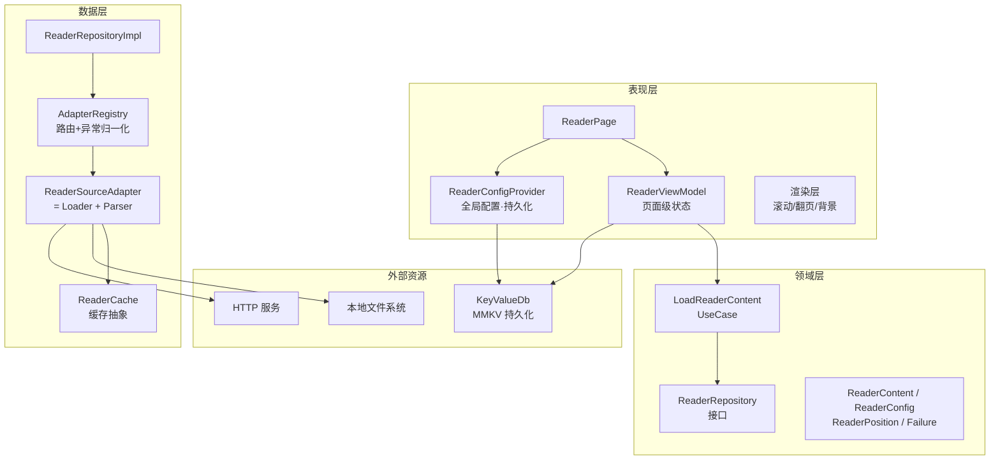
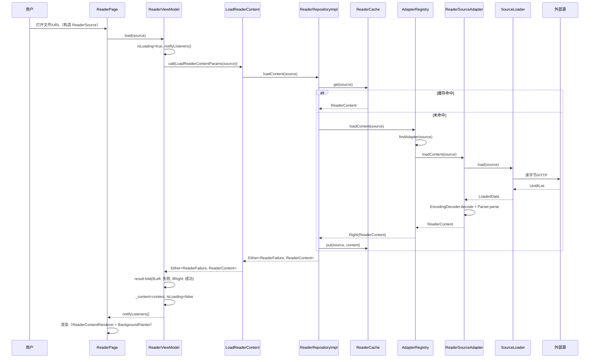

# 阅读器框架设计文档（v2）

> **文档定位**：本文档是 `des-doc/reader-framework-design.md`（v1）的全新重写版，目标是产出一套**"按图施工即可编译运行、每个扩展方向都有清晰落点"**的阅读器框架设计。
>
> v1 已覆盖适配器模式、间距、背景、动画等核心需求，但存在若干**编译级缺陷**与**实现盲区**。v2 在保留 v1 架构方向的基础上，修复全部已知问题并补齐缺失模块（详见 §1.4 改进对照表）。

---

## 1. 概述

### 1.1 目标

设计一套可扩展的阅读器框架，核心采用**适配器模式**统一不同输入源，支持：

- **本地文件**：txt、markdown（后续可扩 epub / pdf / asset）
- **在线 HTML**：URL 抓取 → 正文提取
- **可配置阅读体验**：间距（字号 / 行高 / 段距 / 页边距）、背景（纯色 / 渐变 / 纹理 / 主题预设）、动画（滑动 / 淡入 / 无）、阅读模式（滚动 / 翻页）
- **配置与进度持久化**：复用项目已有 `KeyValueDb`（MMKV）

框架优先关注**架构的可扩展性与类型自洽性**，具体功能可逐步填补。

### 1.2 设计原则

| 原则             | 说明                                                                                                          |
| ---------------- | ------------------------------------------------------------------------------------------------------------- |
| **适配器模式**   | 所有输入源通过 `ReaderSourceAdapter` 接口统一接入，产出统一的 [`ReaderContent`](#5-内容模型) 模型              |
| **关注点分离**   | 加载（Loader）、解析（Parser）、缓存（Cache）、配置（Config）、渲染（Render）各层独立，单一职责               |
| **类型自洽**     | `Either<Failure, T>` 从用例贯穿到 ViewModel；VM 内用 `fold` 消费，杜绝"把 Either 当成 T 赋值"的编译错误       |
| **零阻塞接口**   | 适配器判定 `canHandle` 仅做纯函数计算（类型 / 扩展名 / 协议），**不触碰任何同步 IO**（避免 `existsSync` 阻塞） |
| **可测试**       | Parser 为纯函数；Loader/Cache 通过抽象注入，测试可用 `ContentSource` 直接喂文本，免真实文件 / 网络           |
| **渐进增强**     | 框架骨架先行，每个适配器、渲染细节、动画效果可独立填补，互不阻塞                                              |
| **沿用项目规范** | 严格遵循项目 Clean Architecture + Provider + GetIt 风格，复用 `UseCase`/`Failure`/`KeyValueDb`/`go_router`   |

### 1.3 整体架构图



**核心数据流（管道式）**：

```
ReaderSource(值对象) ──► AdapterRegistry.findAdapter ──► ReaderSourceAdapter
   │                                                        │
   │                                            Loader.readBytes ──► bytes
   │                                                        │
   │                                            EncodingDecoder.decode ──► String
   │                                                        │
   │                                            Parser.parse ──► ReaderContent
   │                                                        │
   └──────────── AdapterRegistry.loadContent ──► Either<ReaderFailure, ReaderContent>
```

### 1.4 相对 v1 的核心改进对照

| # | 问题（v1）                                                                 | v2 改进                                                                                       |
| - | -------------------------------------------------------------------------- | --------------------------------------------------------------------------------------------- |
| 1 | 用例返回 `Either<Failure,T>`，但 VM 写 `_content = await _loadContent(...)` | VM 内用 `either.fold(ifLeft:, ifRight:)` 消费，**类型自洽可编译**                             |
| 2 | `ReaderProvider` 是空壳 `StatelessWidget`，`build` 直接 `return child`      | 升级为 `ReaderConfigProvider extends ChangeNotifier`，真正持有配置并持久化                    |
| 3 | 配置和进度只在内存，未持久化                                                | 均序列化为 JSON String 存入 `KeyValueDb`(MMKV)，跨会话恢复                                    |
| 4 | 翻页模式只留注释，无分页算法                                                | 给出 `PagePaginator`：`TextPainter` 预排版 + 贪心装箱成页 + 配置失效缓存                       |
| 5 | TXT 用 `readAsString()` 默认 UTF-8，GBK 中文乱码                            | Loader 读字节 → BOM/编码检测 → 可配置编码（UTF-8/GBK/GB18030）                                |
| 6 | 无缓存层                                                                   | 新增 `ReaderCache` 抽象（`NoopCache`/`MemoryCache`/`DiskCache`），DI 可切换                   |
| 7 | `canHandle` 用 `File(source).existsSync()` 同步阻塞                        | 引入 `ReaderSource` 值对象，`canHandle` 仅判类型/扩展名/协议，**零 IO**                       |
| 8 | 适配器内加载与解析耦合，难单测                                              | Loader（读字节）+ Parser（纯函数解析）分离，Parser 可独立单测                                  |
| 9 | `ContentBlock` 仅 4 种，缺代码块/引用/列表                                  | 补 `CodeBlock`/`QuoteBlock`/`ListBlock`；`ContentSection` 加 `id`/`level` 供目录锚点           |
| 10 | 错误模型只有单一 `ReaderFailure(message)`                                  | `ReaderFailure` 为 sealed，细化 NotFound/Permission/Network/Parse/Encoding/Unsupported        |
| 11 | 无目录（TOC）锚点跳转                                                       | 新增 `TableOfContents`，按 heading 收集，支持章节跳转                                          |

---

## 2. 目录结构

```
lib/features/reader/
├── reader_config_provider.dart              # ★ 全局配置 Provider（持久化）
│
├── domain/
│   ├── entities/
│   │   ├── reader_source.dart               # 输入源值对象（FilePath/Url/Content/Asset）
│   │   ├── reader_content.dart              # 统一内容模型（含 ContentBlock sealed）
│   │   ├── reader_config.dart               # 阅读配置（间距/背景/动画/模式）
│   │   ├── reader_position.dart             # 阅读进度
│   │   ├── reader_source_type.dart          # 源类型枚举
│   │   └── reader_failure.dart              # ★ sealed 错误模型
│   ├── repositories/
│   │   └── reader_repository.dart           # 仓储接口
│   └── usecases/
│       └── load_reader_content.dart         # 加载内容用例
│
├── data/
│   ├── datasources/
│   │   ├── reader_source_adapter.dart       # ★ 适配器抽象 + AdapterRegistry
│   │   ├── source_loader.dart               # ★ Loader 抽象 + 实现（读字节/编码解码）
│   │   ├── adapters/
│   │   │   ├── local_txt_adapter.dart       # TXT 适配器
│   │   │   ├── local_markdown_adapter.dart  # Markdown 适配器
│   │   │   └── online_html_adapter.dart     # 在线 HTML 适配器
│   │   ├── parsers/
│   │   │   ├── txt_parser.dart              # ★ 纯函数：TXT→ContentBlock
│   │   │   ├── markdown_parser.dart         # ★ 纯函数：Markdown→ContentBlock
│   │   │   └── html_parser.dart             # ★ 纯函数：HTML→ContentBlock
│   │   └── cache/
│   │       └── reader_cache.dart            # ★ 缓存抽象 + Noop/Memory/Disk
│   ├── models/
│   │   └── reader_config_model.dart         # ★ 配置 JSON 序列化（for KeyValueDb）
│   └── repositories/
│       └── reader_repository_impl.dart      # 仓储实现
│
├── presentation/
│   ├── view/
│   │   ├── reader_page.dart                 # 主页面（拼装 AppBar/Body/Bar）
│   │   ├── reader_scroll_view.dart          # 滚动模式
│   │   ├── reader_page_turn_view.dart       # 翻页模式
│   │   └── widgets/
│   │       ├── reader_content_renderer.dart # ContentBlock → Widget
│   │       ├── reader_background_painter.dart# 背景绘制（策略）
│   │       ├── reader_settings_panel.dart    # 设置面板（底部弹出）
│   │       ├── reader_app_bar.dart           # 顶部栏
│   │       └── reader_bottom_bar.dart        # 底部进度栏
│   ├── viewmodels/
│   │   └── reader_view_model.dart            # ★ 页面级 VM（Either.fold 消费）
│   └── paginator/
│       └── page_paginator.dart              # ★ 翻页分页算法（TextPainter）
│
└── core/
    ├── reader_animation.dart                # 动画策略枚举与配置
    ├── reader_background.dart               # 背景策略 sealed
    ├── reader_spacing.dart                  # 间距预设
    └── reader_theme.dart                    # 阅读主题预设
```

> 标 `★` 的为相对 v1 新增 / 重写的文件。

---

## 3. 适配器模式设计（核心）

### 3.1 设计思想

适配器模式是本框架的核心。不同来源（本地文件、在线 HTML、未来可能的 PDF/EPUB）通过实现统一接口 `ReaderSourceAdapter`，将各异的数据格式转换为统一的 [`ReaderContent`](#5-内容模型) 模型。上层业务逻辑不感知底层来源差异。

v2 相对 v1 在适配器层做了三处关键升级：

1. **输入用值对象 `ReaderSource`，不再用裸 `String`** —— `canHandle` 不再需要做同步 IO（消除 `existsSync` 阻塞）。
2. **Loader 与 Parser 分离** —— 适配器 = Loader（读字节）+ Parser（纯函数解析），Parser 可独立单测。
3. **异常归一化在 Registry** —— 适配器/Loader 抛 `ReaderSourceException`，Registry 统一 catch 并返回 `Either<ReaderFailure, ReaderContent>`。

### 3.2 输入源值对象

```dart
// lib/features/reader/domain/entities/reader_source.dart

import 'package:equatable/equatable.dart';
import 'package:provider_mode/features/reader/domain/entities/reader_source_type.dart';

/// 输入源基类 —— sealed 保证穷尽匹配
sealed class ReaderSource extends Equatable {
  const ReaderSource();

  /// 源类型标识（用于错误提示与强制路由）
  ReaderSourceType get type;

  /// 扩展名（小写、无点；URL 源从路径解析；Content 源为空）
  String? get extension => null;
}

/// 本地文件路径源
class FilePathSource extends ReaderSource {
  final String path;
  const FilePathSource(this.path);

  @override
  ReaderSourceType get type => ReaderSourceType.localFile;

  @override
  String? get extension {
    final dot = path.lastIndexOf('.');
    if (dot < 0 || dot == path.length - 1) return null;
    return path.substring(dot + 1).toLowerCase();
  }

  @override
  List<Object?> get props => [path];
}

/// 在线 URL 源
class UrlSource extends ReaderSource {
  final String url;
  const UrlSource(this.url);

  @override
  ReaderSourceType get type => ReaderSourceType.onlineUrl;

  @override
  String? get extension {
    final uri = Uri.tryParse(url);
    final seg = uri?.pathSegments;
    if (seg == null || seg.isEmpty) return null;
    final last = seg.last;
    final dot = last.lastIndexOf('.');
    if (dot < 0) return null;
    return last.substring(dot + 1).toLowerCase();
  }

  @override
  List<Object?> get props => [url];
}

/// 直接内容源（用于测试：注入文本，免 IO）
class ContentSource extends ReaderSource {
  final String content;
  final ReaderSourceType explicitType;
  const ContentSource(this.content, {this.explicitType = ReaderSourceType.localFile});

  @override
  ReaderSourceType get type => explicitType;

  @override
  List<Object?> get props => [content, explicitType];
}

/// Asset 源（资源文件，后续扩展）
class AssetSource extends ReaderSource {
  final String assetPath;
  const AssetSource(this.assetPath);

  @override
  ReaderSourceType get type => ReaderSourceType.asset;

  @override
  String? get extension {
    final dot = assetPath.lastIndexOf('.');
    if (dot < 0) return null;
    return assetPath.substring(dot + 1).toLowerCase();
  }

  @override
  List<Object?> get props => [assetPath];
}
```

> **设计要点**：`canHandle(ReaderSource)` 只看 `source.runtimeType` / `source.extension` / `source.type`，**绝不触碰 IO**。这是消除 v1 同步阻塞的关键。

### 3.3 适配器接口

```dart
// lib/features/reader/data/datasources/reader_source_adapter.dart

import 'package:provider_mode/features/reader/domain/entities/reader_content.dart';
import 'package:provider_mode/features/reader/domain/entities/reader_source.dart';
import 'package:provider_mode/features/reader/domain/entities/reader_source_type.dart';

/// 适配器内部异常 —— 由 Registry 统一 catch 并转换为 ReaderFailure
class ReaderSourceException implements Exception {
  final String message;
  const ReaderSourceException(this.message);
  @override
  String toString() => 'ReaderSourceException: $message';
}

/// 阅读器输入源适配器接口
///
/// 每个适配器 = 一个 Loader + 一个 Parser 的组合。
/// 仅负责"声明能处理哪些源"与"加载并解析为 ReaderContent"。
abstract class ReaderSourceAdapter {
  /// 判断此适配器是否能处理给定的源（纯函数，禁止 IO）
  bool canHandle(ReaderSource source);

  /// 加载并解析内容（内部组合 Loader + Parser）
  ///
  /// 失败时抛 [ReaderSourceException]，由 Registry 归一化为 Either。
  Future<ReaderContent> loadContent(ReaderSource source);

  /// 该适配器产出的内容类型标识
  ReaderSourceType get sourceType;
}
```

### 3.4 适配器注册表（AdapterRegistry）

注册表负责管理所有适配器，按注册顺序匹配（首个 `canHandle` 为真者胜出），并把异常归一化为 `Either<ReaderFailure, ReaderContent>`。

```dart
// lib/features/reader/data/datasources/reader_source_adapter.dart（续）

import 'package:dart_either/dart_either.dart';
import 'package:provider_mode/features/reader/domain/entities/reader_failure.dart';

class AdapterRegistry {
  final List<ReaderSourceAdapter> _adapters;

  AdapterRegistry([List<ReaderSourceAdapter>? adapters])
      : _adapters = adapters ?? [];

  /// 注册适配器（追加到末尾，优先级最低）
  void register(ReaderSourceAdapter adapter) => _adapters.add(adapter);

  /// 注册适配器到头部（优先级最高，用于覆盖/前置自定义适配器）
  void prepend(ReaderSourceAdapter adapter) =>
      _adapters.insert(0, adapter);

  /// 按注册顺序查找首个能处理该源的适配器
  ReaderSourceAdapter? findAdapter(ReaderSource source) {
    for (final adapter in _adapters) {
      if (adapter.canHandle(source)) return adapter;
    }
    return null;
  }

  /// 强制使用指定类型的适配器（用于"用 HTML 适配器打开某 URL"等场景）
  ReaderSourceAdapter? findByType(ReaderSourceType type) {
    for (final adapter in _adapters) {
      if (adapter.sourceType == type) return adapter;
    }
    return null;
  }

  /// 加载内容 —— 自动路由 + 异常归一化（返回 Either）
  Future<Either<ReaderFailure, ReaderContent>> loadContent(
      ReaderSource source) async {
    final adapter = findAdapter(source);
    if (adapter == null) {
      return Left(ReaderFailure.unsupported(
          '没有找到能处理该源的适配器: $source'));
    }
    try {
      final content = await adapter.loadContent(source);
      return Right(content);
    } on ReaderSourceException catch (e) {
      return Left(ReaderFailure.parse(e.message));
    } catch (e) {
      return Left(ReaderFailure.unknown(e.toString()));
    }
  }

  /// 所有已注册适配器（只读视图，便于调试/测试）
  List<ReaderSourceAdapter> get adapters =>
      List.unmodifiable(_adapters);
}
```

### 3.5 第三方动态注册扩展范例

新增输入源类型，**无需改动框架代码**，只需实现接口并 `prepend`/`register`：

```dart
// 第三方示例：EPUB 适配器
class EpubAdapter implements ReaderSourceAdapter {
  @override
  bool canHandle(ReaderSource source) =>
      source is FilePathSource && source.extension == 'epub';

  @override
  Future<ReaderContent> loadContent(ReaderSource source) async {
    // ... epub 解析逻辑
    throw UnimplementedError();
  }

  @override
  ReaderSourceType get sourceType => ReaderSourceType.epub;
}

// 注册时（在 DI 之后）：
injector<AdapterRegistry>().prepend(EpubAdapter());
```

> `prepend` 让自定义适配器优先于内置适配器；普通扩展用 `register` 即可。

---

## 4. Loader 与编码处理

### 4.1 设计思想

将"读字节"从适配器中剥离成独立 `SourceLoader`，原因有二：

1. **编码处理**集中在一处，避免每个适配器各自处理 UTF-8/GBK；
2. **测试友好**：Loader 是接口，测试可注入 mock 直接抛 `ReaderSourceException`。

### 4.2 SourceLoader 接口

```dart
// lib/features/reader/data/datasources/source_loader.dart

import 'dart:typed_data';
import 'package:dio/dio.dart';
import 'package:provider_mode/features/reader/data/datasources/reader_source_adapter.dart';
import 'package:provider_mode/features/reader/domain/entities/reader_source.dart';

/// 加载结果：原始字节 + 供编码检测的"前若干字节"
class LoadedData {
  final Uint8List bytes;
  const LoadedData(this.bytes);
}

/// 源加载器抽象
abstract class SourceLoader {
  /// 该 loader 能否处理此源（纯函数）
  bool canHandle(ReaderSource source);

  /// 读取原始字节（不做解码）
  Future<LoadedData> load(ReaderSource source);
}
```

### 4.3 本地文件 Loader

```dart
// lib/features/reader/data/datasources/source_loader.dart（续）

import 'dart:io';

class LocalFileLoader implements SourceLoader {
  @override
  bool canHandle(ReaderSource source) => source is FilePathSource;

  @override
  Future<LoadedData> load(ReaderSource source) async {
    final path = (source as FilePathSource).path;
    try {
      final bytes = await File(path).readAsBytes();
      return LoadedData(bytes);
    } catch (e) {
      throw ReaderSourceException('读取本地文件失败: $path ($e)');
    }
  }
}
```

### 4.4 在线 URL Loader

```dart
// lib/features/reader/data/datasources/source_loader.dart（续）

class OnlineUrlLoader implements SourceLoader {
  final Dio _dio;
  OnlineUrlLoader(this._dio);

  @override
  bool canHandle(ReaderSource source) {
    if (source is! UrlSource) return false;
    final uri = Uri.tryParse(source.url);
    return uri != null && (uri.scheme == 'http' || uri.scheme == 'https');
  }

  @override
  Future<LoadedData> load(ReaderSource source) async {
    final url = (source as UrlSource).url;
    try {
      final resp = await _dio.get<List<int>>(
        url,
        options: Options(responseType: ResponseType.bytes),
      );
      return LoadedData(Uint8List.fromList(resp.data ?? const []));
    } on DioException catch (e) {
      throw ReaderSourceException('HTTP 请求失败: ${e.type} ${e.message}');
    } catch (e) {
      throw ReaderSourceException('HTTP 请求失败: $e');
    }
  }
}
```

### 4.5 编码解码（修复 GBK 乱码盲区）

v1 用 `readAsString()` 默认 UTF-8，遇到 GBK/GB18030 中文文件必然乱码。v2 引入 `EncodingDecoder`：先看 BOM，再用配置编码，最后回退 UTF-8。

```dart
// lib/features/reader/data/datasources/source_loader.dart（续）

/// 文本编码（可由 ReaderConfig 扩展项注入）
enum TextEncoding { utf8, gbk, gb18030, auto }

class EncodingDecoder {
  const EncodingDecoder();

  /// bytes → String
  ///
  /// 优先级：BOM 检测 > 显式 encoding > 回退 UTF-8(replace)
  String decode(Uint8List bytes, {TextEncoding encoding = TextEncoding.auto}) {
    // 1. BOM 优先
    if (_isUtf8Bom(bytes)) {
      return _decodeUtf8(bytes.sublist(3));
    }
    if (_isUtf16LeBom(bytes)) {
      // UTF-16 LE（少见，但 mhtml 等场景存在）
      return _decodeUtf16Le(bytes);
    }

    // 2. 显式指定（非 auto）
    if (encoding != TextEncoding.auto) {
      return _decodeBy(bytes, encoding);
    }

    // 3. auto：尝试 UTF-8 严格解码，失败则按 GBK
    final utf8 = _tryDecodeUtf8Strict(bytes);
    if (utf8 != null) return utf8;
    return _decodeBy(bytes, TextEncoding.gbk);
  }

  bool _isUtf8Bom(Uint8List b) =>
      b.length >= 3 && b[0] == 0xEF && b[1] == 0xBB && b[2] == 0xBF;
  bool _isUtf16LeBom(Uint8List b) =>
      b.length >= 2 && b[0] == 0xFF && b[1] == 0xFE;

  // _decodeUtf8 / _tryDecodeUtf8Strict / _decodeUtf16Le / _decodeBy
  // 依赖 dart:convert 的 Utf8Decoder(allowMalformed:false/true)；
  // GBK/GB18030 需引入编码库（如 charset 或 gb_to_utf8）。
  // 详细实现见 §18 依赖变更。
  String _decodeUtf8(Uint8List b) => String.fromCharCodes(b); // 占位，实际用 Utf8Decoder
  String? _tryDecodeUtf8Strict(Uint8List b) => null;
  String _decodeUtf16Le(Uint8List b) => '';
  String _decodeBy(Uint8List b, TextEncoding e) => String.fromCharCodes(b);
}
```

> **实现备注**：`auto` 模式下，对纯 UTF-8 文件零成本；对 GBK 文件，UTF-8 严格解码会抛错，再回退 GBK。GBK/GB18030 解码需依赖第三方包（见 §18）。如项目暂不引入编码库，`auto` 模式可仅做 BOM + UTF-8(replace)，文档已留接口供后续填充。

---

## 5. 内容模型

### 5.1 ContentBlock（升级版 sealed class）

v1 仅 4 种 block。v2 补齐 `CodeBlock`/`QuoteBlock`/`ListBlock`，覆盖 Markdown/HTML 常见结构。

```dart
// lib/features/reader/domain/entities/reader_content.dart

import 'package:equatable/equatable.dart';
import 'package:provider_mode/features/reader/domain/entities/reader_source_type.dart';

/// 统一的内容块 —— sealed class 保证穷尽匹配与类型安全
sealed class ContentBlock extends Equatable {
  const ContentBlock();
}

/// 普通段落文本
class TextBlock extends ContentBlock {
  final String text;
  const TextBlock({required this.text});
  @override
  List<Object?> get props => [text];
}

/// 标题
class HeadingBlock extends ContentBlock {
  final String text;
  final int level; // 1-6
  const HeadingBlock({required this.text, required this.level});
  @override
  List<Object?> get props => [text, level];
}

/// 图片
class ImageBlock extends ContentBlock {
  final String url;
  final String? caption;
  const ImageBlock({required this.url, this.caption});
  @override
  List<Object?> get props => [url, caption];
}

/// 代码块（v2 新增）
class CodeBlock extends ContentBlock {
  final String code;
  final String? language;
  const CodeBlock({required this.code, this.language});
  @override
  List<Object?> get props => [code, language];
}

/// 引用块（v2 新增）
class QuoteBlock extends ContentBlock {
  final String text;
  const QuoteBlock({required this.text});
  @override
  List<Object?> get props => [text];
}

/// 列表块（v2 新增；ordered=true 有序，false 无序）
class ListBlock extends ContentBlock {
  final List<String> items;
  final bool ordered;
  const ListBlock({required this.items, this.ordered = false});
  @override
  List<Object?> get props => [items, ordered];
}

/// 分隔线
class DividerBlock extends ContentBlock {
  const DividerBlock();
  @override
  List<Object?> get props => [];
}
```

### 5.2 章节、元数据、统一内容

```dart
// lib/features/reader/domain/entities/reader_content.dart（续）

/// 章节 / 分段
///
/// [id] 用于目录锚点跳转；[level] 表示嵌套层级（顶层=0）。
class ContentSection extends Equatable {
  final String id;
  final String title;
  final int level;
  final List<ContentBlock> blocks;

  const ContentSection({
    required this.id,
    required this.title,
    this.level = 0,
    required this.blocks,
  });

  @override
  List<Object?> get props => [id, title, level, blocks];
}

/// 内容元数据
class ContentMetadata extends Equatable {
  final ReaderSourceType sourceType;
  final String sourcePath;
  final int totalCharacters;
  final String? coverUrl;
  final String? language;

  const ContentMetadata({
    required this.sourceType,
    required this.sourcePath,
    required this.totalCharacters,
    this.coverUrl,
    this.language,
  });

  @override
  List<Object?> get props =>
      [sourceType, sourcePath, totalCharacters, coverUrl, language];
}

/// 统一的内容实体 —— 所有适配器的产出物
class ReaderContent extends Equatable {
  final String title;
  final String author;
  final List<ContentSection> sections;
  final ContentMetadata metadata;

  const ReaderContent({
    required this.title,
    this.author = '',
    required this.sections,
    required this.metadata,
  });

  /// 扁平化所有 section 的 blocks（滚动模式渲染常用）
  List<ContentBlock> get flatBlocks =>
      sections.expand((s) => s.blocks).toList(growable: false);

  /// 总字符数（进度计算用）
  int get totalCharacters => sections.fold<int>(
        0,
        (sum, s) => sum + _sectionCharCount(s),
      );

  static int _sectionCharCount(ContentSection s) => s.blocks.fold<int>(
        0,
        (acc, b) => acc + _blockCharCount(b),
      );

  static int _blockCharCount(ContentBlock b) => switch (b) {
        TextBlock(:final text) => text.length,
        HeadingBlock(:final text) => text.length,
        QuoteBlock(:final text) => text.length,
        CodeBlock(:final code) => code.length,
        ListBlock(:final items) =>
          items.fold<int>(0, (a, i) => a + i.length),
        ImageBlock() => 0,
        DividerBlock() => 0,
      };

  @override
  List<Object?> get props => [title, author, sections, metadata];
}
```

### 5.3 源类型枚举

```dart
// lib/features/reader/domain/entities/reader_source_type.dart

enum ReaderSourceType {
  localFile,
  onlineUrl,
  asset,
  // 未来扩展
  // epub,
  // pdf,
}
```

> **设计选择**：v1 用 `localTxt`/`localMarkdown`/`onlineHtml` 三个值，与适配器强耦合；v2 改为通用的 `localFile`/`onlineUrl`/`asset`，具体格式由适配器的 `sourceType` getter 区分（适配器可重写为更具体语义）。这样枚举稳定，新增格式不破坏枚举。

### 5.4 目录（TOC，v2 新增）

```dart
// lib/features/reader/domain/entities/reader_content.dart（续）

/// 目录项 —— 从 HeadingBlock 收集而来
class TocEntry extends Equatable {
  final String sectionId;
  final String title;
  final int level;

  const TocEntry({
    required this.sectionId,
    required this.title,
    required this.level,
  });

  @override
  List<Object?> get props => [sectionId, title, level];
}

/// 从 ReaderContent 生成目录
List<TocEntry> buildTableOfContents(ReaderContent content) {
  final entries = <TocEntry>[];
  for (final section in content.sections) {
    for (final block in section.blocks) {
      if (block is HeadingBlock) {
        entries.add(TocEntry(
          sectionId: section.id,
          title: block.text,
          level: block.level,
        ));
      }
    }
  }
  return entries;
}
```

---

## 6. 解析器分离（Parser）

### 6.1 设计思想

Parser 是**纯函数**：输入是已解码的 `String`，输出是 `List<ContentBlock>`（或 `ReaderContent`）。无 IO、无状态，可独立单测。适配器组合 Loader（读字节）+ Parser（解析）。

### 6.2 Parser 接口

```dart
// lib/features/reader/data/datasources/parsers/txt_parser.dart

import 'package:provider_mode/features/reader/domain/entities/reader_content.dart';

/// TXT 解析器 —— 按行/空行切分段落
class TxtParser {
  /// 将纯文本解析为内容块列表
  List<ContentBlock> parse(String raw) {
    final blocks = <ContentBlock>[];
    for (final line in raw.split('\n')) {
      final trimmed = line.trim();
      if (trimmed.isEmpty) continue;
      blocks.add(TextBlock(text: trimmed));
    }
    return blocks;
  }
}
```

### 6.3 Markdown 解析器

复用项目已有的 `markdown` 包（`flutter_markdown` 的传递依赖）。

```dart
// lib/features/reader/data/datasources/parsers/markdown_parser.dart

import 'package:markdown/markdown.dart' as md;
import 'package:provider_mode/features/reader/domain/entities/reader_content.dart';

class MarkdownParser {
  List<ContentBlock> parse(String markdown) {
    final document = md.Document().parse(markdown);
    final blocks = <ContentBlock>[];

    for (final node in document) {
      _walk(node, blocks);
    }
    return blocks;
  }

  /// 递归遍历 AST
  void _walk(md.Node node, List<ContentBlock> out) {
    if (node is! md.Element) return;
    switch (node.tag) {
      case 'h1': case 'h2': case 'h3':
      case 'h4': case 'h5': case 'h6':
        final level = int.parse(node.tag.substring(1));
        out.add(HeadingBlock(text: node.textContent.trim(), level: level));
      case 'p':
        final text = node.textContent.trim();
        if (text.isNotEmpty) out.add(TextBlock(text: text));
      case 'blockquote':
        out.add(QuoteBlock(text: node.textContent.trim()));
      case 'pre':
        // 代码块：尝试从子节点取 language
        final code = node.textContent;
        final lang = _codeLanguage(node);
        out.add(CodeBlock(code: code.trim(), language: lang));
      case 'ul':
        out.add(ListBlock(
          items: node.children
                  ?.whereType<md.Element>()
                  .map((e) => e.textContent.trim())
                  .toList() ??
              const [],
          ordered: false,
        ));
      case 'ol':
        out.add(ListBlock(
          items: node.children
                  ?.whereType<md.Element>()
                  .map((e) => e.textContent.trim())
                  .toList() ??
              const [],
          ordered: true,
        ));
      case 'hr':
        out.add(const DividerBlock());
      default:
        // 未知节点：递归子节点
        for (final child in node.children ?? const <md.Node>[]) {
          _walk(child, out);
        }
    }
  }

  String? _codeLanguage(md.Element pre) {
    final code = pre.children?.whereType<md.Element>().firstOrNull;
    if (code == null) return null;
    return code.attributes['class']?.replaceAll('language-', '');
  }
}
```

> `firstOrNull`、`switch` 模式为 Dart 3 语法，项目 SDK `^3.5.2` 支持。

### 6.4 HTML 解析器

需要新增 `html` 包（见 §18）。

```dart
// lib/features/reader/data/datasources/parsers/html_parser.dart

import 'package:html/parser.dart' as html_parser;
import 'package:html/dom.dart' as dom;
import 'package:provider_mode/features/reader/domain/entities/reader_content.dart';

class HtmlParseResult {
  final String title;
  final String? author;
  final List<ContentBlock> blocks;
  const HtmlParseResult({
    required this.title,
    this.author,
    required this.blocks,
  });
}

class HtmlParser {
  HtmlParseResult parse(String html) {
    final document = html_parser.parse(html);
    final title =
        document.querySelector('title')?.text.trim() ?? '未命名文档';
    final author = document
        .querySelector('meta[name=author]')
        ?.attributes['content'];

    final blocks = <ContentBlock>[];
    // 优先正文容器，退化到 body
    final root = document.querySelector('article') ??
        document.querySelector('main') ??
        document.body;
    if (root != null) {
      _extract(root, blocks);
    }
    return HtmlParseResult(title: title, author: author, blocks: blocks);
  }

  void _extract(dom.Element el, List<ContentBlock> out) {
    for (final child in el.children) {
      switch (child.localName) {
        case 'h1': case 'h2': case 'h3':
        case 'h4': case 'h5': case 'h6':
          final level = int.parse(child.localName!.substring(1));
          final t = child.text.trim();
          if (t.isNotEmpty) out.add(HeadingBlock(text: t, level: level));
        case 'p':
          final t = child.text.trim();
          if (t.isNotEmpty) out.add(TextBlock(text: t));
        case 'blockquote':
          out.add(QuoteBlock(text: child.text.trim()));
        case 'pre':
          out.add(CodeBlock(code: child.text.trim()));
        case 'ul':
          out.add(ListBlock(
            items: child.querySelectorAll('li').map((e) => e.text.trim()).toList(),
            ordered: false,
          ));
        case 'ol':
          out.add(ListBlock(
            items: child.querySelectorAll('li').map((e) => e.text.trim()).toList(),
            ordered: true,
          ));
        case 'hr':
          out.add(const DividerBlock());
        case 'img':
          final src = child.attributes['src'];
          if (src != null) {
            out.add(ImageBlock(url: src, caption: child.attributes['alt']));
          }
        default:
          _extract(child, out); // 递归
      }
    }
  }
}
```

---

## 7. 缓存层（v2 新增）

### 7.1 设计思想

在线 HTML 抓取较慢且不可重放，需要缓存以支持离线阅读与快速返回。缓存抽象成 `ReaderCache` 接口，DI 可切换 `NoopCache`（默认关闭）/`MemoryCache`(LRU)/`DiskCache`。

### 7.2 缓存抽象

```dart
// lib/features/reader/data/datasources/cache/reader_cache.dart

import 'package:provider_mode/features/reader/domain/entities/reader_content.dart';
import 'package:provider_mode/features/reader/domain/entities/reader_source.dart';

/// 缓存 Key 生成（基于源的唯一标识）
String cacheKey(ReaderSource source) {
  return switch (source) {
    FilePathSource(:final path) => 'file:$path',
    UrlSource(:final url) => 'url:$url',
    AssetSource(:final assetPath) => 'asset:$assetPath',
    ContentSource(:final content) => 'content:${content.hashCode}',
  };
}

/// 缓存抽象
abstract class ReaderCache {
  Future<ReaderContent?> get(ReaderSource source);
  Future<void> put(ReaderSource source, ReaderContent content);
  Future<void> remove(ReaderSource source);
  Future<void> clear();
}

/// 空实现（默认，关闭缓存）
class NoopCache implements ReaderCache {
  const NoopCache();
  @override
  Future<ReaderContent?> get(ReaderSource source) async => null;
  @override
  Future<void> put(ReaderSource source, ReaderContent content) async {}
  @override
  Future<void> remove(ReaderSource source) async {}
  @override
  Future<void> clear() async {}
}
```

### 7.3 内存 LRU 缓存

```dart
// lib/features/reader/data/datasources/cache/reader_cache.dart（续）

/// 简易 LRU 内存缓存
class MemoryCache implements ReaderCache {
  final int maxSize;
  final LinkedHashMap<String, ReaderContent> _map = LinkedHashMap();

  MemoryCache({this.maxSize = 8});

  @override
  Future<ReaderContent?> get(ReaderSource source) async {
    final key = cacheKey(source);
    final v = _map.remove(key); // 移除后重新插入，实现 LRU
    if (v != null) _map[key] = v;
    return v;
  }

  @override
  Future<void> put(ReaderSource source, ReaderContent content) async {
    final key = cacheKey(source);
    _map.remove(key);
    _map[key] = content;
    while (_map.length > maxSize) {
      _map.remove(_map.keys.first);
    }
  }

  @override
  Future<void> remove(ReaderSource source) async =>
      _map.remove(cacheKey(source));

  @override
  Future<void> clear() async => _map.clear();
}
```

### 7.4 磁盘缓存（占位，后续填充）

```dart
// lib/features/reader/data/datasources/cache/reader_cache.dart（续）

/// 磁盘缓存：将 ReaderContent 序列化为 JSON 写入应用文档目录
///
/// 依赖 ReaderConfigModel（见 §8）的 toJson/fromJson。
/// 实现阶段：先实现 ReaderContent 的 JSON 序列化，再接入 DiskCache。
class DiskCache implements ReaderCache {
  // final KeyValueDb _db; // 复用项目 MMKV 存缓存元数据
  // 实现略，留接口
  @override
  Future<ReaderContent?> get(ReaderSource source) async => null;
  @override
  Future<void> put(ReaderSource source, ReaderContent content) async {}
  @override
  Future<void> remove(ReaderSource source) async {}
  @override
  Future<void> clear() async {}
}
```

> 仓储层使用：先查缓存命中则返回，未命中走适配器加载并回填缓存。详见 §11。

---

## 8. 配置系统（持久化闭环）

### 8.1 设计思想

v1 的 `ReaderConfig` 是纯内存对象，配置改完就丢。v2 让配置**序列化为 JSON String 存入项目已有 `KeyValueDb`（MMKV）**，跨会话恢复。

> **关键约束**：项目 `KeyValueDb`（见 `lib/core/store/key_value_db.dart`）只支持 `int`/`double`/`bool`/`String`/`MMBuffer`。因此配置与进度**必须序列化为 JSON String** 存储，不能直接存自定义对象。

### 8.2 配置实体

```dart
// lib/features/reader/domain/entities/reader_config.dart

import 'package:equatable/equatable.dart';
import 'package:flutter/material.dart';
import 'package:provider_mode/features/reader/core/reader_animation.dart';
import 'package:provider_mode/features/reader/core/reader_background.dart';

/// 阅读模式
enum ReaderMode { scroll, pageTurn }

/// 阅读器配置
class ReaderConfig extends Equatable {
  // 间距
  final double fontSize;          // 12-28
  final double lineHeight;        // 1.2-2.5（倍率）
  final double paragraphSpacing;  // 0-32
  final double pagePadding;       // 8-48

  // 字体
  final String fontFamily;        // 'System' 或字体名
  final FontWeight fontWeight;
  final Color textColor;

  // 背景与动画
  final ReaderBackground background;
  final ReaderAnimationStyle animationStyle;
  final ReaderMode readerMode;

  const ReaderConfig({
    this.fontSize = 16,
    this.lineHeight = 1.8,
    this.paragraphSpacing = 16,
    this.pagePadding = 24,
    this.fontFamily = 'System',
    this.fontWeight = FontWeight.normal,
    this.textColor = const Color(0xFF333333),
    this.background =
        const SolidColorBackground(color: Color(0xFFF5F0E8)),
    this.animationStyle = ReaderAnimationStyle.slide,
    this.readerMode = ReaderMode.scroll,
  });

  ReaderConfig copyWith({
    double? fontSize,
    double? lineHeight,
    double? paragraphSpacing,
    double? pagePadding,
    String? fontFamily,
    FontWeight? fontWeight,
    Color? textColor,
    ReaderBackground? background,
    ReaderAnimationStyle? animationStyle,
    ReaderMode? readerMode,
  }) =>
      ReaderConfig(
        fontSize: fontSize ?? this.fontSize,
        lineHeight: lineHeight ?? this.lineHeight,
        paragraphSpacing: paragraphSpacing ?? this.paragraphSpacing,
        pagePadding: pagePadding ?? this.pagePadding,
        fontFamily: fontFamily ?? this.fontFamily,
        fontWeight: fontWeight ?? this.fontWeight,
        textColor: textColor ?? this.textColor,
        background: background ?? this.background,
        animationStyle: animationStyle ?? this.animationStyle,
        readerMode: readerMode ?? this.readerMode,
      );

  @override
  List<Object?> get props => [
        fontSize, lineHeight, paragraphSpacing, pagePadding,
        fontFamily, fontWeight, textColor,
        background, animationStyle, readerMode,
      ];
}
```

### 8.3 配置 JSON 序列化（适配 KeyValueDb）

```dart
// lib/features/reader/data/models/reader_config_model.dart

import 'dart:convert';
import 'package:flutter/material.dart';
import 'package:provider_mode/features/reader/core/reader_animation.dart';
import 'package:provider_mode/features/reader/core/reader_background.dart';
import 'package:provider_mode/features/reader/domain/entities/reader_config.dart';

/// ReaderConfig ↔ JSON String（用于持久化到 KeyValueDb）
extension ReaderConfigJson on ReaderConfig {
  String toJsonString() => jsonEncode({
        'fontSize': fontSize,
        'lineHeight': lineHeight,
        'paragraphSpacing': paragraphSpacing,
        'pagePadding': pagePadding,
        'fontFamily': fontFamily,
        'fontWeight': fontWeight.index,
        'textColor': _colorToValue(textColor),
        'background': _backgroundToJson(background),
        'animationStyle': animationStyle.name,
        'readerMode': readerMode.name,
      });

  static ReaderConfig fromJsonString(String? json) {
    if (json == null || json.isEmpty) return const ReaderConfig();
    try {
      final m = jsonDecode(json) as Map<String, dynamic>;
      return ReaderConfig(
        fontSize: (m['fontSize'] as num?)?.toDouble() ?? 16,
        lineHeight: (m['lineHeight'] as num?)?.toDouble() ?? 1.8,
        paragraphSpacing:
            (m['paragraphSpacing'] as num?)?.toDouble() ?? 16,
        pagePadding: (m['pagePadding'] as num?)?.toDouble() ?? 24,
        fontFamily: m['fontFamily'] as String? ?? 'System',
        fontWeight:
            FontWeight.values[m['fontWeight'] as int? ?? 3],
        textColor:
            Color(_colorFromValue(m['textColor'] as int? ?? 0xFF333333)),
        background: _backgroundFromJson(m['background']),
        animationStyle: ReaderAnimationStyle.values
            .byName(m['animationStyle'] as String? ?? 'slide'),
        readerMode: ReaderMode.values
            .byName(m['readerMode'] as String? ?? 'scroll'),
      );
    } catch (_) {
      return const ReaderConfig();
    }
  }
}

// Color ↔ int 转换辅助（跨 Flutter 版本稳定，不依赖 toARGB32/value 废弃 API）
int _colorToValue(Color c) {
  // 0xAARRGGBB
  return (c.a * 255).round() << 24 |
      (c.r * 255).round() << 16 |
      (c.g * 255).round() << 8 |
      (c.b * 255).round();
}

int _colorFromValue(int v) => v; // Color 构造本身接受 0xAARRGGBB

Map<String, dynamic> _backgroundToJson(ReaderBackground bg) =>
    switch (bg) {
      SolidColorBackground(:final color) => {
          'type': 'solid',
          'color': _colorToValue(color),
        },
      GradientBackground(:final colors, :final begin, :final end) => {
          'type': 'gradient',
          'colors': colors.map(_colorToValue).toList(),
        },
      TextureBackground(:final imagePath, :final opacity) => {
          'type': 'texture',
          'imagePath': imagePath,
          'opacity': opacity,
        },
    };

ReaderBackground _backgroundFromJson(Map<String, dynamic>? m) {
  if (m == null) {
    return const SolidColorBackground(color: Color(0xFFF5F0E8));
  }
  return switch (m['type']) {
    'gradient' => GradientBackground(
        colors: (m['colors'] as List)
            .map((c) => Color(c as int))
            .toList(),
      ),
    'texture' => TextureBackground(
        imagePath: m['imagePath'] as String,
        opacity: (m['opacity'] as num?)?.toDouble() ?? 0.1,
      ),
    _ => SolidColorBackground(
        color: Color(m['color'] as int? ?? 0xFFF5F0E8)),
  };
}
```

> **Color 序列化说明**：Flutter 的 `Color.value` 已废弃，`Color.toARGB32()` 是 3.27+ API。本设计用 `_colorToValue`/`_colorFromValue` 手动移位（基于 `Color.a/r/g/b` getter，3.27+ 稳定可用），跨版本兼容。读回时 `Color(int)` 直接接受 `0xAARRGGBB` 整数。

### 8.4 间距预设

```dart
// lib/features/reader/core/reader_spacing.dart

enum SpacingPreset { compact, standard, relaxed, spacious }

extension SpacingPresetX on SpacingPreset {
  double get fontSize => switch (this) {
        SpacingPreset.compact => 14,
        SpacingPreset.standard => 16,
        SpacingPreset.relaxed => 18,
        SpacingPreset.spacious => 22,
      };
  double get lineHeight => switch (this) {
        SpacingPreset.compact => 1.4,
        SpacingPreset.standard => 1.8,
        SpacingPreset.relaxed => 2.0,
        SpacingPreset.spacious => 2.4,
      };
  double get paragraphSpacing => switch (this) {
        SpacingPreset.compact => 8,
        SpacingPreset.standard => 16,
        SpacingPreset.relaxed => 24,
        SpacingPreset.spacious => 32,
      };
  double get pagePadding => switch (this) {
        SpacingPreset.compact => 16,
        SpacingPreset.standard => 24,
        SpacingPreset.relaxed => 32,
        SpacingPreset.spacious => 40,
      };
  String get displayName => switch (this) {
        SpacingPreset.compact => '紧凑',
        SpacingPreset.standard => '标准',
        SpacingPreset.relaxed => '宽松',
        SpacingPreset.spacious => '超大',
      };

  /// 应用到配置（保留其它字段）
  ReaderConfig applyTo(ReaderConfig c) => c.copyWith(
        fontSize: fontSize,
        lineHeight: lineHeight,
        paragraphSpacing: paragraphSpacing,
        pagePadding: pagePadding,
      );
}
```

> `applyTo` 需要 `import 'package:provider_mode/features/reader/domain/entities/reader_config.dart';`（略）。

---

## 9. 背景系统

### 9.1 设计思想

策略模式：`ReaderBackground` 为 sealed class，每种背景是一个子类，由 [`ReaderBackgroundPainter`](#124-背景绘制器) 按 `switch` 绘制。新增背景类型只需新增子类 + painter 加一个分支。

### 9.2 背景类型定义

```dart
// lib/features/reader/core/reader_background.dart

import 'package:equatable/equatable.dart';
import 'package:flutter/material.dart';

/// 背景基类 —— 策略模式
sealed class ReaderBackground extends Equatable {
  const ReaderBackground();

  /// 该背景对应的推荐文字颜色（用于自动适配对比度）
  Color get recommendedTextColor;
}

/// 纯色背景
class SolidColorBackground extends ReaderBackground {
  final Color color;
  const SolidColorBackground({required this.color});

  @override
  Color get recommendedTextColor =>
      color.computeLuminance() > 0.5 ? Colors.black87 : Colors.white70;

  @override
  List<Object?> get props => [color];
}

/// 渐变背景
class GradientBackground extends ReaderBackground {
  final List<Color> colors;
  final Alignment begin;
  final Alignment end;
  const GradientBackground({
    required this.colors,
    this.begin = Alignment.topLeft,
    this.end = Alignment.bottomRight,
  });

  @override
  Color get recommendedTextColor {
    // 取中间色亮度近似判断
    if (colors.isEmpty) return Colors.black87;
    return colors.first.computeLuminance() > 0.5
        ? Colors.black87
        : Colors.white70;
  }

  @override
  List<Object?> get props => [colors, begin, end];
}

/// 纹理 / 图片背景
class TextureBackground extends ReaderBackground {
  final String imagePath; // asset 路径优先
  final ImageRepeat repeat;
  final double opacity;
  const TextureBackground({
    required this.imagePath,
    this.repeat = ImageRepeat.repeat,
    this.opacity = 0.1,
  });

  @override
  Color get recommendedTextColor => Colors.black87;

  @override
  List<Object?> get props => [imagePath, repeat, opacity];
}
```

### 9.3 阅读主题预设

```dart
// lib/features/reader/core/reader_theme.dart

import 'package:flutter/material.dart';
import 'package:provider_mode/features/reader/core/reader_background.dart';

enum ReadingThemePreset { classic, night, eyeCare, pure, dark }

extension ReadingThemePresetX on ReadingThemePreset {
  ReaderBackground get background => switch (this) {
        ReadingThemePreset.classic =>
          const SolidColorBackground(color: Color(0xFFF5F0E8)),
        ReadingThemePreset.night =>
          const SolidColorBackground(color: Color(0xFF1A1A2E)),
        ReadingThemePreset.eyeCare =>
          const SolidColorBackground(color: Color(0xFFC8D6C0)),
        ReadingThemePreset.pure =>
          const SolidColorBackground(color: Colors.white),
        ReadingThemePreset.dark =>
          const SolidColorBackground(color: Color(0xFF121212)),
      };

  Color get textColor => switch (this) {
        ReadingThemePreset.classic => const Color(0xFF333333),
        ReadingThemePreset.pure => Colors.black87,
        ReadingThemePreset.eyeCare => const Color(0xFF2E4A2E),
        ReadingThemePreset.night => Colors.white70,
        ReadingThemePreset.dark => Colors.white70,
      };

  String get displayName => switch (this) {
        ReadingThemePreset.classic => '经典',
        ReadingThemePreset.night => '夜间',
        ReadingThemePreset.eyeCare => '护眼',
        ReadingThemePreset.pure => '纯净',
        ReadingThemePreset.dark => '暗黑',
      };
}
```

---

## 10. 动画系统

### 10.1 设计思想

动画系统定义翻页 / 切换过渡策略，当前提供基础实现，后续可扩展仿真翻页等。配置变更时的重排（如字号改变导致分页变化）也在此处约定。

### 10.2 动画策略

```dart
// lib/features/reader/core/reader_animation.dart

import 'package:flutter/material.dart';

/// 翻页动画风格
enum ReaderAnimationStyle { none, slide, fade }

extension ReaderAnimationStyleX on ReaderAnimationStyle {
  String get displayName => switch (this) {
        ReaderAnimationStyle.none => '无',
        ReaderAnimationStyle.slide => '滑动',
        ReaderAnimationStyle.fade => '淡入',
      };

  /// 构建过渡动画（用于翻页 PageView 的自定义 transition）
  Widget buildTransition(
    Animation<double> animation,
    Widget child,
  ) =>
      switch (this) {
        ReaderAnimationStyle.none => child,
        ReaderAnimationStyle.slide => SlideTransition(
            position: Tween<Offset>(
              begin: const Offset(1.0, 0.0),
              end: Offset.zero,
            ).animate(
              CurvedAnimation(
                parent: animation,
                curve: Curves.easeOutCubic,
              ),
            ),
            child: child,
          ),
        ReaderAnimationStyle.fade => FadeTransition(
            opacity: CurvedAnimation(
              parent: animation,
              curve: Curves.easeIn,
            ),
            child: child,
          ),
      };
}

/// 阅读器动画时长常量
class ReaderAnimationDuration {
  static const pageTurn = Duration(milliseconds: 350);
  static const settingsPanel = Duration(milliseconds: 250);
  static const progressUpdate = Duration(milliseconds: 150);
  static const relayout = Duration(milliseconds: 200); // 配置变更重排
}
```

### 10.3 配置变更重排策略

当 `ReaderConfig`（字号 / 行高 / 页边距）变化时，翻页模式必须重新分页。约定：

1. VM 持有当前 `config`，`config` 变更 → 清空 `PagePaginator` 的分页缓存；
2. 翻页视图监听 config 变化，在 `didChangeDependencies` / 监听到 `notifyListeners` 时触发重新分页；
3. 重排期间保留"当前阅读位置的字符偏移"，分页完成后定位到包含该偏移的页，避免跳页。

详见 §12.3。

---

## 11. 仓储与用例

### 11.1 错误模型（sealed 细化）

v1 只有单一 `ReaderFailure(message)`。v2 细化为 sealed，便于 UI 区分提示（如"文件不存在"vs"网络失败"）。

```dart
// lib/features/reader/domain/entities/reader_failure.dart

import 'package:equatable/equatable.dart';

/// 阅读器领域错误基类 —— sealed 便于穷尽匹配
sealed class ReaderFailure extends Equatable {
  final String message;
  const ReaderFailure(this.message);

  /// 不支持的源
  const factory ReaderFailure.unsupported(String message) =
      UnsupportedReaderFailure;
  /// 文件不存在
  const factory ReaderFailure.notFound(String message) =
      NotFoundReaderFailure;
  /// 权限不足
  const factory ReaderFailure.permission(String message) =
      PermissionReaderFailure;
  /// 网络错误
  const factory ReaderFailure.network(String message) =
      NetworkReaderFailure;
  /// 解析错误
  const factory ReaderFailure.parse(String message) =
      ParseReaderFailure;
  /// 编码错误
  const factory ReaderFailure.encoding(String message) =
      EncodingReaderFailure;
  /// 缓存错误
  const factory ReaderFailure.cache(String message) =
      CacheReaderFailure;
  /// 未知错误
  const factory ReaderFailure.unknown(String message) =
      UnknownReaderFailure;

  @override
  List<Object?> get props => [message, runtimeType];
}

class UnsupportedReaderFailure extends ReaderFailure {
  const UnsupportedReaderFailure(super.message);
}
class NotFoundReaderFailure extends ReaderFailure {
  const NotFoundReaderFailure(super.message);
}
class PermissionReaderFailure extends ReaderFailure {
  const PermissionReaderFailure(super.message);
}
class NetworkReaderFailure extends ReaderFailure {
  const NetworkReaderFailure(super.message);
}
class ParseReaderFailure extends ReaderFailure {
  const ParseReaderFailure(super.message);
}
class EncodingReaderFailure extends ReaderFailure {
  const EncodingReaderFailure(super.message);
}
class CacheReaderFailure extends ReaderFailure {
  const CacheReaderFailure(super.message);
}
class UnknownReaderFailure extends ReaderFailure {
  const UnknownReaderFailure(super.message);
}
```

> **注意**：项目 `core/error/failures.dart` 的 `Failure` 是普通抽象类。`ReaderFailure` 为**领域内独立**的 sealed，不继承 `core.Failure`，避免与全局 `Failure` 类型耦合。Reader 模块的用例返回 `Either<ReaderFailure, T>`（而非 `Either<Failure, T>`），但实现了相同语义。

### 11.2 仓储接口

```dart
// lib/features/reader/domain/repositories/reader_repository.dart

import 'package:provider_mode/features/reader/domain/entities/reader_content.dart';
import 'package:provider_mode/features/reader/domain/entities/reader_failure.dart';
import 'package:provider_mode/features/reader/domain/entities/reader_source.dart';

abstract class ReaderRepository {
  /// 加载内容 —— 自动选择适配器，命中缓存优先
  Future<Either<ReaderFailure, ReaderContent>> loadContent(
      ReaderSource source);
}
```

### 11.3 仓储实现

```dart
// lib/features/reader/data/repositories/reader_repository_impl.dart

import 'package:dart_either/dart_either.dart';
import 'package:provider_mode/features/reader/data/datasources/cache/reader_cache.dart';
import 'package:provider_mode/features/reader/data/datasources/reader_source_adapter.dart';
import 'package:provider_mode/features/reader/domain/entities/reader_content.dart';
import 'package:provider_mode/features/reader/domain/entities/reader_failure.dart';
import 'package:provider_mode/features/reader/domain/entities/reader_source.dart';
import 'package:provider_mode/features/reader/domain/repositories/reader_repository.dart';

class ReaderRepositoryImpl implements ReaderRepository {
  final AdapterRegistry _registry;
  final ReaderCache _cache;

  ReaderRepositoryImpl(this._registry, this._cache);

  @override
  Future<Either<ReaderFailure, ReaderContent>> loadContent(
      ReaderSource source) async {
    // 1. 命中缓存优先
    final cached = await _cache.get(source);
    if (cached != null) return Right(cached);

    // 2. 未命中走适配器加载
    final result = await _registry.loadContent(source);

    // 3. 成功则回填缓存
    return result.fold(
      ifLeft: (f) => Left<ReaderFailure, ReaderContent>(f),
      ifRight: (content) {
        _cache.put(source, content); // fire-and-forget
        return Right<ReaderFailure, ReaderContent>(content);
      },
    );
  }
}
```

### 11.4 用例

```dart
// lib/features/reader/domain/usecases/load_reader_content.dart

import 'package:dart_either/dart_either.dart';
import 'package:equatable/equatable.dart';
import 'package:provider_mode/features/reader/domain/entities/reader_content.dart';
import 'package:provider_mode/features/reader/domain/entities/reader_failure.dart';
import 'package:provider_mode/features/reader/domain/entities/reader_source.dart';
import 'package:provider_mode/features/reader/domain/repositories/reader_repository.dart';

/// 用例参数 —— 携带输入源值对象
class LoadReaderContentParams extends Equatable {
  final ReaderSource source;
  const LoadReaderContentParams(this.source);

  @override
  List<Object?> get props => [source];
}

/// 加载阅读内容用例
///
/// 薄封装：直接委托给 repository。保留用例层是为了与项目其它模块
/// （auth/chat）的 Clean Architecture 结构一致，并为后续可能的
/// 业务规则（鉴权、配额）预留扩展点。
class LoadReaderContent {
  final ReaderRepository _repository;
  LoadReaderContent(this._repository);

  Future<Either<ReaderFailure, ReaderContent>> call(
          LoadReaderContentParams params) =>
      _repository.loadContent(params.source);
}
```

> **说明**：项目 `UseCase<T,P>` 抽象要求返回 `Future<Either<Failure, T>>`。Reader 用例返回 `Either<ReaderFailure, T>`，与 `Failure` 同语义但独立类型，因此**不直接 implements `UseCase`**，而是保留同名 `call` 签名。若团队偏好统一，可让 `ReaderFailure implements Failure`（需 `ReaderFailure` 加 `abstract`，子类提供 `message`）——此处为清晰起见独立定义。

---

## 12. 渲染层

### 12.1 渲染架构

```
ReaderPage (入口)
├── ReaderBackgroundPainter  (背景层，包裹整个 body)
│   └── Body ──┬── ReaderScrollView   (滚动模式)
│              └── ReaderPageTurnView (翻页模式)
├── ReaderAppBar    (顶部：标题 + 模式切换)
├── ReaderBottomBar (底部：进度 + 章节列表)
└── ReaderSettingsPanel (底部弹出：字号/行高/背景/动画)
```

### 12.2 内容渲染器

核心：将 `List<ContentBlock>` 渲染为 Widget 树，样式受 `ReaderConfig` 控制。

```dart
// lib/features/reader/presentation/view/widgets/reader_content_renderer.dart

import 'package:flutter/material.dart';
import 'package:provider_mode/features/reader/domain/entities/reader_content.dart';
import 'package:provider_mode/features/reader/domain/entities/reader_config.dart';

class ReaderContentRenderer extends StatelessWidget {
  final List<ContentBlock> blocks;
  final ReaderConfig config;

  const ReaderContentRenderer({
    super.key,
    required this.blocks,
    required this.config,
  });

  @override
  Widget build(BuildContext context) {
    return Column(
      crossAxisAlignment: CrossAxisAlignment.start,
      children: [
        for (final block in blocks) _renderBlock(block),
      ],
    );
  }

  Widget _renderBlock(ContentBlock block) => switch (block) {
        TextBlock(:final text) => Padding(
            padding: EdgeInsets.only(bottom: config.paragraphSpacing),
            child: Text(text, style: _textStyle, textAlign: TextAlign.justify),
          ),
        HeadingBlock(:final text, :final level) => Padding(
            padding: EdgeInsets.only(
              top: config.paragraphSpacing * (level <= 2 ? 1.5 : 1),
              bottom: config.paragraphSpacing,
            ),
            child: Text(text, style: _headingStyle(level)),
          ),
        QuoteBlock(:final text) => Container(
            margin: EdgeInsets.only(bottom: config.paragraphSpacing),
            padding: const EdgeInsets.only(left: 12),
            decoration: BoxDecoration(
              border: Border(
                left: BorderSide(
                    color: config.textColor.withOpacity(0.3), width: 3),
              ),
            ),
            child: Text(text,
                style: _textStyle.copyWith(
                    fontStyle: FontStyle.italic,
                    color: config.textColor.withOpacity(0.8))),
          ),
        CodeBlock(:final code, :final language) => Container(
            margin: EdgeInsets.only(bottom: config.paragraphSpacing),
            padding: const EdgeInsets.all(12),
            decoration: BoxDecoration(
              color: config.textColor.withOpacity(0.05),
              borderRadius: BorderRadius.circular(6),
            ),
            child: SelectableText(
              code,
              style: TextStyle(
                fontFamily: 'monospace',
                fontSize: config.fontSize - 1,
                height: config.lineHeight,
              ),
            ),
          ),
        ListBlock(:final items, :final ordered) => Padding(
            padding: EdgeInsets.only(bottom: config.paragraphSpacing),
            child: Column(
              crossAxisAlignment: CrossAxisAlignment.start,
              children: [
                for (int i = 0; i < items.length; i++)
                  Text(
                    ordered ? '${i + 1}. ${items[i]}' : '• ${items[i]}',
                    style: _textStyle,
                  ),
              ],
            ),
          ),
        ImageBlock(:final url, :final caption) => Padding(
            padding: EdgeInsets.only(bottom: config.paragraphSpacing),
            child: Column(
              children: [
                Image.network(url, errorBuilder: (_, __, ___) =>
                    const SizedBox(height: 0)),
                if (caption != null)
                  Text(caption,
                      style: TextStyle(
                        fontSize: config.fontSize - 2,
                        color: config.textColor.withOpacity(0.6),
                      )),
              ],
            ),
          ),
        DividerBlock() => Padding(
            padding: EdgeInsets.symmetric(vertical: config.paragraphSpacing),
            child: Divider(color: config.textColor.withOpacity(0.2)),
          ),
      };

  TextStyle get _textStyle => TextStyle(
        fontSize: config.fontSize,
        height: config.lineHeight,
        fontFamily: config.fontFamily == 'System' ? null : config.fontFamily,
        fontWeight: config.fontWeight,
        color: config.textColor,
      );

  TextStyle _headingStyle(int level) {
    final sizeScale = switch (level) {
      1 => 1.8,
      2 => 1.5,
      3 => 1.25,
      _ => 1.1,
    };
    return _textStyle.copyWith(
      fontSize: config.fontSize * sizeScale,
      fontWeight: FontWeight.bold,
    );
  }
}
```

### 12.3 翻页分页算法（PagePaginator）★

这是 v1 完全缺失、v2 重点补齐的核心难点。翻页模式必须预先把内容切成"一屏一页"。

**算法思路**：
1. 用 `TextPainter` 模拟排版，贪心地把 block 逐个装入当前页；
2. 每个 block 测量高度时扣除 `pagePadding` 与已占用高度；
3. block 装不下则切分（针对 `TextBlock`/`QuoteBlock`/`CodeBlock` 按行切），其它整块移到下一页；
4. 结果缓存，key 为 `(content, config)`；config 变更则失效。

```dart
// lib/features/reader/presentation/paginator/page_paginator.dart

import 'package:flutter/material.dart';
import 'package:provider_mode/features/reader/domain/entities/reader_content.dart';
import 'package:provider_mode/features/reader/domain/entities/reader_config.dart';

/// 单页：该页包含的 block 列表 + 起止字符偏移（用于进度映射）
class ReaderPage {
  final List<ContentBlock> blocks;
  final int sectionIndex;
  final int startCharOffset; // 该页在 section 内的起始字符偏移
  final int endCharOffset;

  const ReaderPage({
    required this.blocks,
    required this.sectionIndex,
    required this.startCharOffset,
    required this.endCharOffset,
  });
}

/// 翻页分页器
///
/// 给定 [ReaderContent]、[ReaderConfig]、可用尺寸 [Size]，
/// 计算 [ReaderPage] 列表。结果按 (content 标识, config) 缓存。
class PagePaginator {
  final Map<String, List<ReaderPage>> _cache = {};

  /// 执行分页
  ///
  /// [viewport] 为页面可用绘制区域（已扣除 pagePadding）。
  List<ReaderPage> paginate({
    required ReaderContent content,
    required ReaderConfig config,
    required Size viewport,
    required TextScaler textScaler,
    required BuildContext context,
  }) {
    final cacheKey = _makeKey(content, config, viewport);
    if (_cache.containsKey(cacheKey)) return _cache[cacheKey]!;

    final pages = <ReaderPage>[];
    double remainingHeight = viewport.height;
    var currentBlocks = <ContentBlock>[];
    var sectionIndex = 0;
    var charCursor = 0;
    var pageStartChar = 0;

    void flushPage() {
      if (currentBlocks.isEmpty) return;
      pages.add(ReaderPage(
        blocks: List.of(currentBlocks),
        sectionIndex: sectionIndex,
        startCharOffset: pageStartChar,
        endCharOffset: charCursor,
      ));
      currentBlocks = [];
      pageStartChar = charCursor;
      remainingHeight = viewport.height;
    }

    for (var si = 0; si < content.sections.length; si++) {
      sectionIndex = si;
      final section = content.sections[si];
      for (final block in section.blocks) {
        final height = _measureBlock(
          block: block,
          config: config,
          width: viewport.width,
          textScaler: textScaler,
          context: context,
        );

        if (height > remainingHeight && currentBlocks.isNotEmpty) {
          // 当前页装不下，先封页
          flushPage();
        }

        // 大 block（单块就超一页）按行切分
        if (height > viewport.height && block is TextBlock) {
          final subPages = _splitTextBlockByLine(
            block: block,
            config: config,
            viewport: viewport,
            textScaler: textScaler,
            context: context,
          );
          for (final (subBlock, subHeight) in subPages) {
            if (subHeight > remainingHeight && currentBlocks.isNotEmpty) {
              flushPage();
            }
            currentBlocks.add(subBlock);
            charCursor += _blockCharCount(subBlock);
            remainingHeight -= subHeight + config.paragraphSpacing;
          }
        } else {
          currentBlocks.add(block);
          charCursor += _blockCharCount(block);
          remainingHeight -= height + config.paragraphSpacing;
        }
      }
    }
    flushPage();
    _cache[cacheKey] = pages;
    return pages;
  }

  /// 失效缓存（config 或 content 变更时调用）
  void invalidate() => _cache.clear();

  /// 根据字符偏移定位到对应的页索引（用于恢复阅读位置）
  int pageIndexForChar(List<ReaderPage> pages, int sectionIdx, int charOffset) {
    for (var i = 0; i < pages.length; i++) {
      final p = pages[i];
      if (p.sectionIndex == sectionIdx &&
          charOffset >= p.startCharOffset &&
          charOffset < p.endCharOffset) {
        return i;
      }
    }
    return 0;
  }

  // ---- 私有辅助 ----

  double _measureBlock({
    required ContentBlock block,
    required ReaderConfig config,
    required double width,
    required TextScaler textScaler,
    required BuildContext context,
  }) {
    final tp = TextPainter(
      textDirection: TextDirection.ltr,
      textScaler: textScaler,
      maxLines: null,
    );
    // 用与 renderer 一致的 TextSpan 测量（简化版，实际可复用 renderer 的样式函数）
    tp.text = TextSpan(
      text: _blockText(block),
      style: TextStyle(
        fontSize: config.fontSize,
        height: config.lineHeight,
        color: config.textColor,
      ),
    );
    tp.layout(maxWidth: width);
    final h = tp.height;
    tp.dispose();
    return h;
  }

  String _blockText(ContentBlock b) => switch (b) {
        TextBlock(:final text) => text,
        HeadingBlock(:final text) => text,
        QuoteBlock(:final text) => text,
        CodeBlock(:final code) => code,
        ListBlock(:final items) => items.join('\n'),
        ImageBlock(:final caption) => caption ?? '',
        DividerBlock() => '',
      };

  int _blockCharCount(ContentBlock b) => _blockText(b).length;

  /// 把超大 TextBlock 按行切分，每行测量高度贪心装箱
  List<(ContentBlock, double)> _splitTextBlockByLine({
    required TextBlock block,
    required ReaderConfig config,
    required Size viewport,
    required TextScaler textScaler,
    required BuildContext context,
  }) {
    final result = <(ContentBlock, double)>[];
    final tp = TextPainter(
      textDirection: TextDirection.ltr,
      textScaler: textScaler,
    );
    final style = TextStyle(
      fontSize: config.fontSize,
      height: config.lineHeight,
      color: config.textColor,
    );

    double pageHeight = 0;
    final buffer = StringBuffer();
    double remaining = viewport.height;

    void measureLine(String line) {
      tp.text = TextSpan(text: line, style: style);
      tp.layout(maxWidth: viewport.width);
      final lineH = tp.height;
      if (lineH > remaining && buffer.isNotEmpty) {
        result.add((TextBlock(text: buffer.toString()), pageHeight));
        buffer.clear();
        pageHeight = 0;
        remaining = viewport.height;
      }
      buffer.writeln(line);
      pageHeight += lineH;
      remaining -= lineH;
    }

    for (final line in block.text.split('\n')) {
      measureLine(line);
    }
    if (buffer.isNotEmpty) {
      result.add((TextBlock(text: buffer.toString()), pageHeight));
    }
    tp.dispose();
    return result;
  }

  String _makeKey(ReaderContent c, ReaderConfig cfg, Size v) =>
      '${c.metadata.sourcePath}|${c.totalCharacters}|'
      'f${cfg.fontSize}-l${cfg.lineHeight}-p${cfg.pagePadding}|'
      '${v.width.toInt()}x${v.height.toInt()}';
}
```

> **实现备注**：
> - `TextPainter` 必须在 `layout` 后才能读 `height`，且需 `dispose()`；
> - `TextScaler` 来自 `MediaQuery.textScalerOf(context)`，用于响应系统字号设置；
> - 该算法为**贪心近似**，对绝大多数小说/文章足够；若需像素级精确（处理行间距边界），可在 `_splitTextBlockByLine` 内改用"逐字符追加 + 测量"的二分法。

### 12.4 滚动模式视图

```dart
// lib/features/reader/presentation/view/reader_scroll_view.dart

import 'package:flutter/material.dart';
import 'package:provider_mode/features/reader/domain/entities/reader_content.dart';
import 'package:provider_mode/features/reader/domain/entities/reader_config.dart';
import 'package:provider_mode/features/reader/domain/entities/reader_position.dart';
import 'package:provider_mode/features/reader/presentation/view/widgets/reader_content_renderer.dart';

class ReaderScrollView extends StatefulWidget {
  final ReaderContent content;
  final ReaderConfig config;
  final ReaderPosition position;
  final ScrollController? scrollController;
  final ValueChanged<ReaderPosition> onPositionChanged;

  const ReaderScrollView({
    super.key,
    required this.content,
    required this.config,
    required this.position,
    this.scrollController,
    required this.onPositionChanged,
  });

  @override
  State<ReaderScrollView> createState() => _ReaderScrollViewState();
}

class _ReaderScrollViewState extends State<ReaderScrollView> {
  late ScrollController _controller;

  @override
  void initState() {
    super.initState();
    _controller = widget.scrollController ?? ScrollController();
    _controller.addListener(_onScroll);
  }

  void _onScroll() {
    if (!_controller.hasClients) return;
    final max = _controller.position.maxScrollExtent;
    final offset = _controller.offset;
    final progress = max == 0 ? 0.0 : (offset / max).clamp(0.0, 1.0);
    widget.onPositionChanged(widget.position.copyWith(progress: progress));
  }

  @override
  void dispose() {
    _controller.removeListener(_onScroll);
    if (widget.scrollController == null) _controller.dispose();
    super.dispose();
  }

  @override
  Widget build(BuildContext context) {
    final blocks = widget.content.flatBlocks;
    return Scrollbar(
      controller: _controller,
      child: SingleChildScrollView(
        controller: _controller,
        padding: EdgeInsets.all(widget.config.pagePadding),
        child: ReaderContentRenderer(
          blocks: blocks,
          config: widget.config,
        ),
      ),
    );
  }
}
```

### 12.5 翻页模式视图

```dart
// lib/features/reader/presentation/view/reader_page_turn_view.dart

import 'package:flutter/material.dart';
import 'package:provider_mode/features/reader/domain/entities/reader_content.dart';
import 'package:provider_mode/features/reader/domain/entities/reader_config.dart';
import 'package:provider_mode/features/reader/domain/entities/reader_position.dart';
import 'package:provider_mode/features/reader/core/reader_animation.dart';
import 'package:provider_mode/features/reader/presentation/paginator/page_paginator.dart';
import 'package:provider_mode/features/reader/presentation/view/widgets/reader_content_renderer.dart';

class ReaderPageTurnView extends StatefulWidget {
  final ReaderContent content;
  final ReaderConfig config;
  final ReaderPosition position;
  final PagePaginator paginator;
  final ValueChanged<ReaderPosition> onPositionChanged;

  const ReaderPageTurnView({
    super.key,
    required this.content,
    required this.config,
    required this.position,
    required this.paginator,
    required this.onPositionChanged,
  });

  @override
  State<ReaderPageTurnView> createState() => _ReaderPageTurnViewState();
}

class _ReaderPageTurnViewState extends State<ReaderPageTurnView> {
  late PageController _pageController;
  List<ReaderPage>? _pages;

  @override
  void didChangeDependencies() {
    super.didChangeDependencies();
    _paginate();
  }

  void _paginate() {
    final mq = MediaQuery.of(context);
    final viewport = Size(
      mq.size.width - widget.config.pagePadding * 2,
      mq.size.height - widget.config.pagePadding * 2,
    );
    _pages = widget.paginator.paginate(
      content: widget.content,
      config: widget.config,
      viewport: viewport,
      textScaler: mq.textScaler,
      context: context,
    );
    final initialPage = widget.paginator.pageIndexForChar(
      _pages!,
      widget.position.sectionIndex,
      0, // 简化：按 section 定位；可扩展为按 charOffset
    );
    _pageController = PageController(initialPage: initialPage);
  }

  void _onPageChanged(int index) {
    if (_pages == null || index >= _pages!.length) return;
    final progress = (index + 1) / _pages!.length;
    final p = _pages![index];
    widget.onPositionChanged(widget.position.copyWith(
      sectionIndex: p.sectionIndex,
      blockIndex: 0,
      characterOffset: p.startCharOffset,
      progress: progress.clamp(0.0, 1.0),
    ));
  }

  @override
  Widget build(BuildContext context) {
    if (_pages == null || _pages!.isEmpty) {
      return const Center(child: Text('无可显示内容'));
    }
    return PageView.builder(
      controller: _pageController,
      itemCount: _pages!.length,
      onPageChanged: _onPageChanged,
      // 翻页动画由 PageView 默认提供；如需自定义，可包 AnimatedSwitcher +
      // widget.config.animationStyle.buildTransition(...)（见 §10）
      itemBuilder: (context, index) {
        final page = _pages![index];
        return Padding(
          padding: EdgeInsets.all(widget.config.pagePadding),
          child: ReaderContentRenderer(
            blocks: page.blocks,
            config: widget.config,
          ),
        );
      },
    );
  }

  @override
  void dispose() {
    _pageController.dispose();
    super.dispose();
  }
}
```

### 12.6 背景绘制器

```dart
// lib/features/reader/presentation/view/widgets/reader_background_painter.dart

import 'package:flutter/material.dart';
import 'package:provider_mode/features/reader/core/reader_background.dart';

/// 背景绘制器 —— 根据 [ReaderBackground] 策略渲染背景
class ReaderBackgroundPainter extends StatelessWidget {
  final ReaderBackground background;
  final Widget child;

  const ReaderBackgroundPainter({
    super.key,
    required this.background,
    required this.child,
  });

  @override
  Widget build(BuildContext context) => switch (background) {
        SolidColorBackground(:final color) =>
          ColoredBox(color: color, child: child),
        GradientBackground(:final colors, :final begin, :final end) =>
          DecoratedBox(
            decoration: BoxDecoration(
              gradient: LinearGradient(colors: colors, begin: begin, end: end),
            ),
            child: child,
          ),
        TextureBackground(:final imagePath, :final repeat, :final opacity) =>
          Stack(
            children: [
              Opacity(
                opacity: opacity,
                child: Image.asset(
                  imagePath,
                  repeat: repeat,
                  width: double.infinity,
                  height: double.infinity,
                  fit: BoxFit.cover,
                ),
              ),
              child,
            ],
          ),
      };
}
```

---

## 13. 阅读进度

### 13.1 进度实体

```dart
// lib/features/reader/domain/entities/reader_position.dart

import 'package:equatable/equatable.dart';

class ReaderPosition extends Equatable {
  final int sectionIndex;
  final int blockIndex;
  final int characterOffset;
  final double progress; // 0.0-1.0

  const ReaderPosition({
    this.sectionIndex = 0,
    this.blockIndex = 0,
    this.characterOffset = 0,
    this.progress = 0.0,
  });

  static double calculateProgress(int current, int total) =>
      total == 0 ? 0.0 : (current / total).clamp(0.0, 1.0);

  ReaderPosition copyWith({
    int? sectionIndex,
    int? blockIndex,
    int? characterOffset,
    double? progress,
  }) =>
      ReaderPosition(
        sectionIndex: sectionIndex ?? this.sectionIndex,
        blockIndex: blockIndex ?? this.blockIndex,
        characterOffset: characterOffset ?? this.characterOffset,
        progress: progress ?? this.progress,
      );

  @override
  List<Object?> get props =>
      [sectionIndex, blockIndex, characterOffset, progress];
}
```

### 13.2 进度持久化（接入 KeyValueDb）

> **关键约束**：`KeyValueDb` 仅支持标量。进度按"源路径"为 key 存 JSON String。

```dart
// lib/features/reader/data/models/reader_position_storage.dart（概念，可并入 view_model）

import 'dart:convert';
import 'package:provider_mode/core/store/key_value_db.dart';
import 'package:provider_mode/features/reader/domain/entities/reader_position.dart';
import 'package:provider_mode/features/reader/domain/entities/reader_source.dart';

class ReaderPositionStorage {
  final KeyValueDb _db;
  ReaderPositionStorage(this._db);

  static const _prefix = 'reader_pos_';

  Future<ReaderPosition> load(ReaderSource source) async {
    final key = _prefix + source.hashCode.toString();
    final json = _db.get<String>(key, '');
    if (json.isEmpty) return const ReaderPosition();
    try {
      final m = jsonDecode(json) as Map<String, dynamic>;
      return ReaderPosition(
        sectionIndex: m['s'] as int? ?? 0,
        blockIndex: m['b'] as int? ?? 0,
        characterOffset: m['c'] as int? ?? 0,
        progress: (m['p'] as num?)?.toDouble() ?? 0.0,
      );
    } catch (_) {
      return const ReaderPosition();
    }
  }

  Future<void> save(ReaderSource source, ReaderPosition pos) async {
    final key = _prefix + source.hashCode.toString();
    final json = jsonEncode({
      's': pos.sectionIndex,
      'b': pos.blockIndex,
      'c': pos.characterOffset,
      'p': pos.progress,
    });
    await _db.put<String>(key, json);
  }
}
```

---

## 14. 状态管理（修复类型 + 分层）

### 14.1 设计思想

v1 的 `ReaderProvider` 是空壳。v2 把状态分两层：

1. **全局层 `ReaderConfigProvider`**：持有 `ReaderConfig`，持久化到 MMKV，全局共享。注册在 `main.dart` 的 `MultiProvider`。
2. **页面层 `ReaderViewModel`**：持有当前内容、加载状态、进度，消费 `LoadReaderContent` 用例，**用 `fold` 处理 Either**（修复 v1 编译错误）。

### 14.2 全局配置 Provider

```dart
// lib/features/reader/reader_config_provider.dart

import 'package:flutter/foundation.dart';
import 'package:provider_mode/core/store/key_value_db.dart';
import 'package:provider_mode/features/reader/core/reader_animation.dart';
import 'package:provider_mode/features/reader/core/reader_background.dart';
import 'package:provider_mode/features/reader/core/reader_spacing.dart';
import 'package:provider_mode/features/reader/core/reader_theme.dart';
import 'package:provider_mode/features/reader/data/models/reader_config_model.dart';
import 'package:provider_mode/features/reader/domain/entities/reader_config.dart';

/// 全局阅读配置 Provider —— 持久化到 KeyValueDb
class ReaderConfigProvider extends ChangeNotifier {
  static const _key = 'reader_config_json';

  final KeyValueDb _db;
  ReaderConfig _config;

  ReaderConfigProvider(this._db)
      : _config = ReaderConfigJson.fromJsonString(
          _db.get<String>(_key, ''),
        );

  ReaderConfig get config => _config;

  void update(ReaderConfig newConfig) {
    _config = newConfig;
    _persist();
    notifyListeners();
  }

  void setFontSize(double size) => update(_config.copyWith(fontSize: size));
  void setLineHeight(double h) => update(_config.copyWith(lineHeight: h));
  void setBackground(ReaderBackground bg) =>
      update(_config.copyWith(background: bg));
  void setAnimation(ReaderAnimationStyle s) =>
      update(_config.copyWith(animationStyle: s));
  void setReaderMode(ReaderMode m) =>
      update(_config.copyWith(readerMode: m));

  void applySpacingPreset(SpacingPreset preset) =>
      update(preset.applyTo(_config));

  void applyThemePreset(ReadingThemePreset preset) => update(
        _config.copyWith(
          background: preset.background,
          textColor: preset.textColor,
        ),
      );

  void reset() => update(const ReaderConfig());

  void _persist() => _db.put<String>(_key, _config.toJsonString());
}
```

> **为何 `get` 同步**：项目 `KeyValueDb.get` 是同步 API（MMKV 同步读）。故 `ReaderConfigProvider` 构造期即可恢复配置，无需异步 init。

### 14.3 页面级 ViewModel（Either.fold 消费）

```dart
// lib/features/reader/presentation/viewmodels/reader_view_model.dart

import 'package:flutter/foundation.dart';
import 'package:provider_mode/features/reader/data/models/reader_position_storage.dart';
import 'package:provider_mode/features/reader/domain/entities/reader_content.dart';
import 'package:provider_mode/features/reader/domain/entities/reader_failure.dart';
import 'package:provider_mode/features/reader/domain/entities/reader_position.dart';
import 'package:provider_mode/features/reader/domain/entities/reader_source.dart';
import 'package:provider_mode/features/reader/domain/usecases/load_reader_content.dart';

class ReaderViewModel extends ChangeNotifier {
  final LoadReaderContent _loadContent;
  final ReaderPositionStorage _positionStorage;

  ReaderViewModel({
    required LoadReaderContent loadContent,
    required ReaderPositionStorage positionStorage,
  })  : _loadContent = loadContent,
        _positionStorage = positionStorage;

  // 状态
  bool _isLoading = false;
  ReaderFailure? _failure;
  ReaderContent? _content;
  ReaderSource? _source;
  ReaderPosition _position = const ReaderPosition();

  // Getters
  bool get isLoading => _isLoading;
  ReaderFailure? get failure => _failure;
  ReaderContent? get content => _content;
  ReaderPosition get position => _position;
  bool get hasError => _failure != null;

  /// 加载内容 —— 用 Either.fold 消费（类型自洽）
  Future<void> load(ReaderSource source) async {
    _source = source;
    _isLoading = true;
    _failure = null;
    notifyListeners();

    final result = await _loadContent(LoadReaderContentParams(source));

    // ★ 关键：fold 分别处理 Left/Right，杜绝"把 Either 当 T 赋值"
    result.fold(
      ifLeft: (f) {
        _failure = f;
        _content = null;
      },
      ifRight: (content) {
        _content = content;
        _failure = null;
        // 恢复上次阅读位置
        _position = await _positionStorage.load(source);
      },
    );

    _isLoading = false;
    notifyListeners();
  }

  /// 更新阅读位置（并防抖持久化）
  ReaderPosition? _lastSaved;
  Future<void> updatePosition(ReaderPosition newPosition) async {
    _position = newPosition;
    notifyListeners();

    // 防抖：进度变化小于 1% 不持久化
    if (_lastSaved != null &&
        (newPosition.progress - _lastSaved!.progress).abs() < 0.01) {
      return;
    }
    if (_source == null) return;
    _lastSaved = newPosition;
    await _positionStorage.save(_source!, newPosition);
  }

  /// 跳转到指定章节
  void jumpToSection(int sectionIndex) {
    _position = _position.copyWith(sectionIndex: sectionIndex, blockIndex: 0);
    notifyListeners();
  }

  /// 把 Failure 翻译为 UI 文案
  String failureMessage() => switch (_failure) {
        null => '',
        UnsupportedReaderFailure(:final message) => '不支持的来源: $message',
        NotFoundReaderFailure(:final message) => '文件不存在: $message',
        PermissionReaderFailure(:final message) => '无访问权限: $message',
        NetworkReaderFailure(:final message) => '网络错误: $message',
        ParseReaderFailure(:final message) => '解析失败: $message',
        EncodingReaderFailure(:final message) => '编码错误: $message',
        CacheReaderFailure(:final message) => '缓存错误: $message',
        UnknownReaderFailure(:final message) => '未知错误: $message',
      };
}
```

> **类型自洽验证**：`result` 是 `Either<ReaderFailure, ReaderContent>`，`fold` 的 `ifLeft` 收 `ReaderFailure`，`ifRight` 收 `ReaderContent`，分别赋值给对应类型字段。**编译通过，无 v1 的赋值类型错误**。

---

## 15. 数据流时序图（类型自洽版）



---

## 16. 依赖注入配置

复用项目已有 `Dio`（chat 模块未直接注册全局 Dio，但可新增）与 `KeyValueDb`（MMKV 已注册）。新增 Reader 模块注册段：

```dart
// lib/di/injector.dart（新增片段）

import 'package:dio/dio.dart';
import 'package:provider_mode/features/reader/core/reader_animation.dart';
import 'package:provider_mode/features/reader/data/datasources/adapters/local_markdown_adapter.dart';
import 'package:provider_mode/features/reader/data/datasources/adapters/local_txt_adapter.dart';
import 'package:provider_mode/features/reader/data/datasources/adapters/online_html_adapter.dart';
import 'package:provider_mode/features/reader/data/datasources/cache/reader_cache.dart';
import 'package:provider_mode/features/reader/data/datasources/reader_source_adapter.dart';
import 'package:provider_mode/features/reader/data/datasources/source_loader.dart';
import 'package:provider_mode/features/reader/data/models/reader_position_storage.dart';
import 'package:provider_mode/features/reader/data/repositories/reader_repository_impl.dart';
import 'package:provider_mode/features/reader/domain/repositories/reader_repository.dart';
import 'package:provider_mode/features/reader/domain/usecases/load_reader_content.dart';
import 'package:provider_mode/features/reader/presentation/paginator/page_paginator.dart';
import 'package:provider_mode/features/reader/presentation/viewmodels/reader_view_model.dart';
import 'package:provider_mode/features/reader/reader_config_provider.dart';

// ========== Reader 阅读器模块 ==========

// 全局配置 Provider（持久化，单例）
injector.registerLazySingleton(
    () => ReaderConfigProvider(injector<MMKVService>()));

// Dio（若全局未注册；OnlineUrlLoader 需要）
injector.registerLazySingleton(() => Dio());

// Loader
injector.registerLazySingleton(() => LocalFileLoader());
injector.registerLazySingleton(() => OnlineUrlLoader(injector<Dio>()));

// 适配器注册表（注册顺序 = 优先级）
injector.registerLazySingleton(() => AdapterRegistry([
      LocalTxtAdapter(loader: injector<LocalFileLoader>()),
      LocalMarkdownAdapter(loader: injector<LocalFileLoader>()),
      OnlineHtmlAdapter(loader: injector<OnlineUrlLoader>()),
    ]));

// 缓存（默认内存缓存；可切 NoopCache/DiskCache）
injector.registerLazySingleton<ReaderCache>(() => MemoryCache(maxSize: 8));

// Repository
injector.registerLazySingleton<ReaderRepository>(() =>
    ReaderRepositoryImpl(injector<AdapterRegistry>(), injector<ReaderCache>()));

// UseCase
injector.registerFactory(() => LoadReaderContent(injector<ReaderRepository>()));

// 进度持久化
injector.registerLazySingleton(
    () => ReaderPositionStorage(injector<MMKVService>()));

// 翻页分页器（无状态，单例即可）
injector.registerLazySingleton(() => PagePaginator());

// ViewModel（页面级，工厂）
injector.registerFactory(() => ReaderViewModel(
      loadContent: injector<LoadReaderContent>(),
      positionStorage: injector<ReaderPositionStorage>(),
    ));
```

并在 `main.dart` 的 `MultiProvider` 中追加全局配置 Provider：

```dart
// lib/main.dart（MultiProvider.providers 追加）
ChangeNotifierProvider.value(value: injector<ReaderConfigProvider>()),
```

---

## 17. 路由与入口

### 17.1 路由

在 `lib/core/router/app_router.dart` 的 `/` 子路由列表中追加：

```dart
import 'package:provider_mode/features/reader/presentation/view/reader_page.dart';

// Reader 阅读器
GoRoute(
  path: 'reader',
  pageBuilder: (context, state) => CustomTransitionPage(
    child: const ReaderPage(),
    transitionsBuilder: _slideTransition,
  ),
),
```

### 17.2 入口卡片

在 `lib/app.dart` 的 `_buildExampleGrid` 的 `examples` 列表追加：

```dart
_ExampleItem(
  icon: Icons.menu_book,
  title: '阅读器',
  subtitle: '适配器模式·本地/在线阅读',
  route: '/reader',
  color: Colors.brown,
),
```

### 17.3 l10n 接入

若要让标题/副标题支持多语言，在 `lib/l10n/app_en.arb` 与 `app_zh.arb` 加 key（如 `readerTitle` / `readerSubtitle`），并在 `app.dart` 用 `l10n.readerTitle` 替代硬编码字符串。本阶段可先用硬编码中文，后续国际化时迁移。

---

## 18. 依赖变更

```yaml
# pubspec.yaml — dependencies 新增

dependencies:
  # ... 已有依赖 ...
  html: ^0.15.4           # HTML 解析（HtmlParser 必须）
```

可选依赖（编码处理，按需引入）：

```yaml
  # 可选：GBK/GB18030 解码（§4.5 的 auto 模式回退需要）
  # charset: ^2.0.0       # 或 gb_to_utf8
```

> **已有可复用依赖**（无需新增）：
> - `flutter_markdown` + 传递依赖 `markdown`：MarkdownParser 直接用。
> - `dio`：OnlineUrlLoader 用。
> - `mmkv`（经 `MMKVService`）：配置与进度持久化用。
> - `equatable`、`dart_either`、`go_router`、`provider`、`get_it`。

---

## 19. 测试策略

### 19.1 测试分层

| 层级     | 测试对象                | 方式                                                                  |
| -------- | ----------------------- | --------------------------------------------------------------------- |
| Parser   | `TxtParser`/`MarkdownParser`/`HtmlParser` | 纯函数单测：输入字符串，断言输出 `List<ContentBlock>`               |
| Loader   | `LocalFileLoader`/`OnlineUrlLoader`      | 用 `ContentSource` 绕过；或用临时文件 / Dio Adapter 注入 mock 响应 |
| Registry | `AdapterRegistry`       | 注册多个假适配器，验证 `findAdapter`/`findByType`/`loadContent` 异常归一化 |
| Repository | `ReaderRepositoryImpl` | 注入假 Registry + 假 Cache，验证缓存命中/回填                        |
| Paginator | `PagePaginator`        | 注入固定 viewport 与配置，断言分页数与字符偏移映射                    |
| ViewModel | `ReaderViewModel`      | 注入假 UseCase（返回 Left/Right），验证状态变化                       |

### 19.2 关键测试用例示例

```dart
// test/unit/reader/txt_parser_test.dart

import 'package:flutter_test/flutter_test.dart';
import 'package:provider_mode/features/reader/data/datasources/parsers/txt_parser.dart';
import 'package:provider_mode/features/reader/domain/entities/reader_content.dart';

void main() {
  test('TxtParser 按行切分段落，跳过空行', () {
    const raw = '第一行\n\n第二行\n第三行';
    final blocks = TxtParser().parse(raw);
    expect(blocks, hasLength(3));
    expect((blocks[0] as TextBlock).text, '第一行');
    expect((blocks[2] as TextBlock).text, '第三行');
  });
}
```

```dart
// test/unit/reader/adapter_registry_test.dart

void main() {
  test('findAdapter 按注册顺序返回首个 canHandle 的适配器', () {
    final reg = AdapterRegistry([_FakeAdapter('a'), _FakeAdapter('b')]);
    final found = reg.findAdapter(const ContentSource('x'));
    expect((found as _FakeAdapter).name, 'a');
  });

  test('loadContent 无适配器时返回 Left(unsupported)', () async {
    final reg = AdapterRegistry();
    final result = await reg.loadContent(const ContentSource('x'));
    expect(result.isLeft, isTrue);
    result.fold(
      ifLeft: (f) => expect(f, isA<UnsupportedReaderFailure>()),
      ifRight: (_) => fail('应返回失败'),
    );
  });
}
```

> 详细测试文件清单见 §21。

---

## 20. 分阶段实施计划

> 本阶段（本次任务）**只产出本文档**，不写 `lib/` 代码。以下计划供后续实现参考。

### 第一阶段：领域与数据骨架

| 序号 | 任务                     | 产出物                                                                                       |
| ---- | ------------------------ | -------------------------------------------------------------------------------------------- |
| 1    | 创建目录结构             | `lib/features/reader/` 完整目录                                                              |
| 2    | 领域实体                 | `reader_source.dart`、`reader_content.dart`、`reader_config.dart`、`reader_position.dart`、`reader_source_type.dart`、`reader_failure.dart` |
| 3    | 适配器接口 + Registry    | `reader_source_adapter.dart`                                                                 |
| 4    | Loader + 编码处理        | `source_loader.dart`                                                                         |
| 5    | Parser 三件套            | `parsers/{txt,markdown,html}_parser.dart`                                                    |
| 6    | 缓存抽象                 | `cache/reader_cache.dart`                                                                    |
| 7    | 仓储接口 + 实现          | `reader_repository.dart`、`reader_repository_impl.dart`                                      |
| 8    | 用例                     | `load_reader_content.dart`                                                                   |

### 第二阶段：配置与核心

| 序号 | 任务             | 产出物                                              |
| ---- | ---------------- | --------------------------------------------------- |
| 9    | 核心策略枚举     | `reader_animation.dart`、`reader_background.dart`、`reader_spacing.dart`、`reader_theme.dart` |
| 10   | 配置序列化       | `reader_config_model.dart`                          |
| 11   | 全局配置 Provider | `reader_config_provider.dart`                       |
| 12   | 进度持久化       | `reader_position_storage.dart`                      |

### 第三阶段：适配器实现与表现层

| 序号 | 任务             | 产出物                                            |
| ---- | ---------------- | ------------------------------------------------- |
| 13   | 三个具体适配器   | `adapters/{local_txt,local_markdown,online_html}_adapter.dart` |
| 14   | 内容渲染器       | `widgets/reader_content_renderer.dart`            |
| 15   | 背景绘制器       | `widgets/reader_background_painter.dart`          |
| 16   | 翻页分页器       | `paginator/page_paginator.dart`                   |
| 17   | 滚动视图         | `reader_scroll_view.dart`                         |
| 18   | 翻页视图         | `reader_page_turn_view.dart`                      |
| 19   | 主页面 + 设置面板 + 栏 | `reader_page.dart`、`reader_settings_panel.dart`、`reader_app_bar.dart`、`reader_bottom_bar.dart` |
| 20   | 页面级 ViewModel | `reader_view_model.dart`                          |

### 第四阶段：集成与测试

| 序号 | 任务       | 产出物                                              |
| ---- | ---------- | --------------------------------------------------- |
| 21   | DI 注册    | 更新 `lib/di/injector.dart`、`lib/main.dart`         |
| 22   | 路由 + 入口 | 更新 `lib/core/router/app_router.dart`、`lib/app.dart` |
| 23   | 依赖更新   | `pubspec.yaml` 加 `html` 包                         |
| 24   | 单元测试   | Parser/Registry/Repository/Paginator/ViewModel 测试 |
| 25   | 验收       | 加载本地 txt/md、在线 HTML；切换配置/模式/背景      |

---

## 21. 文件清单

### 21.1 新增文件

```
des-doc/reader-framework-design-glm.md                      # 本设计文档

lib/features/reader/
├── reader_config_provider.dart                             # 全局配置 Provider
├── domain/
│   ├── entities/
│   │   ├── reader_source.dart                              # 输入源值对象（sealed）
│   │   ├── reader_content.dart                             # 内容模型（ContentBlock sealed + TOC）
│   │   ├── reader_config.dart                              # 配置实体
│   │   ├── reader_position.dart                            # 进度实体
│   │   ├── reader_source_type.dart                         # 源类型枚举
│   │   └── reader_failure.dart                             # sealed 错误模型
│   ├── repositories/
│   │   └── reader_repository.dart                          # 仓储接口
│   └── usecases/
│       └── load_reader_content.dart                        # 加载用例
├── data/
│   ├── datasources/
│   │   ├── reader_source_adapter.dart                      # 适配器抽象 + AdapterRegistry
│   │   ├── source_loader.dart                              # Loader + 编码解码
│   │   ├── adapters/
│   │   │   ├── local_txt_adapter.dart
│   │   │   ├── local_markdown_adapter.dart
│   │   │   └── online_html_adapter.dart
│   │   ├── parsers/
│   │   │   ├── txt_parser.dart
│   │   │   ├── markdown_parser.dart
│   │   │   └── html_parser.dart
│   │   └── cache/
│   │       └── reader_cache.dart                           # Noop/Memory/Disk
│   ├── models/
│   │   ├── reader_config_model.dart                        # 配置 JSON 序列化
│   │   └── reader_position_storage.dart                    # 进度持久化
│   └── repositories/
│       └── reader_repository_impl.dart
├── presentation/
│   ├── view/
│   │   ├── reader_page.dart
│   │   ├── reader_scroll_view.dart
│   │   ├── reader_page_turn_view.dart
│   │   └── widgets/
│   │       ├── reader_content_renderer.dart
│   │       ├── reader_background_painter.dart
│   │       ├── reader_settings_panel.dart
│   │       ├── reader_app_bar.dart
│   │       └── reader_bottom_bar.dart
│   ├── viewmodels/
│   │   └── reader_view_model.dart
│   └── paginator/
│       └── page_paginator.dart                             # 翻页分页算法
├── core/
│   ├── reader_animation.dart
│   ├── reader_background.dart
│   ├── reader_spacing.dart
│   └── reader_theme.dart
test/unit/reader/
├── txt_parser_test.dart
├── markdown_parser_test.dart
├── html_parser_test.dart
├── adapter_registry_test.dart
├── reader_repository_impl_test.dart
├── page_paginator_test.dart
└── reader_view_model_test.dart
```

### 21.2 修改文件

| 文件                          | 修改内容                                                                 |
| ----------------------------- | ------------------------------------------------------------------------ |
| `lib/di/injector.dart`        | 新增 Reader 模块注册段（Loader/Adapter/Cache/Repo/UseCase/VM/Provider）  |
| `lib/main.dart`               | `MultiProvider` 追加 `ChangeNotifierProvider.value(ReaderConfigProvider)` |
| `lib/core/router/app_router.dart` | 新增 `/reader` 路由                                                  |
| `lib/app.dart`                | `_buildExampleGrid` 追加阅读器入口卡片                                   |
| `pubspec.yaml`                | 新增 `html: ^0.15.4`（可选 `charset` 编码包）                            |
| `lib/l10n/app_*.arb`          | （可选）新增 `readerTitle`/`readerSubtitle` 等多语言 key                  |

---

## 22. 扩展性总结

本框架通过以下设计保证扩展性。**每新增一类能力，都有明确的落点，且不破坏既有代码。**

| 扩展方向          | 实现方式                                                          | 示例                              |
| ----------------- | ----------------------------------------------------------------- | --------------------------------- |
| **新输入源格式**  | 实现 `ReaderSourceAdapter` + 对应 Parser，`prepend`/`register`    | EPUB、PDF、RSS                    |
| **新加载通道**    | 实现 `SourceLoader`，在适配器内组合                                | Asset 加载、zip 包内文件          |
| **新内容块类型**  | 扩展 `ContentBlock` sealed 子类 + renderer 加分支                 | 表格块、数学公式块、音频块        |
| **新背景类型**    | 扩展 `ReaderBackground` sealed 子类 + painter 加分支              | 动态渐变、视频背景、粒子效果      |
| **新动画风格**    | 扩展 `ReaderAnimationStyle` 枚举 + `buildTransition` 分支         | 仿真翻页（shader）、3D 翻转       |
| **新阅读模式**    | 扩展 `ReaderMode` 枚举 + 新建 View                                | 自动滚动、TTS 朗读模式            |
| **新配置项**      | `ReaderConfig` 加字段 + `copyWith` + 序列化扩展                   | 首行缩进、字间距、自动翻页速度    |
| **第三方适配器**  | 运行时 `prepend`，无需改框架源码                                  | 插件化接入私有格式                |
| **缓存策略切换**  | `ReaderCache` 抽象 + DI 切换实现                                   | 多级缓存、带 TTL 的磁盘缓存       |
| **持久化后端切换**| `KeyValueDb` 抽象（项目已有），Provider 透明                      | MMKV ↔ SharedPreferences ↔ Hive   |
| **搜索**          | 在 `ReaderContent.flatBlocks` 上建立字符索引，VM 暴露 `search()`  | 全文检索、高亮                    |
| **书签 / 笔记**   | 新增 `Bookmark`/`Annotation` 实体 + 独立 Provider，复用 `KeyValueDb` | 长按选中 → 添加笔记               |
| **大文件流式**    | Loader 增加 `Stream<LoadedData>` 接口，Parser 改为流式增量解析    | 超大 TXT（百 MB 级）分块加载      |

> **核心理念**：框架的价值不在于"现在能做什么"，而在于"未来加什么有多便宜"。本设计通过 **接口隔离 + 值对象输入 + 纯函数解析 + sealed 模型 + DI 切换** 五个手段，使每个扩展方向都收敛到"加一个类/枚举值/分支"，而无需改动既有逻辑。

---

*文档结束。*
