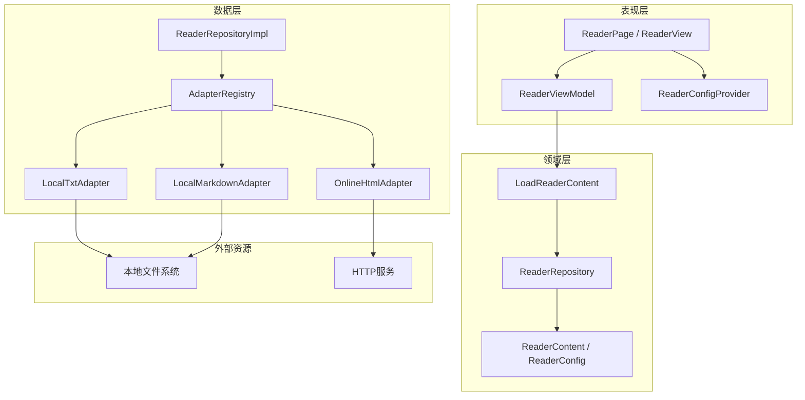
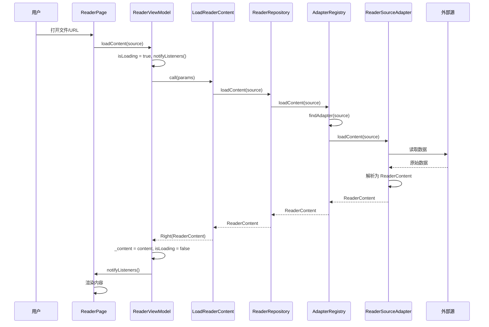

# 阅读器框架设计文档

## 1. 概述

### 1.1 目标

设计一套可扩展的阅读器框架，核心采用**适配器模式**统一不同输入源，支持本地文件（txt/markdown）和在线HTML，提供可配置的间距、背景、动画等阅读体验参数。框架优先关注架构的可扩展性，具体功能可逐步填补。

### 1.2 设计原则

| 原则             | 说明                                                                               |
| ---------------- | ---------------------------------------------------------------------------------- |
| **适配器模式**   | 所有输入源通过 `ReaderSourceAdapter` 接口统一接入，产生统一的 `ReaderContent` 模型 |
| **关注点分离**   | 数据源、解析、配置、渲染各层独立，互不耦合                                         |
| **面向接口编程** | 核心抽象定义在 domain 层，具体实现在 data 层                                       |
| **渐进增强**     | 框架骨架先行，具体适配器和渲染细节可后续填充                                       |
| **遵循项目规范** | 沿用项目 Clean Architecture + Provider + GetIt 架构风格                            |

### 1.3 整体架构图



---

## 2. 目录结构

```
lib/features/reader/
├── reader_provider.dart                     # 阅读器全局状态管理
│
├── domain/
│   ├── entities/
│   │   ├── reader_content.dart              # 统一内容模型
│   │   ├── reader_config.dart               # 阅读配置（间距/背景/动画）
│   │   ├── reader_position.dart             # 阅读进度
│   │   └── reader_source_type.dart          # 输入源类型枚举
│   ├── repositories/
│   │   └── reader_repository.dart           # 仓储接口
│   └── usecases/
│       └── load_reader_content.dart         # 加载内容用例
│
├── data/
│   ├── datasources/
│   │   ├── reader_source_adapter.dart       # ★ 适配器抽象接口
│   │   ├── local_txt_adapter.dart           # 本地TXT适配器
│   │   ├── local_markdown_adapter.dart      # 本地Markdown适配器
│   │   ├── online_html_adapter.dart         # 在线HTML适配器
│   │   └── parsers/
│   │       └── html_to_text_parser.dart     # HTML→纯文本解析器
│   ├── models/
│   │   ├── reader_content_model.dart        # 内容模型实现
│   │   └── reader_config_model.dart         # 配置模型实现
│   └── repositories/
│       └── reader_repository_impl.dart      # 仓储实现
│
├── presentation/
│   ├── view/
│   │   ├── reader_page.dart                 # 阅读器主页面
│   │   ├── reader_scroll_view.dart          # 滚动模式视图
│   │   ├── reader_page_turn_view.dart       # 翻页模式视图
│   │   └── widgets/
│   │       ├── reader_content_renderer.dart # 内容渲染器
│   │       ├── reader_app_bar.dart          # 顶部导航栏
│   │       ├── reader_bottom_bar.dart       # 底部进度条
│   │       ├── reader_settings_panel.dart   # 设置面板（底部弹出）
│   │       ├── reader_animation_builder.dart# 动画构建器
│   │       └── reader_background_painter.dart# 背景绘制器
│   └── viewmodels/
│       └── reader_view_model.dart           # 阅读器ViewModel
│
└── core/
    ├── reader_animation.dart                # 动画策略枚举与配置
    ├── reader_background.dart               # 背景策略枚举与配置
    ├── reader_spacing.dart                  # 间距预设
    └── reader_theme.dart                    # 阅读主题预设
```

---

## 3. 适配器模式设计（核心）

### 3.1 设计思想

适配器模式是本框架的核心。不同来源（本地文件、在线HTML、未来可能的PDF/EPUB）通过实现统一接口 `ReaderSourceAdapter`，将各异的数据格式转换为统一的 [`ReaderContent`](#4-内容模型) 模型。上层业务逻辑不感知底层来源差异。

### 3.2 适配器接口

```dart
// lib/features/reader/data/datasources/reader_source_adapter.dart

import 'package:provider_mode/features/reader/domain/entities/reader_content.dart';
import 'package:provider_mode/features/reader/domain/entities/reader_source_type.dart';

/// 阅读器输入源适配器接口
///
/// 所有输入源（本地文件、在线HTML、PDF等）必须实现此接口，
/// 将异构数据转换为统一的 [ReaderContent] 模型。
abstract class ReaderSourceAdapter {
  /// 判断此适配器是否能处理给定的输入源
  ///
  /// [source] 可以是文件路径、URL 或其他源标识符
  bool canHandle(String source);

  /// 加载并解析内容，返回统一的 [ReaderContent]
  ///
  /// 可能抛出 [ReaderSourceException] 当加载或解析失败时
  Future<ReaderContent> loadContent(String source);

  /// 输入源类型标识
  ReaderSourceType get sourceType;
}
```

### 3.3 适配器注册表

适配器注册表负责管理所有适配器实例，根据输入源自动选择合适的适配器。

```dart
// lib/features/reader/data/datasources/reader_source_adapter.dart 尾部追加

/// 适配器注册表 —— 管理所有适配器实例，自动路由到合适的适配器
class AdapterRegistry {
  final List<ReaderSourceAdapter> _adapters;

  AdapterRegistry(this._adapters);

  /// 注册一个新适配器（用于扩展新输入源类型）
  void register(ReaderSourceAdapter adapter) {
    _adapters.add(adapter);
  }

  /// 查找能处理指定源的首个适配器
  ReaderSourceAdapter? findAdapter(String source) {
    for (final adapter in _adapters) {
      if (adapter.canHandle(source)) {
        return adapter;
      }
    }
    return null;
  }

  /// 加载内容 —— 自动选择适配器
  Future<ReaderContent> loadContent(String source) async {
    final adapter = findAdapter(source);
    if (adapter == null) {
      throw ReaderSourceException('没有找到能处理该源的适配器: $source');
    }
    return adapter.loadContent(source);
  }
}
```

### 3.4 具体适配器实现

#### 3.4.1 本地TXT适配器

```dart
// lib/features/reader/data/datasources/local_txt_adapter.dart

import 'dart:io';
import 'package:provider_mode/features/reader/data/datasources/reader_source_adapter.dart';
import 'package:provider_mode/features/reader/domain/entities/reader_content.dart';
import 'package:provider_mode/features/reader/domain/entities/reader_source_type.dart';

class LocalTxtAdapter implements ReaderSourceAdapter {
  @override
  bool canHandle(String source) {
    // 判断是否为本地 .txt 文件路径
    return source.endsWith('.txt') && (File(source).existsSync() || source.startsWith('/'));
  }

  @override
  Future<ReaderContent> loadContent(String source) async {
    final file = File(source);
    if (!await file.exists()) {
      throw ReaderSourceException('文件不存在: $source');
    }
    final rawText = await file.readAsString();
    return _parseTxtContent(source, rawText);
  }

  ReaderContent _parseTxtContent(String source, String rawText) {
    final fileName = source.split('/').last.replaceAll('.txt', '');
    final lines = rawText.split('\n');

    // 按空行分割为段落
    final blocks = <ContentBlock>[];
    for (final line in lines) {
      final trimmed = line.trim();
      if (trimmed.isEmpty) continue;
      blocks.add(TextBlock(text: trimmed));
    }

    return ReaderContent(
      title: fileName,
      author: '',
      sections: [
        ContentSection(title: fileName, blocks: blocks),
      ],
      metadata: ContentMetadata(
        sourceType: ReaderSourceType.localTxt,
        sourcePath: source,
        totalCharacters: rawText.length,
      ),
    );
  }

  @override
  ReaderSourceType get sourceType => ReaderSourceType.localTxt;
}
```

#### 3.4.2 本地Markdown适配器

利用项目已有依赖 `flutter_markdown` 进行解析。

```dart
// lib/features/reader/data/datasources/local_markdown_adapter.dart

import 'dart:io';
import 'package:flutter_markdown/flutter_markdown.dart';
import 'package:markdown/markdown.dart' as md;
import 'package:provider_mode/features/reader/data/datasources/reader_source_adapter.dart';
import 'package:provider_mode/features/reader/domain/entities/reader_content.dart';
import 'package:provider_mode/features/reader/domain/entities/reader_source_type.dart';

class LocalMarkdownAdapter implements ReaderSourceAdapter {
  @override
  bool canHandle(String source) {
    return source.endsWith('.md') || source.endsWith('.markdown');
  }

  @override
  Future<ReaderContent> loadContent(String source) async {
    final file = File(source);
    if (!await file.exists()) {
      throw ReaderSourceException('文件不存在: $source');
    }
    final markdown = await file.readAsString();
    return _parseMarkdown(source, markdown);
  }

  ReaderContent _parseMarkdown(String source, String markdown) {
    final fileName = source.split('/').last.replaceAll(RegExp(r'\.(md|markdown)$'), '');
    final document = md.Document().parse(markdown);
    final blocks = <ContentBlock>[];

    for (final node in document) {
      if (node is md.Element) {
        switch (node.tag) {
          case 'h1':
          case 'h2':
          case 'h3':
          case 'h4':
          case 'h5':
          case 'h6':
            final level = int.parse(node.tag.substring(1));
            blocks.add(HeadingBlock(text: node.textContent, level: level));
            break;
          case 'p':
            blocks.add(TextBlock(text: node.textContent));
            break;
          case 'hr':
            blocks.add(const DividerBlock());
            break;
          default:
            blocks.add(TextBlock(text: node.textContent));
        }
      }
    }

    return ReaderContent(
      title: fileName,
      author: '',
      sections: [
        ContentSection(title: fileName, blocks: blocks),
      ],
      metadata: ContentMetadata(
        sourceType: ReaderSourceType.localMarkdown,
        sourcePath: source,
        totalCharacters: markdown.length,
      ),
    );
  }

  @override
  ReaderSourceType get sourceType => ReaderSourceType.localMarkdown;
}
```

#### 3.4.3 在线HTML适配器

使用 `dio` 获取HTML内容，通过 `HtmlToTextParser` 提取纯文本。

```dart
// lib/features/reader/data/datasources/online_html_adapter.dart

import 'package:dio/dio.dart';
import 'package:provider_mode/features/reader/data/datasources/parsers/html_to_text_parser.dart';
import 'package:provider_mode/features/reader/data/datasources/reader_source_adapter.dart';
import 'package:provider_mode/features/reader/domain/entities/reader_content.dart';
import 'package:provider_mode/features/reader/domain/entities/reader_source_type.dart';

class OnlineHtmlAdapter implements ReaderSourceAdapter {
  final Dio _dio;

  OnlineHtmlAdapter({Dio? dio}) : _dio = dio ?? Dio();

  @override
  bool canHandle(String source) {
    final uri = Uri.tryParse(source);
    return uri != null && (uri.scheme == 'http' || uri.scheme == 'https');
  }

  @override
  Future<ReaderContent> loadContent(String source) async {
    final response = await _dio.get<String>(source);
    if (response.data == null) {
      throw ReaderSourceException('HTTP响应内容为空: $source');
    }
    final html = response.data!;
    return _parseHtml(source, html);
  }

  ReaderContent _parseHtml(String source, String html) {
    final parser = HtmlToTextParser();
    final parsed = parser.parse(html);

    return ReaderContent(
      title: parsed.title,
      author: parsed.author,
      sections: [
        ContentSection(title: parsed.title, blocks: parsed.blocks),
      ],
      metadata: ContentMetadata(
        sourceType: ReaderSourceType.onlineHtml,
        sourcePath: source,
        totalCharacters: html.length,
      ),
    );
  }

  @override
  ReaderSourceType get sourceType => ReaderSourceType.onlineHtml;
}
```

#### 3.4.4 HTML→文本解析器

```dart
// lib/features/reader/data/datasources/parsers/html_to_text_parser.dart

import 'package:html/parser.dart' as html_parser;
import 'package:html/dom.dart' as dom;
import 'package:provider_mode/features/reader/domain/entities/reader_content.dart';

class HtmlParseResult {
  final String title;
  final String author;
  final List<ContentBlock> blocks;

  const HtmlParseResult({
    required this.title,
    this.author = '',
    required this.blocks,
  });
}

class HtmlToTextParser {
  HtmlParseResult parse(String html) {
    final document = html_parser.parse(html);
    final blocks = <ContentBlock>[];

    // 提取标题
    final title = document.querySelector('title')?.text ?? '未命名文档';
    final author = document.querySelector('meta[name=author]')?.attributes['content'] ?? '';

    // 遍历body下的主要元素
    final body = document.body;
    if (body != null) {
      _extractBlocks(body, blocks);
    }

    return HtmlParseResult(title: title, author: author, blocks: blocks);
  }

  void _extractBlocks(dom.Element element, List<ContentBlock> blocks) {
    for (final child in element.children) {
      switch (child.localName) {
        case 'h1':
        case 'h2':
        case 'h3':
        case 'h4':
        case 'h5':
        case 'h6':
          final level = int.parse(child.localName!.substring(1));
          final text = child.text.trim();
          if (text.isNotEmpty) {
            blocks.add(HeadingBlock(text: text, level: level));
          }
          break;
        case 'p':
        case 'div':
        case 'article':
        case 'section':
          final text = child.text.trim();
          if (text.isNotEmpty) {
            blocks.add(TextBlock(text: text));
          }
          break;
        case 'hr':
          blocks.add(const DividerBlock());
          break;
        case 'br':
          // 换行 → 空文本块表示段落间距
          break;
        default:
          // 递归提取嵌套元素
          _extractBlocks(child, blocks);
      }
    }
  }
}
```

### 3.5 未来扩展方向

新增输入源类型只需实现 `ReaderSourceAdapter` 接口并注册到 `AdapterRegistry`：

```dart
// 示例：未来扩展 EPUB 适配器
class EpubAdapter implements ReaderSourceAdapter {
  @override
  bool canHandle(String source) => source.endsWith('.epub');

  @override
  Future<ReaderContent> loadContent(String source) async {
    // EPUB 解析逻辑...
  }

  @override
  ReaderSourceType get sourceType => ReaderSourceType.epub;
}

// 注册
registry.register(EpubAdapter());
```

---

## 4. 内容模型

### 4.1 统一内容实体

```dart
// lib/features/reader/domain/entities/reader_content.dart

import 'package:equatable/equatable.dart';
import 'package:provider_mode/features/reader/domain/entities/reader_source_type.dart';

/// 统一的内容块 —— 使用 sealed class 保证类型安全
sealed class ContentBlock extends Equatable {
  const ContentBlock();
}

class TextBlock extends ContentBlock {
  final String text;
  const TextBlock({required this.text});

  @override
  List<Object?> get props => [text];
}

class HeadingBlock extends ContentBlock {
  final String text;
  final int level; // 1-6，对应 h1-h6
  const HeadingBlock({required this.text, required this.level});

  @override
  List<Object?> get props => [text, level];
}

class ImageBlock extends ContentBlock {
  final String url;
  final String? caption;
  const ImageBlock({required this.url, this.caption});

  @override
  List<Object?> get props => [url, caption];
}

class DividerBlock extends ContentBlock {
  const DividerBlock();

  @override
  List<Object?> get props => [];
}

/// 章节/分段
class ContentSection extends Equatable {
  final String title;
  final List<ContentBlock> blocks;

  const ContentSection({required this.title, required this.blocks});

  @override
  List<Object?> get props => [title, blocks];
}

/// 内容元数据
class ContentMetadata extends Equatable {
  final ReaderSourceType sourceType;
  final String sourcePath;
  final int totalCharacters;
  final String? coverUrl;

  const ContentMetadata({
    required this.sourceType,
    required this.sourcePath,
    required this.totalCharacters,
    this.coverUrl,
  });

  @override
  List<Object?> get props => [sourceType, sourcePath, totalCharacters, coverUrl];
}

/// 统一的内容实体 —— 所有适配器的产出物
class ReaderContent extends Equatable {
  final String title;
  final String author;
  final List<ContentSection> sections;
  final ContentMetadata metadata;

  const ReaderContent({
    required this.title,
    this.author = '',
    required this.sections,
    required this.metadata,
  });

  /// 计算总字符数（用于进度计算）
  int get totalCharacters => sections.fold<int>(
        0,
        (sum, section) =>
            sum +
            section.blocks.fold<int>(
              0,
              (s, block) => switch (block) {
                TextBlock(:final text) => s + text.length,
                HeadingBlock(:final text) => s + text.length,
                _ => s,
              },
            ),
      );

  @override
  List<Object?> get props => [title, author, sections, metadata];
}
```

### 4.2 输入源类型枚举

```dart
// lib/features/reader/domain/entities/reader_source_type.dart

enum ReaderSourceType {
  localTxt,
  localMarkdown,
  onlineHtml,
  // 未来扩展
  // epub,
  // pdf,
  // assetFile,
}
```

---

## 5. 配置系统

### 5.1 配置实体

```dart
// lib/features/reader/domain/entities/reader_config.dart

import 'package:equatable/equatable.dart';
import 'package:flutter/material.dart';
import 'package:provider_mode/features/reader/core/reader_animation.dart';
import 'package:provider_mode/features/reader/core/reader_background.dart';

/// 阅读模式
enum ReaderMode { scroll, pageTurn }

/// 阅读器全局配置
class ReaderConfig extends Equatable {
  // ===== 间距设置 =====
  final double fontSize;          // 字体大小 (12-28)
  final double lineHeight;        // 行高倍率 (1.2-2.5)
  final double paragraphSpacing;  // 段落间距 (0-32)
  final double pagePadding;       // 页面内边距 (8-48)

  // ===== 字体设置 =====
  final String fontFamily;        // 字体族
  final FontWeight fontWeight;    // 字重
  final Color textColor;          // 文字颜色

  // ===== 背景设置 =====
  final ReaderBackground background;

  // ===== 动画设置 =====
  final ReaderAnimationStyle animationStyle;

  // ===== 阅读模式 =====
  final ReaderMode readerMode;

  const ReaderConfig({
    this.fontSize = 16,
    this.lineHeight = 1.8,
    this.paragraphSpacing = 16,
    this.pagePadding = 24,
    this.fontFamily = 'System',
    this.fontWeight = FontWeight.normal,
    this.textColor = Colors.black87,
    this.background = const SolidColorBackground(color: Color(0xFFF5F0E8)),
    this.animationStyle = ReaderAnimationStyle.slide,
    this.readerMode = ReaderMode.scroll,
  });

  ReaderConfig copyWith({
    double? fontSize,
    double? lineHeight,
    double? paragraphSpacing,
    double? pagePadding,
    String? fontFamily,
    FontWeight? fontWeight,
    Color? textColor,
    ReaderBackground? background,
    ReaderAnimationStyle? animationStyle,
    ReaderMode? readerMode,
  }) {
    return ReaderConfig(
      fontSize: fontSize ?? this.fontSize,
      lineHeight: lineHeight ?? this.lineHeight,
      paragraphSpacing: paragraphSpacing ?? this.paragraphSpacing,
      pagePadding: pagePadding ?? this.pagePadding,
      fontFamily: fontFamily ?? this.fontFamily,
      fontWeight: fontWeight ?? this.fontWeight,
      textColor: textColor ?? this.textColor,
      background: background ?? this.background,
      animationStyle: animationStyle ?? this.animationStyle,
      readerMode: readerMode ?? this.readerMode,
    );
  }

  @override
  List<Object?> get props => [
        fontSize,
        lineHeight,
        paragraphSpacing,
        pagePadding,
        fontFamily,
        fontWeight,
        textColor,
        background,
        animationStyle,
        readerMode,
      ];
}
```

### 5.2 间距系统

```dart
// lib/features/reader/core/reader_spacing.dart

/// 间距预设 —— 方便用户快速切换
enum SpacingPreset {
  compact,   // 紧凑: fontSize=14, lineHeight=1.4, paragraphSpacing=8, padding=16
  standard,  // 标准: fontSize=16, lineHeight=1.8, paragraphSpacing=16, padding=24
  relaxed,   // 宽松: fontSize=18, lineHeight=2.0, paragraphSpacing=24, padding=32
  spacious,  // 超大: fontSize=22, lineHeight=2.4, paragraphSpacing=32, padding=40
}

extension SpacingPresetExtension on SpacingPreset {
  double get fontSize {
    switch (this) {
      case SpacingPreset.compact: return 14;
      case SpacingPreset.standard: return 16;
      case SpacingPreset.relaxed: return 18;
      case SpacingPreset.spacious: return 22;
    }
  }

  double get lineHeight {
    switch (this) {
      case SpacingPreset.compact: return 1.4;
      case SpacingPreset.standard: return 1.8;
      case SpacingPreset.relaxed: return 2.0;
      case SpacingPreset.spacious: return 2.4;
    }
  }

  double get paragraphSpacing {
    switch (this) {
      case SpacingPreset.compact: return 8;
      case SpacingPreset.standard: return 16;
      case SpacingPreset.relaxed: return 24;
      case SpacingPreset.spacious: return 32;
    }
  }

  double get pagePadding {
    switch (this) {
      case SpacingPreset.compact: return 16;
      case SpacingPreset.standard: return 24;
      case SpacingPreset.relaxed: return 32;
      case SpacingPreset.spacious: return 40;
    }
  }

  String get displayName {
    switch (this) {
      case SpacingPreset.compact: return '紧凑';
      case SpacingPreset.standard: return '标准';
      case SpacingPreset.relaxed: return '宽松';
      case SpacingPreset.spacious: return '超大';
    }
  }
}
```

---

## 6. 背景系统

### 6.1 设计思想

背景系统采用**策略模式**，通过 `ReaderBackground` 密封类定义多种背景类型，由 [`ReaderBackgroundPainter`](#93-背景绘制器) 统一绘制。

### 6.2 背景类型定义

```dart
// lib/features/reader/core/reader_background.dart

import 'package:equatable/equatable.dart';
import 'package:flutter/material.dart';

/// 背景基类 —— 策略模式
sealed class ReaderBackground extends Equatable {
  const ReaderBackground();
}

/// 纯色背景
class SolidColorBackground extends ReaderBackground {
  final Color color;
  const SolidColorBackground({required this.color});

  @override
  List<Object?> get props => [color];
}

/// 渐变背景
class GradientBackground extends ReaderBackground {
  final List<Color> colors;
  final Alignment begin;
  final Alignment end;
  const GradientBackground({
    required this.colors,
    this.begin = Alignment.topLeft,
    this.end = Alignment.bottomRight,
  });

  @override
  List<Object?> get props => [colors, begin, end];
}

/// 纹理/图片背景
class TextureBackground extends ReaderBackground {
  final String imagePath;     // 本地路径或 asset 路径
  final ImageRepeat repeat;
  final double opacity;
  const TextureBackground({
    required this.imagePath,
    this.repeat = ImageRepeat.repeat,
    this.opacity = 0.1,
  });

  @override
  List<Object?> get props => [imagePath, repeat, opacity];
}

/// 阅读主题预设
enum ReadingThemePreset {
  classic,   // 经典: 米黄色背景 + 深灰文字
  night,     // 夜间: 深色背景 + 浅灰文字
  eyeCare,   // 护眼: 浅绿背景 + 深绿文字
  pure,      // 纯净: 白色背景 + 黑色文字
  dark,      // 暗黑: 深黑背景 + 白色文字
}

extension ReadingThemePresetExtension on ReadingThemePreset {
  ReaderBackground get background {
    switch (this) {
      case ReadingThemePreset.classic:
        return const SolidColorBackground(color: Color(0xFFF5F0E8));
      case ReadingThemePreset.night:
        return const SolidColorBackground(color: Color(0xFF1A1A2E));
      case ReadingThemePreset.eyeCare:
        return const SolidColorBackground(color: Color(0xFFC8D6C0));
      case ReadingThemePreset.pure:
        return const SolidColorBackground(color: Colors.white);
      case ReadingThemePreset.dark:
        return const SolidColorBackground(color: Color(0xFF121212));
    }
  }

  Color get textColor {
    switch (this) {
      case ReadingThemePreset.classic:
      case ReadingThemePreset.pure:
      case ReadingThemePreset.eyeCare:
        return Colors.black87;
      case ReadingThemePreset.night:
      case ReadingThemePreset.dark:
        return Colors.white70;
    }
  }

  String get displayName {
    switch (this) {
      case ReadingThemePreset.classic: return '经典';
      case ReadingThemePreset.night: return '夜间';
      case ReadingThemePreset.eyeCare: return '护眼';
      case ReadingThemePreset.pure: return '纯净';
      case ReadingThemePreset.dark: return '暗黑';
    }
  }
}
```

---

## 7. 动画系统

### 7.1 设计思想

动画系统定义翻页/切换等过渡动画策略，当前阶段提供基础实现，后续可扩展更丰富的动画效果（如仿真翻页）。

### 7.2 动画策略定义

```dart
// lib/features/reader/core/reader_animation.dart

import 'package:flutter/material.dart';

/// 翻页动画风格
enum ReaderAnimationStyle {
  none,       // 无动画
  slide,      // 滑动
  fade,       // 淡入淡出
  // 未来扩展:
  // curl,     // 仿真翻页（需借助 shader 或第三方库）
  // flip,     // 3D翻转
}

extension ReaderAnimationStyleExtension on ReaderAnimationStyle {
  String get displayName {
    switch (this) {
      case ReaderAnimationStyle.none: return '无';
      case ReaderAnimationStyle.slide: return '滑动';
      case ReaderAnimationStyle.fade: return '淡入';
    }
  }

  /// 构建对应的过渡动画
  Widget buildTransition(
    Animation<double> animation,
    Animation<double> secondaryAnimation,
    Widget child,
  ) {
    switch (this) {
      case ReaderAnimationStyle.none:
        return child;
      case ReaderAnimationStyle.slide:
        return SlideTransition(
          position: Tween<Offset>(
            begin: const Offset(1.0, 0.0),
            end: Offset.zero,
          ).animate(CurvedAnimation(
            parent: animation,
            curve: Curves.easeOutCubic,
          )),
          child: child,
        );
      case ReaderAnimationStyle.fade:
        return FadeTransition(
          opacity: CurvedAnimation(
            parent: animation,
            curve: Curves.easeIn,
          ),
          child: child,
        );
    }
  }
}

/// 阅读器专用的动画时长常量
class ReaderAnimationDuration {
  static const pageTurn = Duration(milliseconds: 350);
  static const settingsPanel = Duration(milliseconds: 250);
  static const progressUpdate = Duration(milliseconds: 150);
}
```

---

## 8. 阅读进度模型

```dart
// lib/features/reader/domain/entities/reader_position.dart

import 'package:equatable/equatable.dart';

/// 阅读进度 —— 支持持久化保存
class ReaderPosition extends Equatable {
  /// 当前章节索引
  final int sectionIndex;

  /// 当前段落块索引
  final int blockIndex;

  /// 在当前段落内的字符偏移（用于精确恢复位置）
  final int characterOffset;

  /// 整体进度百分比 (0.0-1.0)
  final double progress;

  const ReaderPosition({
    this.sectionIndex = 0,
    this.blockIndex = 0,
    this.characterOffset = 0,
    this.progress = 0.0,
  });

  /// 计算进度百分比
  static double calculateProgress(int currentChar, int totalChar) {
    if (totalChar == 0) return 0.0;
    return (currentChar / totalChar).clamp(0.0, 1.0);
  }

  ReaderPosition copyWith({
    int? sectionIndex,
    int? blockIndex,
    int? characterOffset,
    double? progress,
  }) {
    return ReaderPosition(
      sectionIndex: sectionIndex ?? this.sectionIndex,
      blockIndex: blockIndex ?? this.blockIndex,
      characterOffset: characterOffset ?? this.characterOffset,
      progress: progress ?? this.progress,
    );
  }

  @override
  List<Object?> get props => [sectionIndex, blockIndex, characterOffset, progress];
}
```

---

## 9. 渲染层设计

### 9.1 渲染架构

```
ReaderPage (入口)
├── ReaderAppBar (顶部栏：标题 + 模式切换)
├── Body ──┬── ReaderScrollView   (滚动模式)
│          └── ReaderPageTurnView (翻页模式)
├── ReaderBottomBar (底部栏：进度 + 章节)
└── ReaderSettingsPanel (设置面板：底部弹出)
```

### 9.2 内容渲染器

核心渲染组件，负责将 `ContentBlock` 列表渲染为 Flutter Widget 树。

```dart
// lib/features/reader/presentation/view/widgets/reader_content_renderer.dart

/// 内容渲染器 —— 将 [ContentBlock] 列表转换为 Widget 树
///
/// 支持通过 [ReaderConfig] 动态控制样式
class ReaderContentRenderer extends StatelessWidget {
  final List<ContentBlock> blocks;
  final ReaderConfig config;

  const ReaderContentRenderer({
    super.key,
    required this.blocks,
    required this.config,
  });

  @override
  Widget build(BuildContext context) {
    return Column(
      crossAxisAlignment: CrossAxisAlignment.start,
      children: blocks.map((block) => _renderBlock(block)).toList(),
    );
  }

  Widget _renderBlock(ContentBlock block) {
    return switch (block) {
      TextBlock(:final text) => Padding(
          padding: EdgeInsets.only(bottom: config.paragraphSpacing),
          child: Text(
            text,
            style: _textStyle(),
            textAlign: TextAlign.justify,
          ),
        ),
      HeadingBlock(:final text, :final level) => Padding(
          padding: EdgeInsets.only(
            top: _headingTopPadding(level),
            bottom: config.paragraphSpacing,
          ),
          child: Text(
            text,
            style: _headingStyle(level),
          ),
        ),
      ImageBlock(:final url, :final caption) => Padding(
          padding: EdgeInsets.only(bottom: config.paragraphSpacing),
          child: Column(
            children: [
              Image.network(url),
              if (caption != null) Text(caption!, style: _captionStyle()),
            ],
          ),
        ),
      DividerBlock() => Padding(
          padding: EdgeInsets.symmetric(vertical: config.paragraphSpacing),
          child: const Divider(),
        ),
    };
  }

  TextStyle _textStyle() => TextStyle(
        fontSize: config.fontSize,
        height: config.lineHeight,
        fontFamily: config.fontFamily == 'System' ? null : config.fontFamily,
        fontWeight: config.fontWeight,
        color: config.textColor,
      );

  // ... _headingStyle, _captionStyle, _headingTopPadding 等辅助方法
}
```

### 9.3 背景绘制器

```dart
// lib/features/reader/presentation/view/widgets/reader_background_painter.dart

/// 背景绘制器 —— 根据 [ReaderBackground] 策略渲染背景
class ReaderBackgroundPainter extends StatelessWidget {
  final ReaderBackground background;
  final Widget child;

  const ReaderBackgroundPainter({
    super.key,
    required this.background,
    required this.child,
  });

  @override
  Widget build(BuildContext context) {
    return switch (background) {
      SolidColorBackground(:final color) => Container(
          color: color,
          child: child,
        ),
      GradientBackground(:final colors, :final begin, :final end) => Container(
          decoration: BoxDecoration(
            gradient: LinearGradient(
              colors: colors,
              begin: begin,
              end: end,
            ),
          ),
          child: child,
        ),
      TextureBackground(:final imagePath, :final repeat, :final opacity) =>
        Stack(
          children: [
            Opacity(
              opacity: opacity,
              child: Image.asset(imagePath, repeat: repeat, width: double.infinity, height: double.infinity),
            ),
            child,
          ],
        ),
    };
  }
}
```

### 9.4 滚动模式视图

```dart
// lib/features/reader/presentation/view/reader_scroll_view.dart

/// 滚动模式 —— 连续上下滚动阅读
class ReaderScrollView extends StatelessWidget {
  final ReaderContent content;
  final ReaderConfig config;
  final ReaderPosition position;
  final ScrollController scrollController;
  final ValueChanged<ReaderPosition> onPositionChanged;

  // 使用 ListView.builder 渲染所有章节和内容块
  // 通过 ScrollController 监听滚动位置，实时计算阅读进度
}
```

### 9.5 翻页模式视图

```dart
// lib/features/reader/presentation/view/reader_page_turn_view.dart

/// 翻页模式 —— 左右滑动翻页阅读
class ReaderPageTurnView extends StatelessWidget {
  final ReaderContent content;
  final ReaderConfig config;
  final ReaderPosition position;
  final PageController pageController;
  final ValueChanged<ReaderPosition> onPositionChanged;

  // 使用 PageView.builder 进行分页
  // 需要预先计算每页可容纳的内容量（字符数）
  // 通过 PageController 监听当前页码
}
```

---

## 10. 状态管理

### 10.1 ViewModel

```dart
// lib/features/reader/presentation/viewmodels/reader_view_model.dart

import 'package:flutter/material.dart';
import 'package:provider_mode/features/reader/domain/entities/reader_config.dart';
import 'package:provider_mode/features/reader/domain/entities/reader_content.dart';
import 'package:provider_mode/features/reader/domain/entities/reader_position.dart';
import 'package:provider_mode/features/reader/domain/usecases/load_reader_content.dart';

/// 阅读器ViewModel —— 管理加载状态、内容、配置、进度
class ReaderViewModel extends ChangeNotifier {
  final LoadReaderContent _loadContent;

  // 加载状态
  bool _isLoading = false;
  String? _errorMessage;

  // 内容
  ReaderContent? _content;

  // 配置
  ReaderConfig _config = const ReaderConfig();

  // 进度
  ReaderPosition _position = const ReaderPosition();

  ReaderViewModel({required LoadReaderContent loadContent})
      : _loadContent = loadContent;

  // ===== Getters =====
  bool get isLoading => _isLoading;
  String? get errorMessage => _errorMessage;
  ReaderContent? get content => _content;
  ReaderConfig get config => _config;
  ReaderPosition get position => _position;

  // ===== 加载内容 =====
  Future<void> loadContent(String source) async {
    _isLoading = true;
    _errorMessage = null;
    notifyListeners();

    try {
      _content = await _loadContent(source);
      _position = const ReaderPosition(); // 重置进度
    } catch (e) {
      _errorMessage = e.toString();
    } finally {
      _isLoading = false;
      notifyListeners();
    }
  }

  // ===== 配置更新 =====
  void updateConfig(ReaderConfig newConfig) {
    _config = newConfig;
    notifyListeners();
  }

  void setFontSize(double size) {
    _config = _config.copyWith(fontSize: size);
    notifyListeners();
  }

  void setLineHeight(double height) {
    _config = _config.copyWith(lineHeight: height);
    notifyListeners();
  }

  void setBackground(ReaderBackground background) {
    _config = _config.copyWith(background: background);
    notifyListeners();
  }

  void setAnimation(ReaderAnimationStyle style) {
    _config = _config.copyWith(animationStyle: style);
    notifyListeners();
  }

  void setReaderMode(ReaderMode mode) {
    _config = _config.copyWith(readerMode: mode);
    notifyListeners();
  }

  void applySpacingPreset(SpacingPreset preset) {
    _config = _config.copyWith(
      fontSize: preset.fontSize,
      lineHeight: preset.lineHeight,
      paragraphSpacing: preset.paragraphSpacing,
      pagePadding: preset.pagePadding,
    );
    notifyListeners();
  }

  void applyThemePreset(ReadingThemePreset preset) {
    _config = _config.copyWith(
      background: preset.background,
      textColor: preset.textColor,
    );
    notifyListeners();
  }

  // ===== 进度更新 =====
  void updatePosition(ReaderPosition newPosition) {
    _position = newPosition;
    notifyListeners();
  }
}
```

### 10.2 全局 Provider

````dart
// lib/features/reader/reader_provider.dart

import 'package:flutter/material.dart';
import 'package:provider_mode/features/reader/presentation/viewmodels/reader_view_model.dart';

/// 阅读器全局 Provider —— 通过 Provider 暴露 ViewModel
///
/// 使用方式:
/// ```dart
/// final readerVM = context.read<ReaderViewModel>();
/// readerVM.loadContent('/path/to/file.txt');
/// ```
///
/// 注册在 injector.dart 中:
/// ```dart
/// injector.registerFactory(() => ReaderViewModel(
///   loadContent: injector<LoadReaderContent>(),
/// ));
/// ```
class ReaderProvider extends StatelessWidget {
  final Widget child;

  const ReaderProvider({super.key, required this.child});

  @override
  Widget build(BuildContext context) {
    return child;
  }
}
````

---

## 11. 仓储与用例

### 11.1 仓储接口

```dart
// lib/features/reader/domain/repositories/reader_repository.dart

import 'package:provider_mode/features/reader/domain/entities/reader_content.dart';

abstract class ReaderRepository {
  /// 加载内容 —— 自动选择适配器
  Future<ReaderContent> loadContent(String source);
}
```

### 11.2 仓储实现

```dart
// lib/features/reader/data/repositories/reader_repository_impl.dart

import 'package:provider_mode/features/reader/data/datasources/reader_source_adapter.dart';
import 'package:provider_mode/features/reader/domain/entities/reader_content.dart';
import 'package:provider_mode/features/reader/domain/repositories/reader_repository.dart';

class ReaderRepositoryImpl implements ReaderRepository {
  final AdapterRegistry _registry;

  ReaderRepositoryImpl(this._registry);

  @override
  Future<ReaderContent> loadContent(String source) {
    return _registry.loadContent(source);
  }
}
```

### 11.3 用例

```dart
// lib/features/reader/domain/usecases/load_reader_content.dart

import 'package:dart_either/dart_either.dart';
import 'package:provider_mode/core/error/failures.dart';
import 'package:provider_mode/core/usecases/use_case.dart';
import 'package:provider_mode/features/reader/domain/entities/reader_content.dart';
import 'package:provider_mode/features/reader/domain/repositories/reader_repository.dart';

class LoadReaderContentParams {
  final String source;
  const LoadReaderContentParams({required this.source});
}

class LoadReaderContent
    implements UseCase<ReaderContent, LoadReaderContentParams> {
  final ReaderRepository _repository;

  LoadReaderContent(this._repository);

  @override
  Future<Either<Failure, ReaderContent>> call(
      LoadReaderContentParams params) async {
    try {
      final content = await _repository.loadContent(params.source);
      return Right(content);
    } catch (e) {
      return Left(ReaderFailure(message: e.toString()));
    }
  }
}

class ReaderFailure extends Failure {
  const ReaderFailure({required super.message});
}
```

---

## 12. 依赖注入配置

新增在 [`lib/di/injector.dart`](lib/di/injector.dart:1) 中的注册代码：

```dart
// ========== Reader 阅读器模块 ==========

// 适配器注册表（含所有内置适配器）
injector.registerLazySingleton(() => AdapterRegistry([
      LocalTxtAdapter(),
      LocalMarkdownAdapter(),
      OnlineHtmlAdapter(dio: injector<Dio>()),
    ]));

// Repository
injector.registerLazySingleton<ReaderRepository>(
    () => ReaderRepositoryImpl(injector<AdapterRegistry>()));

// UseCase
injector.registerFactory(() => LoadReaderContent(injector<ReaderRepository>()));

// ViewModel
injector.registerFactory(() => ReaderViewModel(
      loadContent: injector<LoadReaderContent>(),
    ));
```

> **注意**: `OnlineHtmlAdapter` 依赖 `Dio`，需要确保 `Dio` 已在 DI 中注册，或在适配器中默认创建实例。

---

## 13. 路由配置

在 [`lib/core/router/app_router.dart`](lib/core/router/app_router.dart:40) 中添加阅读器路由：

```dart
// Reader 阅读器
GoRoute(
  path: 'reader',
  pageBuilder: (context, state) => CustomTransitionPage(
    child: const ReaderPage(),
    transitionsBuilder: _slideTransition,
  ),
),
```

---

## 14. 异常处理

```dart
// lib/features/reader/data/datasources/reader_source_adapter.dart 尾部追加

/// 阅读器输入源异常
class ReaderSourceException implements Exception {
  final String message;
  const ReaderSourceException(this.message);

  @override
  String toString() => 'ReaderSourceException: $message';
}
```

---

## 15. 数据流图



---

## 16. 分阶段实施计划

### 第一阶段：框架骨架

| 序号 | 任务           | 产出物                                                                                         |
| ---- | -------------- | ---------------------------------------------------------------------------------------------- |
| 1    | 创建目录结构   | `lib/features/reader/` 完整目录                                                                |
| 2    | 定义领域实体   | `reader_content.dart`, `reader_config.dart`, `reader_position.dart`, `reader_source_type.dart` |
| 3    | 定义适配器接口 | `reader_source_adapter.dart` + `AdapterRegistry`                                               |
| 4    | 定义仓储接口   | `reader_repository.dart`                                                                       |
| 5    | 定义用例       | `load_reader_content.dart`                                                                     |
| 6    | 定义核心配置   | `reader_animation.dart`, `reader_background.dart`, `reader_spacing.dart`, `reader_theme.dart`  |

### 第二阶段：适配器实现

| 序号 | 任务                   | 产出物                             |
| ---- | ---------------------- | ---------------------------------- |
| 7    | 实现本地TXT适配器      | `local_txt_adapter.dart`           |
| 8    | 实现本地Markdown适配器 | `local_markdown_adapter.dart`      |
| 9    | 实现HTML→文本解析器    | `parsers/html_to_text_parser.dart` |
| 10   | 实现在线HTML适配器     | `online_html_adapter.dart`         |
| 11   | 实现仓储实现类         | `reader_repository_impl.dart`      |

### 第三阶段：表现层

| 序号 | 任务             | 产出物                                          |
| ---- | ---------------- | ----------------------------------------------- |
| 12   | 实现ViewModel    | `reader_view_model.dart`                        |
| 13   | 实现背景绘制器   | `reader_background_painter.dart`                |
| 14   | 实现内容渲染器   | `reader_content_renderer.dart`                  |
| 15   | 实现滚动模式视图 | `reader_scroll_view.dart`                       |
| 16   | 实现翻页模式视图 | `reader_page_turn_view.dart`                    |
| 17   | 实现主页面       | `reader_page.dart`                              |
| 18   | 实现设置面板     | `reader_settings_panel.dart`                    |
| 19   | 实现导航组件     | `reader_app_bar.dart`, `reader_bottom_bar.dart` |

### 第四阶段：集成

| 序号 | 任务     | 产出物                         |
| ---- | -------- | ------------------------------ |
| 20   | DI注册   | 更新 `injector.dart`           |
| 21   | 路由注册 | 更新 `app_router.dart`         |
| 22   | 入口接入 | 更新 `app.dart` 添加阅读器入口 |
| 23   | 测试验证 | 加载本地txt/md，加载在线HTML   |

---

## 17. 文件清单

### 新增文件（共 28 个）

```
des-doc/reader-framework-design.md                    # 本设计文档

lib/features/reader/
├── reader_provider.dart                              # 全局Provider封装
├── domain/
│   ├── entities/
│   │   ├── reader_content.dart                       # 内容模型（含ContentBlock sealed class）
│   │   ├── reader_config.dart                        # 配置模型
│   │   ├── reader_position.dart                      # 进度模型
│   │   └── reader_source_type.dart                   # 源类型枚举
│   ├── repositories/
│   │   └── reader_repository.dart                    # 仓储接口
│   └── usecases/
│       └── load_reader_content.dart                  # 加载用例
├── data/
│   ├── datasources/
│   │   ├── reader_source_adapter.dart                # 适配器接口 + AdapterRegistry
│   │   ├── local_txt_adapter.dart                    # TXT适配器
│   │   ├── local_markdown_adapter.dart               # Markdown适配器
│   │   ├── online_html_adapter.dart                  # HTML适配器
│   │   └── parsers/
│   │       └── html_to_text_parser.dart              # HTML解析器
│   ├── models/
│   │   ├── reader_content_model.dart                 # 内容模型实现（如有需要）
│   │   └── reader_config_model.dart                  # 配置模型实现（如有需要）
│   └── repositories/
│       └── reader_repository_impl.dart               # 仓储实现
├── presentation/
│   ├── view/
│   │   ├── reader_page.dart                          # 主页面
│   │   ├── reader_scroll_view.dart                   # 滚动视图
│   │   ├── reader_page_turn_view.dart                # 翻页视图
│   │   └── widgets/
│   │       ├── reader_content_renderer.dart          # 内容渲染器
│   │       ├── reader_app_bar.dart                   # 顶部栏
│   │       ├── reader_bottom_bar.dart                # 底部栏
│   │       ├── reader_settings_panel.dart            # 设置面板
│   │       ├── reader_animation_builder.dart         # 动画构建器
│   │       └── reader_background_painter.dart        # 背景绘制器
│   └── viewmodels/
│       └── reader_view_model.dart                    # ViewModel
└── core/
    ├── reader_animation.dart                          # 动画策略
    ├── reader_background.dart                         # 背景策略
    ├── reader_spacing.dart                            # 间距预设
    └── reader_theme.dart                              # 主题预设
```

### 修改文件

| 文件                              | 修改内容                                                  |
| --------------------------------- | --------------------------------------------------------- |
| `lib/di/injector.dart`            | 添加 AdapterRegistry、Repository、UseCase、ViewModel 注册 |
| `lib/core/router/app_router.dart` | 添加 `/reader` 路由                                       |
| `lib/app.dart`                    | 添加阅读器入口卡片                                        |
| `pubspec.yaml`                    | 添加 `html` 包依赖（HTML解析）                            |

---

## 18. 扩展性总结

本框架通过以下设计保证扩展性：

| 扩展方向       | 实现方式                                             | 示例                   |
| -------------- | ---------------------------------------------------- | ---------------------- |
| **新输入源**   | 实现 `ReaderSourceAdapter`，注册到 `AdapterRegistry` | EPUB、PDF、在线TXT     |
| **新内容类型** | 扩展 `ContentBlock` sealed class 子类                | 代码块、表格、公式     |
| **新背景类型** | 扩展 `ReaderBackground` sealed class 子类            | 视频背景、动态渐变     |
| **新动画风格** | 扩展 `ReaderAnimationStyle` 枚举                     | 仿真翻页、3D翻转       |
| **新阅读模式** | 扩展 `ReaderMode` 枚举 + 新建View                    | 自动滚动、朗读模式     |
| **新配置项**   | 在 `ReaderConfig` 中添加字段 + `copyWith`            | 首行缩进、字体颜色方案 |
