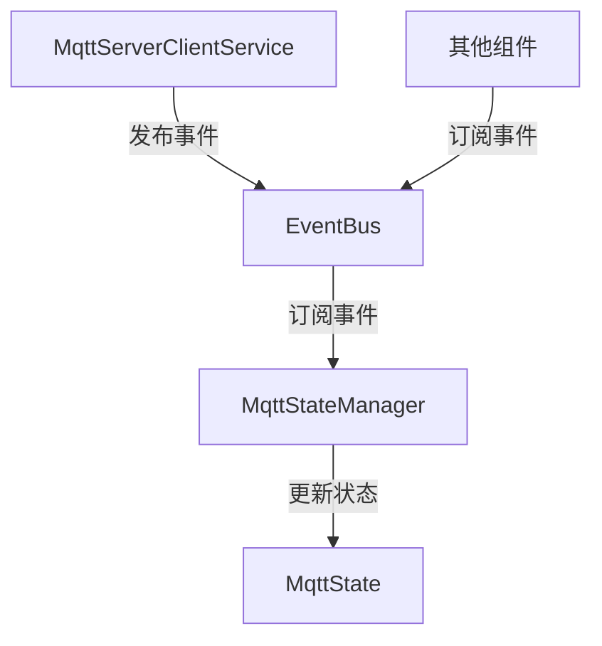

# MQTT 服务与状态管理解耦实施计划

## 问题分析
当前 [`MqttServerClientService`](lib/core/mqtt/mqtt_server_client_service.dart:11) 与 [`MqttState`](lib/core/mqtt/mqtt_state.dart:3) 存在紧耦合，在6个关键点直接调用状态更新方法：
1. 连接开始时设置连接状态为 `connecting`
2. 连接失败时设置连接状态为 `connectionfailed`  
3. 连接断开时设置连接状态为 `disconnected`
4. 连接成功时设置连接状态为 `connected`
5. 心跳正常时设置连接健康状态为 `true`
6. 心跳超时时设置连接健康状态为 `false`

## 解决方案：事件驱动架构

### 架构设计


### 实施步骤

#### 1. 创建事件总线 (EventBus)
**文件**: `lib/core/event/event_bus.dart`
```dart
import 'dart:async';

class EventBus {
  final _controller = StreamController<dynamic>.broadcast();
  
  Stream<T> on<T>() {
    return _controller.stream.where((event) => event is T).cast<T>();
  }
  
  void fire(dynamic event) {
    _controller.add(event);
  }
  
  void dispose() {
    _controller.close();
  }
}
```

#### 2. 定义 MQTT 事件类
**文件**: `lib/core/event/mqtt_events.dart`
```dart
// 连接状态变化事件
class MqttConnectionStateChangedEvent {
  final MqttAppConnectionState state;
  MqttConnectionStateChangedEvent(this.state);
}

// 连接健康状态变化事件  
class MqttConnectionHealthChangedEvent {
  final bool isHealthy;
  MqttConnectionHealthChangedEvent(this.isHealthy);
}

// 消息接收事件
class MqttMessageReceivedEvent {
  final String topic;
  final String payload;
  MqttMessageReceivedEvent(this.topic, this.payload);
}
```

#### 3. 创建 MqttStateManager
**文件**: `lib/core/mqtt/mqtt_state_manager.dart`
```dart
import 'package:flutter/foundation.dart';
import '../event/event_bus.dart';
import '../event/mqtt_events.dart';
import 'mqtt_state.dart';

class MqttStateManager {
  final EventBus _eventBus;
  final MqttState _mqttState;
  StreamSubscription? _subscription;

  MqttStateManager(this._eventBus, this._mqttState) {
    _subscribeToEvents();
  }

  void _subscribeToEvents() {
    _subscription = _eventBus.on<MqttConnectionStateChangedEvent>().listen((event) {
      _mqttState.setAppConnectionState(event.state);
    });
    
    _eventBus.on<MqttConnectionHealthChangedEvent>().listen((event) {
      _mqttState.setConnectionHealth(event.isHealthy);
    });
  }

  void dispose() {
    _subscription?.cancel();
  }
}
```

#### 4. 重构 MqttServerClientService
**修改**: `lib/core/mqtt/mqtt_server_client_service.dart`
- 移除第34行对 MqttState 的直接依赖
- 添加 EventBus 依赖
- 将6个状态更新点改为事件发布：
  - `_mqttState.setAppConnectionState(...)` → `_eventBus.fire(MqttConnectionStateChangedEvent(...))`
  - `_mqttState.setConnectionHealth(...)` → `_eventBus.fire(MqttConnectionHealthChangedEvent(...))`

#### 5. 更新依赖注入配置
**修改**: `lib/di/injector.dart`
```dart
// 添加 EventBus 和 MqttStateManager 的注册
injector.registerLazySingleton(() => EventBus());
injector.registerLazySingleton(() => MqttStateManager(
  injector<EventBus>(),
  injector<MqttState>()
));

// 更新 MqttServerClientService 注册，移除 MqttState 依赖
injector.registerFactory(() => MqttServerClientService(injector<EventBus>()));
```

## 预期收益
- **解耦**: 服务层与状态层完全分离
- **可测试性**: 可以独立测试各个组件
- **可扩展性**: 其他组件可以订阅 MQTT 事件
- **维护性**: 状态管理逻辑集中化

## 实施顺序
1. 创建事件总线基础组件
2. 定义 MQTT 事件类
3. 创建 MqttStateManager 状态管理器  
4. 重构 MqttServerClientService 移除状态直接依赖
5. 更新依赖注入配置
6. 测试解耦后的功能