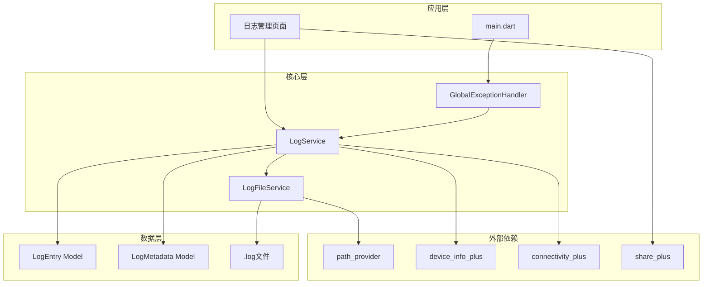
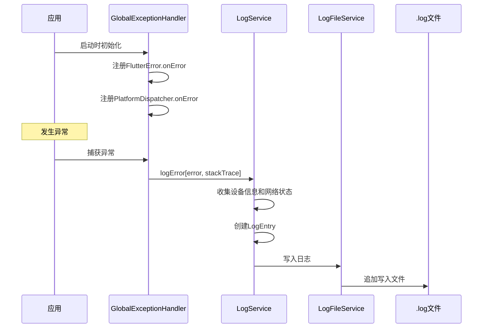

# 异常日志系统设计方案

## 1. 功能概述

实现一个完整的异常日志记录系统，当程序出现异常时，将错误信息写入.log文件存储在手机上，并提供功能完善的日志管理页面。

### 核心功能
- 全局异常捕获（Flutter错误、Dart错误、异步错误）
- 日志持久化存储到本地文件
- 记录完整设备信息、网络状态、应用版本等元数据
- 日志管理页面（查看、搜索、筛选、导出、分享、清理）

## 2. 系统架构



## 3. 文件结构

```
lib/
├── core/
│   └── logging/
│       ├── log_service.dart              # 日志服务核心类
│       ├── log_file_service.dart         # 日志文件管理
│       ├── global_exception_handler.dart # 全局异常捕获
│       └── models/
│           ├── log_entry.dart            # 日志条目模型
│           └── log_metadata.dart         # 日志元数据模型
├── features/
│   └── logs/
│       ├── logs_provider.dart            # 日志状态管理
│       └── view/
│           ├── logs_page.dart            # 日志管理页面
#           └── log_detail_page.dart      # 日志详情页面
```

## 4. 依赖包

需要在 `pubspec.yaml` 中添加以下依赖：

```yaml
dependencies:
  # 文件路径获取
  path_provider: ^2.1.1
  # 设备信息
  device_info_plus: ^9.1.0
  # 网络状态
  connectivity_plus: ^5.0.2
  # 分享功能
  share_plus: ^7.2.1
  # 国际化日期格式
  intl: ^0.19.0
```

## 5. 核心类设计

### 5.1 LogEntry - 日志条目模型

```dart
class LogEntry {
  final String id;              // 唯一标识
  final DateTime timestamp;     // 时间戳
  final String level;           // 日志级别: error, warning, info
  final String message;         // 错误消息
  final String? stackTrace;     // 堆栈跟踪
  final String? errorType;      // 错误类型
  final LogMetadata metadata;   // 元数据
}
```

### 5.2 LogMetadata - 日志元数据模型

```dart
class LogMetadata {
  final String appVersion;      // 应用版本
  final String buildNumber;     // 构建号
  final String deviceModel;     // 设备型号
  final String osVersion;       // 系统版本
  final String platform;        // 平台: Android/iOS
  final String? networkType;    // 网络类型: WiFi/Cellular/None
  final String? batteryLevel;   // 电池电量
  final bool? isJailbroken;     // 是否越狱/Root
}
```

### 5.3 LogService - 日志服务核心类

```dart
abstract class LogService {
  Future<void> initialize();
  Future<void> logError(dynamic error, StackTrace? stackTrace);
  Future<void> logWarning(String message);
  Future<void> logInfo(String message);
  Future<List<LogEntry>> getLogs({LogFilter? filter});
  Future<void> clearLogs({DateTime? before});
  Future<File?> exportLogs();
  Future<String> getLogsDirectory();
}
```

### 5.4 GlobalExceptionHandler - 全局异常处理器

```dart
class GlobalExceptionHandler {
  final LogService _logService;
  
  void setup();
  void handleFlutterError(FlutterErrorDetails details);
  void handlePlatformError(Object error, StackTrace stackTrace);
}
```

## 6. 日志文件格式

日志文件采用JSON Lines格式，每行一个JSON对象，便于流式读取和解析：

```json
{"id":"uuid-1","timestamp":"2024-01-15T10:30:00Z","level":"error","message":"Null check operator used on a null value","stackTrace":"#0 main...","errorType":"NullCheckException","metadata":{...}}
{"id":"uuid-2","timestamp":"2024-01-15T11:00:00Z","level":"warning","message":"Network connection timeout",...}
```

### 文件命名规则
- 文件名格式：`error_log_YYYYMMDD.log`
- 每天一个文件，便于按日期筛选和管理

## 7. 异常捕获流程



## 8. 日志管理页面功能

### 8.1 主页面功能
- 日志列表展示（按时间倒序）
- 按日志级别筛选（Error/Warning/Info）
- 按日期范围筛选
- 关键词搜索
- 下拉刷新
- 分页加载

### 8.2 日志详情页面
- 完整错误信息展示
- 堆栈跟踪格式化显示
- 设备信息卡片
- 复制到剪贴板
- 分享日志文件

### 8.3 管理功能
- 批量删除
- 按日期范围清理
- 导出所有日志
- 清空所有日志

## 9. UI设计参考

```
┌─────────────────────────────────────┐
│ ← 错误日志                    🗑️ 📤 │
├─────────────────────────────────────┤
│ 🔍 搜索...              [级别 ▼]    │
├─────────────────────────────────────┤
│ ┌─────────────────────────────────┐ │
│ │ 🔴 NullCheckException           │ │
│ │ 2024-01-15 10:30:00             │ │
│ │ Null check operator used on... │ │
│ └─────────────────────────────────┘ │
│ ┌─────────────────────────────────┐ │
│ │ 🟡 NetworkException             │ │
│ │ 2024-01-15 09:15:00             │ │
│ │ Connection timeout after 30s   │ │
│ └─────────────────────────────────┘ │
│ ┌─────────────────────────────────┐ │
│ │ 🔴 ServerException              │ │
│ │ 2024-01-14 18:45:00             │ │
│ │ HTTP 500 Internal Server Error │ │
│ └─────────────────────────────────┘ │
└─────────────────────────────────────┘
```

## 10. 实现步骤

### 第一阶段：基础设施
1. 添加依赖包
2. 创建日志模型类
3. 实现LogFileService
4. 实现LogService

### 第二阶段：异常捕获
5. 实现GlobalExceptionHandler
6. 在main.dart中集成初始化
7. 注册依赖注入

### 第三阶段：UI界面
8. 创建LogsProvider
9. 实现日志列表页面
10. 实现日志详情页面
11. 添加路由配置

### 第四阶段：完善功能
12. 实现搜索和筛选
13. 实现导出和分享
14. 实现清理功能
15. 编写使用文档

## 11. 注意事项

1. **性能考虑**
   - 日志写入使用异步操作，避免阻塞UI
   - 大量日志时采用分页加载
   - 文件读取使用流式处理

2. **隐私安全**
   - 日志中不记录敏感信息（密码、token等）
   - 导出前提醒用户注意隐私

3. **存储空间**
   - 提供日志大小统计
   - 建议用户定期清理

4. **兼容性**
   - 支持Android和iOS
   - 处理权限问题

## 12. 后续扩展

- [ ] 日志上传到服务器
- [ ] 崩溃次数统计
- [ ] 自动上报严重错误
- [ ] 日志加密存储
