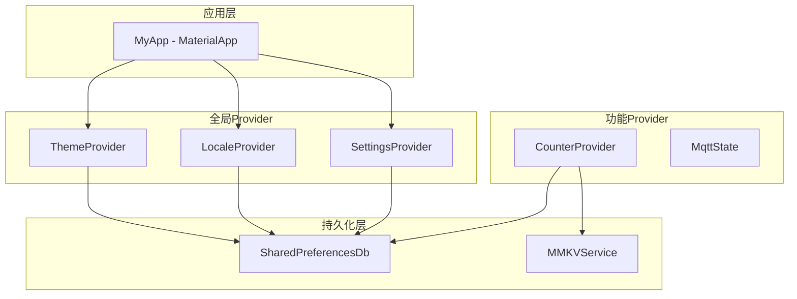

# Provider 示例扩展计划

## 项目概述

为 `provider_mode` 项目添加更多Provider状态管理示例，包括主题切换、多语言支持和应用设置功能，帮助学习和理解Provider的各种使用场景。

## 架构设计



## 功能模块详细设计

### 1. 主题切换功能 - ThemeProvider

**目标**: 实现亮色/暗色/系统跟随三种主题模式切换

**文件结构**:
```
lib/features/theme/
├── theme_provider.dart        # 主题状态管理
├── models/
│   └── app_theme.dart         # 主题枚举和模型
└── view/
    └── theme_page.dart        # 主题设置页面
```

**核心实现**:

```dart
// theme_provider.dart
class ThemeProvider with ChangeNotifier {
  final KeyValueDb _db;
  AppTheme _currentTheme = AppTheme.system;
  
  ThemeMode get themeMode => _currentTheme.toThemeMode();
  
  ThemeProvider(this._db) {
    _loadTheme();
  }
  
  void _loadTheme() {
    final themeIndex = _db.get('app_theme', 0);
    _currentTheme = AppTheme.values[themeIndex];
  }
  
  void setTheme(AppTheme theme) {
    _currentTheme = theme;
    _db.put('app_theme', theme.index);
    notifyListeners();
  }
}

// app_theme.dart
enum AppTheme { light, dark, system }

extension AppThemeExtension on AppTheme {
  ThemeMode toThemeMode() {
    switch (this) {
      case AppTheme.light: return ThemeMode.light;
      case AppTheme.dark: return ThemeMode.dark;
      case AppTheme.system: return ThemeMode.system;
    }
  }
}
```

**学习要点**:
- Provider与MaterialApp.themeMode的集成
- 枚举类型的状态管理
- 持久化存储的应用

---

### 2. 多语言支持 - LocaleProvider

**目标**: 实现中文/英文语言切换，支持系统语言跟随

**文件结构**:
```
lib/features/locale/
├── locale_provider.dart       # 语言状态管理
├── models/
│   └── app_locale.dart        # 语言枚举和模型
└── view/
    └── locale_page.dart       # 语言设置页面
    
lib/l10n/
├── app_localizations.dart     # 本地化代理
├── app_localizations_zh.dart  # 中文翻译
└── app_localizations_en.dart  # 英文翻译
```

**核心实现**:

```dart
// locale_provider.dart
class LocaleProvider with ChangeNotifier {
  final KeyValueDb _db;
  AppLocale _currentLocale = AppLocale.system;
  
  Locale? get locale => _currentLocale.toLocale();
  
  LocaleProvider(this._db) {
    _loadLocale();
  }
  
  void _loadLocale() {
    final localeIndex = _db.get('app_locale', 0);
    _currentLocale = AppLocale.values[localeIndex];
  }
  
  void setLocale(AppLocale locale) {
    _currentLocale = locale;
    _db.put('app_locale', locale.index);
    notifyListeners();
  }
}

// app_locale.dart
enum AppLocale { zh, en, system }

extension AppLocaleExtension on AppLocale {
  Locale? toLocale() {
    switch (this) {
      case AppLocale.zh: return const Locale('zh', 'CN');
      case AppLocale.en: return const Locale('en', 'US');
      case AppLocale.system: return null;
    }
  }
}
```

**学习要点**:
- Provider与MaterialApp.locale的集成
- Flutter国际化机制
- LocalizationsDelegate的使用

---

### 3. 应用设置功能 - SettingsProvider

**目标**: 实现通用应用设置管理，如通知开关、缓存清理等

**文件结构**:
```
lib/features/settings/
├── settings_provider.dart     # 设置状态管理
├── models/
│   └── app_settings.dart      # 设置数据模型
└── view/
    └── settings_page.dart     # 设置页面
```

**核心实现**:

```dart
// app_settings.dart
class AppSettings {
  final bool notificationsEnabled;
  final bool soundEnabled;
  final bool vibrationEnabled;
  final int cacheSizeMB;
  
  const AppSettings({
    this.notificationsEnabled = true,
    this.soundEnabled = true,
    this.vibrationEnabled = false,
    this.cacheSizeMB = 0,
  });
  
  AppSettings copyWith({...});
}

// settings_provider.dart
class SettingsProvider with ChangeNotifier {
  final KeyValueDb _db;
  AppSettings _settings = const AppSettings();
  
  AppSettings get settings => _settings;
  
  SettingsProvider(this._db) {
    _loadSettings();
  }
  
  void _loadSettings() {
    _settings = AppSettings(
      notificationsEnabled: _db.get('notifications', true),
      soundEnabled: _db.get('sound', true),
      vibrationEnabled: _db.get('vibration', false),
    );
  }
  
  void toggleNotifications() {
    _settings = _settings.copyWith(
      notificationsEnabled: !_settings.notificationsEnabled,
    );
    _db.put('notifications', _settings.notificationsEnabled);
    notifyListeners();
  }
  
  Future<void> clearCache() async {
    // 清理缓存逻辑
    notifyListeners();
  }
}
```

**学习要点**:
- 复杂对象的状态管理
- 多个相关状态的组织
- 异步操作与状态更新

---

## 路由配置更新

```dart
// app_router.dart
static final GoRouter _router = GoRouter(
  routes: <RouteBase>[
    GoRoute(path: '/', pageBuilder: ...),
    GoRoute(path: 'providerCounter', pageBuilder: ...),
    GoRoute(path: 'theme', pageBuilder: ...),      // 新增
    GoRoute(path: 'locale', pageBuilder: ...),     // 新增
    GoRoute(path: 'settings', pageBuilder: ...),   // 新增
  ],
);
```

## 依赖注入更新

```dart
// injector.dart
Future<void> initDependencies() async {
  // 现有注册...
  
  // 新增Provider注册
  injector.registerFactory(() => ThemeProvider(injector<SharedPreferencesDb>()));
  injector.registerFactory(() => LocaleProvider(injector<SharedPreferencesDb>()));
  injector.registerFactory(() => SettingsProvider(injector<SharedPreferencesDb>()));
}
```

## 首页更新设计

```dart
// app.dart
class AppPage extends StatelessWidget {
  @override
  Widget build(BuildContext context) {
    return Scaffold(
      appBar: AppBar(title: const Text('Provider状态管理学习')),
      body: ListView(
        children: [
          _buildMenuItem(context, 'Provider计数器', '/providerCounter'),
          _buildMenuItem(context, '主题切换', '/theme'),
          _buildMenuItem(context, '多语言设置', '/locale'),
          _buildMenuItem(context, '应用设置', '/settings'),
        ],
      ),
    );
  }
}
```

## 实施顺序

1. **第一阶段：基础设施准备**
   - 创建feature目录结构
   - 更新依赖注入配置

2. **第二阶段：主题切换功能**
   - 实现AppTheme模型
   - 实现ThemeProvider
   - 创建主题设置页面
   - 集成到MaterialApp

3. **第三阶段：多语言支持**
   - 创建本地化文件
   - 实现LocaleProvider
   - 创建语言设置页面
   - 集成到MaterialApp

4. **第四阶段：应用设置功能**
   - 实现AppSettings模型
   - 实现SettingsProvider
   - 创建设置页面

5. **第五阶段：整合与完善**
   - 更新路由配置
   - 更新首页入口
   - 完善README文档

## 预期成果

完成后项目将展示以下Provider使用场景：

| 功能 | Provider类型 | 学习要点 |
|------|-------------|---------|
| 计数器 | ChangeNotifier | 基础状态管理 |
| MQTT状态 | ChangeNotifier | 全局单例状态 |
| 主题切换 | ChangeNotifier | 与MaterialApp集成 |
| 多语言 | ChangeNotifier | 国际化支持 |
| 应用设置 | ChangeNotifier | 复杂对象管理 |

## 文件清单

### 新增文件
- `lib/features/theme/theme_provider.dart`
- `lib/features/theme/models/app_theme.dart`
- `lib/features/theme/view/theme_page.dart`
- `lib/features/locale/locale_provider.dart`
- `lib/features/locale/models/app_locale.dart`
- `lib/features/locale/view/locale_page.dart`
- `lib/features/settings/settings_provider.dart`
- `lib/features/settings/models/app_settings.dart`
- `lib/features/settings/view/settings_page.dart`
- `lib/l10n/app_localizations.dart`
- `lib/l10n/app_localizations_zh.dart`
- `lib/l10n/app_localizations_en.dart`

### 修改文件
- `lib/main.dart` - 添加全局Provider
- `lib/app.dart` - 更新首页UI
- `lib/di/injector.dart` - 添加新Provider注册
- `lib/core/router/app_router.dart` - 添加新路由
- `README.md` - 更新项目文档
