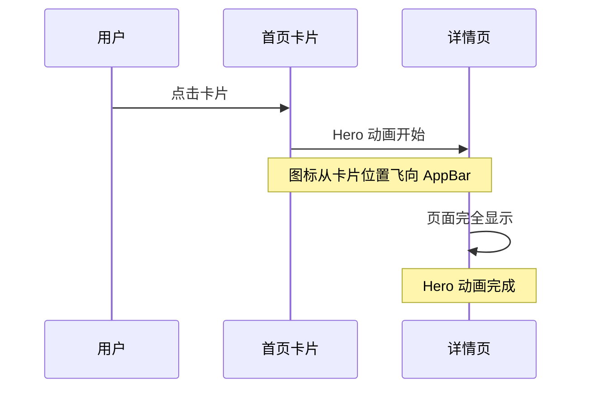

# App.dart 首页优化计划

> **状态**: 已确认，待实施
> **确认内容**: 需要 Timer 页面 + Hero 动画效果 + 三个功能卡片

## 一、现状分析

### 当前问题
- 页面仅包含两个简单的 `ElevatedButton`，缺乏视觉吸引力
- 没有功能描述，用户难以理解各功能的作用
- 缺少主题切换入口
- 没有动画效果，用户体验平淡

### 现有功能模块
| 模块 | 路由 | 说明 |
|------|------|------|
| Counter | `/riverpodCounter` | Riverpod 计数器示例 |
| Setting | `/riverpodSetting` | Riverpod 设置页面 |
| Timer | `/riverpodTimer` (待添加) | 倒计时器功能 |

## 二、优化目标

实现一个现代化的功能展示首页，包含：
1. **卡片式布局** - 使用 GridView 展示功能模块
2. **图标 + 标题 + 描述** - 每个卡片包含完整信息
3. **主题切换入口** - 在 AppBar 添加主题切换按钮
4. **Hero 动画** - 卡片图标到详情页的共享元素过渡动画
5. **入场动画** - 卡片交错淡入效果

## 三、技术架构

### 3.1 数据模型设计

```dart
/// 功能模块数据模型
class FeatureItem {
  final String title;           // 功能标题
  final String description;     // 功能描述
  final IconData icon;          // 图标
  final String route;           // 路由路径
  final Color? color;           // 主题色（可选）
}
```

### 3.2 页面结构设计

```
AppPage
├── AppBar
│   ├── title: 应用标题
│   ├── actions: 主题切换按钮
│   └── backgroundColor: 主题色
├── Body: GridView.builder
│   └── FeatureCard (功能卡片)
│       ├── Icon (图标)
│       ├── Title (标题)
│       └── Description (描述)
└── FloatingActionButton (可选: 快速操作)
```

### 3.3 动画方案

#### 入场动画
采用 `AnimatedOpacity` + `Transform.translate` 实现卡片入场动画：
- 页面加载时卡片从下方淡入滑出
- 交错动画延迟，形成波浪效果
- 点击卡片时有缩放反馈

#### Hero 动画
使用 Flutter 的 `Hero` widget 实现共享元素过渡：
- 卡片图标作为 Hero 的 tag
- 导航到详情页时，图标平滑过渡到目标位置
- 每个 FeatureItem 需要唯一的 heroTag

```dart
// 卡片中的 Hero
Hero(
  tag: 'hero_${feature.route}',
  child: Icon(feature.icon, size: 48),
)

// 详情页 AppBar 中的 Hero
Hero(
  tag: 'hero_${feature.route}',
  child: Icon(feature.icon, size: 32),
)
```

## 四、详细实现计划

### Step 1: 创建功能模块数据模型

**文件**: `lib/app.dart` 内部定义或新建 `lib/features/home/models/feature_item.dart`

```dart
class FeatureItem {
  final String title;
  final String description;
  final IconData icon;
  final String route;
  final Color? color;

  const FeatureItem({
    required this.title,
    required this.description,
    required this.icon,
    required this.route,
    this.color,
  });
}
```

### Step 2: 定义功能模块列表

```dart
const List<FeatureItem> _features = [
  FeatureItem(
    title: '计数器',
    description: 'Riverpod 状态管理示例，展示计数器的增减操作',
    icon: Icons.add_circle_outline,
    route: '/riverpodCounter',
    color: Colors.blue,
  ),
  FeatureItem(
    title: '设置',
    description: '应用设置页面，包含地址配置等选项',
    icon: Icons.settings_outlined,
    route: '/riverpodSetting',
    color: Colors.orange,
  ),
  FeatureItem(
    title: '计时器',
    description: '倒计时功能示例，展示 Stream 状态管理',
    icon: Icons.timer_outlined,
    route: '/riverpodTimer', // 需要添加路由
    color: Colors.green,
  ),
];
```

### Step 3: 实现卡片组件

```dart
class FeatureCard extends StatefulWidget {
  final FeatureItem feature;
  final int index;

  const FeatureCard({
    super.key,
    required this.feature,
    required this.index,
  });

  @override
  State<FeatureCard> createState() => _FeatureCardState();
}

class _FeatureCardState extends State<FeatureCard>
    with SingleTickerProviderStateMixin {
  bool _visible = false;

  @override
  void initState() {
    super.initState();
    // 交错动画延迟
    Future.delayed(Duration(milliseconds: widget.index * 100), () {
      if (mounted) setState(() => _visible = true);
    });
  }

  @override
  Widget build(BuildContext context) {
    return AnimatedOpacity(
      opacity: _visible ? 1.0 : 0.0,
      duration: const Duration(milliseconds: 300),
      child: Transform.translate(
        offset: _visible ? Offset.zero : const Offset(0, 20),
        child: Card(
          child: InkWell(
            onTap: () => context.go(widget.feature.route),
            child: Padding(
              padding: const EdgeInsets.all(16),
              child: Column(
                mainAxisAlignment: MainAxisAlignment.center,
                children: [
                  Icon(widget.feature.icon, size: 48),
                  const SizedBox(height: 12),
                  Text(
                    widget.feature.title,
                    style: Theme.of(context).textTheme.titleMedium,
                  ),
                  const SizedBox(height: 8),
                  Text(
                    widget.feature.description,
                    style: Theme.of(context).textTheme.bodySmall,
                    textAlign: TextAlign.center,
                    maxLines: 2,
                    overflow: TextOverflow.ellipsis,
                  ),
                ],
              ),
            ),
          ),
        ),
      ),
    );
  }
}
```

### Step 4: 添加主题切换功能

在 AppBar 的 actions 中添加主题切换按钮：

```dart
AppBar(
  title: Text(S.of(context).mainTitle),
  actions: [
    IconButton(
      icon: Icon(
        ref.watch(switchThemeModeProvider) == ThemeMode.dark
            ? Icons.light_mode
            : Icons.dark_mode,
      ),
      onPressed: () {
        final currentMode = ref.read(switchThemeModeProvider);
        ref.read(switchThemeModeProvider.notifier).state =
            currentMode == ThemeMode.dark
                ? ThemeMode.light
                : ThemeMode.dark;
      },
    ),
  ],
)
```

### Step 5: 更新路由配置

在 `lib/route/app_router.dart` 中添加 Timer 页面路由：

```dart
GoRoute(
  path: 'riverpodTimer',
  pageBuilder: (context, state) => CustomTransitionPage(
    child: const TimerPage(), // 需要创建 TimerPage
    transitionsBuilder: // ... 同其他路由
  ),
),
```

## 五、文件变更清单

| 文件 | 操作 | 说明 |
|------|------|------|
| `lib/app.dart` | 重写 | 实现新的卡片布局首页 + Hero 动画 |
| `lib/route/app_router.dart` | 修改 | 添加 Timer 路由 |
| `lib/features/timer/presentation/pages/timer_page.dart` | 新建 | Timer 页面展示 |
| `lib/features/counter/presentation/pages/counter_page.dart` | 修改 | 添加 Hero 接收 |
| `lib/features/setting/view/setting_view.dart` | 修改 | 添加 Hero 接收 |

## 六、Timer 页面设计

### TimerPage 实现方案

```dart
// lib/features/timer/presentation/pages/timer_page.dart
import 'package:flutter/material.dart';
import 'package:flutter_riverpod/flutter_riverpod.dart';
import '../../state/timer_controller.dart';

class TimerPage extends ConsumerWidget {
  const TimerPage({super.key});

  @override
  Widget build(BuildContext context, WidgetRef ref) {
    final timerState = ref.watch(timerControllerProvider);
    
    return Scaffold(
      appBar: AppBar(
        title: const Text('计时器'),
        // Hero 接收点
        leading: Hero(
          tag: 'hero_/riverpodTimer',
          child: const Icon(Icons.timer_outlined),
        ),
      ),
      body: Center(
        child: timerState.when(
          data: (state) => _buildTimerContent(context, ref, state),
          loading: () => const CircularProgressIndicator(),
          error: (err, stack) => Text('Error: $err'),
        ),
      ),
    );
  }

  Widget _buildTimerContent(BuildContext context, WidgetRef ref, state) {
    // 根据 state 类型显示不同 UI
    // TimeStateInitial / TimerRunInProgress / TimerRunPause / TimerRunComplete
    return Column(
      mainAxisAlignment: MainAxisAlignment.center,
      children: [
        // 显示倒计时数字
        // 开始/暂停/重置按钮
      ],
    );
  }
}
```

## 七、Hero 动画集成

### 首页卡片 Hero标签

```dart
// 在 FeatureCard 中
Hero(
  tag: 'hero_${feature.route}',
  child: Icon(feature.icon, size: 48),
)
```

### 各详情页 Hero 接收

**CounterPage:**
```dart
AppBar(
  leading: Hero(
    tag: 'hero_/riverpodCounter',
    child: const Icon(Icons.add_circle_outline),
  ),
  title: const Text('Counter example'),
)
```

**SettingView:**
```dart
AppBar(
  leading: Hero(
    tag: 'hero_/riverpodSetting',
    child: const Icon(Icons.settings_outlined),
  ),
  title: const Text('Setting example'),
)
```

**TimerPage:**
```dart
AppBar(
  leading: Hero(
    tag: 'hero_/riverpodTimer',
    child: const Icon(Icons.timer_outlined),
  ),
  title: const Text('Timer example'),
)
```

## 八、效果预览

```
┌─────────────────────────────────────┐
│≡Riverpod Mode            ☀️/🌙    │
├─────────────────────────────────────┤
│┌─────────────┐ ┌─────────────┐     │
││    ➕       │ │    ⚙️       │     │
││   计数器    │ │    设置     │     │
││ Riverpod   │ │  应用设置   │     │
││ 状态管理   │ │  地址配置   │     │
│└─────────────┘ └─────────────┘     │
│┌─────────────┐                     │
││    ⏱️       │                     │
││   计时器    │                     │
││  Stream    │                     │
││  状态管理  │                     │
│└─────────────┘                     │
└─────────────────────────────────────┘
```

### Hero 动画流程



## 九、实施确认

| 项目 | 状态 |
|------|------|
| Timer 页面 | ✅ 需要创建 |
| 功能卡片数量 | ✅ 三个：Counter、Setting、Timer |
| Hero 动画 | ✅ 需要 |
| 入场动画 | ✅ 交错淡入效果 |
| 主题切换 | ✅ AppBar 右侧按钮 |

---

*计划创建时间: 2026-03-22*
*最后更新: 2026-03-22 - 用户已确认*
