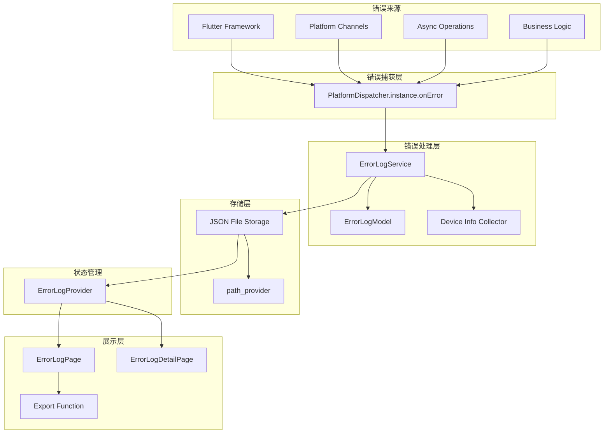
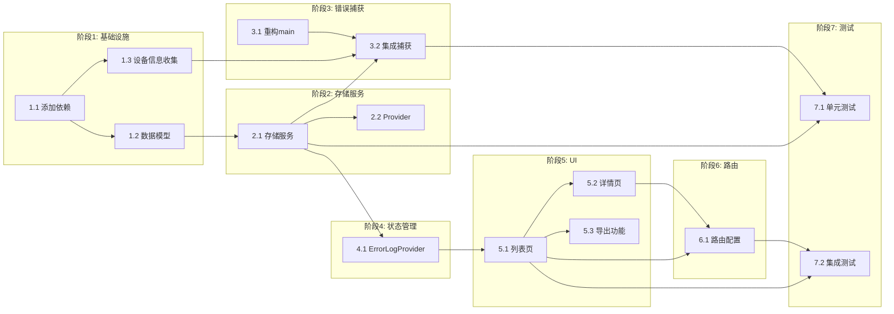

# 错误日志功能实施计划

## 一、背景分析

### 1.1 当前项目状态
- **错误处理现状**：项目使用已废弃的 `runZonedGuarded` 方案捕获异常（见 [`main.dart`](../lib/main.dart:7)）
- **存储基础设施**：已集成 `path_provider: ^2.1.5` 用于文件存储
- **日志工具**：已集成 `logger: ^2.5.0`
- **数据模型**：使用 `freezed 3.2.3` + `json_annotation 4.9.0` 构建不可变模型
- **状态管理**：使用 `flutter_riverpod 3.0.3`

### 1.2 需求确认
| 需求项 | 确认结果 |
|--------|----------|
| 存储格式 | JSON |
| 清理策略 | 无自动清理，手动管理 |
| 导出方式 | 分享到其他应用 + 保存为文件 |
| 显示内容 | 完整错误详情（时间戳、错误类型、堆栈跟踪、设备信息） |

---

## 二、技术约束

### 2.1 Flutter 版本要求
- Flutter SDK: `^3.8.0`
- Dart SDK: `^3.8.0`

### 2.2 错误捕获机制
**必须使用 `PlatformDispatcher.instance.onError`** 替代已废弃的 `runZonedGuarded`，覆盖以下场景：
- Isolate 错误
- Timer 错误
- Future/Stream 异步错误
- async/await 异常

### 2.3 错误分类标签
```dart
enum ErrorCategory {
  flutter,        // Flutter 框架错误
  platform,       // 平台通道错误
  network,        // 网络请求错误
  storage,        // 本地存储错误
  business,       // 业务逻辑错误
  uncaught,       // 未捕获异常
}
```

### 2.4 验收指标
| 指标 | 目标值 |
|------|--------|
| 异常捕获率 | ≥ 99.5% |
| 日志写入延迟 | ≤ 200ms |
| 单元测试覆盖率 | ≥ 80% 异常路径 |

---

## 三、架构设计

### 3.1 整体架构图



### 3.2 文件结构

```
lib/
├── core/
│   └── error_log/
│       ├── models/
│       │   ├── error_log_entry.dart        # 错误日志条目模型
│       │   └── error_log_entry.freezed.dart# freezed 生成文件
│       ├── services/
│       │   ├── error_log_storage_service.dart    # 存储服务
│       │   └── error_log_storage_service.g.dart  # JSON 序列化生成文件
│       ├── providers/
│       │   └── error_log_provider.dart     # Riverpod Provider
│       └── utils/
│           └── device_info_collector.dart  # 设备信息收集
├── features/
│   └── error_log/
│       └── pages/
│           ├── error_log_page.dart         # 日志列表页
│           └── error_log_detail_page.dart  # 日志详情页
└── bootstrap.dart                          # 修改：初始化错误捕获
```

### 3.3 数据模型设计

```dart
// error_log_entry.dart
@freezed
class ErrorLogEntry with _$ErrorLogEntry {
  const factory ErrorLogEntry({
    required String id,                    // UUID
    required DateTime timestamp,           // 发生时间
    required ErrorCategory category,       // 错误分类
    required String message,               // 错误消息
    required String stackTrace,            // 堆栈跟踪
    required DeviceInfo deviceInfo,        // 设备信息
    String? context,                       // 上下文信息
    Map<String, dynamic>? additionalData,  // 附加数据
  }) = _ErrorLogEntry;

  factory ErrorLogEntry.fromJson(Map<String, dynamic> json) =>
      _$ErrorLogEntryFromJson(json);
}

@freezed
class DeviceInfo with _$DeviceInfo {
  const factory DeviceInfo({
    required String platform,          // android/ios
    required String osVersion,         // 系统版本
    required String deviceModel,       // 设备型号
    required String appVersion,        // 应用版本
    required String buildNumber,       // 构建号
    String? deviceId,                  // 设备ID
  }) = _DeviceInfo;

  factory DeviceInfo.fromJson(Map<String, dynamic> json) =>
      _$DeviceInfoFromJson(json);
}
```

### 3.4 存储策略

**文件位置**：`{getApplicationDocumentsDirectory()}/error_logs/`

**文件命名**：`error_log_{timestamp}.json`（按天分文件）

**JSON 结构**：
```json
{
  "logs": [
    {
      "id": "uuid-v4",
      "timestamp": "2026-03-23T10:00:00.000Z",
      "category": "flutter",
      "message": "Null check operator used on a null value",
      "stackTrace": "#0 main...",
      "deviceInfo": {
        "platform": "android",
        "osVersion": "33",
        "deviceModel": "Pixel 7",
        "appVersion": "1.0.0",
        "buildNumber": "1"
      },
      "context": "HomePage.build",
      "additionalData": {}
    }
  ]
}
```

---

## 四、阶段任务

### 阶段 1：基础设施搭建
- [ ] **任务 1.1**：添加依赖包
  - `share_plus: ^10.0.0` - 分享功能
  - `package_info_plus: ^8.0.0` - 应用信息
  - `device_info_plus: ^10.0.0` - 设备信息
  - `uuid: ^4.0.0` - UUID 生成
  - 依赖项：无

- [ ] **任务 1.2**：创建数据模型
  - 创建 `ErrorLogEntry` 和 `DeviceInfo` freezed 模型
  - 运行 `build_runner` 生成代码
  - 依赖项：任务 1.1

- [ ] **任务 1.3**：实现设备信息收集器
  - 创建 `DeviceInfoCollector` 工具类
  - 收集平台、系统版本、设备型号、应用版本等信息
  - 依赖项：任务 1.1

### 阶段 2：存储服务实现
- [ ] **任务 2.1**：实现错误日志存储服务
  - 创建 `ErrorLogStorageService`
  - 实现 JSON 文件的读写操作
  - 实现日志条目的增删改查
  - 依赖项：任务 1.2

- [ ] **任务 2.2**：创建存储服务 Provider
  - 使用 Riverpod 提供存储服务实例
  - 依赖项：任务 2.1

### 阶段 3：错误捕获机制
- [ ] **任务 3.1**：重构 main.dart
  - 移除 `runZonedGuarded`
  - 实现 `PlatformDispatcher.instance.onError` 错误捕获
  - 依赖项：任务 2.1

- [ ] **任务 3.2**：集成错误捕获与存储
  - 在错误捕获回调中调用存储服务
  - 添加错误分类逻辑
  - 依赖项：任务 3.1，任务 2.1

### 阶段 4：状态管理与 Provider
- [ ] **任务 4.1**：创建 ErrorLogProvider
  - 使用 `AsyncNotifier` 管理日志列表状态
  - 提供日志加载、删除、清空等方法
  - 依赖项：任务 2.1

### 阶段 5：UI 实现
- [ ] **任务 5.1**：创建日志列表页面
  - 显示日志条目列表
  - 支持按分类筛选
  - 支持删除单条/清空全部
  - 依赖项：任务 4.1

- [ ] **任务 5.2**：创建日志详情页面
  - 显示完整错误信息
  - 显示设备信息
  - 支持复制堆栈跟踪
  - 依赖项：任务 5.1

- [ ] **任务 5.3**：实现导出功能
  - 分享到其他应用（使用 share_plus）
  - 保存为 JSON 文件
  - 依赖项：任务 5.1

### 阶段 6：路由与集成
- [ ] **任务 6.1**：添加路由配置
  - 在 `app_router.dart` 添加错误日志页面路由
  - 在设置页面或我的页面添加入口
  - 依赖项：任务 5.1，任务 5.2

### 阶段 7：测试
- [ ] **任务 7.1**：单元测试
  - 测试 `ErrorLogStorageService` 读写操作
  - 测试 `ErrorLogEntry` JSON 序列化/反序列化
  - 测试错误捕获逻辑
  - 依赖项：阶段 2-3 完成

- [ ] **任务 7.2**：集成测试
  - 测试完整的错误捕获到存储流程
  - 测试 UI 交互
  - 依赖项：阶段 5-6 完成

---

## 五、验收标准

### 5.1 功能验收
| 功能点 | 验收标准 |
|--------|----------|
| 错误捕获 | 所有未捕获异常均被记录，包括 Isolate、Timer、Future 等场景 |
| 日志存储 | 日志以 JSON 格式正确存储到本地文件 |
| 日志查看 | 列表页正确显示所有日志，详情页显示完整信息 |
| 日志导出 | 支持分享到其他应用，支持保存为文件 |
| 日志删除 | 支持删除单条日志和清空全部日志 |

### 5.2 质量验收
| 指标 | 标准 |
|------|------|
| 单元测试覆盖率 | ≥ 80% 异常路径 |
| 静态分析 | 无 warnings 和 errors |
| 代码规范 | 符合 Dart/Flutter 官方风格指南 |

---

## 六、风险与应对

| 风险 | 影响 | 应对措施 |
|------|------|----------|
| 文件存储权限问题 | 无法写入日志 | 使用 `path_provider` 获取应用专属目录，无需额外权限 |
| 日志文件过大 | 占用过多存储空间 | 提供手动清理功能，后续可扩展自动清理 |
| 敏感信息泄露 | 隐私问题 | 日志中脱敏处理敏感数据，导出时提示用户 |
| share_plus 兼容性 | 部分设备分享失败 | 提供备选方案：复制到剪贴板、保存文件 |

---

## 七、依赖关系图



---

## 八、设计决策确认

| 决策项 | 确认结果 |
|--------|----------|
| 入口位置 | "我的"页面 |
| Debug模式 | 自动在控制台打印错误日志 |
| 远程上报 | 预留远程错误上报接口（如 Sentry）扩展能力 |

### 8.1 远程上报扩展设计

为支持未来集成 Sentry 等错误监控服务，存储服务将采用策略模式：

```dart
abstract class ErrorReportStrategy {
  Future<void> report(ErrorLogEntry entry);
}

class LocalOnlyStrategy implements ErrorReportStrategy {
  // 仅本地存储
}

class SentryStrategy implements ErrorReportStrategy {
  // 预留 Sentry 上报实现
}
```

### 8.2 Debug 模式日志输出

在错误捕获时，根据 `kDebugMode` 判断是否输出到控制台：

```dart
if (kDebugMode) {
  developer.log(
    error.toString(),
    stackTrace: stackTrace,
    time: DateTime.now(),
    level: 1000, // ERROR level
    name: 'ErrorLog',
  );
}
```

---

**计划状态**：待批准
**创建时间**：2026-03-23
**最后更新**：2026-03-23
