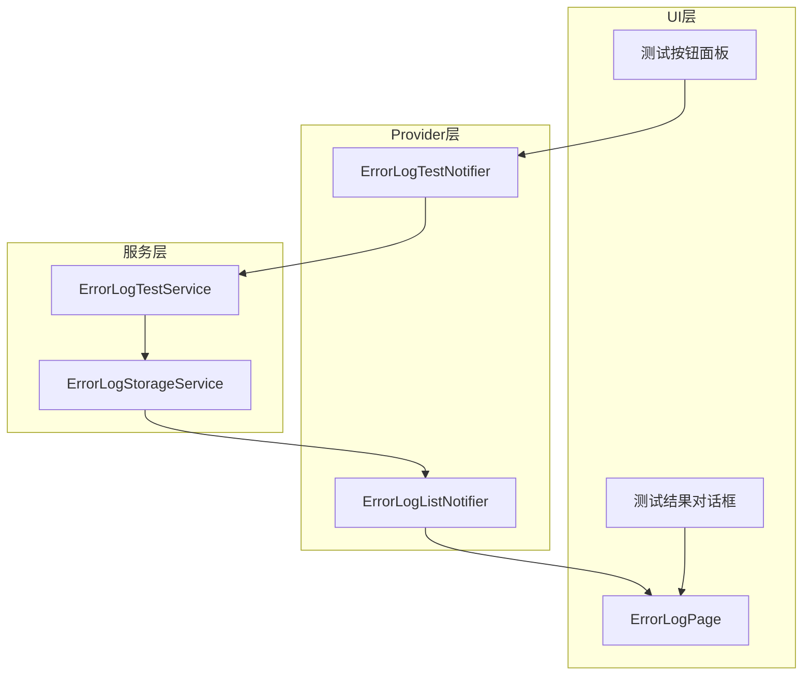

# 错误日志测试功能实施计划

## 背景分析

### 现有系统架构

错误日志系统已具备以下核心组件：

| 组件 | 路径 | 职责 |
|------|------|------|
| [`ErrorLogEntry`](lib/core/error_log/models/error_log_entry.dart) | 数据模型 | 定义错误日志条目结构，包含 6 种错误分类 |
| [`ErrorLogStorageService`](lib/core/error_log/services/error_log_storage_service.dart) | 存储服务 | 负责日志的持久化存储、导出、清理 |
| [`ErrorLogListNotifier`](lib/core/error_log/providers/error_log_provider.dart) | 状态管理 | 管理日志列表状态，提供 CRUD 操作 |
| [`ErrorLogPage`](lib/features/error_log/pages/error_log_page.dart) | UI 页面 | 展示日志列表、统计信息、搜索筛选 |

### 错误分类枚举

```dart
enum ErrorCategory {
  flutter,    // Flutter 框架错误
  platform,   // 平台通道错误
  network,    // 网络请求错误
  storage,    // 本地存储错误
  business,   // 业务逻辑错误
  uncaught,   // 未捕获异常
}
```

### 需求分析

用户需要在错误日志页面添加测试功能，用于验证：

1. **错误捕获机制** - 验证 `PlatformDispatcher.instance.onError` 是否正常工作
2. **日志存储功能** - 验证日志是否能正确持久化到本地文件
3. **日志展示功能** - 验证 UI 是否能正确显示日志列表和详情
4. **各类型错误处理** - 验证不同分类的错误是否都能被正确记录

---

## 技术方案

### 架构设计



### 测试功能设计

#### 1. 测试类型

| 测试项 | 触发方式 | 预期结果 | 验证点 |
|--------|----------|----------|--------|
| 同步异常测试 | `throw Exception` | 捕获并记录 | 同步错误捕获 |
| 异步异常测试 | `Future.throw` | 捕获并记录 | 异步错误捕获 |
| Flutter 错误测试 | `FlutterError` | 捕获并记录 | Flutter 框架错误 |
| 手动记录测试 | `logError()` | 直接存储 | 存储服务功能 |
| 各分类测试 | 按分类记录 | 分类正确 | 分类标签功能 |

#### 2. UI 设计

在[`ErrorLogPage`](lib/features/error_log/pages/error_log_page.dart) 的统计卡片下方添加测试面板：

```
┌─────────────────────────────────────────┐
│ 📊 日志统计                              │
│ 共 0 条| Flutter: 0 | 平台: 0 | ...      │
└─────────────────────────────────────────┘

┌─────────────────────────────────────────┐
│ 🧪 功能测试                    [展开/收起] │
├─────────────────────────────────────────┤
│ [测试同步异常] [测试异步异常]              │
│ [测试Flutter错误] [测试手动记录]          │
│                                         │
│ 分类测试:                                │
│ [Flutter] [平台] [网络] [存储] [业务]     │
│                                         │
│ [一键全量测试]                           │
└─────────────────────────────────────────┘
```

---

## 阶段任务

### 阶段一：创建测试服务层

#### 任务 1.1：创建 ErrorLogTestService

**文件路径**: `lib/core/error_log/services/error_log_test_service.dart`

**职责**:
- 提供各类测试错误的生成方法
- 封装测试逻辑，返回测试结果

**核心方法**:

```dart
class ErrorLogTestService {
  /// 测试同步异常
  Future<TestResult> testSyncException();
  
  /// 测试异步异常
  Future<TestResult> testAsyncException();
  
  /// 测试 Flutter 错误
  Future<TestResult> testFlutterError();
  
  /// 测试手动记录
  Future<TestResult> testManualLog(ErrorCategory category);
  
  /// 执行全量测试
  Future<List<TestResult>> runAllTests();
}

class TestResult {
  final String testName;
  final bool success;
  final String? errorMessage;
  final String? logId; // 成功时返回的日志ID
}
```

#### 任务 1.2：创建测试 Provider

**文件路径**: `lib/core/error_log/providers/error_log_test_provider.dart`

**职责**:
- 管理测试状态
- 提供测试方法给 UI 层调用

---

### 阶段二：UI 实现

#### 任务 2.1：创建测试面板组件

**文件路径**: `lib/features/error_log/widgets/error_log_test_panel.dart`

**组件结构**:
- 可展开/收起的面板
- 测试按钮网格
- 测试进度指示器
- 测试结果摘要

#### 任务 2.2：集成到 ErrorLogPage

**修改文件**: `lib/features/error_log/pages/error_log_page.dart`

**修改内容**:
- 在统计卡片下方添加测试面板
- 添加测试结果 Snackbar 反馈

---

### 阶段三：测试结果反馈

#### 任务 3.1：创建测试结果对话框

**文件路径**: `lib/features/error_log/widgets/test_result_dialog.dart`

**功能**:
- 显示各测试项的通过/失败状态
- 提供快速跳转到日志详情的功能
- 显示失败原因

---

## 验收标准

### 功能验收

- [ ] 点击测试按钮能正确触发对应类型的错误
- [ ] 错误被正确捕获并记录到日志系统
- [ ] 日志列表能实时刷新显示新记录的测试日志
- [ ] 测试日志的分类标签正确
- [ ] 测试结果有明确的成功/失败反馈
- [ ] 全量测试能一次性执行所有测试项

### 代码质量

- [ ] 遵循现有代码风格和架构模式
- [ ] 使用 Riverpod 3.x Notifier 模式
- [ ] 包含必要的错误处理
- [ ] 代码有适当的注释

### UI/UX

- [ ] 测试面板设计与应用整体风格一致
- [ ] 测试按钮有清晰的标签说明
- [ ] 测试过程有加载状态提示
- [ ] 测试结果有直观的视觉反馈

---

## 风险与应对

| 风险 | 影响 | 应对措施 |
|------|------|----------|
| 测试异常可能影响应用稳定性 | 中 | 仅在 Debug 模式下显示测试功能 |
| 异步异常捕获时机不确定 | 低 | 使用 `Future.delayed` 确保捕获完成 |
| 测试日志污染真实日志 | 低 | 提供一键清理测试日志功能 |

---

## 文件变更清单

| 操作 | 文件路径 | 说明 |
|------|----------|------|
| 新增 | `lib/core/error_log/services/error_log_test_service.dart` | 测试服务 |
| 新增 | `lib/core/error_log/providers/error_log_test_provider.dart` | 测试 Provider |
| 新增 | `lib/features/error_log/widgets/error_log_test_panel.dart` | 测试面板组件 |
| 新增 | `lib/features/error_log/widgets/test_result_dialog.dart` | 结果对话框 |
| 修改 | `lib/features/error_log/pages/error_log_page.dart` | 集成测试面板 |
