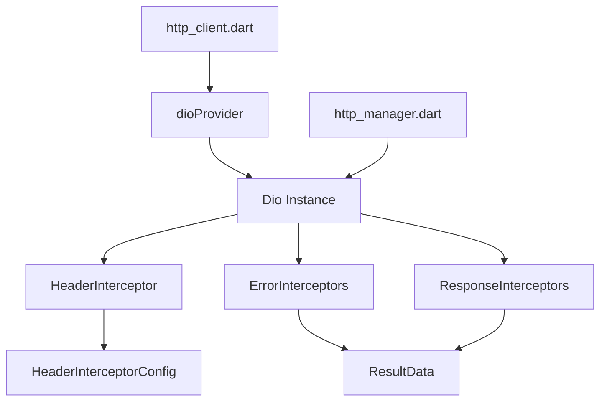

# 网络模块重构计划

## 📋 概述

对 `lib/common/net/` 目录下的网络请求相关文件进行全面重构，解决类型安全、职责分离、代码重复等问题。

## 🎯 改进目标

1. **类型安全** - 使用 freezed 增强 ResultData
2. **职责分离** - 移除拦截器中的 UI 耦合
3. **代码质量** - 修复空分支、未使用参数等问题
4. **可配置性** - 超时时间等配置可定制
5. **命名一致性** - 统一拦截器命名规范

## ✅ 用户确认

- [x] `ResultData.result` → `ResultData.success`（语义更清晰）
- [x] 保留 `http_client.dart` 和 `http_manager.dart` 两个文件
- [x] 移除拦截器中的 Toast 显示

---

## 📁 文件改进详情

### 1. `result_data.dart` - 使用 freezed 重构

**当前问题：**
- 缺少 `copyWith`、`==`、`hashCode` 等方法
- 字段命名不够清晰（`result` 应为 `success`）

**改进方案：**
```dart
import 'package:freezed_annotation/freezed_annotation.dart';

part 'result_data.freezed.dart';

@freezed
class ResultData with _$ResultData {
  const factory ResultData({
    required dynamic data,
    required bool success,// result -> success
    int? code,
    dynamic headers,
    String? message,// 新增：错误消息
  }) = _ResultData;
}
```

**改进点：**
- ✅ 使用 freezed 生成不可变类
- ✅ `result` 重命名为 `success` 更清晰
- ✅ 新增 `message` 字段存储错误信息
- ✅ 自动生成 `copyWith`、`==`、`hashCode`、`toString`

---

### 2. `error_interceptors.dart` - 移除 UI 耦合

**当前问题：**
- 在拦截器中直接显示 Toast，违反单一职责原则
- 依赖 `flutter_screenutil` 和 `fluttertoast`
- 错误处理不够完善

**改进方案：**
```dart
import 'dart:io';

import 'package:connectivity_plus/connectivity_plus.dart';
import 'package:dio/dio.dart';

import '../result_data.dart';

class ErrorInterceptors extends InterceptorsWrapper {
  @override
  void onRequest(
    RequestOptions options,
    RequestInterceptorHandler handler,
  ) async {
    // 检查网络连接
    var connectivityResult = await (Connectivity().checkConnectivity());

    if (connectivityResult.contains(ConnectivityResult.none)) {
      return handler.reject(
        DioException(
          type: DioExceptionType.unknown,
          requestOptions: options,
          response: Response(
            requestOptions: options,
            statusCode: -1,
            data: const ResultData(
              data: null,
              success: false,
              code: -1,
              message: '网络错误',
            ),
          ),
          message: '网络错误未连接网络',
        ),
      );
    }
    super.onRequest(options, handler);
  }

  @override
  void onError(DioException err, ErrorInterceptorHandler handler) {
    // 构建错误信息，但不显示 Toast
    final errorInfo = _getErrorInfo(err);
    
    // 将错误信息附加到 exception 中，由调用方决定如何处理
    final newError = DioException(
      type: err.type,
      requestOptions: err.requestOptions,
      response: err.response,
      message: errorInfo,
    );
    
    super.onError(newError, handler);
  }

  String _getErrorInfo(DioException err) {
    switch (err.type) {
      case DioExceptionType.connectionTimeout:
        return '连接超时';
      case DioExceptionType.receiveTimeout:
        return '接收数据超时';
      case DioExceptionType.sendTimeout:
        return '发送数据超时';
      case DioExceptionType.badResponse:
        final statusCode = err.response?.statusCode;
        if (statusCode == HttpStatus.unauthorized) {
          return '登录过期，请重新登录';
        } else if (statusCode == HttpStatus.internalServerError) {
          return '服务器内部错误';
        }
        return '网络请求出错';
      case DioExceptionType.cancel:
        return '请求已取消';
      case DioExceptionType.connectionError:
        return '网络连接失败';
      case DioExceptionType.badCertificate:
        return '证书验证失败';
      case DioExceptionType.unknown:
        return err.message ?? '未知错误';
    }
  }
}
```

**改进点：**
- ✅ 移除 Toast 显示，由调用方决定如何处理错误
- ✅ 移除 `flutter_screenutil` 和 `fluttertoast` 依赖
- ✅ 使用 switch 表达式处理所有 DioExceptionType
- ✅ 错误信息通过 message 传递

---

### 3. `response_interceptors.dart` - 完善响应处理

**当前问题：**
- 第 24 行 `else {}` 空分支没有处理
- 异常捕获后只是打印日志
- Content-Type 判断逻辑过于简单

**改进方案：**
```dart
import 'dart:io';

import 'package:dio/dio.dart';
import 'package:flutter/foundation.dart';

import '../result_data.dart';

class ResponseInterceptors extends InterceptorsWrapper {
  @override
  void onResponse(
    Response<dynamic> response,
    ResponseInterceptorHandler handler,
  ) {
    try {
      final statusCode = response.statusCode;
      final headers = response.headers;
      
      // 检查 HTTP 状态码
      if (statusCode != null &&
          statusCode >= HttpStatus.ok &&
          statusCode < HttpStatus.multipleChoices) {
        // 成功响应
        final contentType = headers.value(Headers.contentTypeHeader);
        final isTextResponse = contentType?.contains('text') ?? false;
        
        response.data = ResultData(
          data: response.data,
          success: true,
          code: statusCode,
          headers: headers,
          message: isTextResponse ? null : '请求成功',
        );
      } else {
        // 非 2xx 状态码
        response.data = ResultData(
          data: response.data,
          success: false,
          code: statusCode ?? -1,
          headers: headers,
          message: '请求失败: ${statusCode ?? "未知状态码"}',
        );
      }
    } catch (e) {
      if (kDebugMode) {
        debugPrint('ResponseInterceptors error: ${e.toString()}');
      }
      response.data = ResultData(
        data: response.data,
        success: false,
        code: response.statusCode ?? -1,
        message: '响应解析失败: ${e.toString()}',
      );
    }
    
    super.onResponse(response, handler);
  }
}
```

**改进点：**
- ✅ 处理空的 else 分支
- ✅ 完善异常处理，提供有意义的错误信息
- ✅ 使用 `headers.value()` 替代数组访问
- ✅ 统一使用 ResultData 包装响应

---

### 4. `header_interceptor.dart` - 可配置化 + 命名统一

**当前问题：**
- 超时设置硬编码为 3 秒
- 命名不一致（`HeaderInterceptors` vs 其他拦截器单数形式）

**改进方案：**
```dart
import 'package:dio/dio.dart';

/// 请求头拦截器配置
class HeaderInterceptorConfig {
  final Duration connectTimeout;
  final Duration receiveTimeout;
  final Duration sendTimeout;
  final Map<String, String> defaultHeaders;

  const HeaderInterceptorConfig({
    this.connectTimeout = const Duration(seconds: 10),
    this.receiveTimeout = const Duration(seconds: 10),
    this.sendTimeout = const Duration(seconds: 10),
    this.defaultHeaders = const {
      'Accept': 'application/json',
    },
  });
}

class HeaderInterceptor extends InterceptorsWrapper {
  final HeaderInterceptorConfig config;

  HeaderInterceptor({this.config = const HeaderInterceptorConfig()});

  @override
  void onRequest(
    RequestOptions options,
    RequestInterceptorHandler handler,
  ) {
    // 设置超时
    options.connectTimeout = config.connectTimeout;
    options.receiveTimeout = config.receiveTimeout;
    options.sendTimeout = config.sendTimeout;

    // 添加默认请求头（不覆盖已有头）
    for (final entry in config.defaultHeaders.entries) {
      options.headers.putIfAbsent(entry.key, () => entry.value);
    }

    super.onRequest(options, handler);
  }
}
```

**改进点：**
- ✅ 类名改为 `HeaderInterceptor`（单数形式，与其他拦截器一致）
- ✅ 超时时间可配置，默认 10 秒（更合理的默认值）
- ✅ 支持自定义默认请求头
- ✅ 使用 `putIfAbsent` 避免覆盖已有头

---

### 5. `http_client.dart` - 优化 Dio 实例管理

**当前问题：**
- 每次请求都创建新的 Dio 实例
- `noTip` 参数未使用
- `resultError` 函数定义在函数内部

**改进方案：**
```dart
import 'package:dio/dio.dart';
import 'package:flutter/foundation.dart';
import 'package:riverpod_annotation/riverpod_annotation.dart';
import 'package:riverpod_mode/common/net/result_data.dart';

import 'interceptors/error_interceptors.dart';
import 'interceptors/header_interceptor.dart';
import 'interceptors/response_interceptors.dart';

part 'http_client.g.dart';

const _contentTypeJson = 'application/json';
const _contentTypeForm = 'application/x-www-form-urlencoded';

/// 提供 Dio 实例的 Provider
@riverpod
Dio dio(Ref ref) {
  final dio = Dio();
  
  // 配置拦截器
  dio.interceptors.addAll([
    HeaderInterceptor(),
    ErrorInterceptors(),
    ResponseInterceptors(),
  ]);
  
  // 在 debug 模式下添加日志
  if (kDebugMode) {
    dio.interceptors.add(LogInterceptor(
      requestBody: true,
      responseBody: true,
      error: true,
    ));
  }
  
  return dio;
}

/// 网络请求方法
@riverpod
Future<ResultData?> netFetch(
  Ref ref, {
  required String url,
  DioMethod method = DioMethod.get,
  Map<String, dynamic>? params,
  Object? data,
  Options? options,
  Map<String, dynamic>? header,
  ProgressCallback? onSendProgress,
  ProgressCallback? onReceiveProgress,
  bool noTip = false, // 保留参数以保持兼容性
}) async {
  final dio = ref.watch(dioProvider);
  
  final methodValues = {
    DioMethod.get: 'GET',
    DioMethod.post: 'POST',
    DioMethod.put: 'PUT',
    DioMethod.delete: 'DELETE',
    DioMethod.patch: 'PATCH',
    DioMethod.head: 'HEAD',
  };

  options ??= Options(method: methodValues[method]);
  if (header != null) {
    options.headers ??= {};
    options.headers!.addAll(header);
  }

  try {
    final response = await dio.request(
      url,
      queryParameters: params,
      data: data,
      options: options,
      onSendProgress: onSendProgress,
      onReceiveProgress: onReceiveProgress,
    );

    if (kDebugMode) {
      debugPrint('response: ${response.data}');
    }

    if (response.data is ResultData) {
      return response.data as ResultData;
    }
    
    return ResultData(
      data: response.data,
      success: true,
      code: response.statusCode,
    );
  } on DioException catch (e) {
    return _handleError(e, url, noTip);
  }
}

/// 处理错误
ResultData _handleError(DioException e, String url, bool noTip) {
  int code = e.response?.statusCode ?? -1;
  
  if (e.type == DioExceptionType.connectionTimeout ||
      e.type == DioExceptionType.receiveTimeout) {
    code = -2;
  }
  
  return ResultData(
    data: null,
    success: false,
    code: code,
    message: e.message ?? '请求失败',
  );
}

enum DioMethod { get, post, put, delete, patch, head }
```

**改进点：**
- ✅ 使用 Provider 管理 Dio 实例（单例模式）
- ✅ 提取 `_handleError` 为顶层函数
- ✅ 保留 `noTip` 参数以保持 API 兼容性
- ✅ 添加 debug 日志拦截器
- ✅ 使用 HTTP 方法名大写形式（标准做法）

---

## 📊 改进对比表

| 文件 | 改进前 | 改进后 |
|------|--------|--------|
| `result_data.dart` | 普通类，dynamic 类型 | freezed 不可变类，保留 dynamic |
| `error_interceptors.dart` | Toast 耦合 | 纯错误处理，返回错误信息 |
| `response_interceptors.dart` | 空分支、弱异常处理 | 完整分支、完善异常处理 |
| `header_interceptor.dart` | 硬编码超时 | 可配置超时和请求头 |
| `http_client.dart` | 每次创建新 Dio | Provider 管理单例 Dio |

---

## 🔄 依赖关系图



---

## ✅ 实施步骤

1. **重构 `result_data.dart`**
   - 添加 freezed 注解
   - 运行 `flutter pub run build_runner build`

2. **重构 `header_interceptor.dart`**
   - 重命名为 `HeaderInterceptor`
   - 添加配置类

3. **重构 `error_interceptors.dart`**
   - 移除 Toast 相关代码
   - 完善错误类型处理

4. **重构 `response_interceptors.dart`**
   - 处理空分支
   - 完善异常处理

5. **重构 `http_client.dart`**
   - 添加 dioProvider
   - 提取错误处理函数

6. **更新 `http_manager.dart`**
   - 适配新的拦截器命名
   - 使用新的 ResultData

7. **运行代码生成**
   - `flutter pub run build_runner build --delete-conflicting-outputs`

---

## ⚠️ 注意事项

1. **破坏性变更**：`ResultData` 的 `result` 字段改为 `success`，需要更新所有使用处
2. **Toast 处理**：移除拦截器中的 Toast 后，需要在业务层自行处理错误提示
3. **拦截器命名**：`HeaderInterceptors` 改为 `HeaderInterceptor`，需要更新引用
