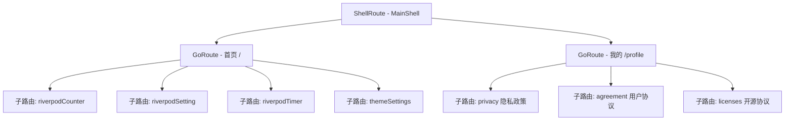
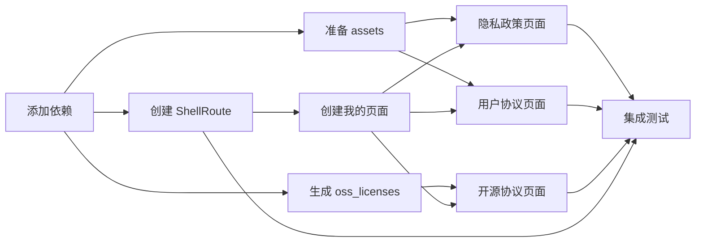

# 我的页面实施计划

## 一、背景分析

### 1.1 需求概述
创建一个带有底部导航栏的应用结构，包含"首页"和"我的"两个Tab。其中"我的"页面需要包含：
- 开源协议展示（使用 flutter_oss_licenses 自动生成）
- 隐私政策页面（从本地 assets 加载）
- 用户协议页面（从本地 assets 加载）

### 1.2 现有项目结构
- 路由：使用 go_router 15.1.1
- 状态管理：flutter_riverpod 3.0.3
- 当前路由配置位于 [`lib/route/app_router.dart`](lib/route/app_router.dart)
- 功能模块位于 `lib/features/` 目录下

## 二、技术约束

### 2.1 技术栈要求
- Flutter SDK: ^3.8.0
- go_router: ^15.1.1
- flutter_riverpod: ^3.0.3
- flutter_oss_licenses: 最新版本（需添加）

### 2.2 架构约束
- 遵循现有项目分层架构（features 按功能模块划分）
- 使用 ShellRoute 实现底部导航栏
- 错误处理统一绑定至 PlatformDispatcher.instance.onError
- 支持 Material 3 主题

## 三、阶段任务

### 阶段一：依赖配置

#### 任务 1.1：添加 flutter_oss_licenses 依赖
- 在 pubspec.yaml 的 dev_dependencies 中添加 flutter_oss_licenses
- 配置 oss_licenses.yaml 生成脚本

**依赖项**：无

#### 任务 1.2：创建 assets 目录结构
```
assets/
├── docs/
│   ├── privacy_policy.md
│   └── user_agreement.md
```

**依赖项**：无

---

### 阶段二：路由架构重构

#### 任务 2.1：创建 ShellRoute 底部导航栏组件
创建 [`lib/common/widgets/main_shell.dart`](lib/common/widgets/main_shell.dart)

```dart
/// 底部导航栏 Shell 组件
class MainShell extends ConsumerWidget {
  final Widget child;
  final int currentIndex;
  // 实现 BottomNavigationBar
}
```

**依赖项**：无

#### 任务 2.2：重构路由配置
修改 [`lib/route/app_router.dart`](lib/route/app_router.dart)，使用 ShellRoute 结构：



**依赖项**：任务 2.1

---

### 阶段三：功能模块开发

#### 任务 3.1：创建我的页面模块
创建目录结构：
```
lib/features/profile/
├── pages/
│   ├── profile_page.dart        # 我的页面主页面
│   ├── privacy_page.dart        # 隐私政策页面
│   ├── user_agreement_page.dart # 用户协议页面
│   └── licenses_page.dart       # 开源协议列表页面
├── widgets/
│   └── license_tile.dart        # 开源协议列表项组件
└── providers/
    └── licenses_provider.dart   # 开源协议数据 Provider
```

**依赖项**：阶段二完成

#### 任务 3.2：实现我的页面主页面
[`lib/features/profile/pages/profile_page.dart`](lib/features/profile/pages/profile_page.dart)

功能：
- 显示用户头像和昵称（可先使用占位符）
- 显示菜单列表项：
  - 隐私政策 -> 跳转到隐私政策页面
  - 用户协议 -> 跳转到用户协议页面
  - 开源协议 -> 跳转到开源协议列表页面
- 显示应用版本号

**依赖项**：任务 3.1

#### 任务 3.3：实现隐私政策页面
[`lib/features/profile/pages/privacy_page.dart`](lib/features/profile/pages/privacy_page.dart)

功能：
- 从 assets/docs/privacy_policy.md 加载内容
- 使用 flutter_markdown 渲染 Markdown 内容
- 支持深色模式适配

**依赖项**：任务 3.1, 任务 1.2

#### 任务 3.4：实现用户协议页面
[`lib/features/profile/pages/user_agreement_page.dart`](lib/features/profile/pages/user_agreement_page.dart)

功能：
- 从 assets/docs/user_agreement.md 加载内容
- 使用 flutter_markdown 渲染 Markdown 内容
- 支持深色模式适配

**依赖项**：任务 3.1, 任务 1.2

#### 任务 3.5：实现开源协议列表页面
[`lib/features/profile/pages/licenses_page.dart`](lib/features/profile/pages/licenses_page.dart)

功能：
- 读取 flutter_oss_licenses 生成的 oss_licenses.yaml
- 以列表形式展示所有依赖库
- 点击可查看详细许可证信息

**依赖项**：任务 3.1, 任务 1.1

#### 任务 3.6：创建开源协议 Provider
[`lib/features/profile/providers/licenses_provider.dart`](lib/features/profile/providers/licenses_provider.dart)

功能：
- 使用 FutureProvider 异步加载开源协议数据
- 提供开源协议列表数据

**依赖项**：任务 3.1, 任务 1.1

---

### 阶段四：资源文件准备

#### 任务 4.1：创建隐私政策文档
创建 [`assets/docs/privacy_policy.md`](assets/docs/privacy_policy.md)

内容包含：
- 信息收集说明
- 信息使用说明
- 信息保护措施
- 用户权利说明
- 联系方式

**依赖项**：任务 1.2

#### 任务 4.2：创建用户协议文档
创建 [`assets/docs/user_agreement.md`](assets/docs/user_agreement.md)

内容包含：
- 服务条款
- 用户行为规范
- 知识产权声明
- 免责声明
- 协议修改条款

**依赖项**：任务 1.2

---

### 阶段五：集成与测试

#### 任务 5.1：更新 pubspec.yaml 配置
- 添加 flutter_markdown 依赖
- 配置 assets 路径

**依赖项**：阶段三、阶段四

#### 任务 5.2：运行 flutter_oss_licenses 生成脚本
- 执行 `flutter pub run flutter_oss_licenses:generate.dart`
- 生成 oss_licenses.yaml 文件

**依赖项**：任务 1.1

#### 任务 5.3：功能测试验证
- 验证底部导航栏切换正常
- 验证各页面跳转正常
- 验证 Markdown 内容正确渲染
- 验证开源协议列表正确显示
- 验证深色模式适配

**依赖项**：所有前置任务

## 四、文件变更清单

### 新增文件
| 文件路径 | 说明 |
|---------|------|
| `lib/common/widgets/main_shell.dart` | 底部导航栏 Shell 组件 |
| `lib/features/profile/pages/profile_page.dart` | 我的页面 |
| `lib/features/profile/pages/privacy_page.dart` | 隐私政策页面 |
| `lib/features/profile/pages/user_agreement_page.dart` | 用户协议页面 |
| `lib/features/profile/pages/licenses_page.dart` | 开源协议列表页面 |
| `lib/features/profile/widgets/license_tile.dart` | 开源协议列表项组件 |
| `lib/features/profile/providers/licenses_provider.dart` | 开源协议 Provider |
| `assets/docs/privacy_policy.md` | 隐私政策文档 |
| `assets/docs/user_agreement.md` | 用户协议文档 |
| `oss_licenses.yaml` | 自动生成的开源协议文件 |

### 修改文件
| 文件路径 | 变更说明 |
|---------|---------|
| `pubspec.yaml` | 添加依赖和 assets 配置 |
| `lib/route/app_router.dart` | 重构为 ShellRoute 结构 |
| `lib/route/router_path.dart` | 添加新路由路径枚举 |

## 五、路由结构设计

### 5.1 新路由路径枚举
```dart
enum AppRouterPths {
  // 现有路径...
  profile(value: 6, routePath: '/profile', routeName: '我的'),
  privacy(value: 7, routePath: 'privacy', routeName: '隐私政策'),
  userAgreement(value: 8, routePath: 'agreement', routeName: '用户协议'),
  licenses(value: 9, routePath: 'licenses', routeName: '开源协议'),
}
```

### 5.2 ShellRoute 结构图
```
ShellRoute (MainShell - 底部导航栏)
├── GoRoute path: '/' (首页 - AppPage)
│   ├── GoRoute path: 'riverpodCounter'
│   ├── GoRoute path: 'riverpodSetting'
│   ├── GoRoute path: 'riverpodTimer'
│   └── GoRoute path: 'themeSettings'
│
└── GoRoute path: '/profile' (我的 - ProfilePage)
    ├── GoRoute path: 'privacy'
    ├── GoRoute path: 'agreement'
    └── GoRoute path: 'licenses'
```

## 六、验收标准

### 6.1 功能验收
- [ ] 底部导航栏正确显示"首页"和"我的"两个Tab
- [ ] Tab 切换时页面状态保持正确
- [ ] "我的"页面显示用户信息和菜单列表
- [ ] 隐私政策页面正确加载并渲染 Markdown 内容
- [ ] 用户协议页面正确加载并渲染 Markdown 内容
- [ ] 开源协议列表正确显示所有依赖库
- [ ] 点击开源协议项可查看详细许可证信息

### 6.2 UI/UX 验收
- [ ] 页面风格与现有应用保持一致
- [ ] 支持深色模式正确显示
- [ ] 页面过渡动画流畅
- [ ] 列表滚动流畅

### 6.3 技术验收
- [ ] 代码符合 Flutter 最佳实践
- [ ] 使用 Riverpod 进行状态管理
- [ ] 路由使用 go_router 标准 API
- [ ] 无内存泄漏

## 七、风险与应对

| 风险 | 影响 | 应对措施 |
|-----|------|---------|
| flutter_oss_licenses 生成失败 | 无法显示开源协议 | 提供手动维护的备用列表 |
| Markdown 渲染性能问题 | 长文档加载慢 | 考虑分页或懒加载 |
| ShellRoute 状态保持 | Tab 切换丢失状态 | 使用 StatefulShellRoute |

## 八、依赖关系图


