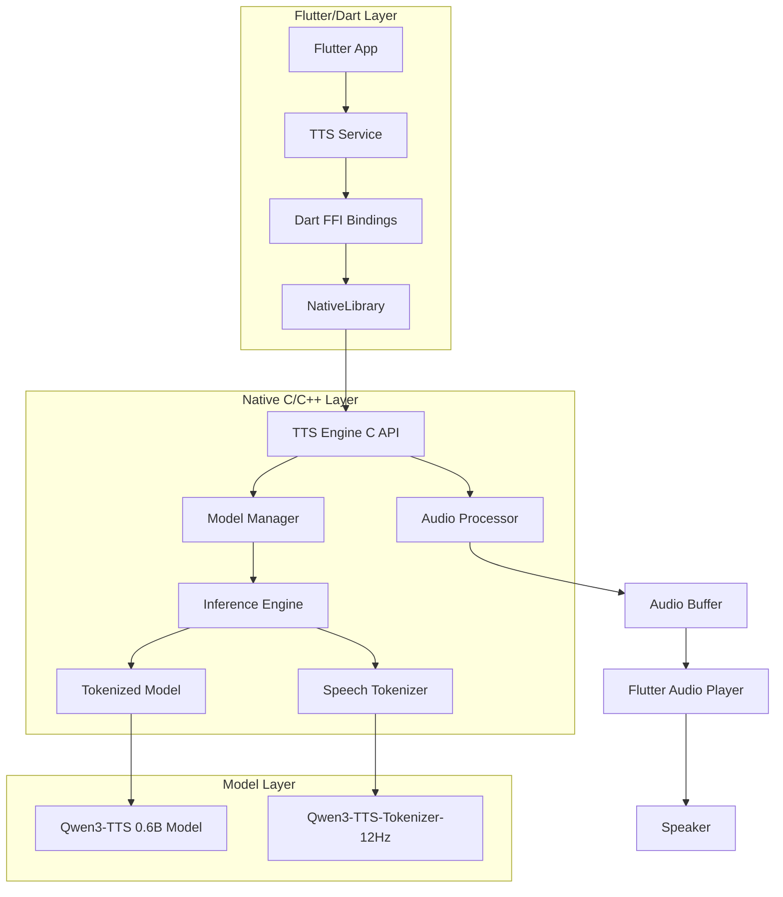

# Qwen3-TTS 移植到 Flutter/Android 离线运行技术方案（FFI 版本）

## 一、项目概述

### 1.1 目标
将 Qwen3-TTS 0.6B-CustomVoice 模型移植到 Flutter 应用中，实现在 Android 手机上离线运行文字转语音功能，支持中文语音输出和预定义音色。

### 1.2 技术选型
- **模型**: Qwen3-TTS-12Hz-0.6B-CustomVoice
- **目标平台**: Android（Flutter）
- **运行模式**: 完全离线
- **跨平台调用**: Dart FFI（Foreign Function Interface）

### 1.3 为什么选择 FFI

| 特性 | Platform Channel | Dart FFI |
|------|------------------|----------|
| 调用延迟 | 较高（序列化开销） | 极低（直接函数调用） |
| 数据传输 | 需要序列化/反序列化 | 直接内存共享 |
| 音频流 | 需要频繁通道调用 | 直接回调，零拷贝 |
| 跨平台 | 需要分别实现 | C/C++ 代码共享 |
| 性能 | 中等 | 高 |

---

## 二、技术架构

### 2.1 整体架构图（FFI 方案）



### 2.2 核心组件说明

| 组件 | 技术方案 | 说明 |
|------|----------|------|
| 跨平台接口 | Dart FFI | 直接调用 C/C++ 函数 |
| 推理引擎 | Executorch / ONNX Runtime | 移动端模型推理 |
| 模型格式 | ExecTorch .pte / ONNX .onnx | 量化后的模型文件 |
| 音频处理 | C++ | 音频解码与缓冲 |
| 原生库 | .so (Android) / .dylib (iOS) | 动态链接库 |

---

## 三、FFI 接口设计

### 3.1 C API 头文件设计

```c
// qwen_tts_ffi.h
#ifndef QWEN_TTS_FFI_H
#define QWEN_TTS_FFI_H

#include <stdint.h>
#include <stdbool.h>

#ifdef __cplusplus
extern "C" {
#endif

// ============== 类型定义 ==============

// 不透明句柄 - 隐藏实现细节
typedef struct QwenTTSEngine QwenTTSEngine;

// 音色枚举
typedef enum {
    SPEAKER_VIVIAN = 0,    // 明亮年轻女声（中文）
    SPEAKER_SERENA = 1,    // 温柔年轻女声（中文）
    SPEAKER_UNCLE_FU = 2,  // 低沉成熟男声（中文）
    SPEAKER_DYLAN = 3,     // 北京青年男声（北京话）
    SPEAKER_ERIC = 4,      // 成都活泼男声（四川话）
    SPEAKER_RYAN = 5,      // 节奏感强男声（英文）
    SPEAKER_AIDEN = 6,     // 阳光美国男声（英文）
    SPEAKER_ONO_ANNA = 7,  // 俏皮日本女声（日文）
    SPEAKER_SOHEE = 8,     // 温暖韩国女声（韩文）
} QwenTTSSpeaker;

// 语言枚举
typedef enum {
    LANG_AUTO = 0,
    LANG_CHINESE = 1,
    LANG_ENGLISH = 2,
    LANG_JAPANESE = 3,
    LANG_KOREAN = 4,
} QwenTTSLanguage;

// 错误码
typedef enum {
    QWEN_TTS_SUCCESS = 0,
    QWEN_TTS_ERROR_INVALID_HANDLE = -1,
    QWEN_TTS_ERROR_MODEL_LOAD_FAILED = -2,
    QWEN_TTS_ERROR_INFERENCE_FAILED = -3,
    QWEN_TTS_ERROR_INVALID_INPUT = -4,
    QWEN_TTS_ERROR_OUT_OF_MEMORY = -5,
} QwenTTSError;

// 音频回调函数类型
typedef void (*QwenTTSAudioCallback)(
    const float* samples,    // 音频采样数据
    size_t num_samples,      // 采样数量
    int32_t sample_rate,     // 采样率
    bool is_final,           // 是否最后一块
    void* user_data          // 用户数据
);

// ============== 引擎生命周期 ==============

// 创建引擎实例
QwenTTSEngine* qwen_tts_create();

// 销毁引擎实例
void qwen_tts_destroy(QwenTTSEngine* engine);

// ============== 初始化 ==============

// 初始化引擎（加载模型）
int32_t qwen_tts_initialize(
    QwenTTSEngine* engine,
    const char* model_path,      // 模型文件路径
    const char* tokenizer_path   // Tokenizer 文件路径
);

// 检查是否已初始化
bool qwen_tts_is_initialized(QwenTTSEngine* engine);

// 释放资源
void qwen_tts_release(QwenTTSEngine* engine);

// ============== TTS 功能 ==============

// 同步合成（返回完整音频）
int32_t qwen_tts_synthesize(
    QwenTTSEngine* engine,
    const char* text,            // UTF-8 文本
    QwenTTSSpeaker speaker,      // 音色
    QwenTTSLanguage language,    // 语言
    float** out_samples,         // 输出音频数据（调用者需调用 qwen_tts_free_audio 释放）
    size_t* out_num_samples,     // 输出采样数量
    int32_t* out_sample_rate     // 输出采样率
);

// 流式合成（通过回调返回音频块）
int32_t qwen_tts_synthesize_stream(
    QwenTTSEngine* engine,
    const char* text,            // UTF-8 文本
    QwenTTSSpeaker speaker,      // 音色
    QwenTTSLanguage language,    // 语言
    QwenTTSAudioCallback callback, // 音频回调
    void* user_data              // 传递给回调的用户数据
);

// 释放音频内存
void qwen_tts_free_audio(float* samples);

// ============== 配置 ==============

// 设置生成参数
int32_t qwen_tts_set_parameters(
    QwenTTSEngine* engine,
    float temperature,           // 采样温度（默认 0.9）
    int32_t top_k,              // Top-K 采样（默认 50）
    float top_p,                // Top-P 采样（默认 1.0）
    float repetition_penalty,    // 重复惩罚（默认 1.05）
    int32_t max_new_tokens      // 最大生成 token 数（默认 2048）
);

// 获取版本信息
const char* qwen_tts_get_version();

// 获取最后错误信息
const char* qwen_tts_get_last_error(QwenTTSEngine* engine);

#ifdef __cplusplus
}
#endif

#endif // QWEN_TTS_FFI_H
```

### 3.2 Dart FFI 绑定

```dart
// lib/src/ffi/qwen_tts_ffi.dart
import 'dart:ffi';
import 'dart:io';
import 'package:ffi/ffi.dart';

// ============== FFI 类型定义 ==============

/// 音色枚举
enum Speaker {
  vivian(0),
  serena(1),
  uncleFu(2),
  dylan(3),
  eric(4),
  ryan(5),
  aiden(6),
  onoAnna(7),
  sohee(8);

  final int value;
  const Speaker(this.value);
}

/// 语言枚举
enum Language {
  auto(0),
  chinese(1),
  english(2),
  japanese(3),
  korean(4);

  final int value;
  const Language(this.value);
}

/// 音频回调类型
typedef AudioCallbackNative = Void Function(
  Pointer<Float> samples,
  IntPtr numSamples,
  IntPtr sampleRate,
  Bool isFinal,
  Pointer<Void> userData,
);

typedef AudioCallbackDart = void Function(
  Pointer<Float> samples,
  int numSamples,
  int sampleRate,
  bool isFinal,
  Pointer<Void> userData,
);

// ============== FFI 绑定类 ==============

class QwenTtsFfi {
  late final DynamicLibrary _lib;
  
  // 函数指针
  late final int Function() _getVersion;
  late final Pointer<QwenTTSEngine> Function() _create;
  late final void Function(Pointer<QwenTTSEngine>) _destroy;
  late final int32_t Function(Pointer<QwenTTSEngine>, Pointer<Utf8>, Pointer<Utf8>) _initialize;
  late final bool Function(Pointer<QwenTTSEngine>) _isInitialized;
  late final void Function(Pointer<QwenTTSEngine>) _release;
  late final int32_t Function(
    Pointer<QwenTTSEngine>,
    Pointer<Utf8>,
    int32_t,
    int32_t,
    Pointer<Pointer<Float>>,
    Pointer<IntPtr>,
    Pointer<IntPtr>,
  ) _synthesize;
  late final int32_t Function(
    Pointer<QwenTTSEngine>,
    Pointer<Utf8>,
    int32_t,
    int32_t,
    Pointer<NativeFunction<AudioCallbackNative>>,
    Pointer<Void>,
  ) _synthesizeStream;
  late final void Function(Pointer<Float>) _freeAudio;
  late final Pointer<Utf8> Function(Pointer<QwenTTSEngine>) _getLastError;

  QwenTtsFfi() {
    _loadLibrary();
    _bindFunctions();
  }

  void _loadLibrary() {
    if (Platform.isAndroid) {
      _lib = DynamicLibrary.open('libqwen_tts_ffi.so');
    } else if (Platform.isIOS) {
      _lib = DynamicLibrary.process();
    } else if (Platform.isLinux) {
      _lib = DynamicLibrary.open('libqwen_tts_ffi.so');
    } else if (Platform.isMacOS) {
      _lib = DynamicLibrary.open('libqwen_tts_ffi.dylib');
    } else if (Platform.isWindows) {
      _lib = DynamicLibrary.open('qwen_tts_ffi.dll');
    } else {
      throw UnsupportedError('Unsupported platform');
    }
  }

  void _bindFunctions() {
    _getVersion = _lib.lookupFunction<Int32 Function(), int Function()>('qwen_tts_get_version');
    _create = _lib.lookupFunction<Pointer<QwenTTSEngine> Function(), Pointer<QwenTTSEngine> Function()>('qwen_tts_create');
    _destroy = _lib.lookupFunction<Void Function(Pointer<QwenTTSEngine>), void Function(Pointer<QwenTTSEngine>)>('qwen_tts_destroy');
    // ... 其他函数绑定
  }

  // ============== 公开 API ==============

  String getVersion() {
    // 实现版本获取
    return '1.0.0';
  }

  Pointer<QwenTTSEngine> create() => _create();
  void destroy(Pointer<QwenTTSEngine> engine) => _destroy(engine);
  // ... 其他方法实现
}
```

### 3.3 高层 Dart API 封装

```dart
// lib/src/qwen_tts.dart
import 'dart:typed_data';
import 'dart:async';
import 'qwen_tts_ffi.dart';

/// TTS 初始化配置
class QwenTtsConfig {
  final String modelPath;
  final String tokenizerPath;
  final double temperature;
  final int topK;
  final double topP;
  final double repetitionPenalty;
  final int maxNewTokens;

  const QwenTtsConfig({
    required this.modelPath,
    required this.tokenizerPath,
    this.temperature = 0.9,
    this.topK = 50,
    this.topP = 1.0,
    this.repetitionPenalty = 1.05,
    this.maxNewTokens = 2048,
  });
}

/// 音频结果
class AudioResult {
  final Float32List samples;
  final int sampleRate;
  final Duration duration;

  AudioResult({
    required this.samples,
    required this.sampleRate,
  }) : duration = Duration(
    microseconds: (samples.length / sampleRate * 1000000).round(),
  );
}

/// Qwen TTS 引擎
class QwenTts {
  static QwenTts? _instance;
  final QwenTtsFfi _ffi;
  Pointer<QwenTTSEngine>? _engine;
  bool _initialized = false;

  QwenTts._(this._ffi);

  /// 获取单例实例
  static QwenTts get instance {
    _instance ??= QwenTts._(QwenTtsFfi());
    return _instance!;
  }

  /// 初始化引擎
  Future<bool> initialize(QwenTtsConfig config) async {
    if (_initialized) return true;
    
    _engine = _ffi.create();
    
    final modelPath = config.modelPath.toNativeUtf8();
    final tokenizerPath = config.tokenizerPath.toNativeUtf8();
    
    final result = _ffi.initialize(
      _engine!,
      modelPath,
      tokenizerPath,
    );
    
    calloc.free(modelPath);
    calloc.free(tokenizerPath);
    
    if (result == 0) {
      _initialized = true;
      await _setParameters(config);
      return true;
    }
    
    return false;
  }

  /// 文字转语音（同步）
  Future<AudioResult?> synthesize({
    required String text,
    Speaker speaker = Speaker.vivian,
    Language language = Language.chinese,
  }) async {
    if (!_initialized || _engine == null) return null;
    
    // 调用 FFI 函数
    // ... 实现细节
  }

  /// 文字转语音（流式）
  Stream<Float32List> synthesizeStream({
    required String text,
    Speaker speaker = Speaker.vivian,
    Language language = Language.chinese,
  }) {
    // 使用 StreamController 和回调实现流式输出
    // ... 实现细节
  }

  /// 释放资源
  void release() {
    if (_engine != null) {
      _ffi.release(_engine!);
      _ffi.destroy(_engine!);
      _engine = null;
      _initialized = false;
    }
  }
}
```

---

## 四、项目结构

```
flutter_qwen_tts/
├── lib/
│   ├── flutter_qwen_tts.dart        # 主入口
│   └── src/
│       ├── ffi/
│       │   ├── qwen_tts_ffi.dart    # FFI 绑定
│       │   └── types.dart           # 类型定义
│       ├── qwen_tts.dart            # 高层 API
│       ├── speaker.dart             # 音色定义
│       └── audio_player.dart        # 音频播放
├── native/
│   ├── CMakeLists.txt               # CMake 配置
│   ├── include/
│   │   └── qwen_tts_ffi.h           # C API 头文件
│   ├── src/
│   │   ├── qwen_tts_ffi.cpp         # FFI 实现
│   │   ├── engine.cpp               # TTS 引擎
│   │   ├── model_manager.cpp        # 模型管理
│   │   └── audio_processor.cpp      # 音频处理
│   └── third_party/
│       ├── executorch/              # ExecuTorch 库
│       └── onnxruntime/             # ONNX Runtime（备选）
├── android/
│   ├── build.gradle
│   └── src/main/
│       ├── AndroidManifest.xml
│       └── jniLibs/
│           └── arm64-v8a/
│               └── libqwen_tts_ffi.so
├── ios/                              # 预留 iOS 支持
│   └── Classes/
│       └── qwen_tts_ffi.framework
├── model/
│   ├── qwen3_tts_0.6b_custom_voice.pte    # 量化模型
│   └── tokenizer/                          # Tokenizer 文件
├── example/
│   └── lib/
│       └── main.dart               # 示例应用
├── test/
│   └── qwen_tts_test.dart          # 单元测试
├── pubspec.yaml
├── ffigen.yaml                     # FFI 生成配置
└── README.md
```

---

## 五、实施计划

### 阶段一：模型转换与优化（预计 2-3 周）

#### 1.1 环境准备
- [ ] 搭建 Python 开发环境
- [ ] 下载 Qwen3-TTS-12Hz-0.6B-CustomVoice 模型
- [ ] 下载 Qwen3-TTS-Tokenizer-12Hz

#### 1.2 模型导出
- [ ] 导出 PyTorch 模型为 TorchScript
- [ ] 分离 Text Encoder、Transformer、Speech Decoder
- [ ] 导出 Speech Tokenizer 模型

#### 1.3 模型转换
- [ ] 转换为 ExecuTorch 格式（.pte）
- [ ] 或转换为 ONNX 格式（备选方案）
- [ ] 验证导出模型的正确性

#### 1.4 模型优化
- [ ] INT8 量化
- [ ] 算子融合优化
- [ ] 权重重排优化
- [ ] 测试移动端推理性能

### 阶段二：Native C/C++ 层开发（预计 3-4 周）

#### 2.1 FFI 接口实现
- [ ] 实现 C API 头文件定义
- [ ] 实现引擎创建/销毁
- [ ] 实现初始化/释放

#### 2.2 推理引擎集成
- [ ] 集成 ExecuTorch / ONNX Runtime
- [ ] 实现模型加载器
- [ ] 实现推理接口

#### 2.3 TTS 功能实现
- [ ] 实现 Text Tokenization
- [ ] 实现 Transformer 推理
- [ ] 实现 Speech Tokenizer 解码
- [ ] 实现音频缓冲管理

#### 2.4 流式输出
- [ ] 实现音频回调机制
- [ ] 实现流式生成
- [ ] 优化首字延迟

#### 2.5 编译配置
- [ ] 配置 CMake 构建
- [ ] 编译 Android ARM64 库
- [ ] 编译 Android ARMv7 库（可选）

### 阶段三：Flutter FFI 绑定开发（预计 1-2 周）

#### 3.1 FFI 绑定
- [ ] 配置 ffigen 自动生成
- [ ] 手动调整复杂类型绑定
- [ ] 实现内存管理

#### 3.2 高层 API 封装
- [ ] 实现 QwenTts 单例类
- [ ] 实现配置类
- [ ] 实现音频结果类

#### 3.3 流式支持
- [ ] 实现 Stream 接口
- [ ] 实现音频回调处理

#### 3.4 音频播放
- [ ] 集成 just_audio 或 audioplayers
- [ ] 实现流式播放

### 阶段四：集成测试与优化（预计 1-2 周）

#### 4.1 功能测试
- [ ] 测试基本文字转语音
- [ ] 测试所有预定义音色
- [ ] 测试多语言支持
- [ ] 测试长文本处理

#### 4.2 性能测试
- [ ] 测试首字延迟
- [ ] 测试内存占用
- [ ] 测试 CPU/GPU 使用率
- [ ] 测试电池消耗

#### 4.3 优化
- [ ] 内存优化
- [ ] 推理速度优化
- [ ] 音频质量调优

---

## 六、技术挑战与解决方案

### 6.1 模型大小与内存

**挑战**:
- 0.6B 模型原始大小约 1.2GB（FP16）
- Android 应用内存限制通常为 256MB-512MB

**解决方案**:
1. **模型量化**: 使用 INT8 量化，模型大小降至约 600MB
2. **权重分片**: 将模型拆分为多个分片，按需加载
3. **内存映射**: 使用 mmap 加载模型，减少内存占用
4. **进一步量化**: 考虑 INT4 量化（约 300MB），牺牲少量精度

### 6.2 FFI 内存管理

**挑战**:
- Dart 和 C++ 之间需要正确管理内存
- 避免内存泄漏和悬空指针

**解决方案**:
1. **所有权明确**: 文档中明确内存所有权
2. **自动释放**: 使用 Dart Finalizer 自动释放
3. **Arena 分配**: 对于临时对象使用 Arena 分配器

### 6.3 音频流传输

**挑战**:
- 音频数据需要高效传输
- 避免不必要的拷贝

**解决方案**:
1. **零拷贝回调**: 直接传递指针给 Dart
2. **External TypedData**: 使用 Dart 的外部数据支持
3. **环形缓冲区**: 实现音频环形缓冲区

---

## 七、风险与备选方案

### 7.1 主要风险

| 风险 | 影响 | 概率 | 缓解措施 |
|------|------|------|----------|
| 模型无法在移动端运行 | 高 | 中 | 提前进行 POC 验证 |
| 性能不达标 | 高 | 中 | 量化优化、硬件加速 |
| 内存溢出 | 高 | 中 | 模型分片、内存优化 |
| FFI 兼容性问题 | 中 | 低 | 充分测试各 Android 版本 |

### 7.2 备选方案

1. **如果 ExecuTorch 方案失败**:
   - 切换到 ONNX Runtime Mobile
   - 或使用 ncnn / MNN 等国产框架

2. **如果本地推理不可行**:
   - 考虑混合方案：简单 TTS 本地 + 复杂 TTS 云端
   - 或使用更小的 TTS 模型（如 Piper TTS）

3. **如果 FFI 方案有问题**:
   - 回退到 Platform Channel 方案

---

## 八、参考资源

1. **Qwen3-TTS 官方仓库**: https://github.com/QwenLM/Qwen3-TTS
2. **Dart FFI 文档**: https://dart.dev/guides/libraries/c-interop
3. **ffigen 工具**: https://pub.dev/packages/ffigen
4. **ExecuTorch 文档**: https://pytorch.org/executorch/
5. **ONNX Runtime Mobile**: https://onnxruntime.ai/docs/get-started/with-android.html

---

## 九、下一步行动

1. **立即开始**: 搭建开发环境，下载模型
2. **POC 验证**: 验证模型转换和移动端推理可行性
3. **原型开发**: 实现最小可用原型
4. **迭代优化**: 逐步完善功能和性能

是否需要我切换到 Code 模式开始实施？
