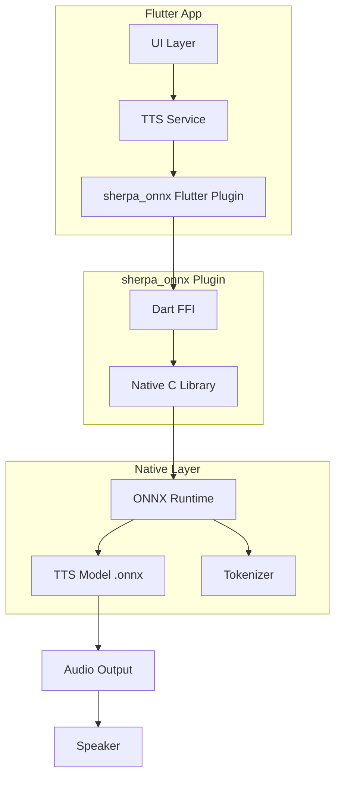

# Sherpa-ONNX Flutter TTS 技术方案

## 一、方案概述

### 1.1 为什么选择 Sherpa-ONNX

| 特性 | Qwen3-TTS | Sherpa-ONNX |
|------|-----------|-------------|
| 模型格式 | PyTorch（需转换） | ONNX（可直接使用） |
| Python依赖 | 必须使用 Python 转换 | 无需 Python |
| Flutter支持 | 需要自己开发 | 已有官方 Flutter 插件 |
| 中文支持 | 支持 | 支持（多个模型可选） |
| 移动端优化 | 需要自己优化 | 已针对移动端优化 |
| 社区支持 | 较新 | 成熟活跃 |

### 1.2 推荐的中文 TTS 模型

| 模型名称 | 语言 | 说话人数 | 模型大小 | 推荐场景 |
|----------|------|----------|----------|----------|
| `vits-melo-tts-zh_en` | 中英双语 | 1 | ~50MB | 简单应用 |
| `vits-zh-hf-fanchen-C` | 中文 | 187 | ~100MB | 多音色需求 |
| `kokoro-multi-lang-v1_1` | 中英双语 | 103 | ~200MB | 高质量多语言 |
| `aishell3` | 中文 | 174 | ~50MB | 标准中文 |

---

## 二、技术架构

### 2.1 整体架构图



### 2.2 核心组件

| 组件 | 说明 |
|------|------|
| sherpa_onnx | 官方 Flutter 插件 |
| ONNX Runtime | 高性能推理引擎 |
| TTS Model | 预训练的 ONNX 模型 |
| Tokenizer | 文本分词器 |

---

## 三、实施步骤

### 步骤 1：添加依赖

```yaml
# pubspec.yaml
dependencies:
  sherpa_onnx: ^1.10.15
  path_provider: ^2.1.0
  audioplayers: ^5.0.0
```

### 步骤 2：下载模型

从 Hugging Face 下载预训练模型：

```bash
# 中文 TTS 模型（推荐）
# vits-melo-tts-zh_en（中英双语，约50MB）
wget https://huggingface.co/csukuangfj/vits-melo-tts-zh_en/tree/main

# 或 vits-zh-hf-fanchen-C（中文，187个说话人）
wget https://huggingface.co/csukuangfj/vits-zh-hf-fanchen-C/tree/main
```

### 步骤 3：配置 Android

```gradle
// android/app/build.gradle
android {
    // ...
    
    packagingOptions {
        pickFirst '**/libonnxruntime.so'
        pickFirst '**/libc++_shared.so'
    }
}
```

### 步骤 4：Flutter 代码示例

```dart
import 'package:sherpa_onnx/sherpa_onnx.dart' as sherpa;
import 'package:path_provider/path_provider.dart';

class TTSService {
  sherpa.VitsTTS? _tts;
  bool _initialized = false;

  Future<bool> initialize() async {
    if (_initialized) return true;

    // 获取模型路径
    final appDir = await getApplicationDocumentsDirectory();
    final modelPath = '${appDir.path}/tts/model.onnx';
    final tokensPath = '${appDir.path}/tts/tokens.txt';

    // 创建 TTS 配置
    final config = sherpa.VitsTTSConfig(
      model: modelPath,
      tokens: tokensPath,
      numThreads: 4,
      debug: false,
    );

    // 初始化 TTS
    _tts = sherpa.VitsTTS(config);
    _initialized = _tts != null;
    
    return _initialized;
  }

  Future<Uint8List?> synthesize(String text, {int speakerId = 0}) async {
    if (!_initialized || _tts == null) return null;

    // 生成音频
    final audio = _tts!.generate(text, sid: speakerId);
    
    // 转换为 WAV 格式
    return sherpa.writeWave(
      samples: audio.samples,
      sampleRate: audio.sampleRate,
    );
  }

  void release() {
    _tts?.free();
    _tts = null;
    _initialized = false;
  }
}
```

---

## 四、项目结构

```
flutter_tts_app/
├── lib/
│   ├── main.dart
│   ├── services/
│   │   └── tts_service.dart
│   ├── pages/
│   │   └── home_page.dart
│   └── widgets/
│       └── tts_controls.dart
├── assets/
│   └── models/
│       └── vits-melo-tts-zh_en/
│           ├── model.onnx
│           ├── tokens.txt
│           └── dict/
├── android/
│   ├── app/build.gradle
│   └── ...
├── ios/
├── pubspec.yaml
└── README.md
```

---

## 五、优势总结

1. **无需 Python** - 所有模型都是预转换的 ONNX 格式
2. **官方 Flutter 支持** - 有成熟的 Flutter 插件
3. **模型体积小** - 50-200MB，远小于 Qwen3-TTS
4. **性能优秀** - 已针对移动端优化
5. **多音色支持** - 部分模型支持上百个说话人
6. **社区活跃** - 持续更新和维护

---

## 六、下一步行动

1. 创建 Flutter 项目
2. 添加 sherpa_onnx 依赖
3. 下载中文 TTS 模型
4. 实现 TTS 服务
5. 测试和优化

是否需要我切换到 Code 模式开始实施？
