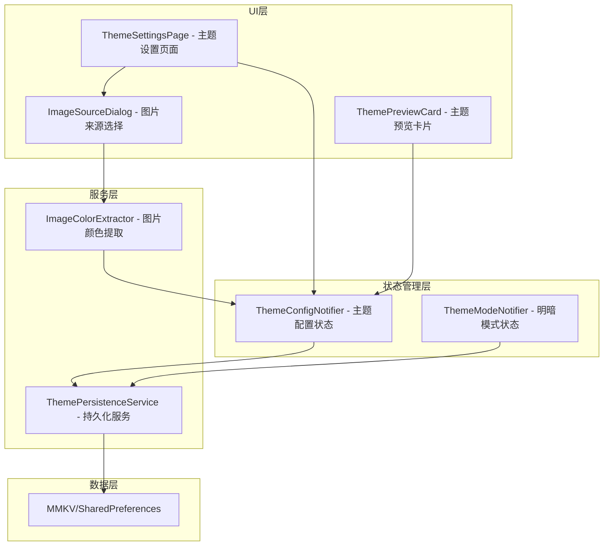
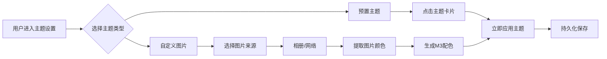

# FlexColorScheme 主题切换实现计划

## 需求概述

实现基于 flex_color_scheme 的颜色主题切换功能，包含：
1. **预置主题**：5-6种精选内置颜色主题
2. **图片生成主题**：支持从本地相册和网络图片自动生成 M3 动态颜色主题
3. **持久化存储**：保存用户选择的主题配置
4. **独立主题页面**：专门的主题设置页面

## 技术方案

### 核心技术栈

| 技术 | 用途 |
|------|------|
| flex_color_scheme8.3.0 | 内置主题和主题构建 |
| ColorScheme.fromImageProvider | Flutter 原生 M3 图片颜色提取 |
| mmkv或 shared_preferences | 主题配置持久化 |
| image_picker | 本地图片选择 |
| flutter_riverpod3.0.3 | 状态管理 |

### 架构设计



## 文件结构

```
lib/
├── common/
│   └── theme/
│       ├── light_theme_provider.dart    # 现有 - 需重构
│       ├── dark_theme_provider.dart     # 现有 - 需重构
│       ├── switch_theme_mode.dart       # 现有 - 需重构
│       ├── theme_config.dart            # 新增 - 主题配置模型
│       ├── theme_config_provider.dart   # 新增 - 主题配置状态管理
│       ├── predefined_themes.dart       # 新增 - 预置主题定义
│       └── theme_persistence.dart       # 新增 - 主题持久化服务
├── features/
│   └── theme/
│       ├── pages/
│       │   └── theme_settings_page.dart # 新增 - 主题设置页面
│       ├── widgets/
│       │   ├── theme_preview_card.dart  # 新增 - 主题预览卡片
│       │   └── image_source_sheet.dart  # 新增 - 图片来源选择
│       └── services/
│           └── image_color_extractor.dart # 新增 - 图片颜色提取服务
└── route/
    └── app_router.dart                  # 需修改 - 添加主题页面路由
```

## 实现步骤

### 第一阶段：数据模型和预置主题

#### 1.1 创建主题配置模型

```dart
// lib/common/theme/theme_config.dart

/// 主题类型枚举
enum ThemeType {
  predefined,  // 预置主题
  custom,      // 自定义图片主题
}

/// 主题配置模型
class ThemeConfig {
  final ThemeType type;
  final String? predefinedSchemeKey;  // 预置主题的key
  final String? customImageSource;    // 自定义图片路径或URL
  final bool isNetworkImage;          // 是否为网络图片
  
  const ThemeConfig.predefined(String schemeKey)
      : type = ThemeType.predefined,
        predefinedSchemeKey = schemeKey,
        customImageSource = null,
        isNetworkImage = false;
  
  const ThemeConfig.custom(this.customImageSource, {this.isNetworkImage = false})
      : type = ThemeType.custom,
        predefinedSchemeKey = null;
  
  // 默认主题
  static const ThemeConfig defaultTheme = ThemeConfig.predefined('blue');
}
```

#### 1.2 定义预置主题

```dart
// lib/common/theme/predefined_themes.dart

/// 预置主题配置
class PredefinedTheme {
  final String key;
  final String name;
  final String description;
  final FlexScheme scheme;
  final Color primaryColor;
  
  const PredefinedTheme({
    required this.key,
    required this.name,
    required this.description,
    required this.scheme,
    required this.primaryColor,
  });
}

/// 精选预置主题列表 - 5-6种
const List<PredefinedTheme> kPredefinedThemes = [
  PredefinedTheme(
    key: 'blue',
    name: '海洋蓝',
    description: '经典蓝色主题',
    scheme: FlexScheme.blue,
    primaryColor: Color(0xFF1976D2),
  ),
  PredefinedTheme(
    key: 'indigo',
    name: '靛青',
    description: '深邃靛青主题',
    scheme: FlexScheme.indigo,
    primaryColor: Color(0xFF3F51B5),
  ),
  PredefinedTheme(
    key: 'teal',
    name: '青碧',
    description: '清新青碧主题',
    scheme: FlexScheme.teal,
    primaryColor: Color(0xFF009688),
  ),
  PredefinedTheme(
    key: 'green',
    name: '翠绿',
    description: '自然翠绿主题',
    scheme: FlexScheme.green,
    primaryColor: Color(0xFF4CAF50),
  ),
  PredefinedTheme(
    key: 'purple',
    name: '典雅紫',
    description: '优雅紫色主题',
    scheme: FlexScheme.purple,
    primaryColor: Color(0xFF9C27B0),
  ),
  PredefinedTheme(
    key: 'sakura',
    name: '樱花粉',
    description: '温柔粉色主题',
    scheme: FlexScheme.sakura,
    primaryColor: Color(0xFFEC407A),
  ),
];
```

### 第二阶段：状态管理和持久化

#### 2.1 主题持久化服务

```dart
// lib/common/theme/theme_persistence.dart

/// 主题持久化服务
class ThemePersistenceService {
  static const String _keyThemeType = 'theme_type';
  static const String _keyPredefinedScheme = 'predefined_scheme';
  static const String _keyCustomImageSource = 'custom_image_source';
  static const String _keyIsNetworkImage = 'is_network_image';
  static const String _keyThemeMode = 'theme_mode';
  
  final MMKVService _mmkv;
  
  ThemePersistenceService(this._mmkv);
  
  /// 保存主题配置
  Future<void> saveThemeConfig(ThemeConfig config) async {
    _mmkv.encode(_keyThemeType, config.type.index);
    if (config.type == ThemeType.predefined) {
      _mmkv.encode(_keyPredefinedScheme, config.predefinedSchemeKey);
    } else {
      _mmkv.encode(_keyCustomImageSource, config.customImageSource);
      _mmkv.encode(_keyIsNetworkImage, config.isNetworkImage);
    }
  }
  
  /// 加载主题配置
  ThemeConfig? loadThemeConfig() {
    final typeIndex = _mmkv.decodeInt(_keyThemeType);
    if (typeIndex == null) return null;
    
    if (typeIndex == ThemeType.predefined.index) {
      final schemeKey = _mmkv.decodeString(_keyPredefinedScheme);
      if (schemeKey != null) {
        return ThemeConfig.predefined(schemeKey);
      }
    } else {
      final imageSource = _mmkv.decodeString(_keyCustomImageSource);
      final isNetwork = _mmkv.decodeBool(_keyIsNetworkImage) ?? false;
      if (imageSource != null) {
        return ThemeConfig.custom(imageSource, isNetworkImage: isNetwork);
      }
    }
    return null;
  }
  
  /// 保存主题模式
  Future<void> saveThemeMode(ThemeMode mode) async {
    _mmkv.encode(_keyThemeMode, mode.index);
  }
  
  /// 加载主题模式
  ThemeMode loadThemeMode() {
    final index = _mmkv.decodeInt(_keyThemeMode);
    return index != null ? ThemeMode.values[index] : ThemeMode.system;
  }
}
```

#### 2.2 主题配置 Provider

```dart
// lib/common/theme/theme_config_provider.dart

@riverpod
class ThemeConfigNotifier extends _$ThemeConfigNotifier {
  late ThemePersistenceService _persistenceService;
  late ImageColorExtractor _colorExtractor;
  
  @override
  ThemeConfig build() {
    _persistenceService = ref.watch(themePersistenceProvider);
    _colorExtractor = ref.watch(imageColorExtractorProvider);
    
    // 加载保存的主题配置
    final savedConfig = _persistenceService.loadThemeConfig();
    return savedConfig ?? ThemeConfig.defaultTheme;
  }
  
  /// 切换到预置主题
  Future<void> setPredefinedTheme(String schemeKey) async {
    final config = ThemeConfig.predefined(schemeKey);
    await _persistenceService.saveThemeConfig(config);
    state = config;
  }
  
  /// 从图片创建自定义主题
  Future<void> setCustomThemeFromImage(String imagePath, {bool isNetwork = false}) async {
    final config = ThemeConfig.custom(imagePath, isNetworkImage: isNetwork);
    await _persistenceService.saveThemeConfig(config);
    state = config;
  }
}
```

#### 2.3 重构现有主题 Provider

```dart
// lib/common/theme/light_theme_provider.dart (重构)

@riverpod
ThemeData lightTheme(Ref ref) {
  final config = ref.watch(themeConfigNotifierProvider);
  
  if (config.type == ThemeType.predefined) {
    final theme = kPredefinedThemes.firstWhere(
      (t) => t.key == config.predefinedSchemeKey,
      orElse: () => kPredefinedThemes.first,
    );
    return FlexThemeData.light(
      scheme: theme.scheme,
      useMaterial3: true,
    );
  } else {
    // 自定义主题 - 需要异步加载，这里返回默认主题
    // 实际实现需要使用 AsyncNotifier
    return FlexThemeData.light(
      scheme: FlexScheme.blue,
      useMaterial3: true,
    );
  }
}
```

### 第三阶段：图片颜色提取服务

#### 3.1 图片颜色提取器

```dart
// lib/features/theme/services/image_color_extractor.dart

/// 图片颜色提取服务
class ImageColorExtractor {
  /// 从图片提供者生成 ColorScheme
  Future<ColorScheme> extractFromImageProvider(
    ImageProvider provider, {
    Brightness brightness = Brightness.light,
    DynamicSchemeVariant variant = DynamicSchemeVariant.tonalSpot,
  }) async {
    return await ColorScheme.fromImageProvider(
      provider: provider,
      brightness: brightness,
      dynamicSchemeVariant: variant,
    );
  }
  
  /// 从本地文件生成 ColorScheme
  Future<ColorScheme> extractFromLocalFile(
    String filePath, {
    Brightness brightness = Brightness.light,
  }) async {
    final file = File(filePath);
    final bytes = await file.readAsBytes();
    return extractFromImageProvider(
      MemoryImage(bytes),
      brightness: brightness,
    );
  }
  
  /// 从网络图片生成 ColorScheme
  Future<ColorScheme> extractFromNetworkUrl(
    String url, {
    Brightness brightness = Brightness.light,
  }) async {
    return extractFromImageProvider(
      NetworkImage(url),
      brightness: brightness,
    );
  }
}
```

### 第四阶段：UI 实现

#### 4.1 主题设置页面

```dart
// lib/features/theme/pages/theme_settings_page.dart

class ThemeSettingsPage extends ConsumerWidget {
  @override
  Widget build(BuildContext context, WidgetRef ref) {
    final themeConfig = ref.watch(themeConfigNotifierProvider);
    final themeMode = ref.watch(switchThemeModeProvider);
    
    return Scaffold(
      appBar: AppBar(
        title: const Text('主题设置'),
      ),
      body: ListView(
        children: [
          // 明暗模式切换
          _buildThemeModeSection(context, ref, themeMode),
          const Divider(),
          // 预置主题选择
          _buildPredefinedThemesSection(context, ref, themeConfig),
          const Divider(),
          // 自定义图片主题
          _buildCustomThemeSection(context, ref),
        ],
      ),
    );
  }
  
  Widget _buildPredefinedThemesSection(...) {
    return Column(
      crossAxisAlignment: CrossAxisAlignment.start,
      children: [
        const Padding(
          padding: EdgeInsets.all(16),
          child: Text('预置主题', style: TextTheme.of(context).titleMedium),
        ),
        GridView.builder(
          shrinkWrap: true,
          physics: const NeverScrollableScrollPhysics(),
          padding: const EdgeInsets.symmetric(horizontal: 16),
          gridDelegate: const SliverGridDelegateWithFixedCrossAxisCount(
            crossAxisCount: 2,
            mainAxisSpacing: 12,
            crossAxisSpacing: 12,
            childAspectRatio: 1.5,
          ),
          itemCount: kPredefinedThemes.length,
          itemBuilder: (context, index) {
            final theme = kPredefinedThemes[index];
            return ThemePreviewCard(
              theme: theme,
              isSelected: themeConfig.type == ThemeType.predefined &&
                  themeConfig.predefinedSchemeKey == theme.key,
              onTap: () => ref.read(themeConfigNotifierProvider.notifier)
                  .setPredefinedTheme(theme.key),
            );
          },
        ),
      ],
    );
  }
  
  Widget _buildCustomThemeSection(...) {
    return Column(
      children: [
        ListTile(
          leading: const Icon(Icons.image),
          title: const Text('从图片生成主题'),
          subtitle: const Text('选择一张图片自动生成配色方案'),
          trailing: const Icon(Icons.chevron_right),
          onTap: () => _showImageSourceDialog(context, ref),
        ),
      ],
    );
  }
}
```

#### 4.2 主题预览卡片

```dart
// lib/features/theme/widgets/theme_preview_card.dart

class ThemePreviewCard extends StatelessWidget {
  final PredefinedTheme theme;
  final bool isSelected;
  final VoidCallback onTap;
  
  const ThemePreviewCard({
    required this.theme,
    required this.isSelected,
    required this.onTap,
  });
  
  @override
  Widget build(BuildContext context) {
    return GestureDetector(
      onTap: onTap,
      child: Container(
        decoration: BoxDecoration(
          color: theme.primaryColor.withOpacity(0.1),
          borderRadius: BorderRadius.circular(12),
          border: Border.all(
            color: isSelected ? theme.primaryColor : Colors.transparent,
            width: 2,
          ),
        ),
        child: Column(
          mainAxisAlignment: MainAxisAlignment.center,
          children: [
            Container(
              width: 40,
              height: 40,
              decoration: BoxDecoration(
                color: theme.primaryColor,
                shape: BoxShape.circle,
              ),
              child: isSelected 
                  ? const Icon(Icons.check, color: Colors.white)
                  : null,
            ),
            const SizedBox(height: 8),
            Text(
              theme.name,
              style: TextStyle(
                fontWeight: isSelected ? FontWeight.bold : FontWeight.normal,
              ),
            ),
            Text(
              theme.description,
              style: TextTheme.of(context).bodySmall,
            ),
          ],
        ),
      ),
    );
  }
}
```

#### 4.3 图片来源选择

```dart
// lib/features/theme/widgets/image_source_sheet.dart

class ImageSourceSheet extends StatelessWidget {
  @override
  Widget build(BuildContext context) {
    return SafeArea(
      child: Column(
        mainAxisSize: MainAxisSize.min,
        children: [
          ListTile(
            leading: const Icon(Icons.photo_library),
            title: const Text('从相册选择'),
            onTap: () => _pickFromGallery(context),
          ),
          ListTile(
            leading: const Icon(Icons.link),
            title: const Text('从网络URL'),
            onTap: () => _showUrlInputDialog(context),
          ),
        ],
      ),
    );
  }
  
  Future<void> _pickFromGallery(BuildContext context) async {
    final picker = ImagePicker();
    final image = await picker.pickImage(source: ImageSource.gallery);
    if (image != null) {
      // 处理选中的图片
    }
  }
}
```

### 第五阶段：路由配置

```dart
// 在 lib/route/app_router.dart 中添加

GoRoute(
  path: '/themeSettings',
  builder: (context, state) => const ThemeSettingsPage(),
),
```

## 依赖添加

需要在 pubspec.yaml 中添加：

```yaml
dependencies:
  image_picker: ^1.0.7  # 图片选择
```

## 实现顺序

1. **数据层**：创建主题配置模型和预置主题定义
2. **服务层**：实现主题持久化服务和图片颜色提取服务
3. **状态管理**：重构现有 Provider，创建新的主题配置 Provider
4. **UI层**：实现主题设置页面和相关组件
5. **路由**：添加主题设置页面路由
6. **集成测试**：测试主题切换和持久化功能

## 注意事项

1. **异步主题加载**：从图片生成 ColorScheme 是异步操作，需要使用 AsyncNotifier 处理加载状态
2. **图片缓存**：网络图片需要考虑缓存策略，避免重复下载
3. **错误处理**：图片加载失败时需要回退到默认主题
4. **性能优化**：图片颜色提取可能耗时，建议显示加载指示器

## 效果预览


